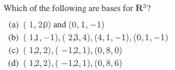
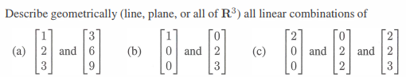
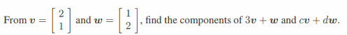
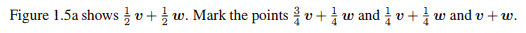

# Chapter 1-1

## Problem 1

### 圖片

### 解題

### 題目復述
請問下列哪些選項是 $\mathbb{R}^3$ 的基底 (bases)？
(a) $(1, 2, 0)$ 與 $(0, 1, -1)$
(b) $(1, 1, -1), (2, 3, 4), (4, 1, -1), (0, 1, -1)$
(c) $(1, 2, 2), (-1, 2, 1), (0, 8, 0)$
(d) $(1, 2, 2), (-1, 2, 1), (0, 8, 6)$

### 解題過程
要判斷一組向量是否為 $\mathbb{R}^3$ 的基底，必須滿足兩個條件：
1. 向量的數量必須正好等於空間的維度（對於 $\mathbb{R}^3$ 來說，必須恰好有 3 個向量）。
2. 這組向量必須是線性獨立的 (Linearly Independent)。

我們逐一分析選項：

*   **(a) 選項**：僅提供 2 個向量。由於基底數量不足 3 個，無法生成整個 $\mathbb{R}^3$ 空間，因此**不是**基底。
*   **(b) 選項**：提供了 4 個向量。在 $\mathbb{R}^3$ 空間中，任何超過 3 個向量的集合必然是線性相依的，因此**不是**基底。
*   **(c) 選項**：提供了 3 個向量。我們將其組成矩陣並計算行列式 (Determinant) 以檢查線性獨立性：
    $$\det \begin{bmatrix} 1 & -1 & 0 \\ 2 & 2 & 8 \\ 2 & 1 & 0 \end{bmatrix}$$
    沿著第三列展開：
    $$\det = -8 \times \det \begin{bmatrix} 1 & -1 \\ 2 & 1 \end{bmatrix} = -8 \times (1 \times 1 - (-1) \times 2) = -8 \times 3 = -24$$
    因為行列式 $\neq 0$，這三個向量線性獨立，且數量為 3，因此**是**基底。
*   **(d) 選項**：提供了 3 個向量。同樣計算其行列式：
    $$\det \begin{bmatrix} 1 & -1 & 0 \\ 2 & 2 & 8 \\ 2 & 1 & 6 \end{bmatrix}$$
    沿著第一列展開：
    $$\det = 1 \times (2 \times 6 - 8 \times 1) - (-1) \times (2 \times 6 - 8 \times 2) + 0$$
    $$\det = 1 \times (12 - 8) + 1 \times (12 - 16) = 4 - 4 = 0$$
    因為行列式 $= 0$，這三個向量線性相依，因此**不是**基底。

**最終答案：(c)**

### 用到的觀念
*   **基底 (Basis)**：一個向量空間的基底是指一組線性獨立且能生成該空間的所有向量。
*   **維度 (Dimension)**：空間中基底所包含的向量數量。$\mathbb{R}^3$ 的維度為 3，因此其基底必須恰好包含 3 個線性獨立向量。
*   **線性獨立 (Linear Independence)**：一組向量中，沒有任何一個向量可以被表示為其他向量的線性組合。
*   **行列式 (Determinant)**：對於方陣而言，若行列式不為零，則該矩陣的列向量（或行向量）線性獨立。

---

## Problem 4

### 圖片

### 解題

### 題目復述

請從幾何角度（直線、平面或整個 $\mathbb{R}^3$ 空間）描述以下向量所有線性組合所構成的集合：

(a) $\begin{bmatrix} 1 \\ 2 \\ 3 \end{bmatrix}$ 與 $\begin{bmatrix} 3 \\ 6 \\ 9 \end{bmatrix}$
(b) $\begin{bmatrix} 1 \\ 0 \\ 0 \end{bmatrix}$ 與 $\begin{bmatrix} 0 \\ 2 \\ 3 \end{bmatrix}$
(c) $\begin{bmatrix} 2 \\ 0 \\ 0 \end{bmatrix}$、$\begin{bmatrix} 0 \\ 2 \\ 2 \end{bmatrix}$ 與 $\begin{bmatrix} 2 \\ 2 \\ 3 \end{bmatrix}$

### 解題過程

**(a) 分析：**
觀察兩個向量 $\mathbf{v}_1 = \begin{bmatrix} 1 \\ 2 \\ 3 \end{bmatrix}$ 和 $\mathbf{v}_2 = \begin{bmatrix} 3 \\ 6 \\ 9 \end{bmatrix}$。
可以發現 $\mathbf{v}_2 = 3 \mathbf{v}_1$，這表示兩個向量彼此共線（線性相依）。
由於這兩個向量位於同一條通過原點的直線上，其所有線性組合仍然會落在這條直線上。
**結論：直線 (Line)**

**(b) 分析：**
觀察兩個向量 $\mathbf{v}_1 = \begin{bmatrix} 1 \\ 0 \\ 0 \end{bmatrix}$ 和 $\mathbf{v}_2 = \begin{bmatrix} 0 \\ 2 \\ 3 \end{bmatrix}$。
這兩個向量並非彼此的倍數，因此它們是線性獨立的。
在 $\mathbb{R}^3$ 空間中，兩個線性獨立向量的所有線性組合（即它們的生成空間 Span）會構成一個通過原點的平面。
**結論：平面 (Plane)**

**(c) 分析：**
考慮三個向量 $\mathbf{v}_1 = \begin{bmatrix} 2 \\ 0 \\ 0 \end{bmatrix}$、$\mathbf{v}_2 = \begin{bmatrix} 0 \\ 2 \\ 2 \end{bmatrix}$ 和 $\mathbf{v}_3 = \begin{bmatrix} 2 \\ 2 \\ 3 \end{bmatrix}$。
我們可以使用行列式來判斷這三個向量是否線性獨立：
$\det \begin{bmatrix} 2 & 0 & 2 \\ 0 & 2 & 2 \\ 0 & 2 & 3 \end{bmatrix} = 2 \times (2 \cdot 3 - 2 \cdot 2) - 0 + 2 \times (0 \cdot 2 - 0 \cdot 2) = 2 \times (6 - 4) = 4$
由於行列式 $\neq 0$，這三個向量在 $\mathbb{R}^3$ 中是線性獨立的。
三個線性獨立的向量可以生成整個 $\mathbb{R}^3$ 空間。
**結論：整個 $\mathbb{R}^3$ (All of $\mathbb{R}^3$)**

### 用到的觀念

1. **線性組合 (Linear Combination)：** 給定向量 $\mathbf{v}_1, \dots, \mathbf{v}_n$，其線性組合是指形式為 $c_1\mathbf{v}_1 + \dots + c_n\mathbf{v}_n$ 的所有可能向量（其中 $c_i$ 為任意純量）。
2. **生成空間 (Span)：** 一組向量所有線性組合所構成的集合稱為該組向量的生成空間。
3. **線性獨立與相依 (Linear Independence and Dependence)：** 
   - 若一組向量中沒有任何一個向量可以由其他向量的線性組合表示，則稱其為線性獨立。
   - 若其中至少有一個向量可由其他向量組合而成，則稱其為線性相依。
4. **幾何解釋：**
   - 在 $\mathbb{R}^3$ 中，一個非零向量的 Span 是一條**直線**。
   - 兩個線性獨立向量的 Span 是一個**平面**。
   - 三個線性獨立向量的 Span 是**整個 $\mathbb{R}^3$ 空間**。

---

## Problem 15

### 圖片

### 解題

### 題目復述
已知向量 $v = \begin{bmatrix} 2 \\ 1 \end{bmatrix}$ 且 $w = \begin{bmatrix} 1 \\ 2 \end{bmatrix}$，請求出 $3v + w$ 與 $cv + dw$ 的分量。

### 解題過程
**1. 計算 $3v + w$：**
首先將純量 $3$ 乘以向量 $v$：
$$3v = 3 \begin{bmatrix} 2 \\ 1 \end{bmatrix} = \begin{bmatrix} 3 \times 2 \\ 3 \times 1 \end{bmatrix} = \begin{bmatrix} 6 \\ 3 \end{bmatrix}$$
接著將結果與向量 $w$ 相加：
$$3v + w = \begin{bmatrix} 6 \\ 3 \end{bmatrix} + \begin{bmatrix} 1 \\ 2 \end{bmatrix} = \begin{bmatrix} 6 + 1 \\ 3 + 2 \end{bmatrix} = \begin{bmatrix} 7 \\ 5 \end{bmatrix}$$

**2. 計算 $cv + dw$：**
首先將純量 $c$ 乘以 $v$ 以及純量 $d$ 乘以 $w$：
$$cv = c \begin{bmatrix} 2 \\ 1 \end{bmatrix} = \begin{bmatrix} 2c \\ c \end{bmatrix}, \quad dw = d \begin{bmatrix} 1 \\ 2 \end{bmatrix} = \begin{bmatrix} d \\ 2d \end{bmatrix}$$
接著將兩者相加：
$$cv + dw = \begin{bmatrix} 2c \\ c \end{bmatrix} + \begin{bmatrix} d \\ 2d \end{bmatrix} = \begin{bmatrix} 2c + d \\ c + 2d \end{bmatrix}$$

**最終答案：**
$3v + w = \begin{bmatrix} 7 \\ 5 \end{bmatrix}$，且 $cv + dw = \begin{bmatrix} 2c + d \\ c + 2d \end{bmatrix}$。

### 用到的觀念
*   **純量乘法 (Scalar Multiplication)**：將一個純量（常數）乘以一個向量，結果是將該向量的每一個分量都乘以該純量。
*   **向量加法 (Vector Addition)**：兩個相同維度的向量相加，其結果是將對應位置的分量分別相加。
*   **線性組合 (Linear Combination)**：將一組向量分別乘以純量後再相加而成的表達式（如 $cv + dw$），是線性代數的核心概念。

---

## Problem 25

### 圖片

### 解題

### 題目復述
圖 1.5a 顯示了點 $\frac{1}{2}v + \frac{1}{2}w$。請標記出點 $\frac{3}{4}v + \frac{1}{4}w$、$\frac{1}{4}v + \frac{1}{4}w$ 以及 $v + w$。

### 解題過程
假設向量 $v$ 與 $w$ 分別從原點 $O$ 出發至其終點。

1.  **標記 $\frac{3}{4}v + \frac{1}{4}w$**：
    *   觀察係數 $\frac{3}{4} + \frac{1}{4} = 1$。在線性代數中，當係數總和為 1 且皆為正數時，該點位於向量 $v$ 與 $w$ 的終點所連成的線段上。
    *   具體位置：該點位於線段 $vw$ 上，距離 $v$ 的距離為線段總長的 $\frac{1}{4}$（或距離 $w$ 的距離為 $\frac{3}{4}$）。

2.  **標記 $\frac{1}{4}v + \frac{1}{4}w$**：
    *   將此式改寫為 $\frac{1}{2}(\frac{1}{2}v + \frac{1}{2}w)$。
    *   題目已知 $\frac{1}{2}v + \frac{1}{2}w$ 是 $v$ 與 $w$ 終點的中點。
    *   因此，$\frac{1}{4}v + \frac{1}{4}w$ 即位於原點 $O$ 與該中點 $\frac{1}{2}v + \frac{1}{2}w$ 之間的中點。

3.  **標記 $v + w$**：
    *   根據向量加法的「平行四邊形法則」，$v + w$ 是以 $v$ 和 $w$ 為鄰邊的平行四邊形中，對角於原點的那個頂點。
    *   另一種思考方式：$v + w = 2 \times (\frac{1}{2}v + \frac{1}{2}w)$。因此，將原點到中點 $\frac{1}{2}v + \frac{1}{2}w$ 的向量方向延伸一倍長度即可到達 $v + w$。

### 用到的觀念
*   **線性組合 (Linear Combination)**：將向量乘以純量（Scalar）後相加的形式，如 $av + bw$。
*   **凸組合 (Convex Combination)**：一種特殊的線性組合，其中所有係數 $\sum a_i = 1$ 且 $a_i \ge 0$。其結果必然落在這些向量終點所構成的凸包（在此為線段）之內。
*   **平行四邊形法則 (Parallelogram Law)**：兩個向量之和在幾何上等於以這兩個向量為鄰邊的平行四邊形的對角線向量。
*   **向量純量乘法 (Scalar Multiplication)**：對向量進行縮放。例如 $\frac{1}{2}u$ 表示將向量 $u$ 的長度減半但方向不變。

---
