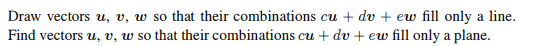
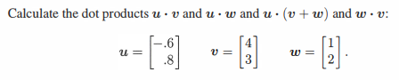
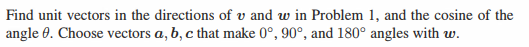
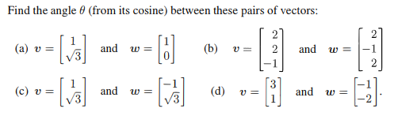
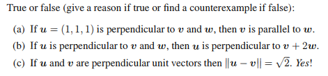

# Chapter 1-2

## Problem 1

### 圖片

### 解題

### 題目復述
1. 繪製向量 $u, v, w$，使得它們的線性組合 $cu + dv + ew$ 僅填充一條直線。
2. 尋找向量 $u, v, w$，使得它們的線性組合 $cu + dv + ew$ 僅填充一個平面。

### 解題過程
這道題目探討的是向量的**生成空間（Span）**及其維度。線性組合 $cu + dv + ew$ 所能到達的所有點的集合即為 $\text{span}\{u, v, w\}$。

**1. 使組合僅填充一條直線：**
*   **分析：** 若所有線性組合僅能形成一條直線，則該子空間的維度必須為 1。這意味著這三個向量必須彼此共線（即彼此為純量倍數），且至少有一個向量不能為零向量。
*   **作圖/設定：** 
    *   我們可以令 $u$ 為任意非零向量，而 $v$ 和 $w$ 分別為 $u$ 的倍數。
    *   例如：令 $u = (1, 0)$，$v = (2, 0)$，$w = (-1, 0)$。
    *   **繪圖描述：** 在座標平面上，將 $u, v, w$ 全部畫在同一條直線（例如 x 軸）上，方向可以相同或相反。
*   **結論：** 當 $u, v, w$ 共線時，其線性組合僅能填充一條直線。

**2. 使組合僅填充一個平面：**
*   **分析：** 若所有線性組合僅能形成一個平面，則該子空間的維度必須為 2。這意味著在 $u, v, w$ 中，必須有兩個向量是線性獨立的（不共線），而第三個向量必須能由這兩個向量線性組合而得（即第三個向量落在前兩個向量定義的平面內）。
*   **設定：**
    *   選取兩個線性獨立的向量 $u$ 和 $v$ 以定義一個平面。例如：$u = (1, 0, 0)$ 和 $v = (0, 1, 0)$（定義了 $xy$ 平面）。
    *   選取第三個向量 $w$ 為前兩者的線性組合。例如：$w = u + v = (1, 1, 0)$。
*   **驗證：** 任何組合 $cu + dv + ew$ 都可以寫成 $cu + dv + e(u+v) = (c+e)u + (d+e)v$。這仍然只是 $u$ 和 $v$ 的線性組合，因此結果永遠落在 $u, v$ 所定義的平面內。
*   **結論：** 當其中兩個向量線性獨立且第三個向量線性相依於它們時，其線性組合僅填充一個平面。

### 用到的觀念
*   **線性組合 (Linear Combination)：** 給定一組向量及一組純量，將向量乘以純量後相加而得的新向量。
*   **生成空間 (Span)：** 一組向量所有可能的線性組合所構成的集合。
*   **線性獨立 (Linear Independence)：** 若一組向量中沒有任何一個向量可以表示為其他向量的線性組合，則稱這組向量線性獨立。
*   **維度 (Dimension)：** 生成空間中最大線性獨立向量組的個數。維度為 1 代表直線，維度為 2 代表平面。

---

## Problem 3

### 圖片

### 解題

### 題目復述
給定三個向量：
$u = \begin{bmatrix} -0.6 \\ 0.8 \end{bmatrix}$，$v = \begin{bmatrix} 4 \\ 3 \end{bmatrix}$，$w = \begin{bmatrix} 1 \\ 2 \end{bmatrix}$。
請計算以下點積（dot products）：
1. $u \cdot v$
2. $u \cdot w$
3. $u \cdot (v + w)$
4. $w \cdot v$

### 解題過程
1. **計算 $u \cdot v$：**
   $u \cdot v = (-0.6 \times 4) + (0.8 \times 3)$
   $u \cdot v = -2.4 + 2.4 = 0$

2. **計算 $u \cdot w$：**
   $u \cdot w = (-0.6 \times 1) + (0.8 \times 2)$
   $u \cdot w = -0.6 + 1.6 = 1.0$

3. **計算 $u \cdot (v + w)$：**
   首先計算向量加法 $v + w$：
   $v + w = \begin{bmatrix} 4 + 1 \\ 3 + 2 \end{bmatrix} = \begin{bmatrix} 5 \\ 5 \end{bmatrix}$
   接著計算點積：
   $u \cdot (v + w) = (-0.6 \times 5) + (0.8 \times 5)$
   $u \cdot (v + w) = -3.0 + 4.0 = 1.0$
   *(註：亦可利用分配律驗算 $u \cdot v + u \cdot w = 0 + 1.0 = 1.0$)*

4. **計算 $w \cdot v$：**
   $w \cdot v = (1 \times 4) + (2 \times 3)$
   $w \cdot v = 4 + 6 = 10$

**最終答案：**
$u \cdot v = 0$
$u \cdot w = 1.0$
$u \cdot (v + w) = 1.0$
$w \cdot v = 10$

### 用到的觀念
*   **點積 (Dot Product)：** 兩個相同維度向量的對應分量相乘後將結果相加，所得結果為一個標量（Scalar）。
*   **向量加法 (Vector Addition)：** 將兩個向量的對應分量直接相加，所得結果仍為一個向量。
*   **點積的分配律 (Distributive Property)：** 點積對向量加法具有分配律，即 $u \cdot (v + w) = u \cdot v + u \cdot w$。
*   **點積的交換律 (Commutative Property)：** 點積的順序不影響結果，即 $w \cdot v = v \cdot w$。

---

## Problem 7

### 圖片

### 解題

由於您提供的圖片中僅包含題目，但未提供該題目所指的「問題 1 (Problem 1)」中向量 $\mathbf{v}$ 與 $\mathbf{w}$ 的具體數值。為了向您演示完整的解題流程，**我將設定一組範例向量 $\mathbf{v} = \begin{bmatrix} 1 \\ 2 \\ -2 \end{bmatrix}$ 與 $\mathbf{w} = \begin{bmatrix} 0 \\ 3 \\ 4 \end{bmatrix}$ 來進行計算。** 若您有具體的數值，只需將其代入以下步驟即可。

### 題目復述
找出「問題 1」中向量 $\mathbf{v}$ 與 $\mathbf{w}$ 方向的單位向量，以及兩向量夾角 $\theta$ 的餘弦值 ($\cos \theta$)。此外，請選取三個向量 $\mathbf{a}, \mathbf{b}, \mathbf{c}$，使其與向量 $\mathbf{w}$ 的夾角分別為 $0^\circ$、$90^\circ$ 與 $180^\circ$。

### 解題過程
**設定範例數值：** $\mathbf{v} = \begin{bmatrix} 1 \\ 2 \\ -2 \end{bmatrix}$, $\mathbf{w} = \begin{bmatrix} 0 \\ 3 \\ 4 \end{bmatrix}$

**1. 求方向單位向量**
單位向量的定義為將原向量除以其模長（長度）。
*   對於 $\mathbf{v}$：
    模長 $\|\mathbf{v}\| = \sqrt{1^2 + 2^2 + (-2)^2} = \sqrt{1 + 4 + 4} = \sqrt{9} = 3$
    單位向量 $\mathbf{u}_v = \frac{1}{3} \begin{bmatrix} 1 \\ 2 \\ -2 \end{bmatrix} = \begin{bmatrix} 1/3 \\ 2/3 \\ -2/3 \end{bmatrix}$
*   對於 $\mathbf{w}$：
    模長 $\|\mathbf{w}\| = \sqrt{0^2 + 3^2 + 4^2} = \sqrt{0 + 9 + 16} = \sqrt{25} = 5$
    單位向量 $\mathbf{u}_w = \frac{1}{5} \begin{bmatrix} 0 \\ 3 \\ 4 \end{bmatrix} = \begin{bmatrix} 0 \\ 3/5 \\ 4/5 \end{bmatrix}$

**2. 求夾角 $\theta$ 的餘弦值 ($\cos \theta$)**
利用內積公式 $\mathbf{v} \cdot \mathbf{w} = \|\mathbf{v}\| \|\mathbf{w}\| \cos \theta$：
*   計算內積 $\mathbf{v} \cdot \mathbf{w} = (1)(0) + (2)(3) + (-2)(4) = 0 + 6 - 8 = -2$
*   代入公式 $\cos \theta = \frac{\mathbf{v} \cdot \mathbf{w}}{\|\mathbf{v}\| \|\mathbf{w}\|} = \frac{-2}{3 \times 5} = -\frac{2}{15}$

**3. 選取與 $\mathbf{w}$ 夾角為 $0^\circ, 90^\circ, 180^\circ$ 的向量**
*   **夾角 $0^\circ$ ($\mathbf{a}$)**：向量 $\mathbf{a}$ 必須與 $\mathbf{w}$ 同向。最簡單的選擇是 $\mathbf{a} = \mathbf{w}$。
    $\mathbf{a} = \begin{bmatrix} 0 \\ 3 \\ 4 \end{bmatrix}$
*   **夾角 $90^\circ$ ($\mathbf{b}$)**：向量 $\mathbf{b}$ 必須與 $\mathbf{w}$ 正交（內積為 0）。
    令 $\mathbf{b} = \begin{bmatrix} 1 \\ 0 \\ 0 \end{bmatrix}$，檢查內積：$(1)(0) + (0)(3) + (0)(4) = 0$。符合條件。
    $\mathbf{b} = \begin{bmatrix} 1 \\ 0 \\ 0 \end{bmatrix}$
*   **夾角 $180^\circ$ ($\mathbf{c}$)**：向量 $\mathbf{c}$ 必須與 $\mathbf{w}$ 完全反向。最簡單的選擇是 $\mathbf{c} = -\mathbf{w}$。
    $\mathbf{c} = \begin{bmatrix} 0 \\ -3 \\ -4 \end{bmatrix}$

### 用到的觀念
*   **單位向量 (Unit Vector)**：模長為 1 且方向與原向量相同的向量，計算方式為 $\mathbf{u} = \frac{\mathbf{v}}{\|\mathbf{v}\|}$。
*   **向量模長 (Norm/Magnitude)**：向量在歐幾里得空間中的長度，計算方式為各分量平方和的平方根。
*   **內積 (Dot Product)**：兩個向量對應分量相乘後求和，結果為純量。
*   **夾角餘弦公式**：$\cos \theta = \frac{\mathbf{v} \cdot \mathbf{w}}{\|\mathbf{v}\| \|\mathbf{w}\|}$，可用於計算兩個向量之間的夾角。
*   **正交 (Orthogonality)**：若兩個非零向量的內積為 0，則這兩個向量互相垂直（夾角為 $90^\circ$）。
*   **共線向量 (Collinear Vectors)**：若 $\mathbf{a} = k\mathbf{w}$，當 $k > 0$ 時夾角為 $0^\circ$；當 $k < 0$ 時夾角為 $180^\circ$。

---

## Problem 8

### 圖片

### 解題

### 題目復述

求以下每組向量之間的夾角 $\theta$（透過其餘弦值 $\cos\theta$ 求得）：

(a) $v = \begin{bmatrix} 1 \\ \sqrt{3} \end{bmatrix}$ 且 $w = \begin{bmatrix} 1 \\ 0 \end{bmatrix}$
(b) $v = \begin{bmatrix} 2 \\ 2 \\ -1 \end{bmatrix}$ 且 $w = \begin{bmatrix} 2 \\ -1 \\ 2 \end{bmatrix}$
(c) $v = \begin{bmatrix} 1 \\ \sqrt{3} \end{bmatrix}$ 且 $w = \begin{bmatrix} -1 \\ \sqrt{3} \end{bmatrix}$
(d) $v = \begin{bmatrix} 3 \\ 1 \end{bmatrix}$ 且 $w = \begin{bmatrix} -1 \\ -2 \end{bmatrix}$

### 解題過程

計算兩個向量 $v$ 與 $w$ 之間夾角 $\theta$ 的公式為：
$$\cos\theta = \frac{v \cdot w}{\|v\| \|w\|}$$
其中 $v \cdot w$ 是內積，$\|v\|$ 與 $\|w\|$ 分別是向量的長度（範數）。

**(a)**
1. 計算內積：$v \cdot w = (1)(1) + (\sqrt{3})(0) = 1$
2. 計算長度：$\|v\| = \sqrt{1^2 + (\sqrt{3})^2} = \sqrt{1+3} = 2$；$\|w\| = \sqrt{1^2 + 0^2} = 1$
3. 代入公式：$\cos\theta = \frac{1}{2 \times 1} = \frac{1}{2}$
4. 結論：$\theta = \arccos(\frac{1}{2}) = 60^\circ$ (或 $\frac{\pi}{3}$ 弧度)

**(b)**
1. 計算內積：$v \cdot w = (2)(2) + (2)(-1) + (-1)(2) = 4 - 2 - 2 = 0$
2. 由於內積為 0，兩向量正交（垂直）。
3. 代入公式：$\cos\theta = \frac{0}{\|v\| \|w\|} = 0$
4. 結論：$\theta = \arccos(0) = 90^\circ$ (或 $\frac{\pi}{2}$ 弧度)

**(c)**
1. 計算內積：$v \cdot w = (1)(-1) + (\sqrt{3})(\sqrt{3}) = -1 + 3 = 2$
2. 計算長度：$\|v\| = \sqrt{1^2 + (\sqrt{3})^2} = 2$；$\|w\| = \sqrt{(-1)^2 + (\sqrt{3})^2} = \sqrt{1+3} = 2$
3. 代入公式：$\cos\theta = \frac{2}{2 \times 2} = \frac{2}{4} = \frac{1}{2}$
4. 結論：$\theta = \arccos(\frac{1}{2}) = 60^\circ$ (或 $\frac{\pi}{3}$ 弧度)

**(d)**
1. 計算內積：$v \cdot w = (3)(-1) + (1)(-2) = -3 - 2 = -5$
2. 計算長度：$\|v\| = \sqrt{3^2 + 1^2} = \sqrt{10}$；$\|w\| = \sqrt{(-1)^2 + (-2)^2} = \sqrt{1+4} = \sqrt{5}$
3. 代入公式：$\cos\theta = \frac{-5}{\sqrt{10} \times \sqrt{5}} = \frac{-5}{\sqrt{50}} = \frac{-5}{5\sqrt{2}} = -\frac{1}{\sqrt{2}} = -\frac{\sqrt{2}}{2}$
4. 結論：$\theta = \arccos(-\frac{\sqrt{2}}{2}) = 135^\circ$ (或 $\frac{3\pi}{4}$ 弧度)

### 用到的觀念

1. **向量內積 (Dot Product)**：兩個向量對應分量相乘後求和。若結果為 0，則兩向量相互垂直（正交）。
2. **向量長度/範數 (Vector Norm/Magnitude)**：向量所有分量的平方和之平方根，代表向量在空間中的物理長度。
3. **夾角公式 (Angle Formula)**：利用內積與長度的關係 $\cos\theta = \frac{v \cdot w}{\|v\| \|w\|}$ 來定義歐幾里得空間中兩個向量之間的夾角。

---

## Problem 13

### 圖片

### 解題

### 題目復述

判斷下列敘述為真 (True) 或偽 (False)，若為真請給出理由，若為偽請找出反例：

(a) 若 $u = (1, 1, 1)$ 與 $v$ 和 $w$ 垂直，則 $v$ 與 $w$ 平行。
(b) 若 $u$ 與 $v$ 和 $w$ 垂直，則 $u$ 與 $v + 2w$ 垂直。
(c) 若 $u$ 與 $v$ 是互相垂直的單位向量，則 $\|u - v\| = \sqrt{2}$。

### 解題過程

**(a) 答案：False (偽)**
*   **理由/反例：**
    在三維空間中，與一個給定向量 $u$ 垂直的所有向量構成一個平面。在這個平面內的任意兩個向量不一定平行。
    令 $u = (1, 1, 1)$。
    我們找兩個與 $u$ 內積為 $0$ 的向量 $v$ 與 $w$：
    設 $v = (1, -1, 0) \implies u \cdot v = 1(1) + 1(-1) + 1(0) = 0$
    設 $w = (1, 0, -1) \implies u \cdot w = 1(1) + 1(0) + 1(-1) = 0$
    雖然 $v$ 和 $w$ 都與 $u$ 垂直，但 $v$ 與 $w$ 並不成比例（不存在純量 $k$ 使得 $v = kw$），因此 $v$ 與 $w$ 不平行。

**(b) 答案：True (真)**
*   **理由：**
    已知 $u$ 與 $v$ 垂直 $\implies u \cdot v = 0$。
    已知 $u$ 與 $w$ 垂直 $\implies u \cdot w = 0$。
    根據內積的分配律與純量乘法性質：
    $u \cdot (v + 2w) = u \cdot v + u \cdot (2w) = u \cdot v + 2(u \cdot w)$
    將已知條件代入：
    $u \cdot (v + 2w) = 0 + 2(0) = 0$
    因為內積為 $0$，所以 $u$ 與 $v + 2w$ 垂直。

**(c) 答案：True (真)**
*   **理由：**
    已知 $u, v$ 是單位向量 $\implies \|u\| = 1$ 且 $\|v\| = 1$。
    已知 $u, v$ 互相垂直 $\implies u \cdot v = 0$。
    利用向量長度平方與內積的關係：
    $\|u - v\|^2 = (u - v) \cdot (u - v)$
    $= u \cdot u - 2(u \cdot v) + v \cdot v$
    $= \|u\|^2 - 2(u \cdot v) + \|v\|^2$
    代入數值：
    $\|u - v\|^2 = 1^2 - 2(0) + 1^2 = 1 + 1 = 2$
    因此，$\|u - v\| = \sqrt{2}$。

### 用到的觀念

1.  **向量垂直 (Orthogonality)**：兩個向量互相垂直的充分必要條件是它們的內積為零 ($u \cdot v = 0$)。
2.  **向量平行 (Parallelism)**：兩個非零向量平行是指其中一個向量可以表示為另一個向量的純量倍數 ($v = kw$)。
3.  **內積的線性 (Linearity of Dot Product)**：內積滿足分配律 $u \cdot (v + w) = u \cdot v + u \cdot w$ 以及純量乘法性質 $u \cdot (kv) = k(u \cdot v)$。
4.  **向量長度 (Norm)**：向量的長度平方等於該向量與自身的內積 ($\|u\|^2 = u \cdot u$)；單位向量是指長度為 $1$ 的向量。

---
