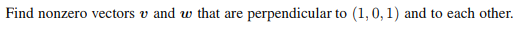
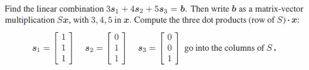
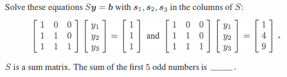
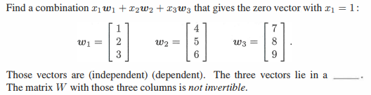

# Chapter 1-3

## Problem 1

### 圖片

### 解題

### 題目復述
找出兩個非零向量 $v$ 與 $w$，使得它們都與向量 $(1, 0, 1)$ 垂直，且 $v$ 與 $w$ 彼此之間也相互垂直。

### 解題過程
1. **設定已知條件**：
   令已知向量 $\mathbf{u} = (1, 0, 1)$。我們需要尋找非零向量 $\mathbf{v}$ 與 $\mathbf{w}$，滿足以下三個條件：
   - $\mathbf{v} \cdot \mathbf{u} = 0$
   - $\mathbf{w} \cdot \mathbf{u} = 0$
   - $\mathbf{v} \cdot \mathbf{w} = 0$

2. **尋找向量 $\mathbf{v}$**：
   設 $\mathbf{v} = (x, y, z)$。根據 $\mathbf{v} \cdot \mathbf{u} = 0$ 可得：
   $x(1) + y(0) + z(1) = 0 \implies x + z = 0$
   為了簡化計算，我們可以令 $x = 0, z = 0$，但 $\mathbf{v}$ 必須是非零向量，因此我們可以令 $y = 1$。
   由此得到 $\mathbf{v} = (0, 1, 0)$。

3. **尋找向量 $\mathbf{w}$**：
   設 $\mathbf{w} = (a, b, c)$。 $\mathbf{w}$ 必須同時與 $\mathbf{u}$ 和 $\mathbf{v}$ 垂直：
   - 由 $\mathbf{w} \cdot \mathbf{v} = 0$ 可得：
     $(a, b, c) \cdot (0, 1, 0) = b = 0$
   - 由 $\mathbf{w} \cdot \mathbf{u} = 0$ 可得：
     $(a, 0, c) \cdot (1, 0, 1) = a + c = 0 \implies c = -a$
   為了讓 $\mathbf{w}$ 為非零向量，我們可以令 $a = 1$，則 $c = -1$。
   由此得到 $\mathbf{w} = (1, 0, -1)$。

4. **驗算**：
   - $\mathbf{v} \cdot \mathbf{u} = (0, 1, 0) \cdot (1, 0, 1) = 0 + 0 + 0 = 0$ （正確）
   - $\mathbf{w} \cdot \mathbf{u} = (1, 0, -1) \cdot (1, 0, 1) = 1 + 0 - 1 = 0$ （正確）
   - $\mathbf{v} \cdot \mathbf{w} = (0, 1, 0) \cdot (1, 0, -1) = 0 + 0 + 0 = 0$ （正確）

**最終答案：**
$\mathbf{v} = (0, 1, 0)$，$\mathbf{w} = (1, 0, -1)$（此答案不唯一，任何滿足上述條件的非零向量均可）。

### 用到的觀念
- **內積 (Dot Product)**：兩個向量 $\mathbf{a} = (a_1, a_2, a_3)$ 與 $\mathbf{b} = (b_1, b_2, b_3)$ 的內積定義為 $\mathbf{a} \cdot \mathbf{b} = a_1b_1 + a_2b_2 + a_3b_3$。
- **正交性/垂直 (Orthogonality)**：在歐幾里得空間中，兩個非零向量相互垂直的充要條件是它們的內積等於 0。
- **線性方程組 (System of Linear Equations)**：透過設定分量並利用垂直條件建立方程式，來求解符合要求的向量分量。

---

## Problem 2

### 圖片

### 解題

### 題目復述
給定三個向量 $s_1 = \begin{bmatrix} 1 \\ 1 \\ 1 \end{bmatrix}$, $s_2 = \begin{bmatrix} 0 \\ 1 \\ 1 \end{bmatrix}$, $s_3 = \begin{bmatrix} 0 \\ 0 \\ 1 \end{bmatrix}$。請完成以下任務：
1. 計算線性組合 $3s_1 + 4s_2 + 5s_3 = b$ 並求出 $b$。
2. 將 $b$ 表示為矩陣與向量的乘法 $Sx$，其中 $3, 4, 5$ 構成向量 $x$，而 $s_1, s_2, s_3$ 作為矩陣 $S$ 的行（columns）。
3. 計算 $S$ 的每一列（row）與向量 $x$ 的三個內積（dot products）。

### 解題過程
**1. 計算線性組合 $b$：**
$$b = 3s_1 + 4s_2 + 5s_3$$
$$b = 3 \begin{bmatrix} 1 \\ 1 \\ 1 \end{bmatrix} + 4 \begin{bmatrix} 0 \\ 1 \\ 1 \end{bmatrix} + 5 \begin{bmatrix} 0 \\ 0 \\ 1 \end{bmatrix} = \begin{bmatrix} 3 \\ 3 \\ 3 \end{bmatrix} + \begin{bmatrix} 0 \\ 4 \\ 4 \end{bmatrix} + \begin{bmatrix} 0 \\ 0 \\ 5 \end{bmatrix} = \begin{bmatrix} 3+0+0 \\ 3+4+0 \\ 3+4+5 \end{bmatrix} = \begin{bmatrix} 3 \\ 7 \\ 12 \end{bmatrix}$$

**2. 將 $b$ 表示為矩陣-向量乘法 $Sx$：**
將 $s_1, s_2, s_3$ 放入矩陣 $S$ 的各行，將係數 $3, 4, 5$ 放入向量 $x$：
$$S = \begin{bmatrix} 1 & 0 & 0 \\ 1 & 1 & 0 \\ 1 & 1 & 1 \end{bmatrix}, \quad x = \begin{bmatrix} 3 \\ 4 \\ 5 \end{bmatrix}$$
因此，$b = Sx = \begin{bmatrix} 1 & 0 & 0 \\ 1 & 1 & 0 \\ 1 & 1 & 1 \end{bmatrix} \begin{bmatrix} 3 \\ 4 \\ 5 \end{bmatrix}$

**3. 計算三個內積（矩陣的每一列 $\cdot x$）：**
* 第一列 $\cdot x$：$\begin{bmatrix} 1 & 0 & 0 \end{bmatrix} \cdot \begin{bmatrix} 3 \\ 4 \\ 5 \end{bmatrix} = (1 \times 3) + (0 \times 4) + (0 \times 5) = 3$
* 第二列 $\cdot x$：$\begin{bmatrix} 1 & 1 & 0 \end{bmatrix} \cdot \begin{bmatrix} 3 \\ 4 \\ 5 \end{bmatrix} = (1 \times 3) + (1 \times 4) + (0 \times 5) = 7$
* 第三列 $\cdot x$：$\begin{bmatrix} 1 & 1 & 1 \end{bmatrix} \cdot \begin{bmatrix} 3 \\ 4 \\ 5 \end{bmatrix} = (1 \times 3) + (1 \times 4) + (1 \times 5) = 12$

計算結果為 $\begin{bmatrix} 3 \\ 7 \\ 12 \end{bmatrix}$，與步驟 1 的結果完全一致。

### 用到的觀念
* **線性組合 (Linear Combination)**：將一組向量分別乘以純量（係數）後相加，所得的新向量即為該組向量的線性組合。
* **矩陣-向量乘法 (Matrix-Vector Multiplication)**：
    * **行視角 (Column View)**：矩陣 $S$ 乘以向量 $x$ 可視為將 $S$ 的各行向量以 $x$ 的分量為係數進行線性組合。
    * **列視角 (Row View)**：結果向量的每一個分量，是由矩陣 $S$ 的對應列（row）與向量 $x$ 進行內積（dot product）所得。
* **內積 (Dot Product)**：兩個維度相同的向量，對應位置元素相乘後求和的運算。

---

## Problem 4

### 圖片

### 解題

### 題目復述
解以下兩個線性方程組 $Sy = b$，其中 $S$ 的列向量為 $s_1, s_2, s_3$：
1. $\begin{bmatrix} 1 & 0 & 0 \\ 1 & 1 & 0 \\ 1 & 1 & 1 \end{bmatrix} \begin{bmatrix} y_1 \\ y_2 \\ y_3 \end{bmatrix} = \begin{bmatrix} 1 \\ 1 \\ 1 \end{bmatrix}$
2. $\begin{bmatrix} 1 & 0 & 0 \\ 1 & 1 & 0 \\ 1 & 1 & 1 \end{bmatrix} \begin{bmatrix} y_1 \\ y_2 \\ y_3 \end{bmatrix} = \begin{bmatrix} 1 \\ 4 \\ 9 \end{bmatrix}$

此外，已知 $S$ 為加總矩陣（sum matrix），請填空：前 5 個奇數的總和是 \_\_\_\_\_\_。

### 解題過程
矩陣 $S$ 是一個下三角矩陣，我們可以利用**前向替代法 (Forward Substitution)** 從上到下逐一求解變數。

**1. 求解第一個方程組：**
將矩陣乘法展開為方程式組：
$$\begin{cases} 1 \cdot y_1 = 1 \\ 1 \cdot y_1 + 1 \cdot y_2 = 1 \\ 1 \cdot y_1 + 1 \cdot y_2 + 1 \cdot y_3 = 1 \end{cases}$$
- 由第一式得：$y_1 = 1$
- 將 $y_1$ 代入第二式：$1 + y_2 = 1 \implies y_2 = 0$
- 將 $y_1, y_2$ 代入第三式：$1 + 0 + y_3 = 1 \implies y_3 = 0$
**第一個方程組的解為：** $y = \begin{bmatrix} 1 \\ 0 \\ 0 \end{bmatrix}$

**2. 求解第二個方程組：**
將矩陣乘法展開為方程式組：
$$\begin{cases} 1 \cdot y_1 = 1 \\ 1 \cdot y_1 + 1 \cdot y_2 = 4 \\ 1 \cdot y_1 + 1 \cdot y_2 + 1 \cdot y_3 = 9 \end{cases}$$
- 由第一式得：$y_1 = 1$
- 將 $y_1$ 代入第二式：$1 + y_2 = 4 \implies y_2 = 3$
- 將 $y_1, y_2$ 代入第三式：$1 + 3 + y_3 = 9 \implies 4 + y_3 = 9 \implies y_3 = 5$
**第二個方程組的解為：** $y = \begin{bmatrix} 1 \\ 3 \\ 5 \end{bmatrix}$

**3. 填空部分：**
觀察第二個方程組的結果，解向量 $y$ 正好是前 3 個奇數 $\{1, 3, 5\}$，而結果向量 $b$ 的分量則是這些奇數的累積和（$1, 1+3=4, 1+3+5=9$）。
前 5 個奇數為：$1, 3, 5, 7, 9$。
其總和為：$1 + 3 + 5 + 7 + 9 = 25$。
（亦可使用數學公式：前 $n$ 個奇數之和為 $n^2$，因此 $5^2 = 25$）。

**答案：25**

### 用到的觀念
1. **下三角矩陣 (Lower Triangular Matrix)**：指矩陣主對角線以上的所有元素皆為 0 的方陣。
2. **前向替代法 (Forward Substitution)**：一種求解下三角線性系統的高效方法，透過從第一個變數開始順序求解，將已知值代入後續方程式。
3. **線性方程組 (System of Linear Equations)**：使用矩陣形式 $Sy=b$ 將多個一次方程整合，其中 $S$ 為係數矩陣，$y$ 為未知數向量，$b$ 為常數向量。
4. **加總矩陣 (Sum Matrix)**：在此脈絡下，$S$ 的作用是將輸入向量 $y$ 的元素進行前綴和（prefix sum）計算。

---

## Problem 7

### 圖片

### 解題

### 題目復述

給定三個向量：
$\mathbf{w}_1 = \begin{bmatrix} 1 \\ 2 \\ 3 \end{bmatrix}$, $\mathbf{w}_2 = \begin{bmatrix} 4 \\ 5 \\ 6 \end{bmatrix}$, $\mathbf{w}_3 = \begin{bmatrix} 7 \\ 8 \\ 9 \end{bmatrix}$

請完成以下要求：
1. 尋找一組線性組合 $x_1 \mathbf{w}_1 + x_2 \mathbf{w}_2 + x_3 \mathbf{w}_3 = \mathbf{0}$，且滿足條件 $x_1 = 1$。
2. 判斷這三個向量是線性獨立 (independent) 還是線性相依 (dependent)。
3. 這三個向量位於一個 \_\_\_\_\_\_ 中。
4. 題目已知：以這三個向量為行向量（columns）的矩陣 $W$ 是不可逆的 (not invertible)。

### 解題過程

**1. 求解線性組合**
根據題目要求 $x_1 = 1$，我們需要求解 $x_2$ 與 $x_3$ 使得：
$1 \begin{bmatrix} 1 \\ 2 \\ 3 \end{bmatrix} + x_2 \begin{bmatrix} 4 \\ 5 \\ 6 \end{bmatrix} + x_3 \begin{bmatrix} 7 \\ 8 \\ 9 \end{bmatrix} = \begin{bmatrix} 0 \\ 0 \\ 0 \end{bmatrix}$

這可以寫成一個線性方程組：
(1) $1 + 4x_2 + 7x_3 = 0$
(2) $2 + 5x_2 + 8x_3 = 0$
(3) $3 + 6x_2 + 9x_3 = 0$

我們使用方程式 (1) 和 (2) 來求解：
由 (1) 得：$4x_2 + 7x_3 = -1$
由 (2) 得：$5x_2 + 8x_3 = -2$

將 (1) 式乘以 5，(2) 式乘以 4：
$20x_2 + 35x_3 = -5$
$20x_2 + 32x_3 = -8$

兩式相減：
$(35x_3 - 32x_3) = -5 - (-8)$
$3x_3 = 3 \implies x_3 = 1$

將 $x_3 = 1$ 代入 (1) 式：
$1 + 4x_2 + 7(1) = 0$
$4x_2 + 8 = 0 \implies x_2 = -2$

驗算 (3) 式：$3 + 6(-2) + 9(1) = 3 - 12 + 9 = 0$。結果正確。
因此，該線性組合為：$1\mathbf{w}_1 - 2\mathbf{w}_2 + 1\mathbf{w}_3 = \mathbf{0}$。

**2. 判斷線性相依性**
因為存在一組不全為零的係數 $(x_1, x_2, x_3) = (1, -2, 1)$ 使得線性組合等於零向量，根據定義，這些向量是 **線性相依 (dependent)** 的。

**3. 幾何位置**
在 $\mathbb{R}^3$ 空間中，三個線性相依且不共線的向量所生成的空間維度為 2。因此，這三個向量位於一個 **平面 (plane)** 中。

**最終答案：**
*   線性組合：$1\mathbf{w}_1 - 2\mathbf{w}_2 + 1\mathbf{w}_3 = \mathbf{0}$
*   向量性質：**dependent** (線性相依)
*   幾何位置：**plane** (平面)

### 用到的觀念

*   **線性組合 (Linear Combination)**：將向量乘以係數後相加。若 $\sum c_i \mathbf{v}_i = \mathbf{0}$ 且係數不全為 0，則稱該組向量線性相依。
*   **線性相依與獨立 (Linear Dependence/Independence)**：
    *   線性獨立：只有當所有係數皆為 0 時，組合結果才為零向量。
    *   線性相依：存在至少一個非零係數使得組合結果為零向量。
*   **矩陣可逆性 (Matrix Invertibility)**：一個方陣可逆的充分必要條件是其行向量（或列向量）必須線性獨立。本題中矩陣 $W$ 不可逆，直接暗示了其行向量 $\mathbf{w}_1, \mathbf{w}_2, \mathbf{w}_3$ 必然線性相依。
*   **向量空間的維度 (Dimension)**：在三維空間中，若三個向量線性相依但其中兩個線性獨立，它們所張成的空間（Span）是一個二維平面。

---
