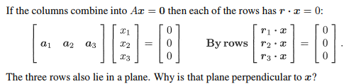
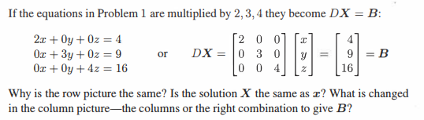
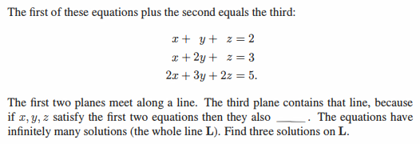
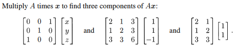
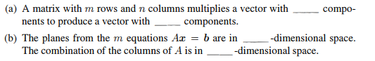
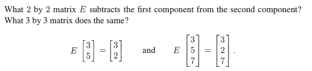
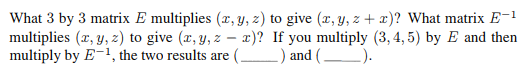

# Chapter 2-1

## Problem 2

### 圖片

### 解題

### 題目復述

如果矩陣的列向量（columns）組合為 $Ax = 0$，則矩陣的每一行向量（rows）$r$ 滿足 $r \cdot x = 0$。
給定方程式：
$$\begin{bmatrix} a_1 & a_2 & a_3 \end{bmatrix} \begin{bmatrix} x_1 \\ x_2 \\ x_3 \end{bmatrix} = \begin{bmatrix} 0 \\ 0 \\ 0 \end{bmatrix}$$
從行向量（rows）的角度來看，其結果為：
$$\begin{bmatrix} r_1 \cdot x \\ r_2 \cdot x \\ r_3 \cdot x \end{bmatrix} = \begin{bmatrix} 0 \\ 0 \\ 0 \end{bmatrix}$$
這三個行向量 $r_1, r_2, r_3$ 同樣位於一個平面上。請問為什麼該平面垂直於向量 $x$？

### 解題過程

1. **分析內積關係**：根據題目給出的行向量視角，矩陣 $A$ 的每一行 $r_i$ 與向量 $x$ 的內積（dot product）均為 0：
   $$r_1 \cdot x = 0$$
   $$r_2 \cdot x = 0$$
   $$r_3 \cdot x = 0$$

2. **內積的幾何意義**：在線性代數中，若兩個非零向量的內積為 0，則這兩個向量在幾何上是**正交（orthogonal）**的，也就是彼此垂直。

3. **定義平面**：在三維空間 $\mathbb{R}^3$ 中，所有與給定向量 $x$ 正交的向量 $r$ 的集合，其構成的幾何形狀是一個通過原點的平面。在這個定義中，向量 $x$ 被稱為該平面的**法向量（normal vector）**。

4. **得出結論**：既然 $r_1, r_2, r_3$ 這三個向量都滿足與 $x$ 的內積為 0，這意味著這三個向量都位於由 $x$ 作為法向量的同一個平面上。因為法向量的定義就是垂直於平面上所有向量的向量，因此該平面必然垂直於向量 $x$。

### 用到的觀念

* **矩陣乘法的行視角 (Row View of Matrix Multiplication)**：矩陣 $Ax$ 的結果向量中，每一個分量是矩陣 $A$ 的對應行向量與向量 $x$ 的內積。
* **內積與正交 (Dot Product and Orthogonality)**：兩個向量的內積為 0 $\iff$ 兩個向量互相垂直（正交）。
* **平面的法向量 (Normal Vector of a Plane)**：在三維空間中，一個平面可以由一個通過原點的點以及一個垂直於該平面的向量（法向量）來唯一確定。方程式 $n \cdot v = 0$ 定義了所有垂直於 $n$ 的向量 $v$ 所組成的平面。

---

## Problem 5

### 圖片

### 解題

### 題目復述

若將問題 1 中的方程式分別乘以 $2, 3, 4$，它們變成了 $DX = B$：
$$2x + 0y + 0z = 4$$
$$0x + 3y + 0z = 9$$
$$0x + 0y + 4z = 16$$
或者寫成矩陣形式：
$$\begin{bmatrix} 2 & 0 & 0 \\ 0 & 3 & 0 \\ 0 & 0 & 4 \end{bmatrix} \begin{bmatrix} x \\ y \\ z \end{bmatrix} = \begin{bmatrix} 4 \\ 9 \\ 16 \end{bmatrix}$$
請回答以下問題：
1. 為什麼行圖（row picture）是相同的？
2. 解 $\mathbf{X}$ 是否與原問題 1 的解 $\mathbf{x}$ 相同？
3. 在列圖（column picture）中，改變的是「列向量（columns）」還是「為了得到 $\mathbf{B}$ 而需要的線性組合（right combination）」？

### 解題過程

**1. 關於行圖（Row Picture）：**
在行圖中，每一個線性方程式代表 $\mathbb{R}^3$ 空間中的一個平面。原問題 1 的方程式分別為 $x=2, y=3, z=4$。當我們將這些方程式分別乘以 $2, 3, 4$ 時，得到了 $2x=4, 3y=9, 4z=16$。
由於將一個方程式的兩邊同時乘以一個非零常數，其所代表的幾何平面在空間中的位置完全不會改變。因此，這三個平面的交點依然位於同一位置，所以行圖是相同的。

**2. 關於解 $\mathbf{X}$：**
我們直接求解該系統：
- 由 $2x = 4$ 得 $x = 2$
- 由 $3y = 9$ 得 $y = 3$
- 由 $4z = 16$ 得 $z = 4$
因此，解為 $\mathbf{X} = \begin{bmatrix} 2 \\ 3 \\ 4 \end{bmatrix}$。這與原問題 1 的解完全相同。

**3. 關於列圖（Column Picture）：**
列圖將方程式視為列向量的線性組合：
- 原問題 1 的列圖：$x \begin{bmatrix} 1 \\ 0 \\ 0 \end{bmatrix} + y \begin{bmatrix} 0 \\ 1 \\ 0 \end{bmatrix} + z \begin{bmatrix} 0 \\ 0 \\ 1 \end{bmatrix} = \begin{bmatrix} 2 \\ 3 \\ 4 \end{bmatrix}$
- 本題的列圖：$x \begin{bmatrix} 2 \\ 0 \\ 0 \end{bmatrix} + y \begin{bmatrix} 0 \\ 3 \\ 0 \end{bmatrix} + z \begin{bmatrix} 0 \\ 0 \\ 4 \end{bmatrix} = \begin{bmatrix} 4 \\ 9 \\ 16 \end{bmatrix}$

對比兩者，我們可以看到：
- **列向量（Columns）改變了**：原本的單位向量變成了其倍數（$2\mathbf{e}_1, 3\mathbf{e}_2, 4\mathbf{e}_3$）。
- **線性組合的係數（Combination）沒變**：為了得到結果向量 $\mathbf{B}$，我們依然需要使用相同的係數 $x=2, y=3, z=4$。
- **結果向量 $\mathbf{B}$ 也改變了**。

因此，改變的是**列向量（columns）**，而為了得到 $\mathbf{B}$ 的線性組合係數（即解 $\mathbf{X}$）則保持不變。

### 用到的觀念

1. **行圖 (Row Picture)**：將線性方程組的每個方程式視為高維空間中的超平面，方程組的解即為這些平面的共同交點。
2. **列圖 (Column Picture)**：將矩陣乘法視為矩陣各列向量的線性組合，尋找一組權重（解 $\mathbf{X}$）使得組合後的向量等於目標向量 $\mathbf{B}$。
3. **方程式的等價性 (Equivalent Equations)**：將方程式兩邊同時乘以非零常數，不會改變該方程式的解集，也不會改變其幾何表示（平面）。
4. **線性組合 (Linear Combination)**：指將一組向量乘以對應的純量後相加的運算。

---

## Problem 12

### 圖片

### 解題

### 題目復述
給定三個線性方程式：
1) $x + y + z = 2$
2) $x + 2y + z = 3$
3) $2x + 3y + 2z = 5$

題目指出第一個方程式加上第二個方程式等於第三個方程式。前兩個平面交於一條直線 $L$，而第三個平面也包含這條直線，因為如果 $x, y, z$ 滿足前兩個方程式，則它們也 $\underline{\hspace{1cm}}$。由於此方程組有無限多組解（即整條直線 $L$），請找出直線 $L$ 上的三組解。

### 解題過程
**1. 填空部分：**
由於第三個方程式是前兩個方程式的相加結果，因此若一組解 $(x, y, z)$ 同時滿足前兩個方程式，則其總和必然滿足第三個方程式。
空格應填入：**「滿足第三個方程式」**。

**2. 求解直線 $L$ 的一般解：**
為了找出直線 $L$ 上的點，我們只需解由前兩個方程式組成的系統：
(1) $x + y + z = 2$
(2) $x + 2y + z = 3$

將方程式 (2) 減去方程式 (1)：
$(x + 2y + z) - (x + y + z) = 3 - 2$
$y = 1$

將 $y = 1$ 代回方程式 (1)：
$x + 1 + z = 2$
$x + z = 1 \implies x = 1 - z$

因此，直線 $L$ 上的任意一點可以用參數 $z$ 來表示，其一般解為：
$(x, y, z) = (1 - z, 1, z)$

**3. 找出三組具體解：**
我們可以隨意賦予 $z$ 不同的數值來獲得三組解：
* 當 $z = 0$ 時，$x = 1 - 0 = 1$，$y = 1$ $\implies$ 解為 **$(1, 1, 0)$**
* 當 $z = 1$ 時，$x = 1 - 1 = 0$，$y = 1$ $\implies$ 解為 **$(0, 1, 1)$**
* 當 $z = 2$ 時，$x = 1 - 2 = -1$，$y = 1$ $\implies$ 解為 **$(-1, 1, 2)$**

（註：任何符合 $(1-z, 1, z)$ 形式的點均為正確答案）

### 用到的觀念
* **線性組合 (Linear Combination)**：當一個方程式可以由其他方程式透過加減或倍數相加得到時，該方程式與原方程式組是線性相關的。在本題中，第三式是前兩式的線性組合，因此它沒有提供額外的約束條件。
* **平面的交集 (Intersection of Planes)**：在三維空間中，兩個不平行的平面相交會形成一條直線。
* **自由變數 (Free Variable)**：當方程組的獨立方程式數量少於變數數量時，會存在自由變數（本題中 $z$ 為自由變數），這導致系統有無限多組解。
* **參數方程 (Parametric Equation)**：利用一個參數（如 $z$ 或 $t$）來描述直線或曲線上的所有點的方法。

---

## Problem 13

### 圖片

### 解題

### 題目復述
計算矩陣 $A$ 與向量 $x$ 的乘積 $Ax$ 以找出其三個分量，分別針對以下三組運算：
1) $\begin{bmatrix} 0 & 0 & 1 \\ 0 & 1 & 0 \\ 1 & 0 & 0 \end{bmatrix} \begin{bmatrix} x \\ y \\ z \end{bmatrix}$
2) $\begin{bmatrix} 2 & 1 & 3 \\ 1 & 2 & 3 \\ 3 & 3 & 6 \end{bmatrix} \begin{bmatrix} 1 \\ 1 \\ -1 \end{bmatrix}$
3) $\begin{bmatrix} 2 & 1 \\ 1 & 2 \\ 3 & 3 \end{bmatrix} \begin{bmatrix} 1 \\ 1 \end{bmatrix}$

### 解題過程
1) $\begin{bmatrix} 0 & 0 & 1 \\ 0 & 1 & 0 \\ 1 & 0 & 0 \end{bmatrix} \begin{bmatrix} x \\ y \\ z \end{bmatrix} = \begin{bmatrix} 0 \cdot x + 0 \cdot y + 1 \cdot z \\ 0 \cdot x + 1 \cdot y + 0 \cdot z \\ 1 \cdot x + 0 \cdot y + 0 \cdot z \end{bmatrix} = \begin{bmatrix} z \\ y \\ x \end{bmatrix}$

2) $\begin{bmatrix} 2 & 1 & 3 \\ 1 & 2 & 3 \\ 3 & 3 & 6 \end{bmatrix} \begin{bmatrix} 1 \\ 1 \\ -1 \end{bmatrix} = \begin{bmatrix} (2 \times 1) + (1 \times 1) + (3 \times -1) \\ (1 \times 1) + (2 \times 1) + (3 \times -1) \\ (3 \times 1) + (3 \times 1) + (6 \times -1) \end{bmatrix} = \begin{bmatrix} 2 + 1 - 3 \\ 1 + 2 - 3 \\ 3 + 3 - 6 \end{bmatrix} = \begin{bmatrix} 0 \\ 0 \\ 0 \end{bmatrix}$

3) $\begin{bmatrix} 2 & 1 \\ 1 & 2 \\ 3 & 3 \end{bmatrix} \begin{bmatrix} 1 \\ 1 \end{bmatrix} = \begin{bmatrix} (2 \times 1) + (1 \times 1) \\ (1 \times 1) + (2 \times 1) \\ (3 \times 1) + (3 \times 1) \end{bmatrix} = \begin{bmatrix} 3 \\ 3 \\ 6 \end{bmatrix}$

### 用到的觀念
* **矩陣與向量乘法 (Matrix-Vector Multiplication)**：結果向量的第 $i$ 個分量，是由矩陣 $A$ 的第 $i$ 行向量與向量 $x$ 進行內積（dot product）計算而得。
* **線性組合 (Linear Combination)**：矩陣乘法也可視為將矩陣 $A$ 的各個行向量，以向量 $x$ 的分量作為權重進行線性組合。

---

## Problem 18

### 圖片

### 解題

### 題目復述

(a) 一個具有 $m$ 列 (rows) 和 $n$ 行 (columns) 的矩陣，乘以一個具有 \_\_\_\_\_ 個分量的向量，會產生一個具有 \_\_\_\_\_ 個分量的向量。

(b) 由 $m$ 個方程式組成的 $Ax = b$ 中的平面位於 \_\_\_\_\_ 維空間中。矩陣 $A$ 的行向量 (columns) 之線性組合位於 \_\_\_\_\_ 維空間中。

### 解題過程

**(a) 關於矩陣與向量的乘法：**
根據矩陣乘法的定義，若一個矩陣 $A$ 的維度為 $m \times n$（$m$ 列 $n$ 行），為了能與向量 $x$ 進行乘法運算 $Ax$，向量 $x$ 的分量個數（維度）必須與矩陣 $A$ 的**行數 (columns)** 相匹配。因此，向量 $x$ 必須有 $n$ 個分量。
相乘後的結果向量 $y = Ax$ 的維度將會等於矩陣 $A$ 的**列數 (rows)**。因此，結果向量具有 $m$ 個分量。
**答案：第一個空格為 $n$，第二個空格為 $m$。**

**(b) 關於 $Ax = b$ 的幾何解釋：**
1. 在方程式 $Ax = b$ 中，$x$ 是一個包含 $n$ 個未知數的向量 $\begin{bmatrix} x_1 & x_2 & \dots & x_n \end{bmatrix}^T$。每一個單獨的線性方程式 $\sum_{j=1}^n a_{ij}x_j = b_i$ 都定義了 $n$ 維空間 $\mathbb{R}^n$ 中的一個超平面 (hyperplane)。因此，這些平面位於 **$n$ 維空間**。
2. 矩陣 $A$ 的每一行 (column) 都是一個具有 $m$ 個分量的向量（因為有 $m$ 列）。矩陣與向量的乘積 $Ax$ 實際上就是矩陣 $A$ 的行向量之線性組合：
   $Ax = x_1 \mathbf{a}_1 + x_2 \mathbf{a}_2 + \dots + x_n \mathbf{a}_n$
   由於每個行向量 $\mathbf{a}_i$ 都在 $\mathbb{R}^m$ 中，因此它們的任何線性組合結果必然仍位於 **$m$ 維空間**。
**答案：第一個空格為 $n$，第二個空格為 $m$。**

### 用到的觀念

*   **矩陣乘法維度匹配 (Matrix Multiplication Dimensions)：** 矩陣 $A(m \times n)$ 乘以向量 $x(n \times 1)$ 得到向量 $b(m \times 1)$。這決定了輸入與輸出向量的維度。
*   **超平面 (Hyperplane)：** 在 $n$ 維空間中，一個線性方程式定義了一個 $(n-1)$ 維的子空間（或其平移），稱為超平面。
*   **列空間 (Column Space)：** 矩陣 $A$ 所有行向量的線性組合所構成的集合，稱為 $A$ 的列空間 $C(A)$，該空間是 $\mathbb{R}^m$ 的子空間。

---

## Problem 19

### 圖片

### 解題

### 題目復述
找出一個 $2 \times 2$ 矩陣 $E$，使其在與一個向量相乘時，能將該向量的第一個分量從第二個分量中減去。同樣地，找出一個 $3 \times 3$ 矩陣 $E$ 能達成相同的操作。

題目給出的範例為：
- 對於 $2 \times 2$ 情況：$E \begin{bmatrix} 3 \\ 5 \end{bmatrix} = \begin{bmatrix} 3 \\ 2 \end{bmatrix}$ （其中 $5 - 3 = 2$）
- 對於 $3 \times 3$ 情況：$E \begin{bmatrix} 3 \\ 5 \\ 7 \end{bmatrix} = \begin{bmatrix} 3 \\ 2 \\ 7 \end{bmatrix}$ （其中 $5 - 3 = 2$，其餘分量不變）

### 解題過程

##### 1. 求解 $2 \times 2$ 矩陣 $E$
假設矩陣 $E = \begin{bmatrix} a & b \\ c & d \end{bmatrix}$，且輸入向量為 $\begin{bmatrix} x_1 \\ x_2 \end{bmatrix}$。
根據題目要求，變換後的結果應為 $\begin{bmatrix} x_1 \\ x_2 - x_1 \end{bmatrix}$。

我們可以建立以下方程式：
$$\begin{bmatrix} a & b \\ c & d \end{bmatrix} \begin{bmatrix} x_1 \\ x_2 \end{bmatrix} = \begin{bmatrix} ax_1 + bx_2 \\ cx_1 + dx_2 \end{bmatrix} = \begin{bmatrix} x_1 \\ -x_1 + x_2 \end{bmatrix}$$

對比對應分量：
- 第一列：$ax_1 + bx_2 = x_1 \implies a = 1, b = 0$
- 第二列：$cx_1 + dx_2 = -x_1 + x_2 \implies c = -1, d = 1$

因此，$2 \times 2$ 矩陣 $E = \begin{bmatrix} 1 & 0 \\ -1 & 1 \end{bmatrix}$。

---

##### 2. 求解 $3 \times 3$ 矩陣 $E$
同理，假設輸入向量為 $\begin{bmatrix} x_1 \\ x_2 \\ x_3 \end{bmatrix}$，目標結果為 $\begin{bmatrix} x_1 \\ x_2 - x_1 \\ x_3 \end{bmatrix}$。

我們需要建構一個矩陣，使得每一列的線性組合符合目標結果：
- 第一列結果為 $x_1$ $\implies$ 係數為 $\begin{bmatrix} 1 & 0 & 0 \end{bmatrix}$
- 第二列結果為 $-x_1 + x_2$ $\implies$ 係數為 $\begin{bmatrix} -1 & 1 & 0 \end{bmatrix}$
- 第三列結果為 $x_3$ $\implies$ 係數為 $\begin{bmatrix} 0 & 0 & 1 \end{bmatrix}$

將其組合起來，得到 $3 \times 3$ 矩陣 $E = \begin{bmatrix} 1 & 0 & 0 \\ -1 & 1 & 0 \\ 0 & 0 & 1 \end{bmatrix}$。

### 用到的觀念
1. **矩陣與向量相乘 (Matrix-Vector Multiplication)**：矩陣乘以向量的結果是矩陣每一列與向量的內積，決定了輸出向量的每個分量。
2. **初等矩陣 (Elementary Matrix)**：本題所求的 $E$ 是一種初等矩陣，對應於高斯消去法中的「列運算 (Row Operation)」——將某一列的倍數加到另一列上。
3. **線性變換 (Linear Transformation)**：將輸入空間的向量映射到輸出空間，本題描述的是一種特定的線性映射，其作用是改變向量的特定分量。

---

## Problem 27

### 圖片

### 解題

### 題目復述
哪個 $3 \times 3$ 矩陣 $E$ 乘以向量 $(x, y, z)$ 會得到 $(x, y, z + x)$？哪個矩陣 $E^{-1}$ 乘以向量 $(x, y, z)$ 會得到 $(x, y, z - x)$？如果你將向量 $(3, 4, 5)$ 乘以 $E$，接著再乘以 $E^{-1}$，這兩次的計算結果分別是 $(\_\_\_\_\_)$ 與 $(\_\_\_\_\_)$。

### 解題過程
**1. 求矩陣 $E$**
我們需要找一個矩陣 $E$，使得：
$$E \begin{pmatrix} x \\ y \\ z \end{pmatrix} = \begin{pmatrix} x \\ y \\ z + x \end{pmatrix}$$
觀察輸出結果：
- 第一個分量 $x = 1 \cdot x + 0 \cdot y + 0 \cdot z$
- 第二個分量 $y = 0 \cdot x + 1 \cdot y + 0 \cdot z$
- 第三個分量 $z + x = 1 \cdot x + 0 \cdot y + 1 \cdot z$

因此，矩陣 $E$ 為：
$$E = \begin{pmatrix} 1 & 0 & 0 \\ 0 & 1 & 0 \\ 1 & 0 & 1 \end{pmatrix}$$

**2. 求矩陣 $E^{-1}$**
我們需要找一個矩陣 $E^{-1}$，使得：
$$E^{-1} \begin{pmatrix} x \\ y \\ z \end{pmatrix} = \begin{pmatrix} x \\ y \\ z - x \end{pmatrix}$$
觀察輸出結果：
- 第一個分量 $x = 1 \cdot x + 0 \cdot y + 0 \cdot z$
- 第二個分量 $y = 0 \cdot x + 1 \cdot y + 0 \cdot z$
- 第三個分量 $z - x = -1 \cdot x + 0 \cdot y + 1 \cdot z$

因此，矩陣 $E^{-1}$ 為：
$$E^{-1} = \begin{pmatrix} 1 & 0 & 0 \\ 0 & 1 & 0 \\ -1 & 0 & 1 \end{pmatrix}$$
（可驗證 $E \cdot E^{-1} = I$，即單位矩陣）

**3. 數值計算**
給定起始向量 $v = (3, 4, 5)$：
- 第一步：將 $v$ 乘以 $E$
$$E \begin{pmatrix} 3 \\ 4 \\ 5 \end{pmatrix} = \begin{pmatrix} 3 \\ 4 \\ 5 + 3 \end{pmatrix} = \begin{pmatrix} 3 \\ 4 \\ 8 \end{pmatrix}$$
- 第二步：將上述結果乘以 $E^{-1}$
$$E^{-1} \begin{pmatrix} 3 \\ 4 \\ 8 \end{pmatrix} = \begin{pmatrix} 3 \\ 4 \\ 8 - 3 \end{pmatrix} = \begin{pmatrix} 3 \\ 4 \\ 5 \end{pmatrix}$$

**最終答案：**
兩個結果分別是 **$(3, 4, 8)$** 與 **$(3, 4, 5)$**。

### 用到的觀念
- **矩陣與向量乘法 (Matrix-Vector Multiplication)**：將矩陣作用於向量，可以看作是對向量的座標進行線性變換。
- **基本矩陣 (Elementary Matrix)**：對單位矩陣進行一次基本行運算（例如將第一列加到第三列）所得到的矩陣。
- **逆矩陣 (Inverse Matrix)**：若矩陣 $E$ 代表某種線性變換，則其逆矩陣 $E^{-1}$ 代表將該變換「還原」的反向操作。
- **單位矩陣 (Identity Matrix)**：任何矩陣乘以其逆矩陣後會得到單位矩陣 $I$，而任何向量乘以 $I$ 都會保持原樣。

---
