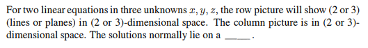
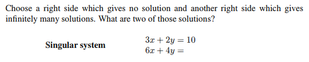
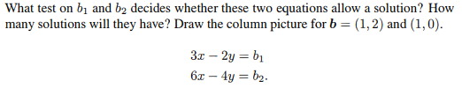
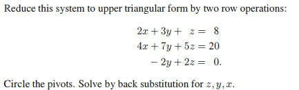
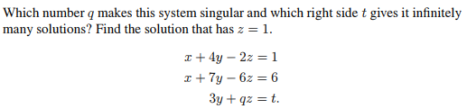

# Chapter 2-2

## Problem 5

### 圖片

### 解題

### 題目復述
對於三個未知數 $x, y, z$ 的兩個線性方程式，其「列圖形」(row picture) 會在 (2 或 3) 維空間中顯示 (2 或 3) 個 (直線或平面)。其「行圖形」(column picture) 則位於 (2 或 3) 維空間中。其解集通常位於一條 \_\_\_\_\_\_ 上。

### 解題過程
1. **分析列圖形 (Row Picture)**：
   在線性代數中，列圖形是指將每個方程式單獨視為一個幾何對象。對於三個未知數 $x, y, z$ 的單個線性方程式（例如 $ax + by + cz = d$），它在三維空間中代表一個**平面 (plane)**。題目中給出的是兩個方程式，因此會顯示 **2** 個平面，且這些平面存在於 **3** 維空間中。

2. **分析行圖形 (Column Picture)**：
   行圖形是指將方程組視為列向量的線性組合。方程組可以寫成 $x\mathbf{v}_1 + y\mathbf{v}_2 + z\mathbf{v}_3 = \mathbf{b}$。其中 $\mathbf{b}$ 是結果向量，其維度等於方程式的數量。由於本題有兩個方程式，$\mathbf{b}$ 是一個二維向量，因此行圖形位於 **2** 維空間中。

3. **分析解集 (Solutions)**：
   從列圖形的角度來看，解集就是這兩個平面的交集。在三維空間中，兩個不平行且不重合的平面相交，其交集通常是一條**直線 (line)**。

**最終答案填空：**
列圖形會顯示 (**2**) 個 (**planes**) 在 (**3**)-維空間中。行圖形在 (**2**)-維空間中。解集通常位於一條 **直線 (line)** 上。

### 用到的觀念
*   **列圖形 (Row Picture)**：將線性方程組的每一個方程式視為一個幾何對象（在 2D 是直線，在 3D 是平面），解為這些對象的共同交點。
*   **行圖形 (Column Picture)**：將線性方程組視為列向量的線性組合，尋找係數 $x, y, z$ 使得向量組合後能合成結果向量 $\mathbf{b}$。
*   **維度 (Dimension)**：未知數的個數決定了列圖形所在的空間維度；方程式的個數決定了行圖形中結果向量所在的空間維度。
*   **平面的交集**：在 $\mathbb{R}^3$ 中，兩個不平行平面的相交結果為一條直線。

---

## Problem 9

### 圖片

### 解題

### 題目復述
給定一個奇異系統（Singular system）：
$3x + 2y = 10$
$6x + 4y = \text{?}$

請選擇一個右側數值使得該系統**無解**，以及另一個右側數值使得該系統有**無限多組解**。此外，針對有無限多組解的情況，請提供其中兩組解。

### 解題過程
1. **分析係數關係**：
   觀察兩個方程式的左側，第二個方程式的係數 $(6x + 4y)$ 正好是第一個方程式 $(3x + 2y)$ 的 2 倍。
   即：$6x + 4y = 2(3x + 2y)$。

2. **尋找無解的情況**：
   若要使系統無解，代表這兩條直線必須**平行且不重合**。
   根據上述倍數關係，如果右側數值$\neq 10 \times 2$（即 $\neq 20$），則會產生矛盾。
   **選擇右側數值為 $5$**（或任何不等於 20 的數）：
   系統變為：
   $3x + 2y = 10$
   $6x + 4y = 5$
   將第一式乘 2 得 $6x + 4y = 20$，與第二式 $6x + 4y = 5$ 矛盾 $\implies$ **無解**。

3. **尋找無限多組解的情況**：
   若要使系統有無限多組解，代表這兩條直線必須**完全重合**。
   因此，右側數值必須剛好是 $10$ 的 2 倍。
   **選擇右側數值為 $20$**：
   系統變為：
   $3x + 2y = 10$
   $6x + 4y = 20$
   此時第二個方程式等同於第一個方程式 $\implies$ **無限多組解**。

4. **找出兩組解**：
   我們只需在方程式 $3x + 2y = 10$ 中代入任意數值即可：
   - 令 $x = 0$，則 $2y = 10 \implies y = 5$。第一組解為 **$(0, 5)$**。
   - 令 $y = 2$，則 $3x + 4 = 10 \implies 3x = 6 \implies x = 2$。第二組解為 **$(2, 2)$**。

**最終答案：**
- 無解的右側數值：$5$（或其他 $\neq 20$ 的數）
- 無限多解的右側數值：$20$
- 兩組解：$(0, 5)$ 與 $(2, 2)$

### 用到的觀念
- **奇異系統 (Singular System)**：指其係數矩陣的行列式（Determinant）為零，這意味著方程式之間存在線性相關性，系統不會有唯一的解（不是無解就是無限多解）。
- **平行線與重合線**：
    - 若兩直線的斜率相同但截距不同，則兩線平行，系統**無解**。
    - 若兩直線的斜率相同且截距也相同，則兩線重合，系統有**無限多組解**。
- **線性相關 (Linear Dependence)**：當一個方程式可以透過將另一個方程式乘以常數而得到時，這兩個方程式是線性相關的。

---

## Problem 12

### 圖片

### 解題

### 題目復述
給定以下兩個線性方程式：
$3x - 2y = b_1$
$6x - 4y = b_2$

請回答：
1. 關於 $b_1$ 與 $b_2$ 的什麼測試（條件）可以決定這兩個方程式是否有解？
2. 若有解，則會有多少個解？
3. 分別針對 $b = (1, 2)$ 與 $b = (1, 0)$ 繪製其列向量圖（column picture）。

### 解題過程
**1. 判定有解的測試條件：**
觀察兩個方程式的左側：
第一式：$3x - 2y$
第二式：$6x - 4y = 2(3x - 2y)$
可以發現第二個方程式的左側正好是第一個方程式左側的 2 倍。為了使系統不產生矛盾（即有解），右側的常數項必須滿足相同的比例關係。
因此，判定測試為：**$b_2 = 2b_1$**。
* 若 $b_2 = 2b_1$，則系統有解。
* 若 $b_2 \neq 2b_1$，則系統矛盾，無解。

**2. 解的數量：**
當滿足 $b_2 = 2b_1$ 時，這兩個方程式實際上代表同一條直線（第二式是第一式的倍數，屬於冗餘方程式）。在二維平面中，一個方程式與兩個未知數會形成一條直線。
因此，此時會有**無限多組解**。

**3. 列向量圖 (Column Picture) 分析：**
將方程式改寫為列向量形式：
$x \begin{bmatrix} 3 \\ 6 \end{bmatrix} + y \begin{bmatrix} -2 \\ -4 \end{bmatrix} = \begin{bmatrix} b_1 \\ b_2 \end{bmatrix}$
這裡的列向量為 $\mathbf{v_1} = \begin{bmatrix} 3 \\ 6 \end{bmatrix}$ 與 $\mathbf{v_2} = \begin{bmatrix} -2 \\ -4 \end{bmatrix}$。注意 $\mathbf{v_2} = -\frac{2}{3}\mathbf{v_1}$，這表示兩個向量共線，落在通過原點且斜率為 2 的同一條直線上。

* **當 $b = (1, 2)$ 時：**
  目標向量 $\mathbf{b} = \begin{bmatrix} 1 \\ 2 \end{bmatrix}$。因為 $2 = 2 \times 1$，$\mathbf{b}$ 恰好落在 $\mathbf{v_1}$ 與 $\mathbf{v_2}$ 所在的直線上。
  **繪圖描述：** 在座標軸上，$\mathbf{v_1}, \mathbf{v_2}, \mathbf{b}$ 三個向量全部落在同一條穿過原點的直線上，因此 $\mathbf{b}$ 可以由 $\mathbf{v_1}$ 和 $\mathbf{v_2}$ 的線性組合達成。

* **當 $b = (1, 0)$ 時：**
  目標向量 $\mathbf{b} = \begin{bmatrix} 1 \\ 0 \end{bmatrix}$。因為 $0 \neq 2 \times 1$，$\mathbf{b}$ 不在 $\mathbf{v_1}$ 與 $\mathbf{v_2}$ 所在的直線上。
  **繪圖描述：** $\mathbf{v_1}$ 與 $\mathbf{v_2}$ 仍在同一條直線上，但 $\mathbf{b}$ 向量指向右方（x軸），脫離了該直線。因此無法透過 $\mathbf{v_1}$ 和 $\mathbf{v_2}$ 的組合到達 $\mathbf{b}$，無解。

### 用到的觀念
* **線性組合 (Linear Combination)：** 將向量乘以純量（係數）後相加，用以表示方程式的解。
* **列向量圖 (Column Picture)：** 將線性方程組視為「列向量的線性組合等於目標向量 $b$」的幾何視角。
* **線性相依 (Linear Dependence)：** 當一組向量中存在某個向量可以由其他向量表示（如本題 $\mathbf{v_1}$ 與 $\mathbf{v_2}$ 共線），則稱其為線性相依。
* **一致性 (Consistency)：** 若方程式系統存在至少一組解，則稱其為一致的 (Consistent)；否則為不一致 (Inconsistent)。

---

## Problem 19

### 圖片

### 解題

### 題目復述
請將下列線性方程組透過兩次列運算（row operations）簡化為上三角形式（upper triangular form）：
$2x + 3y + z = 8$
$4x + 7y + 5z = 20$
$-2y + 2z = 0$

接著請標出主元（pivots），並利用回代法（back substitution）求出 $z, y, x$ 的解。

### 解題過程
首先，將方程式轉換為增廣矩陣（Augmented Matrix）：
$\begin{bmatrix} 2 & 3 & 1 & | & 8 \\ 4 & 7 & 5 & | & 20 \\ 0 & -2 & 2 & | & 0 \end{bmatrix}$

**第一步：消除第二列的第一個元素**
執行列運算 $R_2 \to R_2 - 2R_1$：
$R_2: [4 - 2(2), 7 - 2(3), 5 - 2(1), | 20 - 2(8)] = [0, 1, 3, | 4]$
矩陣變為：
$\begin{bmatrix} 2 & 3 & 1 & | & 8 \\ 0 & 1 & 3 & | & 4 \\ 0 & -2 & 2 & | & 0 \end{bmatrix}$

**第二步：消除第三列的第二個元素**
執行列運算 $R_3 \to R_3 + 2R_2$：
$R_3: [0 + 2(0), -2 + 2(1), 2 + 2(3), | 0 + 2(4)] = [0, 0, 8, | 8]$
矩陣變為上三角形式：
$\begin{bmatrix} \mathbf{2} & 3 & 1 & | & 8 \\ 0 & \mathbf{1} & 3 & | & 4 \\ 0 & 0 & \mathbf{8} & | & 8 \end{bmatrix}$
（其中粗體部分 $\mathbf{2, 1, 8}$ 即為**主元 pivots**）

**第三步：使用回代法求解**
1. 由第三列得：$8z = 8 \implies \mathbf{z = 1}$
2. 將 $z=1$ 代入第二列：$y + 3(1) = 4 \implies y = 4 - 3 \implies \mathbf{y = 1}$
3. 將 $y=1, z=1$ 代入第一列：$2x + 3(1) + 1 = 8 \implies 2x + 4 = 8 \implies 2x = 4 \implies \mathbf{x = 2}$

**最終答案：**
$x = 2, y = 1, z = 1$

### 用到的觀念
*   **增廣矩陣 (Augmented Matrix)**：將線性方程組的係數與常數項組成矩陣，方便進行運算。
*   **高斯消去法 (Gaussian Elimination)**：透過列運算（如將一列的倍數加到另一列）將矩陣化為上三角形式。
*   **上三角形式 (Upper Triangular Form)**：矩陣中主對角線下方的所有元素皆為 0 的形式。
*   **主元 (Pivot)**：在消去過程中，每一列中第一個非零的元素，用於消除其下方列的對應項。
*   **回代法 (Back Substitution)**：從最後一個變數開始，由下而上地將已求得的解代回原方程以求出其餘未知數。

---

## Problem 27

### 圖片

### 解題

### 題目復述

給定以下線性方程組：
$$x + 4y - 2z = 1$$
$$x + 7y - 6z = 6$$
$$3y + qz = t$$

請回答以下問題：
1. 哪個數字 $q$ 會使此系統變成奇異的（singular）？
2. 哪個右側數值 $t$ 會使系統有無限多組解？
3. 在上述條件下，求出滿足 $z = 1$ 的解。

### 解題過程

我們可以使用增廣矩陣（Augmented Matrix）並透過高斯消去法（Gaussian Elimination）來求解。

**步驟 1：建立增廣矩陣並進行列運算**
增廣矩陣為：
$$\begin{bmatrix} 1 & 4 & -2 & | & 1 \\ 1 & 7 & -6 & | & 6 \\ 0 & 3 & q & | & t \end{bmatrix}$$

執行列運算 $R_2 \to R_2 - R_1$：
$$\begin{bmatrix} 1 & 4 & -2 & | & 1 \\ 0 & 3 & -4 & | & 5 \\ 0 & 3 & q & | & t \end{bmatrix}$$

執行列運算 $R_3 \to R_3 - R_2$：
$$\begin{bmatrix} 1 & 4 & -2 & | & 1 \\ 0 & 3 & -4 & | & 5 \\ 0 & 0 & q+4 & | & t-5 \end{bmatrix}$$

**步驟 2：找出使系統奇異的 $q$**
一個系統是奇異的（singular），意味著其係數矩陣的行列式為 0，或者在行階梯形矩陣中出現零行。
由最後一列的係數部分可知，當 $q + 4 = 0$ 時，系統為奇異。
$$\therefore q = -4$$

**步驟 3：找出使系統有無限多組解的 $t$**
當 $q = -4$ 時，最後一行變為 $[0 \quad 0 \quad 0 \quad | \quad t-5]$。
若要使系統有解（一致性）且具有無限多組解，則最後一列必須全為 0，即：
$$t - 5 = 0 \implies t = 5$$
$$\therefore t = 5$$

**步驟 4：求出 $z = 1$ 時的解**
在 $q = -4$ 且 $t = 5$ 的條件下，方程組簡化為：
1. $x + 4y - 2z = 1$
2. $3y - 4z = 5$

已知 $z = 1$，代入方程式 (2)：
$$3y - 4(1) = 5 \implies 3y = 9 \implies y = 3$$

將 $y = 3, z = 1$ 代入方程式 (1)：
$$x + 4(3) - 2(1) = 1$$
$$x + 12 - 2 = 1$$
$$x + 10 = 1 \implies x = -11 + 2 \text{ (錯) } \to x = 1 - 10 = -9$$
$$\therefore x = -9$$

**最終答案：**
- $q = -4$
- $t = 5$
- 當 $z = 1$ 時，解為 $(x, y, z) = (-9, 3, 1)$。

### 用到的觀念

1. **奇異矩陣 (Singular Matrix)**：當一個方陣的行列式為 0 時，該矩陣稱為奇異矩陣，這意味著它不可逆，且對應的線性方程組 either 無解或有無限多組解。
2. **高斯消去法 (Gaussian Elimination)**：透過基本的列運算（如兩列相加減）將矩陣轉化為行階梯形（Row Echelon Form），以便分析解的性質。
3. **無限多組解 (Infinitely Many Solutions)**：在增廣矩陣化簡後，若出現 $0 = 0$ 的情況且自由變數（free variable）數量大於 0，則系統具有無限多組解。
4. **增廣矩陣 (Augmented Matrix)**：將係數矩陣與常數項向量合併在一起的矩陣，用於方便地進行線性方程組的運算。

---
