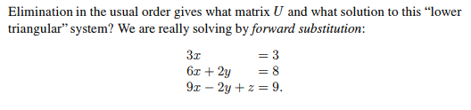
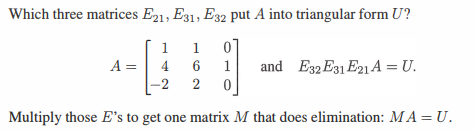
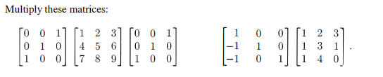
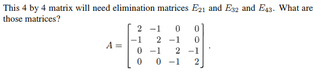
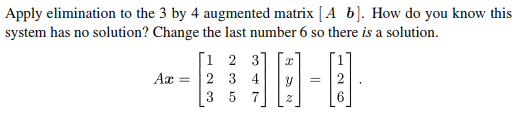

# Chapter 2-3

## Problem 3

### 圖片

### 解題

### 題目復述
依照通常的消去法順序，此「下三角」系統會得到什麼矩陣 $U$？以及該系統的解為何？我們實際上是透過「前向代入法」(forward substitution) 來求解以下系統：
$3x = 3$
$6x + 2y = 8$
$9x - 2y + z = 9$

### 解題過程
**1. 求解矩陣 $U$**
首先，將該線性系統寫成矩陣形式 $Ax = b$，其中係數矩陣 $A$ 為：
$$A = \begin{pmatrix} 3 & 0 & 0 \\ 6 & 2 & 0 \\ 9 & -2 & 1 \end{pmatrix}$$
我們使用高斯消去法（Gaussian Elimination）將其轉化為上三角矩陣 $U$：
*   **第一步：** 消去第一列下方的元素。
    *   第二列 $\text{R}_2 \leftarrow \text{R}_2 - 2\text{R}_1$
    *   第三列 $\text{R}_3 \leftarrow \text{R}_3 - 3\text{R}_1$
    得到：$\begin{pmatrix} 3 & 0 & 0 \\ 0 & 2 & 0 \\ 0 & -2 & 1 \end{pmatrix}$
*   **第二步：** 消去第二列下方的元素。
    *   第三列 $\text{R}_3 \leftarrow \text{R}_3 + 1\text{R}_2$
    得到：$\begin{pmatrix} 3 & 0 & 0 \\ 0 & 2 & 0 \\ 0 & 0 & 1 \end{pmatrix}$

因此，矩陣 $U = \begin{pmatrix} 3 & 0 & 0 \\ 0 & 2 & 0 \\ 0 & 0 & 1 \end{pmatrix}$。

**2. 求解線性系統（前向代入法）**
由於原系統是下三角形式，我們直接由上而下求解：
*   由第一式 $3x = 3 \implies \mathbf{x = 1}$
*   將 $x = 1$ 代入第二式：
    $6(1) + 2y = 8$
    $2y = 2 \implies \mathbf{y = 1}$
*   將 $x = 1, y = 1$ 代入第三式：
    $9(1) - 2(1) + z = 9$
    $7 + z = 9 \implies \mathbf{z = 2}$

**最終答案：**
矩陣 $U = \begin{pmatrix} 3 & 0 & 0 \\ 0 & 2 & 0 \\ 0 & 0 & 1 \end{pmatrix}$，解為 $x = 1, y = 1, z = 2$。

### 用到的觀念
*   **高斯消去法 (Gaussian Elimination)**：利用列運算將矩陣轉化為上三角矩陣 $U$ 的過程，以便於求解線性方程組。
*   **上三角矩陣 (Upper Triangular Matrix)**：主對角線下方所有元素皆為 0 的矩陣。
*   **下三角矩陣 (Lower Triangular Matrix)**：主對角線上方所有元素皆為 0 的矩陣。
*   **前向代入法 (Forward Substitution)**：專門用於求解下三角系統的方法，由第一個變數開始依序求解。

---

## Problem 12

### 圖片

### 解題

### 題目復述

給定矩陣 $A = \begin{bmatrix} 1 & 1 & 0 \\ 4 & 6 & 1 \\ -2 & 2 & 0 \end{bmatrix}$，請找出三個基本矩陣 $E_{21}, E_{31}, E_{32}$，使得透過左乘操作 $E_{32}E_{31}E_{21}A = U$，能將 $A$ 轉換為上三角形式 $U$。最後，請將這三個基本矩陣相乘，求得一個消去矩陣 $M$，使得 $MA = U$。

### 解題過程

我們使用高斯消去法（Gaussian Elimination）來將矩陣 $A$ 轉換為上三角形式 $U$，每一步的操作對應一個基本矩陣 $E$。

**第一步：消去 $A_{21}$（第二列第一行）**
為了將 $A_{21} = 4$ 變為 $0$，我們將第二列減去第一列的 4 倍（$R_2 \leftarrow R_2 - 4R_1$）。
對應的基本矩陣為：
$$E_{21} = \begin{bmatrix} 1 & 0 & 0 \\ -4 & 1 & 0 \\ 0 & 0 & 1 \end{bmatrix}$$
操作後矩陣 $A^{(1)} = E_{21}A = \begin{bmatrix} 1 & 1 & 0 \\ 0 & 2 & 1 \\ -2 & 2 & 0 \end{bmatrix}$

**第二步：消去 $A_{31}$（第三列第一行）**
為了將 $A_{31} = -2$ 變為 $0$，我們將第三列加上第一列的 2 倍（$R_3 \leftarrow R_3 + 2R_1$）。
對應的基本矩陣為：
$$E_{31} = \begin{bmatrix} 1 & 0 & 0 \\ 0 & 1 & 0 \\ 2 & 0 & 1 \end{bmatrix}$$
操作後矩陣 $A^{(2)} = E_{31}A^{(1)} = \begin{bmatrix} 1 & 1 & 0 \\ 0 & 2 & 1 \\ 0 & 4 & 0 \end{bmatrix}$

**第三步：消去 $A_{32}$（第三列第二行）**
為了將 $A_{32} = 4$ 變為 $0$，我們將第三列減去第二列的 2 倍（$R_3 \leftarrow R_3 - 2R_2$）。
對應的基本矩陣為：
$$E_{32} = \begin{bmatrix} 1 & 0 & 0 \\ 0 & 1 & 0 \\ 0 & -2 & 1 \end{bmatrix}$$
操作後得到上三角矩陣 $U = E_{32}A^{(2)} = \begin{bmatrix} 1 & 1 & 0 \\ 0 & 2 & 1 \\ 0 & 0 & -2 \end{bmatrix}$

**最後步驟：計算消去矩陣 $M$**
矩陣 $M = E_{32}E_{31}E_{21}$。我們先計算 $E_{31}E_{21}$：
$$E_{31}E_{21} = \begin{bmatrix} 1 & 0 & 0 \\ 0 & 1 & 0 \\ 2 & 0 & 1 \end{bmatrix} \begin{bmatrix} 1 & 0 & 0 \\ -4 & 1 & 0 \\ 0 & 0 & 1 \end{bmatrix} = \begin{bmatrix} 1 & 0 & 0 \\ -4 & 1 & 0 \\ 2 & 0 & 1 \end{bmatrix}$$
再乘以 $E_{32}$：
$$M = E_{32}(E_{31}E_{21}) = \begin{bmatrix} 1 & 0 & 0 \\ 0 & 1 & 0 \\ 0 & -2 & 1 \end{bmatrix} \begin{bmatrix} 1 & 0 & 0 \\ -4 & 1 & 0 \\ 2 & 0 & 1 \end{bmatrix} = \begin{bmatrix} 1 & 0 & 0 \\ -4 & 1 & 0 \\ 10 & -2 & 1 \end{bmatrix}$$

**最終答案：**
三個基本矩陣分別為：
$E_{21} = \begin{bmatrix} 1 & 0 & 0 \\ -4 & 1 & 0 \\ 0 & 0 & 1 \end{bmatrix}, E_{31} = \begin{bmatrix} 1 & 0 & 0 \\ 0 & 1 & 0 \\ 2 & 0 & 1 \end{bmatrix}, E_{32} = \begin{bmatrix} 1 & 0 & 0 \\ 0 & 1 & 0 \\ 0 & -2 & 1 \end{bmatrix}$
消去矩陣 $M = \begin{bmatrix} 1 & 0 & 0 \\ -4 & 1 & 0 \\ 10 & -2 & 1 \end{bmatrix}$

### 用到的觀念

1. **上三角矩陣 (Upper Triangular Matrix)**：所有主對角線下方元素均為 0 的方陣。
2. **基本矩陣 (Elementary Matrix)**：對單位矩陣進行一次基本列操作（如兩列互換、將一列乘以非零常數、將一列的倍數加到另一列）所得到的矩陣。
3. **高斯消去法 (Gaussian Elimination)**：透過一系列基本列操作將矩陣化為上三角形式的過程。
4. **矩陣乘法與列操作的關係**：在矩陣 $A$ 的左側乘以一個基本矩陣 $E$，等同於對 $A$ 執行該基本矩陣所代表的列操作。

---

## Problem 14

### 圖片

### 解題

### 題目復述

請計算以下矩陣的乘積：
1. $\begin{bmatrix} 0 & 0 & 1 \\ 0 & 1 & 0 \\ 1 & 0 & 0 \end{bmatrix} \begin{bmatrix} 1 & 2 & 3 \\ 4 & 5 & 6 \\ 7 & 8 & 9 \end{bmatrix} \begin{bmatrix} 0 & 0 & 1 \\ 0 & 1 & 0 \\ 1 & 0 & 0 \end{bmatrix}$
2. $\begin{bmatrix} 1 & 0 & 0 \\ -1 & 1 & 0 \\ -1 & 0 & 1 \end{bmatrix} \begin{bmatrix} 1 & 2 & 3 \\ 1 & 3 & 1 \\ 1 & 4 & 0 \end{bmatrix}$

### 解題過程

**第一題：**
令 $P = \begin{bmatrix} 0 & 0 & 1 \\ 0 & 1 & 0 \\ 1 & 0 & 0 \end{bmatrix}$ 且 $A = \begin{bmatrix} 1 & 2 & 3 \\ 4 & 5 & 6 \\ 7 & 8 & 9 \end{bmatrix}$。題目要求計算 $P A P$。

第一步：計算 $PA$
$PA = \begin{bmatrix} 0 & 0 & 1 \\ 0 & 1 & 0 \\ 1 & 0 & 0 \end{bmatrix} \begin{bmatrix} 1 & 2 & 3 \\ 4 & 5 & 6 \\ 7 & 8 & 9 \end{bmatrix} = \begin{bmatrix} 7 & 8 & 9 \\ 4 & 5 & 6 \\ 1 & 2 & 3 \end{bmatrix}$
（此步驟實際上是將矩陣 $A$ 的第一列與第三列互換）

第二步：計算 $(PA)P$
$(PA)P = \begin{bmatrix} 7 & 8 & 9 \\ 4 & 5 & 6 \\ 1 & 2 & 3 \end{bmatrix} \begin{bmatrix} 0 & 0 & 1 \\ 0 & 1 & 0 \\ 1 & 0 & 0 \end{bmatrix} = \begin{bmatrix} 9 & 8 & 7 \\ 6 & 5 & 4 \\ 3 & 2 & 1 \end{bmatrix}$
（此步驟實際上是將結果的第一行與第三行互換）

最終答案：$\begin{bmatrix} 9 & 8 & 7 \\ 6 & 5 & 4 \\ 3 & 2 & 1 \end{bmatrix}$

---

**第二題：**
計算 $\begin{bmatrix} 1 & 0 & 0 \\ -1 & 1 & 0 \\ -1 & 0 & 1 \end{bmatrix} \begin{bmatrix} 1 & 2 & 3 \\ 1 & 3 & 1 \\ 1 & 4 & 0 \end{bmatrix}$

根據矩陣乘法定義，結果矩陣的第 $(i, j)$ 個元素是左矩陣第 $i$ 列與右矩陣第 $j$ 行的內積：

- 第一列：
  - $(1,1)$ 位元：$1\cdot1 + 0\cdot1 + 0\cdot1 = 1$
  - $(1,2)$ 位元：$1\cdot2 + 0\cdot3 + 0\cdot4 = 2$
  - $(1,3)$ 位元：$1\cdot3 + 0\cdot1 + 0\cdot0 = 3$
- 第二列：
  - $(2,1)$ 位元：$-1\cdot1 + 1\cdot1 + 0\cdot1 = 0$
  - $(2,2)$ 位元：$-1\cdot2 + 1\cdot3 + 0\cdot4 = 1$
  - $(2,3)$ 位元：$-1\cdot3 + 1\cdot1 + 0\cdot0 = -2$
- 第三列：
  - $(3,1)$ 位元：$-1\cdot1 + 0\cdot1 + 1\cdot1 = 0$
  - $(3,2)$ 位元：$-1\cdot2 + 0\cdot3 + 1\cdot4 = 2$
  - $(3,3)$ 位元：$-1\cdot3 + 0\cdot1 + 1\cdot0 = -3$

最終答案：$\begin{bmatrix} 1 & 2 & 3 \\ 0 & 1 & -2 \\ 0 & 2 & -3 \end{bmatrix}$

### 用到的觀念

- **矩陣乘法 (Matrix Multiplication)**：計算兩個矩陣乘積時，結果矩陣的元素是由左矩陣的橫列 (Row) 與右矩陣的直行 (Column) 進行對應元素相乘後求和而得。
- **置換矩陣 (Permutation Matrix)**：在第一題中，矩陣 $P$ 是一種特殊的初等矩陣。
  - 左乘置換矩陣會導致結果矩陣的「列 (Row)」發生互換。
  - 右乘置換矩陣會導致結果矩陣的「行 (Column)」發生互換。
- **內積 (Dot Product)**：矩陣乘法在運算本質上是將左矩陣的每一列向量與右矩陣的每一行向量進行內積運算。

---

## Problem 25

### 圖片

### 解題

### 題目復述

給定一個 $4 \times 4$ 的矩陣 $A$：
$$A = \begin{bmatrix} 2 & -1 & 0 & 0 \\ -1 & 2 & -1 & 0 \\ 0 & -1 & 2 & -1 \\ 0 & 0 & -1 & 2 \end{bmatrix}$$
若要透過高斯消去法將其轉換為上三角矩陣，需要使用三個消去矩陣 $E_{21}$、$E_{32}$ 和 $E_{43}$。請找出這三個矩陣。

### 解題過程

消去矩陣 $E_{ij}$ 的目的是將矩陣 $A$ 中第 $i$ 列第 $j$ 行的元素變為 $0$。其運算方式為 $R_i \leftarrow R_i - m_{ij}R_j$，其中 $m_{ij} = \frac{a_{ij}}{a_{jj}}$ 為乘數。消去矩陣 $E_{ij}$ 即為單位矩陣 $I$ 在 $(i, j)$ 位置填入 $-m_{ij}$。

**1. 求 $E_{21}$：**
我們要消去 $A_{21} = -1$，使用主元 (pivot) $A_{11} = 2$。
乘數 $m_{21} = \frac{A_{21}}{A_{11}} = \frac{-1}{2} = -0.5$。
列操作為 $R_2 \leftarrow R_2 - (-0.5)R_1 = R_2 + 0.5R_1$。
因此，在 $E_{21}$ 的 $(2, 1)$ 位置填入 $-(-0.5) = 0.5$：
$$E_{21} = \begin{bmatrix} 1 & 0 & 0 & 0 \\ 1/2 & 1 & 0 & 0 \\ 0 & 0 & 1 & 0 \\ 0 & 0 & 0 & 1 \end{bmatrix}$$

**2. 求 $E_{32}$：**
首先計算執行 $E_{21}A$ 後的矩陣 $A'$ 之第 2 列第 2 行元素（新主元）：
$A'_{22} = A_{22} - m_{21}A_{12} = 2 - (-0.5)(-1) = 2 - 0.5 = 1.5$。
現在要消去 $A'_{32} = -1$，使用主元 $A'_{22} = 1.5 = \frac{3}{2}$。
乘數 $m_{32} = \frac{A'_{32}}{A'_{22}} = \frac{-1}{3/2} = -\frac{2}{3}$。
列操作為 $R_3 \leftarrow R_3 - (-\frac{2}{3})R_2 = R_3 + \frac{2}{3}R_2$。
因此，在 $E_{32}$ 的 $(3, 2)$ 位置填入 $\frac{2}{3}$：
$$E_{32} = \begin{bmatrix} 1 & 0 & 0 & 0 \\ 0 & 1 & 0 & 0 \\ 0 & 2/3 & 1 & 0 \\ 0 & 0 & 0 & 1 \end{bmatrix}$$

**3. 求 $E_{43}$：**
計算執行 $E_{32} E_{21} A$ 後的矩陣 $A''$ 之第 3 列第 3 行元素（新主元）：
$A''_{33} = A'_{33} - m_{32}A'_{23} = 2 - (-\frac{2}{3})(-1) = 2 - \frac{2}{3} = \frac{4}{3}$。
現在要消去 $A''_{43} = -1$，使用主元 $A''_{33} = \frac{4}{3}$。
乘數 $m_{43} = \frac{A''_{43}}{A''_{33}} = \frac{-1}{4/3} = -\frac{3}{4}$。
列操作為 $R_4 \leftarrow R_4 - (-\frac{3}{4})R_3 = R_4 + \frac{3}{4}R_3$。
因此，在 $E_{43}$ 的 $(4, 3)$ 位置填入 $\frac{3}{4}$：
$$E_{43} = \begin{bmatrix} 1 & 0 & 0 & 0 \\ 0 & 1 & 0 & 0 \\ 0 & 0 & 1 & 0 \\ 0 & 0 & 3/4 & 1 \end{bmatrix}$$

**最終答案：**
$$E_{21} = \begin{bmatrix} 1 & 0 & 0 & 0 \\ 1/2 & 1 & 0 & 0 \\ 0 & 0 & 1 & 0 \\ 0 & 0 & 0 & 1 \end{bmatrix}, \quad E_{32} = \begin{bmatrix} 1 & 0 & 0 & 0 \\ 0 & 1 & 0 & 0 \\ 0 & 2/3 & 1 & 0 \\ 0 & 0 & 0 & 1 \end{bmatrix}, \quad E_{43} = \begin{bmatrix} 1 & 0 & 0 & 0 \\ 0 & 1 & 0 & 0 \\ 0 & 0 & 1 & 0 \\ 0 & 0 & 3/4 & 1 \end{bmatrix}$$

### 用到的觀念

*   **高斯消去法 (Gaussian Elimination)**：一種透過初等列操作將矩陣轉換為上三角矩陣（Upper Triangular Matrix）的演算法，用於求解線性方程組或計算行列式。
*   **消去矩陣 (Elimination Matrix)**：一種特殊的初等矩陣，左乘於原矩陣 $A$ 之後，可以將特定位置的元素消為 $0$。其形式為在單位矩陣 $I$ 的 $(i, j)$ 位置填入乘數的相反數 $-m_{ij}$。
*   **主元 (Pivot)**：在消去過程中，用來消去下方元素的對角線元素 $a_{jj}$。
*   **乘數 (Multiplier)**：定義為 $m_{ij} = \frac{a_{ij}}{a_{jj}}$，代表需要將第 $j$ 列乘以多少倍後減去第 $i$ 列，才能使 $a_{ij}$ 變為 $0$。

---

## Problem 27

### 圖片

### 解題

### 題目復述
對 $3 \times 4$ 的增廣矩陣 $[A \quad b]$ 進行消去法。如何得知此線性方程組無解？請修改向量 $b$ 中的最後一個數字 $6$，使得該系統有解。
給定方程式 $Ax = b$：
$$ \begin{bmatrix} 1 & 2 & 3 \\ 2 & 3 & 4 \\ 3 & 5 & 7 \end{bmatrix} \begin{bmatrix} x \\ y \\ z \end{bmatrix} = \begin{bmatrix} 1 \\ 2 \\ 6 \end{bmatrix} $$

### 解題過程
**1. 建立增廣矩陣 $[A \quad b]$：**
$$ [A \quad b] = \left[ \begin{array}{ccc|c} 1 & 2 & 3 & 1 \\ 2 & 3 & 4 & 2 \\ 3 & 5 & 7 & 6 \end{array} \right] $$

**2. 使用高斯消去法（Gaussian Elimination）將其化為行階梯形矩陣：**
*   第一步：將第二列減去第一列的 2 倍 ($R_2 \to R_2 - 2R_1$)，將第三列減去第一列的 3 倍 ($R_3 \to R_3 - 3R_1$)：
$$ \left[ \begin{array}{ccc|c} 1 & 2 & 3 & 1 \\ 0 & -1 & -2 & 0 \\ 0 & -1 & -2 & 3 \end{array} \right] $$

*   第二步：將第三列減去第二列 ($R_3 \to R_3 - R_2$)：
$$ \left[ \begin{array}{ccc|c} 1 & 2 & 3 & 1 \\ 0 & -1 & -2 & 0 \\ 0 & 0 & 0 & 3 \end{array} \right] $$

**3. 分析結果：**
觀察最後一列，我們得到了方程式 $0x + 0y + 0z = 3$，即 $0 = 3$。這是一個明顯的矛盾（Contradiction），因此該系統**無解**。

**4. 修改最後一個數字使系統有解：**
為了讓系統有解，最後一列必須是一致的（Consistent），即最後一列的增廣部分必須為 $0$。
根據上述消去過程，最後一列的常數項是由 $b_3 - 3b_1 - (b_2 - 2b_1) = b_3 - b_1 - b_2$ 算得的。
要使結果為 $0$，需滿足：
$$ b_3 - 1 - 2 = 0 \implies b_3 = 3 $$
（或者從矩陣 $A$ 可以發現，第三列等於第一列加上第二列，因此為了有解，$b$ 的第三個元素也必須等於前兩個元素的和：$1 + 2 = 3$）。

**最終答案：** 將最後一個數字 $6$ 修改為 **$3$**，系統將會有解。

### 用到的觀念
*   **增廣矩陣 (Augmented Matrix)**：將係數矩陣 $A$ 與常數向量 $b$ 合併，方便使用矩陣運算求解線性方程組。
*   **高斯消去法 (Gaussian Elimination)**：透過行運算（Row Operations）將矩陣化為上三角形式，以判定解的情況。
*   **一致性 (Consistency)**：若消去後出現 $0 = \text{非零常數}$ 的情況，則稱該系統為「不一致」（Inconsistent），即無解。
*   **線性相依 (Linear Dependence)**：本題中 $A$ 的第三列是前兩列的線性組合（$R_1 + R_2 = R_3$），因此 $b$ 向量也必須遵循相同的線性組合關係才能使系統有解。

---
