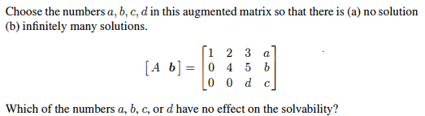
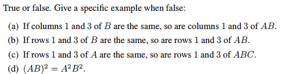
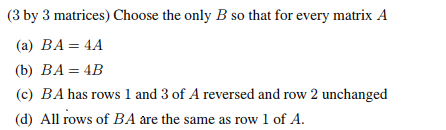
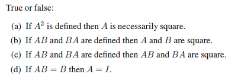
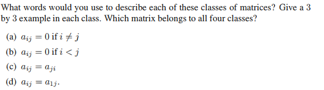
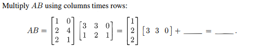
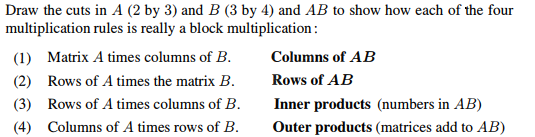

# Chapter 2-4

## Problem 7

### 圖片

### 解題

### 題目復述
給定一個擴增矩陣 $[A \mid \mathbf{b}] = \begin{bmatrix} 1 & 2 & 3 & a \\ 0 & 4 & 5 & b \\ 0 & 0 & d & c \end{bmatrix}$，請選擇數值 $a, b, c, d$ 使得該線性系統：
(a) 無解 (no solution)
(b) 有無限多組解 (infinitely many solutions)

此外，請問在 $a, b, c, d$ 之中，哪些數字對系統的可解性（solvability）沒有影響？

### 解題過程
該擴增矩陣已經處於階梯形（Row-Echelon Form），我們可以將其轉換回線性方程組來分析。令變數為 $x_1, x_2, x_3$，則對應的方程組為：
1) $1x_1 + 2x_2 + 3x_3 = a$
2) $0x_1 + 4x_2 + 5x_3 = b$
3) $0x_1 + 0x_2 + dx_3 = c$

關鍵在於第三個方程式 $dx_3 = c$。

**(a) 使系統無解的情況：**
若要使系統無解，必須出現矛盾的方程式（例如 $0 = \text{非零常數}$）。
當我們設定 **$d = 0$ 且 $c \neq 0$** 時，第三個方程式變為 $0 = c$（其中 $c \neq 0$），這在數學上是不可能的。
因此，只要 $d=0, c \neq 0$（例如 $d=0, c=1$），無論 $a, b$ 取何值，系統均無解。

**(b) 使系統有無限多組解的情況：**
若要使系統有無限多組解，系統必須首先是可解的（一致的），且至少存在一個自由變數（free variable）。
當我們設定 **$d = 0$ 且 $c = 0$** 時，第三個方程式變為 $0 = 0$，這永遠成立。此時，變數 $x_3$ 成為自由變數。
因此，只要 $d=0, c=0$，無論 $a, b$ 取何值，系統都有無限多組解。

**關於對可解性沒有影響的數字：**
從上述分析可知，決定系統是「唯一解」、「無解」還是「無限多解」的條件僅與 $c$ 和 $d$ 有關：
- 若 $d \neq 0$，則必有唯一解。
- 若 $d = 0$ 且 $c \neq 0$，則無解。
- 若 $d = 0$ 且 $c = 0$，則有無限多組解。

而 $a$ 和 $b$ 僅會影響解的具體數值，而不會改變解的存在性或數量。
因此，**$a$ 和 $b$ 對可解性沒有影響**。

### 用到的觀念
1. **擴增矩陣 (Augmented Matrix)**：將線性方程組的係數矩陣 $A$ 與常數向量 $\mathbf{b}$ 合併在一起，方便使用高斯消去法處理。
2. **階梯形矩陣 (Row-Echelon Form)**：矩陣的一種形式，可用於快速判斷系統的解的情況。
3. **可解性分析 (Solvability Analysis)**：
    - **矛盾行 (Contradictory Row)**：若出現 $[0, 0, \dots, 0 \mid \text{non-zero}]$ 的形式，則系統無解。
    - **自由變數 (Free Variable)**：若係數矩陣的主元（pivot）數量少於變數數量，且系統一致，則存在自由變數，導致無限多組解。
4. **主元 (Pivot)**：每行中第一個非零元素。在本題中，第三行是否有主元（即 $d$ 是否為零）決定了系統的性質。

---

## Problem 12

### 圖片

### 解題

### 題目復述

判斷下列敘述之正誤。若為錯誤，請提供一個具體的反例：

(a) 若矩陣 $B$ 的第 1 列（column）與第 3 列相同，則矩陣 $AB$ 的第 1 列與第 3 列也相同。
(b) 若矩陣 $B$ 的第 1 行（row）與第 3 行相同，則矩陣 $AB$ 的第 1 行與第 3 行也相同。
(c) 若矩陣 $A$ 的第 1 行與第 3 行相同，則矩陣 $ABC$ 的第 1 行與第 3 行也相同。
(d) $(AB)^2 = A^2B^2$。

---

### 解題過程

**(a) 正確 (True)**
根據矩陣乘法定義，乘積矩陣 $AB$ 的第 $j$ 列等於矩陣 $A$ 乘以 $B$ 的第 $j$ 列向量。
設 $b_1$ 和 $b_3$ 分別為 $B$ 的第 1 列與第 3 列向量。
已知 $b_1 = b_3$，則 $AB$ 的第 1 列為 $Ab_1$，第 3 列為 $Ab_3$。
因為 $b_1 = b_3$，所以 $Ab_1 = Ab_3$。因此 $AB$ 的第 1 列與第 3 列相同。

**(b) 錯誤 (False)**
矩陣 $AB$ 的第 $i$ 行是矩陣 $B$ 各行的線性組合，權重由 $A$ 的第 $i$ 行決定。
即使 $B$ 的第 1 行與第 3 行相同，但如果 $A$ 的第 1 行與第 3 行不同，結果將會不同。
**反例：**
設 $A = \begin{bmatrix} 1 & 0 & 0 \\ 0 & 0 & 0 \\ 0 & 0 & 0 \end{bmatrix}$，$B = \begin{bmatrix} 1 & 1 \\ 0 & 0 \\ 1 & 1 \end{bmatrix}$。
這裡 $B$ 的第 1 行 $[1, 1]$ 與第 3 行 $[1, 1]$ 相同。
計算 $AB = \begin{bmatrix} 1 & 0 & 0 \\ 0 & 0 & 0 \\ 0 & 0 & 0 \end{bmatrix} \begin{bmatrix} 1 & 1 \\ 0 & 0 \\ 1 & 1 \end{bmatrix} = \begin{bmatrix} 1 & 1 \\ 0 & 0 \\ 0 & 0 \end{bmatrix}$。
此時 $AB$ 的第 1 行為 $[1, 1]$，第 3 行為 $[0, 0]$，兩者不同。

**(c) 正確 (True)**
令 $M = BC$。題目等同於詢問：若 $A$ 的第 1 行與第 3 行相同，則 $AM$ 的第 1 行與第 3 行是否相同。
$AM$ 的第 $i$ 行可表示為 $\sum_{k} A_{ik} (\text{M 的第 } k \text{ 行})$。
既然 $A$ 的第 1 行與第 3 行相同，代表對於所有 $k$，都有 $A_{1k} = A_{3k}$。
因此，$\sum_{k} A_{1k} (\text{M 的第 } k \text{ 行}) = \sum_{k} A_{3k} (\text{M 的第 } k \text{ 行})$。
故 $ABC$ 的第 1 行與第 3 行必然相同。

**(d) 錯誤 (False)**
根據定義，$(AB)^2 = (AB)(AB) = ABAB$。而 $A^2B^2 = AABB$。
這兩者相等的前提是 $BA = AB$（即 $A$ 與 $B$ 可交換），但一般矩陣乘法不滿足交換律。
**反例：**
設 $A = \begin{bmatrix} 1 & 1 \\ 0 & 1 \end{bmatrix}$，$B = \begin{bmatrix} 1 & 0 \\ 1 & 1 \end{bmatrix}$。
$AB = \begin{bmatrix} 2 & 1 \\ 1 & 1 \end{bmatrix} \implies (AB)^2 = \begin{bmatrix} 2 & 1 \\ 1 & 1 \end{bmatrix} \begin{bmatrix} 2 & 1 \\ 1 & 1 \end{bmatrix} = \begin{bmatrix} 5 & 3 \\ 3 & 2 \end{bmatrix}$。
$A^2 = \begin{bmatrix} 1 & 2 \\ 0 & 1 \end{bmatrix}$，$B^2 = \begin{bmatrix} 1 & 0 \\ 2 & 1 \end{bmatrix} \implies A^2B^2 = \begin{bmatrix} 1 & 2 \\ 0 & 1 \end{bmatrix} \begin{bmatrix} 1 & 0 \\ 2 & 1 \end{bmatrix} = \begin{bmatrix} 5 & 2 \\ 2 & 1 \end{bmatrix}$。
顯然 $\begin{bmatrix} 5 & 3 \\ 3 & 2 \end{bmatrix} \neq \begin{bmatrix} 5 & 2 \\ 2 & 1 \end{bmatrix}$。

---

### 用到的觀念

1.  **矩陣乘法之列視角 (Column View of Matrix Multiplication)**：乘積 $AB$ 的第 $j$ 列是 $A$ 乘以 $B$ 的第 $j$ 列向量。
2.  **矩陣乘法之行視角 (Row View of Matrix Multiplication)**：乘積 $AB$ 的第 $i$ 行是 $B$ 各行的線性組合，係數由 $A$ 的第 $i$ 行元素決定。
3.  **矩陣乘法不滿足交換律 (Non-commutativity of Matrix Multiplication)**：一般而言 $AB \neq BA$，因此 $(AB)^2 \neq A^2B^2$。
4.  **結合律 (Associativity)**：矩陣乘法滿足 $(AB)C = A(BC)$，這在分析 $ABC$ 的行/列性質時非常有用。

---

## Problem 15

### 圖片

### 解題

### 題目復述

給定 $3 \times 3$ 矩陣 $A$ 與 $B$，請找出唯一的矩陣 $B$，使得對於所有 $3 \times 3$ 矩陣 $A$ 均滿足以下條件：
(a) $BA = 4A$
(b) $BA = 4B$
(c) $BA$ 的第一列與第三列為 $A$ 的第一列與第三列互換，且第二列保持不變。
(d) $BA$ 的所有列都與 $A$ 的第一列相同。

### 解題過程

由於題目要求條件對於「所有」矩陣 $A$ 都成立，最簡單的驗證方法是令 $A$ 為單位矩陣 $I$（因為 $BI = B$），藉此直接求出 $B$ 的形式，隨後再驗證其普遍性。

**(a) 求解 $BA = 4A$**
1. 令 $A = I$，則方程式變為 $BI = 4I$，因此 $B = 4I$。
2. 驗證：當 $B = 4I$ 時，對於任何 $A$，有 $BA = (4I)A = 4(IA) = 4A$。
3. **答案：** $B = \begin{pmatrix} 4 & 0 & 0 \\ 0 & 4 & 0 \\ 0 & 0 & 4 \end{pmatrix}$。

**(b) 求解 $BA = 4B$**
1. 令 $A = 0$（零矩陣），則方程式變為 $B \cdot 0 = 4B$，即 $0 = 4B$，因此 $B = 0$。
2. 驗證：當 $B = 0$ 時，對於任何 $A$，有 $0 \cdot A = 0$ 且 $4 \cdot 0 = 0$，等式成立。
3. **答案：** $B = \begin{pmatrix} 0 & 0 & 0 \\ 0 & 0 & 0 \\ 0 & 0 & 0 \end{pmatrix}$。

**(c) 求解 $BA$ 互換 $A$ 的第一列與第三列，第二列不變**
1. 令 $A = I = \begin{pmatrix} e_1 \\ e_2 \\ e_3 \end{pmatrix}$（其中 $e_i$ 為標準基底向量）。
2. 根據條件，$BA$ 應為 $\begin{pmatrix} e_3 \\ e_2 \\ e_1 \end{pmatrix}$。
3. 因為 $BI = B$，所以 $B = \begin{pmatrix} 0 & 0 & 1 \\ 0 & 1 & 0 \\ 1 & 0 & 0 \end{pmatrix}$。
4. 驗證：左乘此置換矩陣 $B$ 正好會將 $A$ 的第一列與第三列互換。
5. **答案：** $B = \begin{pmatrix} 0 & 0 & 1 \\ 0 & 1 & 0 \\ 1 & 0 & 0 \end{pmatrix}$。

**(d) 求解 $BA$ 的所有列都與 $A$ 的第一列相同**
1. 令 $A = I = \begin{pmatrix} e_1 \\ e_2 \\ e_3 \end{pmatrix}$。
2. 根據條件，$BA$ 的每一列都應等於 $A$ 的第一列 $e_1$，因此 $BA = \begin{pmatrix} e_1 \\ e_1 \\ e_1 \end{pmatrix}$。
3. 因為 $BI = B$，所以 $B = \begin{pmatrix} 1 & 0 & 0 \\ 1 & 0 & 0 \\ 1 & 0 & 0 \end{pmatrix}$。
4. 驗證：左乘此矩陣後，$BA$ 的每一列皆為 $B$ 的該列與 $A$ 的線性組合，此處每一列皆為 $1 \cdot (\text{row 1 of } A) + 0 + 0$。
5. **答案：** $B = \begin{pmatrix} 1 & 0 & 0 \\ 1 & 0 & 0 \\ 1 & 0 & 0 \end{pmatrix}$。

### 用到的觀念

1. **單位矩陣 (Identity Matrix, $I$)**：單位矩陣是矩陣乘法的單位元，滿足 $AI = IA = A$。在尋找滿足特定條件的矩陣 $B$ 時，令 $A=I$ 可以迅速將 $B$ 孤立出來。
2. **矩陣左乘的幾何意義**：在線性代數中，將矩陣 $B$ 左乘於 $A$ ($BA$)，相當於對 $A$ 進行**列操作 (Row Operations)**。
3. **置換矩陣 (Permutation Matrix)**：一種特殊的正則矩陣，左乘它可以對原矩陣的列進行重新排序（如本題 (c) 的列互換）。
4. **線性組合**：$BA$ 的第 $i$ 列是 $A$ 的所有列以 $B$ 的第 $i$ 列元素為權重的線性組合。在本題 (d) 中，為了讓結果列等於 $A$ 的第一列， $B$ 的每一列必須是 $[1, 0, 0]$。

---

## Problem 19

### 圖片

### 解題

### 題目復述
判斷下列敘述為真 (True) 或 假 (False)：
(a) 如果 $A^2$ 有定義，則 $A$ 必定是方陣。
(b) 如果 $AB$ 和 $BA$ 都有定義，則 $A$ 和 $B$ 必定是方陣。
(c) 如果 $AB$ 和 $BA$ 都有定義，則 $AB$ 和 $BA$ 必定是方陣。
(d) 如果 $AB = B$，則 $A = I$。

### 解題過程
(a) **真 (True)**
矩陣乘法 $A \cdot A$ 有定義的前提是，第一個矩陣的列數 (columns) 必須等於第二個矩陣的行數 (rows)。若 $A$ 的維度為 $m \times n$，則為了讓 $A^2$ 有定義，必須滿足 $n = m$。因此，$A$ 必須是一個 $m \times m$ 的方陣。

(b) **假 (False)**
假設 $A$ 是 $m \times n$ 矩陣，而 $B$ 是 $n \times m$ 矩陣。
- 因為 $A$ 有 $n$ 列且 $B$ 有 $n$ 行，所以 $AB$ 有定義（結果為 $m \times m$ 矩陣）。
- 因為 $B$ 有 $m$ 列且 $A$ 有 $m$ 行，所以 $BA$ 有定義（結果為 $n \times n$ 矩陣）。
即使 $m \neq n$，$AB$ 和 $BA$ 仍然有定義，但此時 $A$ 和 $B$ 都不是方陣。例如 $A$ 為 $2 \times 3$ 矩陣，$B$ 為 $3 \times 2$ 矩陣。

(c) **真 (True)**
承接 (b) 的分析，若 $A$ 為 $m \times n$ 且 $B$ 為 $n \times m$，則：
- $AB$ 的維度為 $m \times m$，是一個方陣。
- $BA$ 的維度為 $n \times n$，是一個方陣。
因此，只要 $AB$ 和 $BA$ 同時有定義，這兩個乘積結果必然是方陣。

(d) **假 (False)**
即便 $AB = B$ 成立，$A$ 也不一定等於單位矩陣 $I$。
- **反例 1**：令 $B$ 為零矩陣 $\mathbf{0}$。對於任何維度匹配的矩陣 $A$，恆有 $A\mathbf{0} = \mathbf{0}$，但 $A$ 可以是任何矩陣而非僅限於 $I$。
- **反例 2**：設 $A = \begin{pmatrix} 1 & 1 \\ 0 & 1 \end{pmatrix}, B = \begin{pmatrix} 1 & 0 \\ 0 & 0 \end{pmatrix}$。
計算 $AB = \begin{pmatrix} 1 & 1 \\ 0 & 1 \end{pmatrix} \begin{pmatrix} 1 & 0 \\ 0 & 0 \end{pmatrix} = \begin{pmatrix} 1 & 0 \\ 0 & 0 \end{pmatrix} = B$。
雖然 $AB = B$ 成立，但 $A \neq I$。

### 用到的觀念
1. **矩陣乘法定義**：兩個矩陣 $A$ ($m \times n$) 與 $B$ ($p \times q$) 相乘 $AB$ 有定義的充分必要條件是 $n = p$。
2. **方陣 (Square Matrix)**：行數與列數相等的矩陣。
3. **單位矩陣 (Identity Matrix, $I$)**：一個特殊的方陣，使得任何可乘矩陣與之相乘後保持不變 ($AI = A$ 且 $IA = A$)。
4. **反例法 (Counterexample)**：在邏輯證明中，只要能找到一個符合條件但結論不成立的特例，即可證明原命題為假。

---

## Problem 26

### 圖片

### 解題

### 題目復述
請描述以下每一類矩陣的名稱，並為每一類提供一個 $3 \times 3$ 的矩陣範例。最後，請指出哪一種矩陣同時屬於這四類。

(a) 當 $i \neq j$ 時，$a_{ij} = 0$
(b) 當 $i < j$ 時，$a_{ij} = 0$
(c) $a_{ij} = a_{ji}$
(d) $a_{ij} = a_{1j}$

### 解題過程

**(a) 條件：$a_{ij} = 0$ if $i \neq j$**
這意味著只有主對角線（即 $i=j$ 的位置）上的元素可以是非零的，其餘所有元素皆為 0。
*   **描述：** 對角矩陣 (Diagonal Matrix)
*   **$3 \times 3$ 範例：** $\begin{bmatrix} 2 & 0 & 0 \\ 0 & -1 & 0 \\ 0 & 0 & 5 \end{bmatrix}$

**(b) 條件：$a_{ij} = 0$ if $i < j$**
這意味著主對角線以上的所有元素都必須為 0。
*   **描述：** 下三角矩陣 (Lower Triangular Matrix)
*   **$3 \times 3$ 範例：** $\begin{bmatrix} 1 & 0 & 0 \\ 4 & 2 & 0 \\ 7 & 8 & 3 \end{bmatrix}$

**(c) 條件：$a_{ij} = a_{ji}$**
這意味著矩陣關於主對角線對稱，或者說該矩陣等於其轉置矩陣 ($A = A^T$)。
*   **描述：** 對稱矩陣 (Symmetric Matrix)
*   **$3 \times 3$ 範例：** $\begin{bmatrix} 1 & 2 & 3 \\ 2 & 4 & 5 \\ 3 & 5 & 6 \end{bmatrix}$

**(d) 條件：$a_{ij} = a_{1j}$**
這意味著矩陣中每一列（row）的元素都與第一列的元素完全相同。
*   **描述：** 所有行皆相同的矩陣 (Matrix with identical rows)
*   **$3 \times 3$ 範例：** $\begin{bmatrix} 1 & 2 & 3 \\ 1 & 2 & 3 \\ 1 & 2 & 3 \end{bmatrix}$

**找出同時屬於這四類的矩陣：**
若一個 $3 \times 3$ 矩陣 $A$ 同時滿足上述四個條件：
1.  由 (a) 可知，$A$ 必須是對角矩陣 $\begin{bmatrix} a & 0 & 0 \\ 0 & b & 0 \\ 0 & 0 & c \end{bmatrix}$。
2.  對角矩陣自動滿足 (b) 下三角矩陣與 (c) 對稱矩陣的條件。
3.  由 (d) 可知，所有行必須相同。因此：
    *   第一行 $[a, 0, 0]$ 必須等於第二行 $[0, b, 0]$ $\rightarrow$ 推得 $a=0$ 且 $b=0$。
    *   第一行 $[a, 0, 0]$ 必須等於第三行 $[0, 0, c]$ $\rightarrow$ 推得 $a=0$ 且 $c=0$。
4.  因此，$a=b=c=0$，該矩陣必須為零矩陣。

**最終答案：** 零矩陣 (Zero Matrix $\mathbf{0}_{3\times3}$) 同時屬於這四類。

### 用到的觀念

*   **對角矩陣 (Diagonal Matrix)：** 只有主對角線元素可能非零的方陣。
*   **下三角矩陣 (Lower Triangular Matrix)：** 主對角線以上元素全部為零的方陣。
*   **對稱矩陣 (Symmetric Matrix)：** 滿足 $A = A^T$ 的方陣，即元素關於主對角線鏡像相等。
*   **零矩陣 (Zero Matrix)：** 所有元素皆為 0 的矩陣。

---

## Problem 28

### 圖片

### 解題

### 題目復述
請使用「行乘以列」（columns times rows）的方法計算矩陣乘法 $AB$。
已知矩陣為：
$A = \begin{bmatrix} 1 & 0 \\ 2 & 4 \\ 2 & 1 \end{bmatrix}$，$B = \begin{bmatrix} 3 & 3 & 0 \\ 1 & 2 & 1 \end{bmatrix}$
請完成以下填空式：
$AB = \begin{bmatrix} 1 \\ 2 \\ 2 \end{bmatrix} \begin{bmatrix} 3 & 3 & 0 \end{bmatrix} + \text{\_\_\_\_\_\_} = \text{\_\_\_\_\_\_}$

### 解題過程
「行乘以列」的方法是指將矩陣乘法視為 $A$ 的每一行（column）與 $B$ 的對應行（row）之外積（outer product）的總和。

**第一步：分解矩陣**
矩陣 $A$ 的兩行分別為 $\text{col}_1 = \begin{bmatrix} 1 \\ 2 \\ 2 \end{bmatrix}$，$\text{col}_2 = \begin{bmatrix} 0 \\ 4 \\ 1 \end{bmatrix}$。
矩陣 $B$ 的兩列分別為 $\text{row}_1 = \begin{bmatrix} 3 & 3 & 0 \end{bmatrix}$，$\text{row}_2 = \begin{bmatrix} 1 & 2 & 1 \end{bmatrix}$。

因此，$AB = \text{col}_1 \cdot \text{row}_1 + \text{col}_2 \cdot \text{row}_2$。

**第二步：計算第一個外積（題目已給出部分）**
$\begin{bmatrix} 1 \\ 2 \\ 2 \end{bmatrix} \begin{bmatrix} 3 & 3 & 0 \end{bmatrix} = \begin{bmatrix} 1\times3 & 1\times3 & 1\times0 \\ 2\times3 & 2\times3 & 2\times0 \\ 2\times3 & 2\times3 & 2\times0 \end{bmatrix} = \begin{bmatrix} 3 & 3 & 0 \\ 6 & 6 & 0 \\ 6 & 6 & 0 \end{bmatrix}$

**第三步：計算第二個外積（填入第一個空格）**
$\begin{bmatrix} 0 \\ 4 \\ 1 \end{bmatrix} \begin{bmatrix} 1 & 2 & 1 \end{bmatrix} = \begin{bmatrix} 0\times1 & 0\times2 & 0\times1 \\ 4\times1 & 4\times2 & 4\times1 \\ 1\times1 & 1\times2 & 1\times1 \end{bmatrix} = \begin{bmatrix} 0 & 0 & 0 \\ 4 & 8 & 4 \\ 1 & 2 & 1 \end{bmatrix}$

**第四步：將兩個結果相加（得出最終答案）**
$AB = \begin{bmatrix} 3 & 3 & 0 \\ 6 & 6 & 0 \\ 6 & 6 & 0 \end{bmatrix} + \begin{bmatrix} 0 & 0 & 0 \\ 4 & 8 & 4 \\ 1 & 2 & 1 \end{bmatrix} = \begin{bmatrix} 3+0 & 3+0 & 0+0 \\ 6+4 & 6+8 & 0+4 \\ 6+1 & 6+2 & 0+1 \end{bmatrix} = \begin{bmatrix} 3 & 3 & 0 \\ 10 & 14 & 4 \\ 7 & 8 & 1 \end{bmatrix}$

**最終填空結果：**
$AB = \begin{bmatrix} 1 \\ 2 \\ 2 \end{bmatrix} \begin{bmatrix} 3 & 3 & 0 \end{bmatrix} + \begin{bmatrix} 0 \\ 4 \\ 1 \end{bmatrix} \begin{bmatrix} 1 & 2 & 1 \end{bmatrix} = \begin{bmatrix} 3 & 3 & 0 \\ 10 & 14 & 4 \\ 7 & 8 & 1 \end{bmatrix}$

### 用到的觀念
1. **外積 (Outer Product)**：一個列向量（column vector）乘以一個行向量（row vector），結果會產生一個矩陣。
2. **矩陣乘法的外積形式 (Matrix Multiplication as a Sum of Outer Products)**：若 $A$ 為 $m \times n$ 矩陣且 $B$ 為 $n \times p$ 矩陣，則 $AB$ 可以表示為 $A$ 的 $n$ 個行向量與 $B$ 的 $n$ 個列向量對應相乘後之總和，即 $AB = \sum_{i=1}^{n} \text{col}_i(A) \text{row}_i(B)$。
3. **秩-1 矩陣 (Rank-1 Matrix)**：每個外積 $\text{col}_i \cdot \text{row}_i$ 所形成的矩陣其秩（rank）最大為 1。這意味著矩陣乘法本質上是將結果矩陣分解為多個秩-1 矩陣之和。

---

## Problem 29

### 圖片

### 解題

### 題目復述

請在矩陣 $A$（$2 \times 3$）、矩陣 $B$（$3 \times 4$）以及乘積矩陣 $AB$（$2 \times 4$）中畫出切分線（cuts），以展示以下四種矩陣乘法規則實際上是如何透過「分塊矩陣乘法」（block multiplication）來實現的：

(1) 矩陣 $A$ 乘以 $B$ 的各個**行向量 (columns)** $\rightarrow$ 得到 $AB$ 的各個**行向量**。
(2) $A$ 的各個**列向量 (rows)** 乘以矩陣 $B$ $\rightarrow$ 得到 $AB$ 的各個**列向量**。
(3) $A$ 的各個**列向量 (rows)** 乘以 $B$ 的各個**行向量 (columns)** $\rightarrow$ 得到 $AB$ 中的**內積 (inner products)**（即 $AB$ 中的單個數值）。
(4) $A$ 的各個**行向量 (columns)** 乘以 $B$ 的各個**列向量 (rows)** $\rightarrow$ 得到**外積 (outer products)**（這些矩陣相加後等於 $AB$）。

---

### 解題過程

假設矩陣 $A$ 的維度為 $2 \times 3$，矩陣 $B$ 的維度為 $3 \times 4$，則乘積 $AB$ 的維度為 $2 \times 4$。我們透過不同的切分方式來分析這四種視角：

##### (1) 矩陣 $A$ 乘以 $B$ 的行向量 $\rightarrow$ $AB$ 的行向量
*   **切分方式**：
    *   $A$：不切分（視為一個整體 $2 \times 3$ 塊）。
    *   $B$：**垂直切分**成 4 個 $3 \times 1$ 的行向量 $[b_1, b_2, b_3, b_4]$。
    *   $AB$：**垂直切分**成 4 個 $2 \times 1$ 的行向量。
*   **邏輯**：$AB = [Ab_1, Ab_2, Ab_3, Ab_4]$。每一列的結果是由 $A$ 作用於 $B$ 的對應行向量而得。

##### (2) $A$ 的列向量 乘以矩陣 $B$ $\rightarrow$ $AB$ 的列向量
*   **切分方式**：
    *   $A$：**水平切分**成 2 個 $1 \times 3$ 的列向量 $\begin{bmatrix} a_1^T \\ a_2^T \end{bmatrix}$。
    *   $B$：不切分（視為一個整體 $3 \times 4$ 塊）。
    *   $AB$：**水平切分**成 2 個 $1 \times 4$ 的列向量。
*   **邏輯**：$AB = \begin{bmatrix} a_1^T B \\ a_2^T B \end{bmatrix}$。每一列的結果是由 $A$ 的對應列向量與 $B$ 乘積而得。

##### (3) $A$ 的列向量 乘以 $B$ 的行向量 $\rightarrow$ $AB$ 中的內積 (數值)
*   **切分方式**：
    *   $A$：**水平切分**成 2 個 $1 \times 3$ 的列向量。
    *   $B$：**垂直切分**成 4 個 $3 \times 1$ 的行向量。
    *   $AB$：**同時水平與垂直切分**，將其分為 $2 \times 4 = 8$ 個 $1 \times 1$ 的單元格。
*   **邏輯**：$(AB)_{ij} = (\text{row } i \text{ of } A) \cdot (\text{column } j \text{ of } B)$。這是最經典的定義，每個元素是兩個向量的內積。

##### (4) $A$ 的行向量 乘以 $B$ 的列向量 $\rightarrow$ 外積 (矩陣相加)
*   **切分方式**：
    *   $A$：**垂直切分**成 3 個 $2 \times 1$ 的行向量 $[c_1, c_2, c_3]$。
    *   $B$：**水平切分**成 3 個 $1 \times 4$ 的列向量 $\begin{bmatrix} r_1^T \\ r_2^T \\ r_3^T \end{bmatrix}$。
    *   $AB$：不切分（最終結果是 3 個 $2 \times 4$ 矩陣的總和）。
*   **邏輯**：$AB = c_1 r_1^T + c_2 r_2^T + c_3 r_3^T$。矩陣乘法被視為 3 個秩為 1 的矩陣（外積）之和。

---

### 用到的觀念

1.  **分塊矩陣乘法 (Block Matrix Multiplication)**：將大矩陣切分為較小的子矩陣（塊），只要維度匹配，分塊矩陣的乘法規則與普通矩陣乘法相同。
2.  **內積 (Inner Product)**：一個行向量與一個行向量的乘積 $\text{(1xK)} \times \text{(Kx1)}$，結果是一個純量（數值）。
3.  **外積 (Outer Product)**：一個行向量與一個列向量的乘積 $\text{(Mx1)} \times \text{(1xN)}$，結果是一個 $M \times N$ 的矩陣。
4.  **矩陣乘法的多重解釋**：
    *   **列視角**：乘積的每一列是 $A$ 對 $B$ 每一列的線性組合。
    *   **行視角**：乘積的每一行是 $B$ 每一行的線性組合（權重由 $A$ 決定）。
    *   **元素視角**：每個元素是 $A$ 的列與 $B$ 的行的內積。
    *   **秩-1 分解視角**：矩陣乘法是多個外積矩陣的累加。

---
