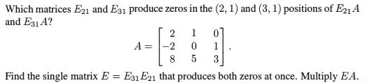
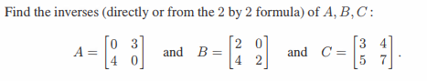
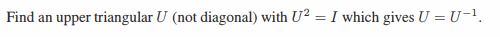
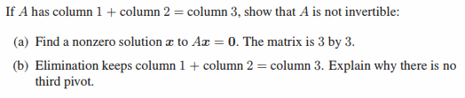
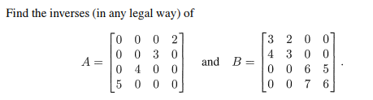
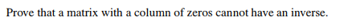
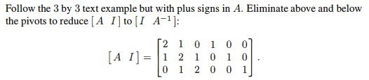

# Chapter 2-5

## Problem 1

### 圖片

### 解題

### 題目復述
給定矩陣 $A = \begin{bmatrix} 2 & 1 & 0 \\ -2 & 0 & 1 \\ 8 & 5 & 3 \end{bmatrix}$。
1. 尋找基本矩陣 $E_{21}$ 與 $E_{31}$，使得乘積 $E_{21}A$ 的第 $(2, 1)$ 位置以及 $E_{31}A$ 的第 $(3, 1)$ 位置變為 0。
2. 求出單一矩陣 $E = E_{31}E_{21}$，使其能一次將上述兩個位置變為 0，並計算 $EA$ 的結果。

### 解題過程

**1. 尋找 $E_{21}$：**
目標是使 $A$ 的第 2 列第 1 行（元素為 $-2$）變為 0。
觀察第 1 列第 1 行的元素為 $2$，我們可以執行列運算：$\text{Row}_2 \leftarrow \text{Row}_2 + 1 \cdot \text{Row}_1$。
對單位矩陣 $I$ 執行相同操作，可得基本矩陣 $E_{21}$：
$$E_{21} = \begin{bmatrix} 1 & 0 & 0 \\ 1 & 1 & 0 \\ 0 & 0 & 1 \end{bmatrix}$$

**2. 尋找 $E_{31}$：**
目標是使 $A$ 的第 3 列第 1 行（元素為 $8$）變為 0。
觀察第 1 列第 1 行的元素為 $2$，我們可以執行列運算：$\text{Row}_3 \leftarrow \text{Row}_3 - 4 \cdot \text{Row}_1$。
對單位矩陣 $I$ 執行相同操作，可得基本矩陣 $E_{31}$：
$$E_{31} = \begin{bmatrix} 1 & 0 & 0 \\ 0 & 1 & 0 \\ -4 & 0 & 1 \end{bmatrix}$$

**3. 計算單一矩陣 $E = E_{31}E_{21}$：**
$$E = \begin{bmatrix} 1 & 0 & 0 \\ 0 & 1 & 0 \\ -4 & 0 & 1 \end{bmatrix} \begin{bmatrix} 1 & 0 & 0 \\ 1 & 1 & 0 \\ 0 & 0 & 1 \end{bmatrix} = \begin{bmatrix} 1 & 0 & 0 \\ 1 & 1 & 0 \\ -4 & 0 & 1 \end{bmatrix}$$

**4. 計算乘積 $EA$：**
$$EA = \begin{bmatrix} 1 & 0 & 0 \\ 1 & 1 & 0 \\ -4 & 0 & 1 \end{bmatrix} \begin{bmatrix} 2 & 1 & 0 \\ -2 & 0 & 1 \\ 8 & 5 & 3 \end{bmatrix}$$
進行矩陣乘法：
- 第一列：$[1 \cdot 2 + 0 + 0, \quad 1 \cdot 1 + 0 + 0, \quad 1 \cdot 0 + 0 + 0] = [2, 1, 0]$
- 第二列：$[1 \cdot 2 + 1 \cdot (-2) + 0, \quad 1 \cdot 1 + 1 \cdot 0 + 0, \quad 1 \cdot 0 + 1 \cdot 1 + 0] = [0, 1, 1]$
- 第三列：$[-4 \cdot 2 + 0 + 1 \cdot 8, \quad -4 \cdot 1 + 0 + 1 \cdot 5, \quad -4 \cdot 0 + 0 + 1 \cdot 3] = [0, 1, 3]$

最終結果為：
$$EA = \begin{bmatrix} 2 & 1 & 0 \\ 0 & 1 & 1 \\ 0 & 1 & 3 \end{bmatrix}$$

### 用到的觀念

*   **基本矩陣 (Elementary Matrix)：** 對單位矩陣進行一次基本列運算後所得到的矩陣。將基本矩陣左乘於原矩陣 $A$，等同於對 $A$ 執行該次列運算。
*   **基本列運算 (Elementary Row Operations)：** 包括交換兩列、將某一列乘以非零常數、將某一列的倍數加到另一列上。本題使用了「將一列的倍數加到另一列」來消除元素。
*   **矩陣乘法 (Matrix Multiplication)：** 用於組合多個基本運算（透過 $E_{31}E_{21}$）以及將運算結果應用於原矩陣 $A$。
*   **高斯消去法 (Gaussian Elimination)：** 本題的操作是高斯消去法的第一步，旨在將矩陣轉化為上三角矩陣（或行階梯形矩陣），以利於求解線性方程組或求逆矩陣。

---

## Problem 5

### 圖片

### 解題

### 題目復述
找出矩陣 $A, B, C$ 的反矩陣（可直接計算或使用 $2 \times 2$ 矩陣的反矩陣公式）：
$A = \begin{bmatrix} 0 & 3 \\ 4 & 0 \end{bmatrix}$, $B = \begin{bmatrix} 2 & 0 \\ 4 & 2 \end{bmatrix}$, $C = \begin{bmatrix} 3 & 4 \\ 5 & 7 \end{bmatrix}$。

### 解題過程
對於一個 $2 \times 2$ 矩陣 $M = \begin{bmatrix} a & b \\ c & d \end{bmatrix}$，其反矩陣公式為：
$M^{-1} = \frac{1}{\det(M)} \begin{bmatrix} d & -b \\ -c & a \end{bmatrix}$，其中 $\det(M) = ad - bc$。

**1. 計算 $A$ 的反矩陣：**
*   行列式 $\det(A) = (0)(0) - (3)(4) = -12$
*   $A^{-1} = \frac{1}{-12} \begin{bmatrix} 0 & -3 \\ -4 & 0 \end{bmatrix} = \begin{bmatrix} 0 & \frac{-3}{-12} \\ \frac{-4}{-12} & 0 \end{bmatrix} = \begin{bmatrix} 0 & \frac{1}{4} \\ \frac{1}{3} & 0 \end{bmatrix}$

**2. 計算 $B$ 的反矩陣：**
*   行列式 $\det(B) = (2)(2) - (0)(4) = 4$
*   $B^{-1} = \frac{1}{4} \begin{bmatrix} 2 & 0 \\ -4 & 2 \end{bmatrix} = \begin{bmatrix} \frac{2}{4} & 0 \\ \frac{-4}{4} & \frac{2}{4} \end{bmatrix} = \begin{bmatrix} \frac{1}{2} & 0 \\ -1 & \frac{1}{2} \end{bmatrix}$

**3. 計算 $C$ 的反矩陣：**
*   行列式 $\det(C) = (3)(7) - (4)(5) = 21 - 20 = 1$
*   $C^{-1} = \frac{1}{1} \begin{bmatrix} 7 & -4 \\ -5 & 3 \end{bmatrix} = \begin{bmatrix} 7 & -4 \\ -5 & 3 \end{bmatrix}$

**最終答案：**
$A^{-1} = \begin{bmatrix} 0 & \frac{1}{4} \\ \frac{1}{3} & 0 \end{bmatrix}, \quad B^{-1} = \begin{bmatrix} \frac{1}{2} & 0 \\ -1 & \frac{1}{2} \end{bmatrix}, \quad C^{-1} = \begin{bmatrix} 7 & -4 \\ -5 & 3 \end{bmatrix}$

### 用到的觀念
*   **行列式 (Determinant)：** 對於 $2 \times 2$ 矩陣 $\begin{bmatrix} a & b \\ c & d \end{bmatrix}$，其行列式定義為 $ad - bc$。行列式不為零是矩陣可逆的必要條件。
*   **反矩陣 (Inverse Matrix)：** 若矩陣 $M$ 可逆，則存在一個矩陣 $M^{-1}$ 使得 $M \cdot M^{-1} = M^{-1} \cdot M = I$（$I$ 為單位矩陣）。
*   **$2 \times 2$ 反矩陣公式：** 一種快速求得二階方陣反矩陣的方法，透過交換主對角線元素、變更副對角線元素符號，並除以行列式來達成。

---

## Problem 8

### 圖片

### 解題

### 題目復述
請找一個上三角矩陣 $U$（且不能是對角矩陣），使得 $U^2 = I$（其中 $I$ 為單位矩陣），進而滿足 $U = U^{-1}$。

### 解題過程
為了簡化計算，我們假設 $U$ 為一個 $2 \times 2$ 的矩陣。

1. **設定矩陣形式**：
   定義一個上三角矩陣 $U$ 為：
   $$U = \begin{pmatrix} a & b \\ 0 & c \end{pmatrix}$$
   根據題目要求，$U$ 不能是對角矩陣，因此必須滿足 $b \neq 0$。

2. **計算 $U^2$**：
   $$U^2 = \begin{pmatrix} a & b \\ 0 & c \end{pmatrix} \begin{pmatrix} a & b \\ 0 & c \end{pmatrix} = \begin{pmatrix} a^2 & ab + bc \\ 0 & c^2 \end{pmatrix}$$

3. **建立方程式組**：
   令 $U^2 = I = \begin{pmatrix} 1 & 0 \\ 0 & 1 \end{pmatrix}$，我們可以得到以下三個方程式：
   - $a^2 = 1 \implies a = \pm 1$
   - $c^2 = 1 \implies c = \pm 1$
   - $ab + bc = 0 \implies b(a + c) = 0$

4. **求解參數**：
   - 由於題目規定 $b \neq 0$，為了使 $b(a + c) = 0$ 成立，必須滿足 $a + c = 0$，即 $a = -c$。
   - 選擇 $a = 1$，則 $c = -1$。
   - $b$ 可以是任何非零實數，我們取 $b = 1$。

5. **得出結果並驗算**：
   我們得到矩陣 $U = \begin{pmatrix} 1 & 1 \\ 0 & -1 \end{pmatrix}$。
   驗算其平方：
   $$U^2 = \begin{pmatrix} 1 & 1 \\ 0 & -1 \end{pmatrix} \begin{pmatrix} 1 & 1 \\ 0 & -1 \end{pmatrix} = \begin{pmatrix} (1\cdot 1 + 1\cdot 0) & (1\cdot 1 + 1\cdot -1) \\ (0\cdot 1 + -1\cdot 0) & (0\cdot 1 + -1\cdot -1) \end{pmatrix} = \begin{pmatrix} 1 & 0 \\ 0 & 1 \end{pmatrix} = I$$
   因為 $U^2 = I$，所以 $U$ 的逆矩陣 $U^{-1}$ 即為 $U$ 本身。

**最終答案：**
一個符合條件的矩陣為 $U = \begin{pmatrix} 1 & 1 \\ 0 & -1 \end{pmatrix}$。

### 用到的觀念
*   **上三角矩陣 (Upper Triangular Matrix)**：主對角線下方所有元素皆為 $0$ 的方陣。
*   **對角矩陣 (Diagonal Matrix)**：除主對角線以外所有元素皆為 $0$ 的方陣。
*   **單位矩陣 (Identity Matrix, $I$)**：主對角線元素皆為 $1$，其餘元素皆為 $0$ 的方陣，在矩陣乘法中扮演乘法單位元的角色。
*   **對合矩陣 (Involutory Matrix)**：滿足 $A^2 = I$ 的矩陣，其特性是該矩陣等於其自身的逆矩陣 ($A = A^{-1}$)。
*   **矩陣乘法 (Matrix Multiplication)**：定義兩個矩陣相乘的方式，用於推導 $U^2$ 的元素。

---

## Problem 10

### 圖片

### 解題

### 題目復述

若一個 $3 \times 3$ 矩陣 $A$ 滿足「第 1 行 + 第 2 行 = 第 3 行」（column 1 + column 2 = column 3），請證明 $A$ 是不可逆的：

(a) 找出 $Ax = 0$ 的一個非零解 $x$。
(b) 說明為何消去法（Elimination）會保持「第 1 行 + 第 2 行 = 第 3 行」的關係，並解釋為何沒有第三個主元（pivot）。

### 解題過程

**(a) 尋找 $Ax = 0$ 的非零解**

令矩陣 $A$ 的三個行向量（column vectors）分別為 $\mathbf{a_1}, \mathbf{a_2}, \mathbf{a_3}$。
根據題目給定條件：
$$\mathbf{a_1} + \mathbf{a_2} = \mathbf{a_3}$$
將其移項可得：
$$\mathbf{a_1} + \mathbf{a_2} - \mathbf{a_3} = \mathbf{0}$$

根據矩陣乘法的定義，$Ax$ 可以看作是 $A$ 的各行向量的線性組合：
$$Ax = x_1 \mathbf{a_1} + x_2 \mathbf{a_2} + x_3 \mathbf{a_3}$$

為了讓 $Ax = \mathbf{0}$，我們可以對照上述的線性關係，取 $x_1 = 1, x_2 = 1, x_3 = -1$。
因此，非零解 $\mathbf{x}$ 為：
$$\mathbf{x} = \begin{bmatrix} 1 \\ 1 \\ -1 \end{bmatrix}$$
驗算：$A \begin{bmatrix} 1 \\ 1 \\ -1 \end{bmatrix} = 1\mathbf{a_1} + 1\mathbf{a_2} - 1\mathbf{a_3} = \mathbf{a_1} + \mathbf{a_2} - \mathbf{a_3} = \mathbf{0}$。

**(b) 消去法與主元的分析**

1. **為何消去法保持該關係**：
   消去法是由基本行運算（Elementary Row Operations）組成的，其中最核心的操作是將某一列（row）的倍數加到另一列。
   假設矩陣中每一列 $i$ 滿足 $a_{i1} + a_{i2} = a_{i3}$。當我們執行行運算（例如將第 $i$ 列的 $k$ 倍加到第 $j$ 列）時，新的一列元素將變為：
   $$(a_{j1} + k a_{i1}) + (a_{j2} + k a_{i2}) = (a_{j1} + a_{j2}) + k(a_{i1} + a_{i2}) = a_{j3} + k a_{i3}$$
   這顯示行運算後，每一列的元素依然滿足「第 1 個元素 + 第 2 個元素 = 第 3 個元素」。因此，整個矩陣的行向量關係 $\mathbf{u_1} + \mathbf{u_2} = \mathbf{u_3}$ 在消去過程中會一直保持。

2. **為何沒有第三個主元**：
   當矩陣 $A$ 經過消去法化為上三角矩陣 $U$ 時，其行向量 $\mathbf{u_1}, \mathbf{u_2}, \mathbf{u_3}$ 依然滿足 $\mathbf{u_1} + \mathbf{u_2} = \mathbf{u_3}$。
   在上三角矩陣 $U$ 中，第三行（最後一行）的前兩個元素 $u_{31}$ 和 $u_{32}$ 必定為 $0$。
   根據行關係 $\mathbf{u_1} + \mathbf{u_2} = \mathbf{u_3}$，在第三行中必須滿足：
   $$u_{31} + u_{32} = u_{33} \implies 0 + 0 = u_{33} \implies u_{33} = 0$$
   由於對角線上的第三個元素 $u_{33}$ 為 $0$，因此不存在第三個主元。一個 $3 \times 3$ 矩陣若主元少於 3 個，則該矩陣不可逆。

### 用到的觀念

*   **線性組合（Linear Combination）**：矩陣乘法 $Ax$ 實質上是將 $A$ 的行向量以 $x$ 的分量作為權重進行加權總和。
*   **可逆矩陣（Invertible Matrix）**：一個方陣可逆的充分必要條件是 $Ax = 0$ 只有零解，或者其化簡後的上三角形式具有滿主元（full pivots）。
*   **行運算（Row Operations）**：行運算會改變矩陣的列空間（row space），但不會改變行向量之間的線性相關性（linear dependence）。
*   **主元（Pivot）**：在消去法化成的上三角矩陣中，對角線上的非零元素稱為主元，其數量決定了矩陣的秩（Rank）。

---

## Problem 15

### 圖片

### 解題

### 題目復述
求以下兩個矩陣的逆矩陣（可用任何合法方法）：
$A = \begin{bmatrix} 0 & 0 & 0 & 2 \\ 0 & 0 & 3 & 0 \\ 0 & 4 & 0 & 0 \\ 5 & 0 & 0 & 0 \end{bmatrix}$ 以及 $B = \begin{bmatrix} 3 & 2 & 0 & 0 \\ 4 & 3 & 0 & 0 \\ 0 & 0 & 6 & 5 \\ 0 & 0 & 7 & 6 \end{bmatrix}$

### 解題過程

**1. 求 $A$ 的逆矩陣 $A^{-1}$：**
矩陣 $A$ 是一個對角線上只有單一非零元素的排列矩陣（經縮放）。我們可以設定 $A A^{-1} = I$，令 $A^{-1} = X$，則有：
$\begin{bmatrix} 0 & 0 & 0 & 2 \\ 0 & 0 & 3 & 0 \\ 0 & 4 & 0 & 0 \\ 5 & 0 & 0 & 0 \end{bmatrix} \begin{bmatrix} x_{11} & x_{12} & x_{13} & x_{14} \\ x_{21} & x_{22} & x_{23} & x_{24} \\ x_{31} & x_{32} & x_{33} & x_{34} \\ x_{41} & x_{42} & x_{43} & x_{44} \end{bmatrix} = \begin{bmatrix} 1 & 0 & 0 & 0 \\ 0 & 1 & 0 & 0 \\ 0 & 0 & 1 & 0 \\ 0 & 0 & 0 & 1 \end{bmatrix}$

根據矩陣乘法：
* 第一列：$2x_{41}=1, 2x_{42}=0, 2x_{43}=0, 2x_{44}=0 \implies x_{41}=\frac{1}{2}, x_{42}=0, x_{43}=0, x_{44}=0$
* 第二列：$3x_{31}=0, 3x_{32}=1, 3x_{33}=0, 3x_{34}=0 \implies x_{31}=0, x_{32}=\frac{1}{3}, x_{33}=0, x_{34}=0$
* 第三列：$4x_{21}=0, 4x_{22}=0, 4x_{23}=1, 4x_{24}=0 \implies x_{21}=0, x_{22}=0, x_{23}=\frac{1}{4}, x_{24}=0$
* 第四列：$5x_{11}=0, 5x_{12}=0, 5x_{13}=0, 5x_{14}=1 \implies x_{11}=0, x_{12}=0, x_{13}=0, x_{14}=\frac{1}{5}$

因此，$A^{-1} = \begin{bmatrix} 0 & 0 & 0 & 1/5 \\ 0 & 0 & 1/4 & 0 \\ 0 & 1/3 & 0 & 0 \\ 1/2 & 0 & 0 & 0 \end{bmatrix}$

---

**2. 求 $B$ 的逆矩陣 $B^{-1}$：**
觀察矩陣 $B$，它是一個分塊對角矩陣 (Block Diagonal Matrix)：
$B = \begin{bmatrix} B_1 & 0 \\ 0 & B_2 \end{bmatrix}$，其中 $B_1 = \begin{bmatrix} 3 & 2 \\ 4 & 3 \end{bmatrix}$ 且 $B_2 = \begin{bmatrix} 6 & 5 \\ 7 & 6 \end{bmatrix}$。
分塊對角矩陣的逆矩陣為其各個對角分塊之逆矩陣的對角組合：$B^{-1} = \begin{bmatrix} B_1^{-1} & 0 \\ 0 & B_2^{-1} \end{bmatrix}$。

* 計算 $B_1^{-1}$：
$\det(B_1) = (3)(3) - (2)(4) = 9 - 8 = 1$
$B_1^{-1} = \frac{1}{1} \begin{bmatrix} 3 & -2 \\ -4 & 3 \end{bmatrix} = \begin{bmatrix} 3 & -2 \\ -4 & 3 \end{bmatrix}$

* 計算 $B_2^{-1}$：
$\det(B_2) = (6)(6) - (5)(7) = 36 - 35 = 1$
$B_2^{-1} = \frac{1}{1} \begin{bmatrix} 6 & -5 \\ -7 & 6 \end{bmatrix} = \begin{bmatrix} 6 & -5 \\ -7 & 6 \end{bmatrix}$

因此，$B^{-1} = \begin{bmatrix} 3 & -2 & 0 & 0 \\ -4 & 3 & 0 & 0 \\ 0 & 0 & 6 & -5 \\ 0 & 0 & -7 & 6 \end{bmatrix}$

### 用到的觀念
1. **逆矩陣 (Inverse Matrix)**：若矩陣 $A$ 存在逆矩陣 $A^{-1}$，則滿足 $AA^{-1} = A^{-1}A = I$（$I$ 為單位矩陣）。
2. **分塊對角矩陣 (Block Diagonal Matrix)**：一種特殊矩陣，其非零元素僅集中在對角線上的方塊中。其逆矩陣可透過分別對每個方塊求逆來獲得。
3. **$2 \times 2$ 矩陣求逆公式**：對於矩陣 $\begin{bmatrix} a & b \\ c & d \end{bmatrix}$，其逆矩陣為 $\frac{1}{ad-bc} \begin{bmatrix} d & -b \\ -c & a \end{bmatrix}$，前提是行列式 $ad-bc \neq 0$。

---

## Problem 23

### 圖片

### 解題

### 題目復述
證明一個具有全零列（column of zeros）的矩陣不可逆（不能有反矩陣）。

### 解題過程
我們可以使用反證法來證明此命題：

1. **設定條件**：假設 $A$ 是一個 $n \times n$ 的方陣，且其第 $j$ 列為全零列。
2. **構造特殊向量**：構造一個非零向量 $\mathbf{x}$，使得其第 $j$ 個分量 $x_j = 1$，而其餘所有分量 $x_k = 0$（對於所有 $k \neq j$）。
3. **計算矩陣乘法**：考慮 $A\mathbf{x}$ 的結果。根據矩陣乘法的定義，$A\mathbf{x}$ 等於 $A$ 的各列向量以 $\mathbf{x}$ 的分量為權重的線性組合：
   $$A\mathbf{x} = x_1\mathbf{a}_1 + x_2\mathbf{a}_2 + \dots + x_j\mathbf{a}_j + \dots + x_n\mathbf{a}_n$$
   其中 $\mathbf{a}_i$ 代表 $A$ 的第 $i$ 列。
4. **代入已知條件**：將 $\mathbf{x}$ 的分量代入上式，由於只有 $x_j=1$ 其餘皆為 $0$，因此：
   $$A\mathbf{x} = 1 \cdot \mathbf{a}_j = \mathbf{a}_j$$
   因為題目已知第 $j$ 列是全零列（$\mathbf{a}_j = \mathbf{0}$），所以得到：
   $$A\mathbf{x} = \mathbf{0}$$
5. **利用反證法**：假設 $A$ 具有反矩陣 $A^{-1}$。
6. **推導矛盾**：在等式 $A\mathbf{x} = \mathbf{0}$ 的兩邊同時左乘 $A^{-1}$：
   $$A^{-1}(A\mathbf{x}) = A^{-1}\mathbf{0}$$
   $$(A^{-1}A)\mathbf{x} = \mathbf{0}$$
   $$I\mathbf{x} = \mathbf{0}$$
   $$\mathbf{x} = \mathbf{0}$$
7. **結論**：這與我們在步驟 2 中設定 $\mathbf{x}$ 為非零向量（$x_j=1$）產生矛盾。因此，原假設（$A$ 具有反矩陣）不成立。

**最終結論：一個具有全零列的矩陣不能有反矩陣。**

### 用到的觀念
* **反矩陣 (Inverse Matrix)**：若方陣 $A$ 存在一個矩陣 $A^{-1}$ 使得 $A^{-1}A = I$（單位矩陣），則稱 $A$ 為可逆矩陣。
* **矩陣乘法與列向量的線性組合**：矩陣與向量的乘積 $A\mathbf{x}$ 可以視為 $A$ 的列向量以 $\mathbf{x}$ 的分量為係數的線性組合。
* **奇異矩陣 (Singular Matrix)**：若一個方陣存在非零向量 $\mathbf{x}$ 使得 $A\mathbf{x} = \mathbf{0}$，則該矩陣稱為奇異矩陣，且必然不可逆。
* **反證法 (Proof by Contradiction)**：先假設命題的相反結論成立，透過邏輯推導得出矛盾，進而證明原命題必須成立。

---

## Problem 27

### 圖片

### 解題

### 題目復述
給定一個增廣矩陣 $[A \ I] = \begin{bmatrix} 2 & 1 & 0 & 1 & 0 & 0 \\ 1 & 2 & 1 & 0 & 1 & 0 \\ 0 & 1 & 2 & 0 & 0 & 1 \end{bmatrix}$，請使用高斯-若爾丹消去法（Gauss-Jordan elimination），透過消除主元（pivots）上方與下方的元素，將其化簡為 $[I \ A^{-1}]$，從而求出矩陣 $A$ 的逆矩陣 $A^{-1}$。

### 解題過程
我們將對增廣矩陣 $[A \ I]$ 進行列運算（Row Operations）來達成目標：

$$[A \ I] = \begin{bmatrix} 2 & 1 & 0 & 1 & 0 & 0 \\ 1 & 2 & 1 & 0 & 1 & 0 \\ 0 & 1 & 2 & 0 & 0 & 1 \end{bmatrix}$$

**步驟 1：處理第一列主元 (1,1)**
- 將第一列除以 $2$ ($R_1 \to \frac{1}{2} R_1$):
$$\begin{bmatrix} 1 & 1/2 & 0 & 1/2 & 0 & 0 \\ 1 & 2 & 1 & 0 & 1 & 0 \\ 0 & 1 & 2 & 0 & 0 & 1 \end{bmatrix}$$
- 消去第二列第一列元素 ($R_2 \to R_2 - R_1$):
$$\begin{bmatrix} 1 & 1/2 & 0 & 1/2 & 0 & 0 \\ 0 & 3/2 & 1 & -1/2 & 1 & 0 \\ 0 & 1 & 2 & 0 & 0 & 1 \end{bmatrix}$$

**步驟 2：處理第二列主元 (2,2)**
- 將第二列乘以 $\frac{2}{3}$ ($R_2 \to \frac{2}{3} R_2$):
$$\begin{bmatrix} 1 & 1/2 & 0 & 1/2 & 0 & 0 \\ 0 & 1 & 2/3 & -1/3 & 2/3 & 0 \\ 0 & 1 & 2 & 0 & 0 & 1 \end{bmatrix}$$
- 消去第一列第二列元素 ($R_1 \to R_1 - \frac{1}{2} R_2$):
$$\begin{bmatrix} 1 & 0 & -1/3 & 2/3 & -1/3 & 0 \\ 0 & 1 & 2/3 & -1/3 & 2/3 & 0 \\ 0 & 1 & 2 & 0 & 0 & 1 \end{bmatrix}$$
- 消去第三列第二列元素 ($R_3 \to R_3 - R_2$):
$$\begin{bmatrix} 1 & 0 & -1/3 & 2/3 & -1/3 & 0 \\ 0 & 1 & 2/3 & -1/3 & 2/3 & 0 \\ 0 & 0 & 4/3 & 1/3 & -2/3 & 1 \end{bmatrix}$$

**步驟 3：處理第三列主元 (3,3)**
- 將第三列乘以 $\frac{3}{4}$ ($R_3 \to \frac{3}{4} R_3$):
$$\begin{bmatrix} 1 & 0 & -1/3 & 2/3 & -1/3 & 0 \\ 0 & 1 & 2/3 & -1/3 & 2/3 & 0 \\ 0 & 0 & 1 & 1/4 & -1/2 & 3/4 \end{bmatrix}$$
- 消去第一列第三列元素 ($R_1 \to R_1 + \frac{1}{3} R_3$):
$$\begin{bmatrix} 1 & 0 & 0 & 3/4 & -1/2 & 1/4 \\ 0 & 1 & 2/3 & -1/3 & 2/3 & 0 \\ 0 & 0 & 1 & 1/4 & -1/2 & 3/4 \end{bmatrix}$$
- 消去第二列第三列元素 ($R_2 \to R_2 - \frac{2}{3} R_3$):
$$\begin{bmatrix} 1 & 0 & 0 & 3/4 & -1/2 & 1/4 \\ 0 & 1 & 0 & -1/2 & 1 & -1/2 \\ 0 & 0 & 1 & 1/4 & -1/2 & 3/4 \end{bmatrix}$$

至此，左側已化為單位矩陣 $I$，右側即為所求的逆矩陣 $A^{-1}$。
最終答案為：
$$A^{-1} = \begin{bmatrix} 3/4 & -1/2 & 1/4 \\ -1/2 & 1 & -1/2 \\ 1/4 & -1/2 & 3/4 \end{bmatrix} = \frac{1}{4} \begin{bmatrix} 3 & -2 & 1 \\ -2 & 4 & -2 \\ 1 & -2 & 3 \end{bmatrix}$$

### 用到的觀念
1. **增廣矩陣 (Augmented Matrix)**：將原矩陣 $A$ 與單位矩陣 $I$ 並列放置，以便對兩者同步進行相同的列運算。
2. **高斯-若爾丹消去法 (Gauss-Jordan Elimination)**：透過基礎列運算將矩陣化為簡化列階梯形（RREF）的演算法，常用於解線性方程組或求逆矩陣。
3. **逆矩陣 (Inverse Matrix)**：若矩陣 $A$ 可逆，則存在 $A^{-1}$ 使得 $A A^{-1} = I$。利用 $[A \ I] \to [I \ A^{-1}]$ 的過程可有效地求得逆矩陣。
4. **基礎列運算 (Elementary Row Operations)**：包括互換兩行、將某行乘以非零常數、以及將某行的倍數加到另一行。

---
