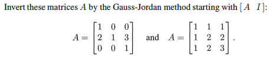
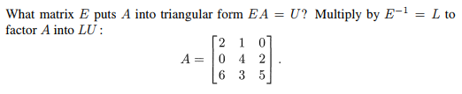
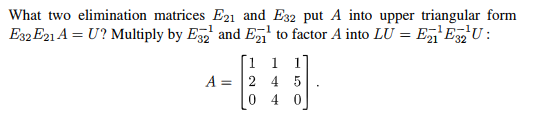

# Chapter 2-6

## Problem 5

### 圖片

### 解題

### 題目復述
使用 Gauss-Jordan 消去法，從增廣矩陣 $[A \quad I]$ 開始，求出以下兩個矩陣 $A$ 的反矩陣：
1) $A = \begin{bmatrix} 1 & 0 & 0 \\ 2 & 1 & 3 \\ 0 & 0 & 1 \end{bmatrix}$
2) $A = \begin{bmatrix} 1 & 1 & 1 \\ 1 & 2 & 2 \\ 1 & 2 & 3 \end{bmatrix}$

### 解題過程

##### 第一題：$A = \begin{bmatrix} 1 & 0 & 0 \\ 2 & 1 & 3 \\ 0 & 0 & 1 \end{bmatrix}$

建立增廣矩陣 $[A \mid I]$：
$$\begin{bmatrix} 1 & 0 & 0 & \mid & 1 & 0 & 0 \\ 2 & 1 & 3 & \mid & 0 & 1 & 0 \\ 0 & 0 & 1 & \mid & 0 & 0 & 1 \end{bmatrix}$$

**步驟 1：** 將第二列的第一個元素變為 0。執行 $R_2 \to R_2 - 2R_1$
$$\begin{bmatrix} 1 & 0 & 0 & \mid & 1 & 0 & 0 \\ 0 & 1 & 3 & \mid & -2 & 1 & 0 \\ 0 & 0 & 1 & \mid & 0 & 0 & 1 \end{bmatrix}$$

**步驟 2：** 將第二列的第三個元素變為 0。執行 $R_2 \to R_2 - 3R_3$
$$\begin{bmatrix} 1 & 0 & 0 & \mid & 1 & 0 & 0 \\ 0 & 1 & 0 & \mid & -2 & 1 & -3 \\ 0 & 0 & 1 & \mid & 0 & 0 & 1 \end{bmatrix}$$

左側已變為單位矩陣 $I$，因此右側即為反矩陣 $A^{-1}$：
$$A^{-1} = \begin{bmatrix} 1 & 0 & 0 \\ -2 & 1 & -3 \\ 0 & 0 & 1 \end{bmatrix}$$

---

##### 第二題：$A = \begin{bmatrix} 1 & 1 & 1 \\ 1 & 2 & 2 \\ 1 & 2 & 3 \end{bmatrix}$

建立增廣矩陣 $[A \mid I]$：
$$\begin{bmatrix} 1 & 1 & 1 & \mid & 1 & 0 & 0 \\ 1 & 2 & 2 & \mid & 0 & 1 & 0 \\ 1 & 2 & 3 & \mid & 0 & 0 & 1 \end{bmatrix}$$

**步驟 1：** 將第一列下方元素變為 0。執行 $R_2 \to R_2 - R_1$ 且 $R_3 \to R_3 - R_1$
$$\begin{bmatrix} 1 & 1 & 1 & \mid & 1 & 0 & 0 \\ 0 & 1 & 1 & \mid & -1 & 1 & 0 \\ 0 & 1 & 2 & \mid & -1 & 0 & 1 \end{bmatrix}$$

**步驟 2：** 將第二列下方元素變為 0。執行 $R_3 \to R_3 - R_2$
$$\begin{bmatrix} 1 & 1 & 1 & \mid & 1 & 0 & 0 \\ 0 & 1 & 1 & \mid & -1 & 1 & 0 \\ 0 & 0 & 1 & \mid & 0 & -1 & 1 \end{bmatrix}$$

**步驟 3：** 將第三列上方元素變為 0。執行 $R_1 \to R_1 - R_3$ 且 $R_2 \to R_2 - R_3$
$$\begin{bmatrix} 1 & 1 & 0 & \mid & 1 & 1 & -1 \\ 0 & 1 & 0 & \mid & -1 & 2 & -1 \\ 0 & 0 & 1 & \mid & 0 & -1 & 1 \end{bmatrix}$$

**步驟 4：** 將第二列上方元素變為 0。執行 $R_1 \to R_1 - R_2$
$$\begin{bmatrix} 1 & 0 & 0 & \mid & 2 & -1 & 0 \\ 0 & 1 & 0 & \mid & -1 & 2 & -1 \\ 0 & 0 & 1 & \mid & 0 & -1 & 1 \end{bmatrix}$$

左側已變為單位矩陣 $I$，因此右側即為反矩陣 $A^{-1}$：
$$A^{-1} = \begin{bmatrix} 2 & -1 & 0 \\ -1 & 2 & -1 \\ 0 & -1 & 1 \end{bmatrix}$$

### 用到的觀念

*   **反矩陣 (Inverse Matrix)**：若矩陣 $A$ 存在反矩陣 $A^{-1}$，則滿足 $AA^{-1} = A^{-1}A = I$（$I$ 為單位矩陣）。
*   **增廣矩陣 (Augmented Matrix)**：將原矩陣 $A$ 與單位矩陣 $I$ 並列放置，形成一個 $[A \mid I]$ 形式的矩陣，以便同步進行行運算。
*   **Gauss-Jordan 消去法 (Gauss-Jordan Elimination)**：一種透過初等行運算將矩陣 $A$ 轉換為單位矩陣 $I$ 的過程。當左側轉換為 $I$ 時，右側的 $I$ 同時會被轉換為 $A^{-1}$。
*   **初等行運算 (Elementary Row Operations)**：包含三種操作：
    1. 交換兩列的位置。
    2. 將某一列乘以一個非零常數。
    3. 將某一列加上另一列的若干倍。

---

## Problem 6

### 圖片

### 解題

### 題目復述
給定矩陣 $A = \begin{bmatrix} 2 & 1 & 0 \\ 0 & 4 & 2 \\ 6 & 3 & 5 \end{bmatrix}$。
請找出一個矩陣 $E$，使得 $EA = U$（其中 $U$ 為上三角矩陣），並利用 $E^{-1} = L$ 將 $A$ 分解為 $LU$ 形式。

### 解題過程
**1. 透過高斯消去法將 $A$ 轉換為上三角矩陣 $U$：**
我們觀察矩陣 $A$：
$$A = \begin{bmatrix} 2 & 1 & 0 \\ 0 & 4 & 2 \\ 6 & 3 & 5 \end{bmatrix}$$
* 第一列已可作為基準列。
* 第二列的第一個元素已是 $0$，無需處理。
* 第三列的第一個元素是 $6$，我們需要將其變為 $0$。執行列運算：$R_3 \to R_3 - 3R_1$。
  $$\begin{bmatrix} 6 & 3 & 5 \end{bmatrix} - 3 \times \begin{bmatrix} 2 & 1 & 0 \end{bmatrix} = \begin{bmatrix} 0 & 0 & 5 \end{bmatrix}$$
因此，得到上三角矩陣 $U$：
$$U = \begin{bmatrix} 2 & 1 & 0 \\ 0 & 4 & 2 \\ 0 & 0 & 5 \end{bmatrix}$$

**2. 找出消去矩陣 $E$：**
矩陣 $E$ 代表上述的列運算 $R_3 \to R_3 - 3R_1$。對單位矩陣 $I$ 執行相同的操作即可得到 $E$：
$$E = \begin{bmatrix} 1 & 0 & 0 \\ 0 & 1 & 0 \\ -3 & 0 & 1 \end{bmatrix}$$
驗算 $EA = U$：
$$\begin{bmatrix} 1 & 0 & 0 \\ 0 & 1 & 0 \\ -3 & 0 & 1 \end{bmatrix} \begin{bmatrix} 2 & 1 & 0 \\ 0 & 4 & 2 \\ 6 & 3 & 5 \end{bmatrix} = \begin{bmatrix} 2 & 1 & 0 \\ 0 & 4 & 2 \\ -6+6 & -3+3 & 0+5 \end{bmatrix} = \begin{bmatrix} 2 & 1 & 0 \\ 0 & 4 & 2 \\ 0 & 0 & 5 \end{bmatrix}$$

**3. 找出 $L$ 並完成 $LU$ 分解：**
$L$ 是 $E$ 的逆矩陣 $E^{-1}$。將 $E$ 的操作反轉（$R_3 \to R_3 + 3R_1$）：
$$L = E^{-1} = \begin{bmatrix} 1 & 0 & 0 \\ 0 & 1 & 0 \\ 3 & 0 & 1 \end{bmatrix}$$
最終的 $LU$ 分解結果為：
$$A = LU = \begin{bmatrix} 1 & 0 & 0 \\ 0 & 1 & 0 \\ 3 & 0 & 1 \end{bmatrix} \begin{bmatrix} 2 & 1 & 0 \\ 0 & 4 & 2 \\ 0 & 0 & 5 \end{bmatrix}$$

**最終答案：**
$E = \begin{bmatrix} 1 & 0 & 0 \\ 0 & 1 & 0 \\ -3 & 0 & 1 \end{bmatrix}$, $L = \begin{bmatrix} 1 & 0 & 0 \\ 0 & 1 & 0 \\ 3 & 0 & 1 \end{bmatrix}$, $U = \begin{bmatrix} 2 & 1 & 0 \\ 0 & 4 & 2 \\ 0 & 0 & 5 \end{bmatrix}$

### 用到的觀念
1. **高斯消去法 (Gaussian Elimination)**：利用列運算將矩陣轉換為上三角形式，以便於求解線性方程組或進行矩陣分解。
2. **基本矩陣 (Elementary Matrix)**：對單位矩陣執行一次基本列運算所得到的矩陣。左乘一個基本矩陣等同於對原矩陣執行該列運算。
3. **LU 分解 (LU Decomposition)**：將一個方陣 $A$ 分解為一個下三角矩陣 $L$ (Lower triangular) 和一個上三角矩陣 $U$ (Upper triangular) 的乘積。
4. **上三角矩陣 (Upper Triangular Matrix)**：主對角線以下的所有元素均為 $0$ 的方陣。

---

## Problem 16

### 圖片

### 解題

### 題目復述
給定矩陣 $A = \begin{bmatrix} 1 & 1 & 1 \\ 2 & 4 & 5 \\ 0 & 4 & 0 \end{bmatrix}$。請找出兩個消去矩陣 $E_{21}$ 與 $E_{32}$，使得 $E_{32}E_{21}A = U$ 為一個上三角矩陣。隨後，透過乘以 $E_{32}^{-1}$ 與 $E_{21}^{-1}$ 將 $A$ 分解為 $LU = E_{21}^{-1}E_{32}^{-1}U$。

### 解題過程

**1. 尋找消去矩陣 $E_{21}$**
為了將 $A$ 轉換為上三角矩陣，首先需要消去第二列第一行的元素 (2)。我們需要執行行運算：將第一列乘以 2 後從第二列中減去 ($R_2 \to R_2 - 2R_1$)。
對應的消去矩陣為：
$$E_{21} = \begin{bmatrix} 1 & 0 & 0 \\ -2 & 1 & 0 \\ 0 & 0 & 1 \end{bmatrix}$$
計算 $E_{21}A$：
$$E_{21}A = \begin{bmatrix} 1 & 0 & 0 \\ -2 & 1 & 0 \\ 0 & 0 & 1 \end{bmatrix} \begin{bmatrix} 1 & 1 & 1 \\ 2 & 4 & 5 \\ 0 & 4 & 0 \end{bmatrix} = \begin{bmatrix} 1 & 1 & 1 \\ 0 & 2 & 3 \\ 0 & 4 & 0 \end{bmatrix}$$

**2. 尋找消去矩陣 $E_{32}$**
接下來，需要消去上述結果第三列第二行的元素 (4)。我們利用第二列的主元 (2)，執行行運算：將第二列乘以 2 後從第三列中減去 ($R_3 \to R_3 - 2R_2$)。
對應的消去矩陣為：
$$E_{32} = \begin{bmatrix} 1 & 0 & 0 \\ 0 & 1 & 0 \\ 0 & -2 & 1 \end{bmatrix}$$
計算 $U = E_{32}(E_{21}A)$：
$$U = \begin{bmatrix} 1 & 0 & 0 \\ 0 & 1 & 0 \\ 0 & -2 & 1 \end{bmatrix} \begin{bmatrix} 1 & 1 & 1 \\ 0 & 2 & 3 \\ 0 & 4 & 0 \end{bmatrix} = \begin{bmatrix} 1 & 1 & 1 \\ 0 & 2 & 3 \\ 0 & 0 & -6 \end{bmatrix}$$
此時 $U$ 已為上三角矩陣。

**3. 進行 LU 分解**
根據題目， $E_{32}E_{21}A = U$，因此 $A = E_{21}^{-1}E_{32}^{-1}U$。
首先求出消去矩陣的逆矩陣（即將負號變為正號）：
$$E_{21}^{-1} = \begin{bmatrix} 1 & 0 & 0 \\ 2 & 1 & 0 \\ 0 & 0 & 1 \end{bmatrix}, \quad E_{32}^{-1} = \begin{bmatrix} 1 & 0 & 0 \\ 0 & 1 & 0 \\ 0 & 2 & 1 \end{bmatrix}$$
計算下三角矩陣 $L = E_{21}^{-1}E_{32}^{-1}$：
$$L = \begin{bmatrix} 1 & 0 & 0 \\ 2 & 1 & 0 \\ 0 & 0 & 1 \end{bmatrix} \begin{bmatrix} 1 & 0 & 0 \\ 0 & 1 & 0 \\ 0 & 2 & 1 \end{bmatrix} = \begin{bmatrix} 1 & 0 & 0 \\ 2 & 1 & 0 \\ 0 & 2 & 1 \end{bmatrix}$$
最終的 $LU$ 分解結果為：
$$A = LU = \begin{bmatrix} 1 & 0 & 0 \\ 2 & 1 & 0 \\ 0 & 2 & 1 \end{bmatrix} \begin{bmatrix} 1 & 1 & 1 \\ 0 & 2 & 3 \\ 0 & 0 & -6 \end{bmatrix}$$

### 用到的觀念

1. **消去矩陣 (Elimination Matrix)**：一種特殊的初等矩陣，用於表示高斯消去法中的行運算。例如 $E_{21}$ 表示將第 1 列乘以某倍數後從第 2 列減去。
2. **上三角矩陣 (Upper Triangular Matrix)**：主對角線下方所有元素皆為 0 的方陣。
3. **LU 分解 (LU Decomposition)**：將一個方陣 $A$ 分解為一個下三角矩陣 $L$ (Lower triangular) 與一個上三角矩陣 $U$ (Upper triangular) 之乘積，常用於簡化求解線性方程組。
4. **矩陣逆運算 (Matrix Inversion)**：對於初等行運算矩陣而言，其逆矩陣即為該操作的相反運算（例如減法變加法）。

---
