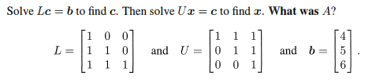
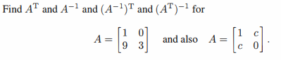
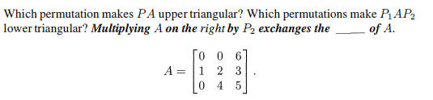
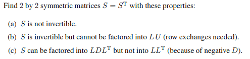
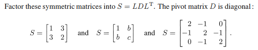

# Chapter 2-7

## Problem 1

### 圖片

### 解題

### 題目復述

已知矩陣 $L = \begin{bmatrix} 1 & 0 & 0 \\ 1 & 1 & 0 \\ 1 & 1 & 1 \end{bmatrix}$、$U = \begin{bmatrix} 1 & 1 & 1 \\ 0 & 1 & 1 \\ 0 & 0 & 1 \end{bmatrix}$ 以及向量 $b = \begin{bmatrix} 4 \\ 5 \\ 6 \end{bmatrix}$。

請完成以下步驟：
1. 解線性方程組 $Lc = b$ 以求出向量 $c$。
2. 接著解線性方程組 $Ux = c$ 以求出向量 $x$。
3. 求出原矩陣 $A$（其中 $A = LU$）。

### 解題過程

##### 1. 求解 $Lc = b$ (前向代入法 Forward Substitution)
方程式為：
$$\begin{bmatrix} 1 & 0 & 0 \\ 1 & 1 & 0 \\ 1 & 1 & 1 \end{bmatrix} \begin{bmatrix} c_1 \\ c_2 \\ c_3 \end{bmatrix} = \begin{bmatrix} 4 \\ 5 \\ 6 \end{bmatrix}$$

*   由第一列得：$c_1 = 4$
*   由第二列得：$c_1 + c_2 = 5 \implies 4 + c_2 = 5 \implies c_2 = 1$
*   由第三列得：$c_1 + c_2 + c_3 = 6 \implies 4 + 1 + c_3 = 6 \implies c_3 = 1$

因此，$\mathbf{c = \begin{bmatrix} 4 \\ 1 \\ 1 \end{bmatrix}}$。

---

##### 2. 求解 $Ux = c$ (後向代入法 Backward Substitution)
方程式為：
$$\begin{bmatrix} 1 & 1 & 1 \\ 0 & 1 & 1 \\ 0 & 0 & 1 \end{bmatrix} \begin{bmatrix} x_1 \\ x_2 \\ x_3 \end{bmatrix} = \begin{bmatrix} 4 \\ 1 \\ 1 \end{bmatrix}$$

*   由第三列得：$x_3 = 1$
*   由第二列得：$x_2 + x_3 = 1 \implies x_2 + 1 = 1 \implies x_2 = 0$
*   由第一列得：$x_1 + x_2 + x_3 = 4 \implies x_1 + 0 + 1 = 4 \implies x_1 = 3$

因此，$\mathbf{x = \begin{bmatrix} 3 \\ 0 \\ 1 \end{bmatrix}}$。

---

##### 3. 求矩陣 $A$
根據 LU 分解的定義，$A = LU$：
$$A = \begin{bmatrix} 1 & 0 & 0 \\ 1 & 1 & 0 \\ 1 & 1 & 1 \end{bmatrix} \begin{bmatrix} 1 & 1 & 1 \\ 0 & 1 & 1 \\ 0 & 0 & 1 \end{bmatrix}$$

計算矩陣乘法：
*   第一列：
    *   $A_{11} = (1)(1) + (0)(0) + (0)(0) = 1$
    *   $A_{12} = (1)(1) + (0)(1) + (0)(0) = 1$
    *   $A_{13} = (1)(1) + (0)(1) + (0)(1) = 1$
*   第二列：
    *   $A_{21} = (1)(1) + (1)(0) + (0)(0) = 1$
    *   $A_{22} = (1)(1) + (1)(1) + (0)(0) = 2$
    *   $A_{23} = (1)(1) + (1)(1) + (0)(1) = 2$
*   第三列：
    *   $A_{31} = (1)(1) + (1)(0) + (1)(0) = 1$
    *   $A_{32} = (1)(1) + (1)(1) + (1)(0) = 2$
    *   $A_{33} = (1)(1) + (1)(1) + (1)(1) = 3$

因此，$\mathbf{A = \begin{bmatrix} 1 & 1 & 1 \\ 1 & 2 & 2 \\ 1 & 2 & 3 \end{bmatrix}}$。

### 用到的觀念

1.  **LU 分解 (LU Decomposition)**：將一個矩陣 $A$ 分解為一個下三角矩陣 $L$ (Lower triangular matrix) 和一個上三角矩陣 $U$ (Upper triangular matrix) 的乘積，以便更高效地求解線性方程組 $Ax = b$。
2.  **前向代入法 (Forward Substitution)**：用於求解下三角矩陣方程 $Lc = b$。從第一個變數開始依次向下求解。
3.  **後向代入法 (Backward Substitution)**：用於求解上三角矩陣方程 $Ux = c$。從最後一個變數開始依次向上求解。
4.  **矩陣乘法 (Matrix Multiplication)**：計算 $A = LU$ 時，將 $L$ 的每一列與 $U$ 的每一行進行內積運算來得到結果矩陣的對應元素。

---

## Problem 11

### 圖片

### 解題

### 題目復述
給定矩陣 $A$，請分別計算其轉置矩陣 $A^T$、逆矩陣 $A^{-1}$、逆矩陣的轉置 $(A^{-1})^T$ 以及轉置矩陣的逆 $(A^T)^{-1}$。
題目提供了兩種不同的矩陣 $A$：
1) $A = \begin{bmatrix} 1 & 0 \\ 9 & 3 \end{bmatrix}$
2) $A = \begin{bmatrix} 1 & c \\ c & 0 \end{bmatrix}$

### 解題過程

##### 情況 1：$A = \begin{bmatrix} 1 & 0 \\ 9 & 3 \end{bmatrix}$

1. **計算轉置矩陣 $A^T$**（將行變為列）：
   $$A^T = \begin{bmatrix} 1 & 9 \\ 0 & 3 \end{bmatrix}$$

2. **計算逆矩陣 $A^{-1}$**：
   首先計算行列式 $\det(A) = (1)(3) - (0)(9) = 3$。
   根據 $2 \times 2$ 矩陣逆矩陣公式 $A^{-1} = \frac{1}{\det(A)} \begin{bmatrix} d & -b \\ -c & a \end{bmatrix}$：
   $$A^{-1} = \frac{1}{3} \begin{bmatrix} 3 & 0 \\ -9 & 1 \end{bmatrix} = \begin{bmatrix} 1 & 0 \\ -3 & \frac{1}{3} \end{bmatrix}$$

3. **計算 $(A^{-1})^T$**：
   對 $A^{-1}$ 進行轉置：
   $$(A^{-1})^T = \begin{bmatrix} 1 & -3 \\ 0 & \frac{1}{3} \end{bmatrix}$$

4. **計算 $(A^T)^{-1}$**：
   對 $A^T$ 求逆，其行列式 $\det(A^T) = \det(A) = 3$：
   $$(A^T)^{-1} = \frac{1}{3} \begin{bmatrix} 3 & -9 \\ 0 & 1 \end{bmatrix} = \begin{bmatrix} 1 & -3 \\ 0 & \frac{1}{3} \end{bmatrix}$$
   （可見 $(A^{-1})^T = (A^T)^{-1}$）

---

##### 情況 2：$A = \begin{bmatrix} 1 & c \\ c & 0 \end{bmatrix}$

1. **計算轉置矩陣 $A^T$**：
   $$A^T = \begin{bmatrix} 1 & c \\ c & 0 \end{bmatrix}$$
   （此矩陣是對稱矩陣，故 $A^T = A$）

2. **計算逆矩陣 $A^{-1}$**：
   首先計算行列式 $\det(A) = (1)(0) - (c)(c) = -c^2$（假設 $c \neq 0$）。
   $$A^{-1} = \frac{1}{-c^2} \begin{bmatrix} 0 & -c \\ -c & 1 \end{bmatrix} = \begin{bmatrix} 0 & \frac{1}{c} \\ \frac{1}{c} & -\frac{1}{c^2} \end{bmatrix}$$

3. **計算 $(A^{-1})^T$**：
   由於 $A^{-1}$ 也是對稱矩陣，其轉置與自身相同：
   $$(A^{-1})^T = \begin{bmatrix} 0 & \frac{1}{c} \\ \frac{1}{c} & -\frac{1}{c^2} \end{bmatrix}$$

4. **計算 $(A^T)^{-1}$**：
   由於 $A^T = A$，因此 $(A^T)^{-1} = A^{-1}$：
   $$(A^T)^{-1} = \begin{bmatrix} 0 & \frac{1}{c} \\ \frac{1}{c} & -\frac{1}{c^2} \end{bmatrix}$$

### 用到的觀念

*   **轉置矩陣 (Transpose Matrix, $A^T$)**：將矩陣的行 (row) 與列 (column) 對調，即 $A_{ij}^T = A_{ji}$。
*   **逆矩陣 (Inverse Matrix, $A^{-1}$)**：滿足 $AA^{-1} = A^{-1}A = I$ (單位矩陣) 的矩陣。對於 $2 \times 2$ 矩陣 $\begin{bmatrix} a & b \\ c & d \end{bmatrix}$，逆矩陣為 $\frac{1}{ad-bc} \begin{bmatrix} d & -b \\ -c & a \end{bmatrix}$。
*   **行列式 (Determinant)**：決定矩陣是否可逆的數值。若 $\det(A) = 0$，則矩陣不可逆。
*   **對稱矩陣 (Symmetric Matrix)**：滿足 $A = A^T$ 的矩陣。
*   **運算性質**：在線性代數中，轉置與求逆的順序可以互換，即 $(A^{-1})^T = (A^T)^{-1}$。

---

## Problem 17

### 圖片

### 解題

### 題目復述

給定矩陣 $A = \begin{bmatrix} 0 & 0 & 6 \\ 1 & 2 & 3 \\ 0 & 4 & 5 \end{bmatrix}$。請回答以下問題：
1. 哪一個置換矩陣 (Permutation matrix) $P$ 能使 $PA$ 成為上三角矩陣？
2. 哪些置換矩陣 $P_1$ 與 $P_2$ 能使 $P_1 A P_2$ 成為下三角矩陣？
3. 填充空格：「在 $A$ 的右側乘以 $P_2$ 會交換 $A$ 的 \_\_\_\_\_。」

---

### 解題過程

##### 1. 尋找使 $PA$ 為上三角矩陣的 $P$
上三角矩陣要求主對角線以下的所有元素皆為 0。觀察矩陣 $A$ 的列 (row) 分佈：
- 第一列 $R_1 = [0, 0, 6]$
- 第二列 $R_2 = [1, 2, 3]$
- 第三列 $R_3 = [0, 4, 5]$

為了使其成為上三角矩陣，我們需要將具有非零首項的列移至上方：
- 第一行 (column 1) 的非零項在 $R_2$，因此將 $R_2$ 移至第一列。
- 第二行 (column 2) 的非零項在 $R_3$，因此將 $R_3$ 移至第二列。
- 第三行 (column 3) 的非零項在 $R_1$，因此將 $R_1$ 移至第三列。

重新排列後的矩陣為：
$PA = \begin{bmatrix} 1 & 2 & 3 \\ 0 & 4 & 5 \\ 0 & 0 & 6 \end{bmatrix}$（這是一個上三角矩陣）。

對應的置換矩陣 $P$ 將原本的第 2 列移到 1，第 3 列移到 2，第 1 列移到 3：
$P = \begin{bmatrix} 0 & 1 & 0 \\ 0 & 0 & 1 \\ 1 & 0 & 0 \end{bmatrix}$

##### 2. 尋找使 $P_1 A P_2$ 為下三角矩陣的 $P_1, P_2$
下三角矩陣要求主對角線以上的所有元素皆為 0。
我們已經知道 $PA$ 是上三角矩陣 $U = \begin{bmatrix} 1 & 2 & 3 \\ 0 & 4 & 5 \\ 0 & 0 & 6 \end{bmatrix}$。
一種簡單的方法是將上三角矩陣的列與行同時完全反轉，即可得到下三角矩陣。

令 $J = \begin{bmatrix} 0 & 0 & 1 \\ 0 & 1 & 0 \\ 1 & 0 & 0 \end{bmatrix}$ 為反轉矩陣 (Exchange matrix)。
則 $P_1 A P_2 = J(PA)J = (JP)AJ$。
因此，我們可以設定：
$P_1 = JP = \begin{bmatrix} 0 & 0 & 1 \\ 0 & 1 & 0 \\ 1 & 0 & 0 \end{bmatrix} \begin{bmatrix} 0 & 1 & 0 \\ 0 & 0 & 1 \\ 1 & 0 & 0 \end{bmatrix} = \begin{bmatrix} 1 & 0 & 0 \\ 0 & 0 & 1 \\ 0 & 1 & 0 \end{bmatrix}$
$P_2 = J = \begin{bmatrix} 0 & 0 & 1 \\ 0 & 1 & 0 \\ 1 & 0 & 0 \end{bmatrix}$

**驗算：**
$P_1 A = \begin{bmatrix} 1 & 0 & 0 \\ 0 & 0 & 1 \\ 0 & 1 & 0 \end{bmatrix} \begin{bmatrix} 0 & 0 & 6 \\ 1 & 2 & 3 \\ 0 & 4 & 5 \end{bmatrix} = \begin{bmatrix} 0 & 0 & 6 \\ 0 & 4 & 5 \\ 1 & 2 & 3 \end{bmatrix}$
$P_1 A P_2 = \begin{bmatrix} 0 & 0 & 6 \\ 0 & 4 & 5 \\ 1 & 2 & 3 \end{bmatrix} \begin{bmatrix} 0 & 0 & 1 \\ 0 & 1 & 0 \\ 1 & 0 & 0 \end{bmatrix} = \begin{bmatrix} 6 & 0 & 0 \\ 5 & 4 & 0 \\ 3 & 2 & 1 \end{bmatrix}$
結果為下三角矩陣。

##### 3. 填充空格
在線性代數中，左乘置換矩陣會交換矩陣的「列 (rows)」，而右乘置換矩陣則會交換矩陣的「行 (columns)」。
因此，空格應填入：**行 (columns)**。

---

### 用到的觀念

1. **置換矩陣 (Permutation Matrix)**：一種特殊的方陣，每行每列恰有一個 1，其餘為 0。它可用於重新排列矩陣的行或列。
2. **左乘與右乘的影響**：
   - **左乘 (Left Multiplication)**：若 $P$ 為置換矩陣，$PA$ 的結果是將 $A$ 的**列 (rows)** 重新排列。
   - **右乘 (Right Multiplication)**：若 $P$ 為置換矩陣，$AP$ 的結果是將 $A$ 的**行 (columns)** 重新排列。
3. **上三角與下三角矩陣**：
   - **上三角矩陣 (Upper Triangular Matrix)**：主對角線下方的所有元素皆為 0。
   - **下三角矩陣 (Lower Triangular Matrix)**：主對角線上方的所有元素皆為 0。

---

## Problem 20

### 圖片

### 解題

### 題目復述

尋找滿足以下條件的 $2 \times 2$ 對稱矩陣 $S = S^T$：

(a) $S$ 不可逆（not invertible）。
(b) $S$ 可逆，但不能分解為 $LU$ 分解（需要進行列交換 row exchanges）。
(c) $S$ 可以分解為 $LDL^T$ 分解，但不能分解為 $LL^T$ 分解（因為 $D$ 包含負值）。

---

### 解題過程

假設 $2 \times 2$ 對稱矩陣的形式為 $S = \begin{pmatrix} a & b \\ b & c \end{pmatrix}$。

**(a) $S$ 不可逆**
矩陣不可逆的條件是其行列式 $\det(S) = 0$。
$\det(S) = ac - b^2 = 0$。
我們可以令 $a=1, b=1, c=1$，則 $\det(S) = 1(1) - 1^2 = 0$。
**答案：** $S = \begin{pmatrix} 1 & 1 \\ 1 & 1 \end{pmatrix}$

**(b) $S$ 可逆但不能進行 $LU$ 分解**
$LU$ 分解失敗的條件是高斯消去法過程中出現主軸（pivot）為 0 的情況。對於 $2 \times 2$ 矩陣，若左上角元素 $a = 0$，則必須進行列交換才能繼續，因此不存在 $LU$ 分解。
同時，題目要求 $S$ 必須可逆，即 $\det(S) = ac - b^2 \neq 0$。
若令 $a=0$，則 $\det(S) = -b^2$。只要 $b \neq 0$，矩陣即為可逆。
令 $a=0, b=1, c=0$。
**答案：** $S = \begin{pmatrix} 0 & 1 \\ 1 & 0 \end{pmatrix}$ （此時 $\det(S) = -1 \neq 0$）

**(c) $S$ 可分解為 $LDL^T$ 但不能分解為 $LL^T$**
對於對稱矩陣，$LDL^T$ 分解中 $D$ 是對角矩陣。$LL^T$ 分解（即 Cholesky 分解）要求矩陣必須是正定矩陣（Positive Definite），這意味著 $LDL^T$ 分解中的對角元素 $d_i$ 必須全部為正數。
若 $D$ 中包含負數，則無法進行實數範圍內的 $LL^T$ 分解（因為會出現虛數平方根）。
最簡單的例子是令 $L=I$（單位矩陣），則 $S = D$。
令 $D = \begin{pmatrix} 1 & 0 \\ 0 & -1 \end{pmatrix}$。
**答案：** $S = \begin{pmatrix} 1 & 0 \\ 0 & -1 \end{pmatrix}$
（驗證：$L=I, D=\text{diag}(1, -1)$，則 $S=LDL^T$ 成立；但 $LL^T$ 要求 $L_{22}^2 = -1$，在實數域無解。）

---

### 用到的觀念

*   **對稱矩陣 (Symmetric Matrix)：** 滿足 $S = S^T$ 的矩陣，其主對角線兩側的元素相對稱。
*   **可逆性 (Invertibility)：** 一個方陣可逆的充分必要條件是其行列式 $\det(S) \neq 0$。
*   **$LU$ 分解 (LU Decomposition)：** 將矩陣分解為一個下三角矩陣 $L$ 和一個上三角矩陣 $U$。若在消去過程中主軸（pivot）為 0，則無法直接進行 $LU$ 分解，必須透過列交換（Permutation）轉為 $PLU$ 分解。
*   **$LDL^T$ 與 $LL^T$ 分解：**
    *   **$LDL^T$ 分解：** 是對稱矩陣的 $LU$ 分解變體，其中 $D$ 為對角矩陣。
    *   **$LL^T$ (Cholesky) 分解：** 要求矩陣必須是**對稱正定 (Symmetric Positive Definite)** 的，即所有特徵值為正，或 $LDL^T$ 分解中的 $D$ 元素全部為正。

---

## Problem 22

### 圖片

### 解題

### 題目復述

將下列對稱矩陣分解為 $S = LDL^T$，其中 $L$ 為下三角矩陣（主對角線元素均為 1），而 $D$ 為對角矩陣：

1. $S = \begin{bmatrix} 1 & 3 \\ 3 & 2 \end{bmatrix}$
2. $S = \begin{bmatrix} 1 & b \\ b & c \end{bmatrix}$
3. $S = \begin{bmatrix} 2 & -1 & 0 \\ -1 & 2 & -1 \\ 0 & -1 & 2 \end{bmatrix}$

### 解題過程

**1. 對於 $S = \begin{bmatrix} 1 & 3 \\ 3 & 2 \end{bmatrix}$：**
假設 $L = \begin{bmatrix} 1 & 0 \\ l_{21} & 1 \end{bmatrix}$ 且 $D = \begin{bmatrix} d_1 & 0 \\ 0 & d_2 \end{bmatrix}$。
則其乘積為：
$LDL^T = \begin{bmatrix} 1 & 0 \\ l_{21} & 1 \end{bmatrix} \begin{bmatrix} d_1 & 0 \\ 0 & d_2 \end{bmatrix} \begin{bmatrix} 1 & l_{21} \\ 0 & 1 \end{bmatrix} = \begin{bmatrix} d_1 & 0 \\ l_{21}d_1 & d_2 \end{bmatrix} \begin{bmatrix} 1 & l_{21} \\ 0 & 1 \end{bmatrix} = \begin{bmatrix} d_1 & d_1l_{21} \\ l_{21}d_1 & l_{21}^2d_1 + d_2 \end{bmatrix}$
將其與原矩陣 $S$ 對比：
- $d_1 = 1$
- $d_1l_{21} = 3 \implies (1)l_{21} = 3 \implies l_{21} = 3$
- $l_{21}^2d_1 + d_2 = 2 \implies 3^2(1) + d_2 = 2 \implies 9 + d_2 = 2 \implies d_2 = -7$

**答案：** $L = \begin{bmatrix} 1 & 0 \\ 3 & 1 \end{bmatrix}, D = \begin{bmatrix} 1 & 0 \\ 0 & -7 \end{bmatrix}$

---

**2. 對於 $S = \begin{bmatrix} 1 & b \\ b & c \end{bmatrix}$：**
同樣對比 $LDL^T = \begin{bmatrix} d_1 & d_1l_{21} \\ l_{21}d_1 & l_{21}^2d_1 + d_2 \end{bmatrix}$：
- $d_1 = 1$
- $d_1l_{21} = b \implies (1)l_{21} = b \implies l_{21} = b$
- $l_{21}^2d_1 + d_2 = c \implies b^2(1) + d_2 = c \implies d_2 = c - b^2$

**答案：** $L = \begin{bmatrix} 1 & 0 \\ b & 1 \end{bmatrix}, D = \begin{bmatrix} 1 & 0 \\ 0 & c - b^2 \end{bmatrix}$

---

**3. 對於 $S = \begin{bmatrix} 2 & -1 & 0 \\ -1 & 2 & -1 \\ 0 & -1 & 2 \end{bmatrix}$：**
使用高斯消去法將 $S$ 轉換為上三角形式 $U = DL^T$：
- **步驟 1**：消去第一列下方元素。$R_2 \to R_2 - (-\frac{1}{2})R_1$，$R_3 \to R_3 - (0)R_1$
  $\begin{bmatrix} 2 & -1 & 0 \\ 0 & 2 - \frac{1}{2} & -1 \\ 0 & -1 & 2 \end{bmatrix} = \begin{bmatrix} 2 & -1 & 0 \\ 0 & \frac{3}{2} & -1 \\ 0 & -1 & 2 \end{bmatrix}$，此時 $l_{21} = -\frac{1}{2}$，$l_{31} = 0$。
- **步驟 2**：消去第二列下方元素。$R_3 \to R_3 - (-\frac{1}{3/2})R_2 = R_3 + \frac{2}{3}R_2$
  $\begin{bmatrix} 2 & -1 & 0 \\ 0 & \frac{3}{2} & -1 \\ 0 & 0 & 2 - \frac{2}{3} \end{bmatrix} = \begin{bmatrix} 2 & -1 & 0 \\ 0 & \frac{3}{2} & -1 \\ 0 & 0 & \frac{4}{3} \end{bmatrix}$，此時 $l_{32} = -\frac{2}{3}$。

由此可得 $L$ 矩陣為對角線為 1 且包含消去係數的下三角矩陣，而 $D$ 矩陣則是由最終的上三角矩陣之主對角線元素組成：
$L = \begin{bmatrix} 1 & 0 & 0 \\ -1/2 & 1 & 0 \\ 0 & -2/3 & 1 \end{bmatrix}, D = \begin{bmatrix} 2 & 0 & 0 \\ 0 & 3/2 & 0 \\ 0 & 0 & 4/3 \end{bmatrix}$

**答案：** $L = \begin{bmatrix} 1 & 0 & 0 \\ -1/2 & 1 & 0 \\ 0 & -2/3 & 1 \end{bmatrix}, D = \begin{bmatrix} 2 & 0 & 0 \\ 0 & 3/2 & 0 \\ 0 & 0 & 4/3 \end{bmatrix}$

### 用到的觀念

- **LDL 分解 (LDL Decomposition)**：是一種特殊的 LU 分解，適用於對稱矩陣 $S$。它將矩陣分解為 $S = LDL^T$，其中 $L$ 是單位下三角矩陣，$D$ 是對角矩陣。這能有效利用對稱性地減少運算量。
- **對稱矩陣 (Symmetric Matrix)**：滿足 $S = S^T$ 的方陣。對於對稱矩陣，若能進行 LU 分解，則必然能進行 LDL 分解。
- **高斯消去法 (Gaussian Elimination)**：透過列運算將矩陣化為上三角形式。在 LDL 分解中，消去過程中使用的乘數（multipliers）即構成了 $L$ 矩陣的元素，而消去後的對角線元素則構成 $D$ 矩陣。
- **轉置矩陣 (Transpose Matrix)**：將矩陣的行與列互換，符號記作 $L^T$。

---
