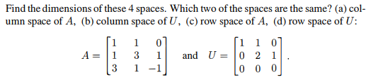
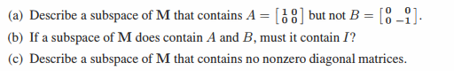
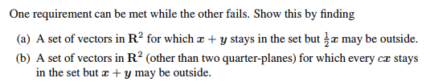
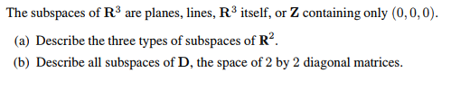
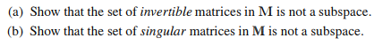
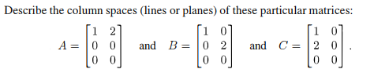
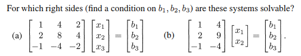
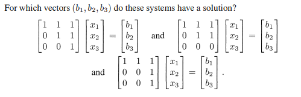
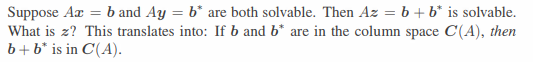
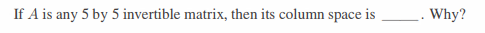

# 3.1 小節

## Problem 5

### 圖片

### 解題

### 題目復述
給定兩個矩陣 $A$ 與 $U$：
$$A = \begin{bmatrix} 1 & 1 & 0 \\ 1 & 3 & 1 \\ 3 & 1 & -1 \end{bmatrix}, \quad U = \begin{bmatrix} 1 & 1 & 0 \\ 0 & 2 & 1 \\ 0 & 0 & 0 \end{bmatrix}$$
請找出以下四個空間的維度 (dimension)，並指出其中哪兩個空間是相同的：
(a) $A$ 的列空間 (column space of $A$)
(b) $U$ 的列空間 (column space of $U$)
(c) $A$ 的行空間 (row space of $A$)
(d) $U$ 的行空間 (row space of $U$)

### 解題過程
**1. 求矩陣 $A$ 的階梯形矩陣 (Echelon Form)：**
對 $A$ 進行基於列 (row) 的初等運算：
- 第二列減去第一列 ($R_2 \to R_2 - R_1$)：$\begin{bmatrix} 1 & 1 & 0 \\ 0 & 2 & 1 \\ 3 & 1 & -1 \end{bmatrix}$
- 第三列減去三倍的第一列 ($R_3 \to R_3 - 3R_1$)：$\begin{bmatrix} 1 & 1 & 0 \\ 0 & 2 & 1 \\ 0 & -2 & -1 \end{bmatrix}$
- 第三列加上第二列 ($R_3 \to R_3 + R_2$)：$\begin{bmatrix} 1 & 1 & 0 \\ 0 & 2 & 1 \\ 0 & 0 & 0 \end{bmatrix}$
可以看到，$A$ 經過列運算後得到的階梯形矩陣正好就是 $U$。

**2. 計算維度 (Dimension)：**
矩陣的秩 (Rank) 定義為其主軸 (pivot) 的數量。由 $U$ 可見，主軸數量為 2 個（分別在第一列第一行與第二列第二行）。
- (a) $A$ 的列空間維度 = $\text{rank}(A) = 2$。
- (b) $U$ 的列空間維度 = $\text{rank}(U) = 2$。
- (c) $A$ 的行空間維度 = $\text{rank}(A) = 2$。
- (d) $U$ 的行空間維度 = $\text{rank}(U) = 2$。
因此，這四個空間的維度皆為 **2**。

**3. 判斷哪些空間相同：**
- **列空間 (Column Space)：** 列運算會改變矩陣的列空間。$A$ 的列空間是由 $A$ 的原列向量生成，而 $U$ 的列空間是由 $U$ 的列向量生成，兩者並不相同。
- **行空間 (Row Space)：** 基於列的初等運算（Elementary row operations）**不會改變**矩陣的行空間。由於 $U$ 是由 $A$ 透過列運算得來，因此 $A$ 的行空間與 $U$ 的行空間完全相同。

**最終答案：**
四個空間的維度均為 2；相同的兩個空間是 **(c) $A$ 的行空間** 與 **(d) $U$ 的行空間**。

### 用到的觀念
- **列空間 (Column Space)：** 矩陣所有列向量的線性組合所構成的空間，其維度等於矩陣的秩 $\text{rank}(A)$。
- **行空間 (Row Space)：** 矩陣所有行向量的線性組合所構成的空間，其維度同樣等於矩陣的秩。
- **秩 (Rank)：** 矩陣中線性獨立的行 (或列) 的最大數量，在階梯形矩陣中等於主軸 (pivot) 的數量。
- **列運算的性質：** 基礎列運算會改變列空間，但會保持行空間不變。

---

## Problem 9

### 圖片

### 解題

### 題目復述
假設 $M$ 為 $2 \times 2$ 矩陣空間。
(a) 描述一個包含矩陣 $A = \begin{bmatrix} 1 & 0 \\ 0 & 0 \end{bmatrix}$ 但不包含矩陣 $B = \begin{bmatrix} 0 & 0 \\ 0 & -1 \end{bmatrix}$ 的子空間。
(b) 如果 $M$ 的一個子空間包含 $A$ 和 $B$，則它是否一定包含單位矩陣 $I$？
(c) 描述一個不包含任何非零對角矩陣的 $M$ 之子空間。

### 解題過程
**(a)**
我們需要尋找一個子空間 $V \subseteq M$，滿足 $A \in V$ 且 $B \notin V$。
最簡單的方法是取由 $A$ 生成的張成空間（Span）：
$$V = \text{span}\{A\} = \{ c \begin{bmatrix} 1 & 0 \\ 0 & 0 \end{bmatrix} \mid c \in \mathbb{R} \} = \left\{ \begin{bmatrix} c & 0 \\ 0 & 0 \end{bmatrix} \mid c \in \mathbb{R} \right\}$$
在這個空間中，所有矩陣的第 $(2,2)$ 個元素都必須為 $0$。而矩陣 $B = \begin{bmatrix} 0 & 0 \\ 0 & -1 \end{bmatrix}$ 的第 $(2,2)$ 個元素為 $-1 \neq 0$，因此 $B$ 不在 $V$ 中。
**答案：** 子空間可描述為所有形如 $\begin{bmatrix} c & 0 \\ 0 & 0 \end{bmatrix}$ 的矩陣集合。

**(b)**
根據子空間的定義，子空間對於向量加法和純量乘法具有封閉性。
已知 $A = \begin{bmatrix} 1 & 0 \\ 0 & 0 \end{bmatrix}$ 和 $B = \begin{bmatrix} 0 & 0 \\ 0 & -1 \end{bmatrix}$ 都在子空間 $V$ 中。
1. 由於 $V$ 對純量乘法封閉，將 $B$ 乘以純量 $-1$，則 $-1 \cdot B = \begin{bmatrix} 0 & 0 \\ 0 & 1 \end{bmatrix}$ 也在 $V$ 中。
2. 由於 $V$ 對加法封閉，則 $A + (-B) = \begin{bmatrix} 1 & 0 \\ 0 & 0 \end{bmatrix} + \begin{bmatrix} 0 & 0 \\ 0 & 1 \end{bmatrix} = \begin{bmatrix} 1 & 0 \\ 0 & 1 \end{bmatrix} = I$ 也在 $V$ 中。
**答案：** 是的，它一定包含 $I$。

**(c)**
對角矩陣的形式為 $\begin{bmatrix} d_1 & 0 \\ 0 & d_2 \end{bmatrix}$。我們要找一個子空間 $V$，使其內部唯一的對角矩陣是零矩陣 $\begin{bmatrix} 0 & 0 \\ 0 & 0 \end{bmatrix}$。
我們可以定義一個由非對角線元素組成的子空間：
$$V = \left\{ \begin{bmatrix} 0 & b \\ c & 0 \end{bmatrix} \mid b, c \in \mathbb{R} \right\}$$
對於 $V$ 中的任意矩陣 $\begin{bmatrix} 0 & b \\ c & 0 \end{bmatrix}$，若它要成為對角矩陣，則必須滿足非對角線元素 $b=0$ 且 $c=0$，這會導致該矩陣變為零矩陣。
因此，此子空間不包含任何非零的對角矩陣。
**答案：** 子空間可描述為所有對角線元素（主對角線）均為 $0$ 的矩陣集合。

### 用到的觀念
1. **子空間 (Subspace)**：一個向量空間的子集，若其本身在同樣的運算下也構成向量空間（即包含零向量，且對加法和純量乘法封閉），則稱為子空間。
2. **張成空間 (Span)**：一組向量的所有線性組合所構成的集合，是包含這些向量的最小子空間。
3. **封閉性 (Closure)**：子空間必須滿足：若 $\mathbf{u}, \mathbf{v} \in V$ 且 $k$ 為純量，則 $\mathbf{u} + \mathbf{v} \in V$ 且 $k\mathbf{u} \in V$。
4. **對角矩陣 (Diagonal Matrix)**：所有非對角線元素（即 $i \neq j$ 的元素 $a_{ij}$）均為零的方陣。

---

## Problem 14

### 圖片

### 解題

### 題目復述

證明在子空間的定義中，其中一個要求可以滿足而另一個則失敗。請透過尋找以下集合來證明：

(a) $\mathbb{R}^2$ 中的一個向量集合，使得對於其中任意向量 $x, y$，其和 $x + y$ 仍在此集合中，但 $\frac{1}{2}x$ 可能不在其中。
(b) $\mathbb{R}^2$ 中的一個向量集合（除兩個四分平面外），使得對於任意純量 $c$ 和向量 $x$，其乘積 $cx$ 仍在此集合中，但 $x + y$ 可能不在其中。

### 解題過程

**(a) 尋找滿足加法封閉性但不滿足純量乘法封閉性的集合**

我們需要一個集合，其元素相加後仍在此集合中，但乘以某個純量（如 $1/2$）後會跳出該集合。

*   **構造集合**：令 $S$ 為 $\mathbb{R}^2$ 中所有分量皆為整數的向量集合（即整數格點 $\mathbb{Z}^2$）：
    $$S = \{ (a, b) \mid a, b \in \mathbb{Z} \}$$
*   **驗證加法封閉性**：
    設 $x = (a, b)$ 且 $y = (c, d)$ 為 $S$ 中的任意兩個向量，則 $a, b, c, d$ 均為整數。
    其和為 $x + y = (a+c, b+d)$。
    由於整數對加法封閉，$a+c$ 與 $b+d$ 仍為整數，因此 $x + y \in S$。
*   **驗證純量乘法失效**：
    取 $x = (1, 0) \in S$。
    計算 $\frac{1}{2}x = \frac{1}{2}(1, 0) = (0.5, 0)$。
    因為 $0.5$ 不是整數，所以 $\frac{1}{2}x \notin S$。

**結論：** 集合 $S = \mathbb{Z}^2$ 符合條件 (a)。

---

**(b) 尋找滿足純量乘法封閉性但不滿足加法封閉性的集合**

我們需要一個集合，使得任何向量在該集合中時，其所在的整條通過原點的直線也在集合中，但兩個不同方向向量的和不在其中。

*   **構造集合**：令 $S$ 為 $\mathbb{R}^2$ 中的 $x$ 軸與 $y$ 軸的聯集：
    $$S = \{ (x, 0) \mid x \in \mathbb{R} \} \cup \{ (0, y) \mid y \in \mathbb{R} \}$$
*   **驗證純量乘法封閉性**：
    設 $v \in S$ 且 $c$ 為任意純量。
    - 若 $v$ 在 $x$ 軸上，則 $v = (x, 0)$，則 $cv = (cx, 0)$ 仍在 $x$ 軸上 $\in S$。
    - 若 $v$ 在 $y$ 軸上，則 $v = (0, y)$，則 $cv = (0, cy)$ 仍在 $y$ 軸上 $\in S$。
    因此，對於所有 $c \in \mathbb{R}$ 和 $x \in S$，$cx \in S$。
*   **驗證加法失效**：
    取 $x = (1, 0) \in S$（在 $x$ 軸上）且 $y = (0, 1) \in S$（在 $y$ 軸上）。
    其和為 $x + y = (1, 1)$。
    向量 $(1, 1)$ 既不在 $x$ 軸上也不在 $y$ 軸上，因此 $x + y \notin S$。

**結論：** 集合 $S$（$x$ 軸與 $y$ 軸的聯集）符合條件 (b)，且它不是四分平面。

### 用到的觀念

1.  **子空間 (Subspace)**：一個向量空間的子集，若它本身在相同的向量加法與純量乘法下也構成一個向量空間，則稱為子空間。
2.  **加法封閉性 (Additive Closure)**：指集合中任意兩個元素相加後，結果仍屬於該集合。
3.  **純量乘法封閉性 (Scalar Multiplication Closure)**：指集合中任意元素與任意純量相乘後，結果仍屬於該集合。
4.  **$\mathbb{R}^2$ 的幾何意義**：在二維歐幾里得空間中，純量乘法封閉的集合必然是由一條或多條通過原點的直線（或原點本身）所組成。

---

## Problem 17

### 圖片

### 解題

### 題目復述

$\mathbb{R}^3$ 的子空間為平面、直線、$\mathbb{R}^3$ 本身，或僅包含 $(0, 0, 0)$ 的零空間。
(a) 請描述 $\mathbb{R}^2$ 的三種子空間類型。
(b) 請描述 $\mathbf{D}$（$2 \times 2$ 對角矩陣空間）的所有子空間。

### 解題過程

**(a) 描述 $\mathbb{R}^2$ 的三種子空間類型：**
$\mathbb{R}^2$ 是一個二維向量空間。根據線性代數理論，子空間的維度必須小於或等於原空間的維度。因此，$\mathbb{R}^2$ 的子空間維度只能是 0, 1 或 2。
1. **維度為 0**：僅包含原點 $(0, 0)$ 的集合，即零子空間 (Zero subspace)。
2. **維度為 1**：通過原點 $(0, 0)$ 的所有直線。
3. **維度為 2**：整個 $\mathbb{R}^2$ 空間本身。

**(b) 描述 $2 \times 2$ 對角矩陣空間 $\mathbf{D}$ 的所有子空間：**
首先，分析 $\mathbf{D}$ 的結構。任何一個 $2 \times 2$ 的對角矩陣可以表示為：
$$\begin{pmatrix} a & 0 \\ 0 & d \end{pmatrix} = a \begin{pmatrix} 1 & 0 \\ 0 & 0 \end{pmatrix} + d \begin{pmatrix} 0 & 0 \\ 0 & 1 \end{pmatrix}$$
其中 $a, d \in \mathbb{R}$。這表明 $\mathbf{D}$ 的基底為 $\left\{ \begin{pmatrix} 1 & 0 \\ 0 & 0 \end{pmatrix}, \begin{pmatrix} 0 & 0 \\ 0 & 1 \end{pmatrix} \right\}$，因此 $\dim(\mathbf{D}) = 2$。

由於 $\mathbf{D}$ 的維度為 2，其子空間的類型與 $\mathbb{R}^2$ 完全相同（兩者同構）：
1. **維度為 0**：僅包含零矩陣 $\begin{pmatrix} 0 & 0 \\ 0 & 0 \end{pmatrix}$ 的子空間。
2. **維度為 1**：由單個非零對角矩陣生成的直線。形式為 $\{ c \mathbf{A} \mid c \in \mathbb{R} \}$，其中 $\mathbf{A}$ 是某個特定的非零對角矩陣。
3. **維度為 2**：整個 $2 \times 2$ 對角矩陣空間 $\mathbf{D}$ 本身。

### 用到的觀念

*   **子空間 (Subspace)**：一個向量空間的子集，如果它在加法和純量乘法下封閉，且包含零向量，則稱為子空間。
*   **維度 (Dimension)**：子空間基底中向量的數量。對於 $n$ 維空間 $\mathbb{R}^n$，其子空間的維度 $k$ 必須滿足 $0 \le k \le n$。
*   **同構 (Isomorphism)**：如果兩個向量空間具有相同的維度，它們在代數性質上是等價的。在本題中，$\mathbf{D}$ 與 $\mathbb{R}^2$ 都具有維度 2，因此其子空間結構相同。
*   **對角矩陣 (Diagonal Matrix)**：除主對角線以外的所有元素都為 0 的方陣。

---

## Problem 19

### 圖片

### 解題

### 題目復述
(a) 證明 $M$ 中可逆矩陣（invertible matrices）的集合不是一個子空間。
(b) 證明 $M$ 中奇異矩陣（singular matrices）的集合不是一個子空間。

### 解題過程

**(a) 證明可逆矩陣的集合不是子空間**

要證明一個集合是向量空間的子空間，它必須滿足三個條件：包含零向量、對加法封閉、對純量乘法封閉。只要其中一個條件不成立，該集合就不是子空間。

1. **檢查零向量**：在矩陣空間 $M$ 中，零向量即為零矩陣 $\mathbf{0}$。
2. **可逆性分析**：一個矩陣可逆的必要條件是其行列式不為零 ($\det(A) \neq 0$)。然而，零矩陣 $\mathbf{0}$ 的行列式 $\det(\mathbf{0}) = 0$，因此零矩陣是不可逆的（奇異的）。
3. **結論**：由於可逆矩陣的集合不包含零矩陣，不符合子空間的第一個基本條件。

因此，可逆矩陣的集合不是一個子空間。

---

**(b) 證明奇異矩陣的集合不是子空間**

奇異矩陣的集合包含零矩陣，且對純量乘法封閉（若 $\det(A)=0$，則 $\det(kA) = k^n \det(A) = 0$），但它對**加法不封閉**。我們可以用反例來證明：

1. **設定反例**（以 $2 \times 2$ 矩陣為例）：
   設矩陣 $A = \begin{pmatrix} 1 & 0 \\ 0 & 0 \end{pmatrix}$，其 $\det(A) = (1 \times 0) - (0 \times 0) = 0$，所以 $A$ 是奇異矩陣。
   設矩陣 $B = \begin{pmatrix} 0 & 0 \\ 0 & 1 \end{pmatrix}$，其 $\det(B) = (0 \times 1) - (0 \times 0) = 0$，所以 $B$ 也是奇異矩陣。

2. **計算兩者之和**：
   $A + B = \begin{pmatrix} 1 & 0 \\ 0 & 0 \end{pmatrix} + \begin{pmatrix} 0 & 0 \\ 0 & 1 \end{pmatrix} = \begin{pmatrix} 1 & 0 \\ 0 & 1 \end{pmatrix} = I$
   其中 $I$ 是單位矩陣。

3. **檢查結果**：
   單位矩陣 $I$ 的行列式 $\det(I) = 1 \neq 0$，因此 $I$ 是可逆矩陣，不再是奇異矩陣。

4. **結論**：
   我們找到了兩個奇異矩陣，其和卻不是奇異矩陣。這證明了奇異矩陣的集合對加法不封閉。

因此，奇異矩陣的集合不是一個子空間。

### 用到的觀念

*   **子空間 (Subspace)**：若一個集合 $W$ 是向量空間 $V$ 的子集，且 $W$ 在相同的加法與純量乘法下仍構成一個向量空間（需滿足包含零向量、加法封閉、純量乘法封閉），則稱 $W$ 為 $V$ 的子空間。
*   **可逆矩陣 (Invertible Matrix)**：指存在一個矩陣 $A^{-1}$ 使得 $AA^{-1} = I$。其充要條件是矩陣的行列式 $\det(A) \neq 0$。
*   **奇異矩陣 (Singular Matrix)**：不可逆的方陣，其特徵是行列式 $\det(A) = 0$。
*   **零矩陣 (Zero Matrix)**：所有元素皆為 0 的矩陣，是矩陣空間中的零向量，且必然是奇異矩陣。

---

## Problem 20

### 圖片

### 解題

### 題目復述
請描述以下三個矩陣的行空間（Column Spaces），並說明它們分別是直線（lines）還是平面（planes）：
$A = \begin{bmatrix} 1 & 2 \\ 0 & 0 \\ 0 & 0 \end{bmatrix}$, $B = \begin{bmatrix} 1 & 0 \\ 0 & 2 \\ 0 & 0 \end{bmatrix}$, $C = \begin{bmatrix} 1 & 0 \\ 2 & 0 \\ 0 & 0 \end{bmatrix}$

### 解題過程
行空間是由矩陣的所有列向量（column vectors）的線性組合所構成的空間。

1.  **分析矩陣 $A$：**
    *   其列向量為 $\vec{a_1} = \begin{bmatrix} 1 \\ 0 \\ 0 \end{bmatrix}$ 和 $\vec{a_2} = \begin{bmatrix} 2 \\ 0 \\ 0 \end{bmatrix}$。
    *   觀察發現 $\vec{a_2} = 2\vec{a_1}$，這兩個向量線性相關（Linearly Dependent）。
    *   因此，行空間 $C(A) = \text{span}\left\{ \begin{bmatrix} 1 \\ 0 \\ 0 \end{bmatrix} \right\}$。
    *   **結論：** $C(A)$ 是一個維度為 1 的空間，在 $\mathbb{R}^3$ 中是一條**直線**（即 $x$ 軸）。

2.  **分析矩陣 $B$：**
    *   其列向量為 $\vec{b_1} = \begin{bmatrix} 1 \\ 0 \\ 0 \end{bmatrix}$ 和 $\vec{b_2} = \begin{bmatrix} 0 \\ 2 \\ 0 \end{bmatrix}$。
    *   這兩個向量並非彼此的倍數，因此線性獨立（Linearly Independent）。
    *   行空間 $C(B) = \text{span}\left\{ \begin{bmatrix} 1 \\ 0 \\ 0 \end{bmatrix}, \begin{bmatrix} 0 \\ 2 \\ 0 \end{bmatrix} \right\}$。
    *   **結論：** $C(B)$ 是一個維度為 2 的空間，在 $\mathbb{R}^3$ 中是一個**平面**（即 $xy$ 平面，滿足 $z=0$）。

3.  **分析矩陣 $C$：**
    *   其列向量為 $\vec{c_1} = \begin{bmatrix} 1 \\ 2 \\ 0 \end{bmatrix}$ 和 $\vec{c_2} = \begin{bmatrix} 0 \\ 0 \\ 0 \end{bmatrix}$。
    *   由於第二個列向量是零向量，它對空間的生成沒有貢獻。
    *   行空間 $C(C) = \text{span}\left\{ \begin{bmatrix} 1 \\ 2 \\ 0 \end{bmatrix} \right\}$。
    *   **結論：** $C(C)$ 是一個維度為 1 的空間，在 $\mathbb{R}^3$ 中是一條**直線**（通過原點與點 $(1, 2, 0)$ 的直線）。

### 用到的觀念
*   **行空間 (Column Space)**：矩陣所有列向量的線性組合（Linear Combinations）所形成的集合。
*   **線性獨立 (Linear Independence)**：若一組向量中沒有任何一個向量可以表示為其他向量的線性組合，則稱該組向量線性獨立。
*   **秩 (Rank)**：矩陣行空間的維度，等於矩陣中線性獨立列向量的最大數量。
*   **幾何解釋 (Geometric Interpretation)**：
    *   在 $\mathbb{R}^3$ 中，維度為 1 的子空間為**直線**。
    *   在 $\mathbb{R}^3$ 中，維度為 2 的子空間為**平面**。

---

## Problem 22

### 圖片

### 解題

### 題目復述

找出使得下列線性方程組有解（solvable）的右側向量 $(b_1, b_2, b_3)$ 必須滿足的條件：

(a) $\begin{bmatrix} 1 & 4 & 2 \\ 2 & 8 & 4 \\ -1 & -4 & -2 \end{bmatrix} \begin{bmatrix} x_1 \\ x_2 \\ x_3 \end{bmatrix} = \begin{bmatrix} b_1 \\ b_2 \\ b_3 \end{bmatrix}$

(b) $\begin{bmatrix} 1 & 4 \\ 2 & 9 \\ -1 & -4 \end{bmatrix} \begin{bmatrix} x_1 \\ x_2 \end{bmatrix} = \begin{bmatrix} b_1 \\ b_2 \\ b_3 \end{bmatrix}$

### 解題過程

**(a) 部分：**
觀察係數矩陣 $A = \begin{bmatrix} 1 & 4 & 2 \\ 2 & 8 & 4 \\ -1 & -4 & -2 \end{bmatrix}$ 的行向量：
- 第二列 $R_2 = [2, 8, 4] = 2 \times [1, 4, 2] = 2 R_1$
- 第三列 $R_3 = [-1, -4, -2] = -1 \times [1, 4, 2] = -R_1$

將矩陣方程展開為三個方程式：
1) $x_1 + 4x_2 + 2x_3 = b_1$
2) $2x_1 + 8x_2 + 4x_3 = b_2 \Rightarrow 2(x_1 + 4x_2 + 2x_3) = b_2$
3) $-x_1 - 4x_2 - 2x_3 = b_3 \Rightarrow -(x_1 + 4x_2 + 2x_3) = b_3$

將方程式 (1) 的結果代入 (2) 與 (3)，可得：
$b_2 = 2b_1$ 且 $b_3 = -b_1$
**答案：條件為 $b_2 = 2b_1$ 且 $b_3 = -b_1$。**

---

**(b) 部分：**
使用增廣矩陣 $[A | b]$ 並進行列運算（Row Reduction）將其化為階梯形：
$\begin{bmatrix} 1 & 4 & b_1 \\ 2 & 9 & b_2 \\ -1 & -4 & b_3 \end{bmatrix}$

執行 $R_2 \to R_2 - 2R_1$ 以及 $R_3 \to R_3 + R_1$：
$\begin{bmatrix} 1 & 4 & b_1 \\ 0 & 1 & b_2 - 2b_1 \\ 0 & 0 & b_3 + b_1 \end{bmatrix}$

為了使系統有解，最後一列必須滿足一致性（consistent），即其右側結果必須為 $0$：
$0 = b_3 + b_1 \Rightarrow b_3 = -b_1$
**答案：條件為 $b_1 + b_3 = 0$（或 $b_3 = -b_1$）。**

### 用到的觀念

1. **線性方程組的可解性 (Solvability)**：一個線性系統 $Ax = b$ 有解的充分必要條件是向量 $b$ 必須位於矩陣 $A$ 的行空間 (column space) 中，或者說增廣矩陣 $[A|b]$ 的秩 (rank) 必須等於係數矩陣 $A$ 的秩。
2. **高斯消去法 (Gaussian Elimination)**：透過初等列運算將增廣矩陣化為階梯形，可以快速找出使系統一致的參數限制條件。
3. **線性相關性 (Linear Dependence)**：當矩陣的列向量之間存在線性倍數關係時（如題目 a），右側的常數項必須遵循相同的線性關係，否則會出現矛盾（如 $0 = \text{非零常數}$）導致無解。

---

## Problem 25

### 圖片

### 解題

### 題目復述

找出對於哪些向量 $(b_1, b_2, b_3)$，以下三個線性方程組具有解：

1) $\begin{bmatrix} 1 & 1 & 1 \\ 0 & 1 & 1 \\ 0 & 0 & 1 \end{bmatrix} \begin{bmatrix} x_1 \\ x_2 \\ x_3 \end{bmatrix} = \begin{bmatrix} b_1 \\ b_2 \\ b_3 \end{bmatrix}$

2) $\begin{bmatrix} 1 & 1 & 1 \\ 0 & 1 & 1 \\ 0 & 0 & 0 \end{bmatrix} \begin{bmatrix} x_1 \\ x_2 \\ x_3 \end{bmatrix} = \begin{bmatrix} b_1 \\ b_2 \\ b_3 \end{bmatrix}$

3) $\begin{bmatrix} 1 & 1 & 1 \\ 0 & 0 & 1 \\ 0 & 0 & 1 \end{bmatrix} \begin{bmatrix} x_1 \\ x_2 \\ x_3 \end{bmatrix} = \begin{bmatrix} b_1 \\ b_2 \\ b_3 \end{bmatrix}$

### 解題過程

**系統 1：**
係數矩陣 $A_1 = \begin{bmatrix} 1 & 1 & 1 \\ 0 & 1 & 1 \\ 0 & 0 & 1 \end{bmatrix}$ 是一個上三角矩陣。其行列式 $\det(A_1)$ 為對角線元素之積：
$$\det(A_1) = 1 \times 1 \times 1 = 1 \neq 0$$
由於行列式不為零，矩陣 $A_1$ 是可逆的（non-singular）。因此，對於任何向量 $\mathbf{b} = (b_1, b_2, b_3)$，方程組 $\mathbf{Ax} = \mathbf{b}$ 必定有唯一解 $\mathbf{x} = A_1^{-1}\mathbf{b}$。
**答案：所有的向量 $(b_1, b_2, b_3)$。**

**系統 2：**
觀察係數矩陣 $A_2 = \begin{bmatrix} 1 & 1 & 1 \\ 0 & 1 & 1 \\ 0 & 0 & 0 \end{bmatrix}$。將其寫成增廣矩陣形式：
$$\left[ \begin{array}{ccc|c} 1 & 1 & 1 & b_1 \\ 0 & 1 & 1 & b_2 \\ 0 & 0 & 0 & b_3 \end{array} \right]$$
第三列對應的方程為 $0x_1 + 0x_2 + 0x_3 = b_3$。為了使該系統有解，必須滿足 $b_3 = 0$。當 $b_3 = 0$ 時，前兩列是線性獨立的，因此系統必定有解。
**答案：滿足 $b_3 = 0$ 的向量 $(b_1, b_2, b_3)$。**

**系統 3：**
考慮增廣矩陣：
$$\left[ \begin{array}{ccc|c} 1 & 1 & 1 & b_1 \\ 0 & 0 & 1 & b_2 \\ 0 & 0 & 1 & b_3 \end{array} \right]$$
對其進行列運算，將第三列減去第二列 ($R_3 \to R_3 - R_2$)：
$$\left[ \begin{array}{ccc|c} 1 & 1 & 1 & b_1 \\ 0 & 0 & 1 & b_2 \\ 0 & 0 & 0 & b_3 - b_2 \end{array} \right]$$
為了使系統有解，必須滿足最後一列的等式 $0 = b_3 - b_2$，即 $b_2 = b_3$。當此條件滿足時，系統將有解（且由於第二列缺少主元，會有無窮多組解）。
**答案：滿足 $b_2 = b_3$ 的向量 $(b_1, b_2, b_3)$。**

### 用到的觀念

*   **可逆矩陣 (Invertible Matrix)：** 若一個方陣的行列式 $\det(A) \neq 0$，則該矩陣可逆，對任何常數向量 $\mathbf{b}$，方程組 $A\mathbf{x} = \mathbf{b}$ 都有唯一解。
*   **增廣矩陣 (Augmented Matrix)：** 將係數矩陣與常數向量合併，以便使用高斯消去法進行行簡化。
*   **相容性 (Consistency)：** 一個線性方程組有解（相容）的必要條件是：在化為行階梯形 (Row Echelon Form) 後，不存在形如 $[0 \ 0 \ \dots \ 0 \ | \ c]$ (其中 $c \neq 0$) 的列。
*   **秩 (Rank)：** 系統有解的充要條件是係數矩陣的秩等於增廣矩陣的秩 $\text{rank}(A) = \text{rank}(A|b)$。

---

## Problem 26

### 圖片

### 解題

### 題目復述
假設線性方程組 $Ax = b$ 與 $Ay = b^*$ 均有解。則 $Az = b + b^*$ 亦有解。請問 $z$ 為何？
這可以轉譯為：若 $b$ 與 $b^*$ 均在 $A$ 的行空間 $C(A)$ 中，則 $b + b^*$ 亦在 $C(A)$ 中。

### 解題過程
1. 根據題目給定條件，我們已知以下兩個等式成立：
   $$Ax = b$$
   $$Ay = b^*$$

2. 我們目標是尋找向量 $z$，使得滿足：
   $$Az = b + b^*$$

3. 將上述兩個已知等式相加：
   $$Ax + Ay = b + b^*$$

4. 根據矩陣乘法的分配律（線性性質），我們可以將左側合併為：
   $$A(x + y) = b + b^*$$

5. 將此結果與目標等式 $Az = b + b^*$ 進行比對，可得：
   $$z = x + y$$

**最終答案：** $z = x + y$

### 用到的觀念
* **矩陣乘法的線性性質 (Linearity of Matrix Multiplication)**：矩陣乘法滿足分配律，即 $A(u + v) = Au + Av$。
* **行空間 (Column Space, $C(A)$)**：矩陣 $A$ 的行空間是由其所有行向量的線性組合所構成的集合。線性方程組 $Ax = b$ 有解，等同於向量 $b$ 落在 $A$ 的行空間 $C(A)$ 中。
* **子空間的封閉性 (Closure under Addition)**：行空間 $C(A)$ 是一個向量子空間，因此對於空間內的任意兩個向量 $b$ 與 $b^*$，其和 $b + b^*$ 必然也屬於該子空間。

---

## Problem 27

### 圖片

### 解題

### 題目復述
若 $A$ 是任意一個 $5 \times 5$ 的可逆矩陣（invertible matrix），則其行空間（column space）是 $\mathbb{R}^5$。為什麼？

### 解題過程
1. **分析已知條件**：題目給定 $A$ 是一個 $5 \times 5$ 的可逆矩陣。
2. **應用可逆矩陣定理**：根據線性代數中的「可逆矩陣定理（Invertible Matrix Theorem）」，一個 $n \times n$ 的方陣 $A$ 是可逆的，若且唯若它的列向量（column vectors）是線性獨立的。
3. **確定維度**：在本題中，$n=5$，因此矩陣 $A$ 擁有 5 個線性獨立的列向量，而這些向量都屬於 $\mathbb{R}^5$ 空間。
4. **推導生成空間**：在一個維度為 5 的向量空間 $\mathbb{R}^5$ 中，任何 5 個線性獨立的向量都必然構成該空間的一組基底（basis）。
5. **得出結論**：行空間的定義是所有列向量的線性組合（span）。既然這 5 個列向量構成 $\mathbb{R}^5$ 的基底，它們的線性組合可以產生 $\mathbb{R}^5$ 中的任何向量。

因此，矩陣 $A$ 的行空間就是 $\mathbb{R}^5$。

### 用到的觀念
* **可逆矩陣 (Invertible Matrix)**：一個方陣若存在逆矩陣，使得 $AA^{-1} = I$，則稱為可逆矩陣。
* **行空間 (Column Space)**：矩陣中所有列向量的線性組合所構成的子空間。
* **線性獨立 (Linear Independence)**：一組向量中，沒有任何一個向量可以表示為其他向量的線性組合。
* **基底 (Basis)**：一組向量若同時滿足「線性獨立」且能「生成（span）整個向量空間」，則稱之為該空間的基底。
* **可逆矩陣定理 (Invertible Matrix Theorem)**：將矩陣的可逆性、滿秩（full rank）、列向量線性獨立以及其行空間等於整個向量空間等性質相互聯繫的定理。

---
