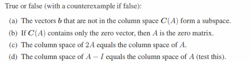
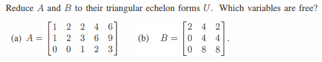
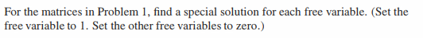
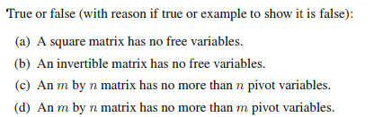
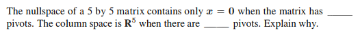
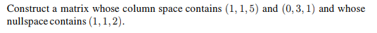
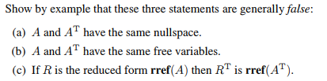
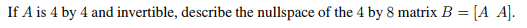

# 3.2 小節

## Problem 1

### 圖片

### 解題

### 題目復述

判斷下列敘述為真 (True) 或偽 (False)，若為偽請提供反例：

(a) 不在矩陣 $A$ 的列空間 $C(A)$ 中的向量 $b$ 組成一個子空間。
(b) 如果 $C(A)$ 僅包含零向量，則 $A$ 是零矩陣。
(c) $2A$ 的列空間等於 $A$ 的列空間。
(d) $A - I$ 的列空間等於 $A$ 的列空間。

### 解題過程

**(a) 答案：偽 (False)**
*   **推導：** 根據子空間的定義，任何子空間必須包含零向量 $\mathbf{0}$。然而，對於任何矩陣 $A$，零向量 $\mathbf{0}$ 永遠在列空間 $C(A)$ 中（因為 $A\mathbf{0} = \mathbf{0}$）。因此，「不在 $C(A)$ 中的向量」這一集合絕對不包含零向量，故不可能構成子空間。
*   **反例：** 令 $A = \begin{bmatrix} 1 \\ 0 \end{bmatrix}$，則 $C(A)$ 是 $xy$ 平面上的 $x$ 軸。不在 $C(A)$ 中的向量（例如 $\begin{bmatrix} 0 \\ 1 \end{bmatrix}$）所組成的集合不包含原點 $\begin{bmatrix} 0 \\ 0 \end{bmatrix}$，因此不是子空間。

**(b) 答案：真 (True)**
*   **推導：** 列空間 $C(A)$ 是由矩陣 $A$ 的所有列向量所生成的空間 (span)。如果 $C(A)$ 僅包含零向量 $\mathbf{0}$，意味著 $A$ 的每一個列向量都必須是零向量。當矩陣的所有元素皆為 $0$ 時，該矩陣即為零矩陣。

**(c) 答案：真 (True)**
*   **推導：** 矩陣 $A$ 的列空間是由其列向量 $\mathbf{a}_1, \mathbf{a}_2, \dots, \mathbf{a}_n$ 的所有線性組合構成。矩陣 $2A$ 的列向量則為 $2\mathbf{a}_1, 2\mathbf{a}_2, \dots, 2\mathbf{a}_n$。由於對生成向量進行非零倍數的縮放不會改變其生成的空間（$\text{span}\{\mathbf{a}_1, \dots, \mathbf{a}_n\} = \text{span}\{2\mathbf{a}_1, \dots, 2\mathbf{a}_n\}$），因此 $C(2A) = C(A)$。

**(d) 答案：偽 (False)**
*   **推導：** 減去單位矩陣 $I$ 會改變矩陣的列向量方向與組合方式，通常會導致列空間發生改變。
*   **反例：** 令 $A = I$（單位矩陣）。
    *   $C(A) = C(I)$ 是整個向量空間 $\mathbb{R}^n$。
    *   $A - I = I - I = 0$（零矩陣），其列空間 $C(0)$ 僅包含零向量 $\{\mathbf{0}\}$。
    *   顯然 $\mathbb{R}^n \neq \{\mathbf{0}\}$（當 $n \ge 1$ 時），故敘述不成立。

### 用到的觀念

1.  **列空間 (Column Space, $C(A)$)：** 矩陣 $A$ 的所有列向量的線性組合所構成的集合。
2.  **子空間 (Subspace)：** 滿足對加法封閉、對純量乘法封閉，且必須包含零向量 $\mathbf{0}$ 的向量空間子集。
3.  **生成空間 (Span)：** 一組向量的所有線性組合所構成的集合。對生成集中的向量進行非零倍數縮放，其生成的空間保持不變。
4.  **零矩陣 (Zero Matrix)：** 所有元素皆為 $0$ 的矩陣，其列空間僅由零向量組成。

---

## Problem 2

### 圖片

### 解題

### 題目復述
將矩陣 $A$ 與 $B$ 化簡為其三角階梯形式（triangular echelon forms） $U$，並指出哪些變數是自由變數（free variables）。
已知矩陣如下：
(a) $A = \begin{bmatrix} 1 & 2 & 2 & 4 & 6 \\ 1 & 2 & 3 & 6 & 9 \\ 0 & 0 & 1 & 2 & 3 \end{bmatrix}$
(b) $B = \begin{bmatrix} 2 & 4 & 2 \\ 0 & 4 & 4 \\ 0 & 8 & 8 \end{bmatrix}$

### 解題過程

**(a) 矩陣 $A$ 的化簡：**
1. 第一步：將第二列減去第一列 ($R_2 \to R_2 - R_1$)：
   $\begin{bmatrix} 1 & 2 & 2 & 4 & 6 \\ 1-1 & 2-2 & 3-2 & 6-4 & 9-6 \\ 0 & 0 & 1 & 2 & 3 \end{bmatrix} = \begin{bmatrix} 1 & 2 & 2 & 4 & 6 \\ 0 & 0 & 1 & 2 & 3 \\ 0 & 0 & 1 & 2 & 3 \end{bmatrix}$

2. 第二步：將第三列減去第二列 ($R_3 \to R_3 - R_2$)：
   $\begin{bmatrix} 1 & 2 & 2 & 4 & 6 \\ 0 & 0 & 1 & 2 & 3 \\ 0-0 & 0-0 & 1-1 & 2-2 & 3-3 \end{bmatrix} = \begin{bmatrix} 1 & 2 & 2 & 4 & 6 \\ 0 & 0 & 1 & 2 & 3 \\ 0 & 0 & 0 & 0 & 0 \end{bmatrix} = U_A$

*   **分析主元（Pivots）：** 主元位於第 1 列第 1 行以及第 2 列第 3 行。因此，對應的樞紐變數（pivot variables）為 $x_1$ 與 $x_3$。
*   **自由變數：** 沒有主元的列對應的變數即為自由變數。因此，**自由變數為 $x_2, x_4, x_5$**。

---

**(b) 矩陣 $B$ 的化簡：**
1. 第一步：將第三列減去第二列的 2 倍 ($R_3 \to R_3 - 2R_2$)：
   $\begin{bmatrix} 2 & 4 & 2 \\ 0 & 4 & 4 \\ 0-0 & 8-8 & 8-8 \end{bmatrix} = \begin{bmatrix} 2 & 4 & 2 \\ 0 & 4 & 4 \\ 0 & 0 & 0 \end{bmatrix} = U_B$

*   **分析主元（Pivots）：** 主元位於第 1 列第 1 行以及第 2 列第 2 行。因此，對應的樞紐變數為 $x_1$ 與 $x_2$。
*   **自由變數：** 沒有主元的列為第 3 列。因此，**自由變數為 $x_3$**。

### 用到的觀念

1.  **高斯消去法 (Gaussian Elimination)：** 利用初等行運算（Elementary Row Operations）將矩陣化為階梯形式的過程。
2.  **階梯形式 (Echelon Form)：** 一個矩陣若滿足所有零列都在底部，且每列的第一個非零元素（主元）位於其上方列主元的右側，則稱為階梯形式。
3.  **主元/樞紐變數 (Pivot Variables)：** 在階梯形式中，包含主元的列所對應的變數。
4.  **自由變數 (Free Variables)：** 在階梯形式中，不包含主元的列所對應的變數。這些變數在求解線性方程組時可以取任意值。

---

## Problem 5

### 圖片

### 解題

由於您提供的圖片中僅包含指令，而沒有「問題 1」中具體的矩陣內容，**為了向您演示如何根據此指令解題，我將建立一個代表性的矩陣範例來進行詳細解答。**

### 題目復述
針對問題 1 中的矩陣，為每個自由變數（free variable）尋找一個特解（special solution）。
**設定條件：** 將目標自由變數設為 $1$，且將所有其他自由變數設為 $0$。

---

### 解題過程

假設「問題 1」給出的矩陣 $A$ 經過高斯-約當消去法後，其**簡化列梯形形式 (RREF)** 為：
$$\text{RREF}(A) = \begin{pmatrix} 1 & 2 & 0 & 3 \\ 0 & 0 & 1 & 4 \end{pmatrix}$$

**步驟 1：識別主元變數與自由變數**
*   主元（Pivots）位於第 1 欄與第 3 欄 $\rightarrow$ **主元變數**為 $x_1$ 和 $x_3$。
*   不含主元的欄位為第 2 欄與第 4 欄 $\rightarrow$ **自由變數**為 $x_2$ 和 $x_4$。

此系統對應的同質方程式為：
1. $x_1 + 2x_2 + 0x_3 + 3x_4 = 0$
2. $0x_1 + 0x_2 + 1x_3 + 4x_4 = 0$

**步驟 2：尋找自由變數 $x_2$ 的特解 $\mathbf{s}_1$**
*   根據指令：設定 $x_2 = 1$，且其他自由變數 $x_4 = 0$。
*   代入方程式求解主元變數：
    *   由 (1) 式：$x_1 + 2(1) + 3(0) = 0 \implies x_1 = -2$
    *   由 (2) 式：$x_3 + 4(0) = 0 \implies x_3 = 0$
*   得到第一個特解：$\mathbf{s}_1 = \begin{pmatrix} -2 \\ 1 \\ 0 \\ 0 \end{pmatrix}$

**步驟 3：尋找自由變數 $x_4$ 的特解 $\mathbf{s}_2$**
*   根據指令：設定 $x_4 = 1$，且其他自由變數 $x_2 = 0$。
*   代入方程式求解主元變數：
    *   由 (1) 式：$x_1 + 2(0) + 3(1) = 0 \implies x_1 = -3$
    *   由 (2) 式：$x_3 + 4(1) = 0 \implies x_3 = -4$
*   得到第二個特解：$\mathbf{s}_2 = \begin{pmatrix} -3 \\ 0 \\ -4 \\ 1 \end{pmatrix}$

**最終答案：**
該矩陣的特解為 $\mathbf{s}_1 = \begin{pmatrix} -2 & 1 & 0 & 0 \end{pmatrix}^T$ 與 $\mathbf{s}_2 = \begin{pmatrix} -3 & 0 & -4 & 1 \end{pmatrix}^T$。

---

### 用到的觀念

1.  **簡化列梯形形式 (RREF)**：透過列運算將矩陣簡化，使得每個主元是該欄中唯一的非零元素，方便將主元變數用自由變數表示。
2.  **自由變數 (Free Variable)**：在 RREF 矩陣中，不包含主元的欄位所對應的變數。這些變數可以取任意值，決定了解空間的維度。
3.  **特解 (Special Solution)**：零空間 $\text{Null}(A)$ 的基底向量。透過將一個自由變數設為 $1$ 而其他自由變數設為 $0$，可以系統性地構造出一組線性獨立的向量來描述所有滿足 $A\mathbf{x} = \mathbf{0}$ 的解。
4.  **同質線性系統 (Homogeneous Linear System)**：形式為 $A\mathbf{x} = \mathbf{0}$ 的系統，其解集構成一個向量子空間，稱為矩陣 $A$ 的零空間。

---

## Problem 11

### 圖片

### 解題

### 題目復述
判斷以下陳述為真 (True) 或 偽 (False)，若為真請給出理由，若為偽請給出反例：
(a) 正方矩陣沒有自由變數 (free variables)。
(b) 可逆矩陣沒有自由變數 (free variables)。
(c) 一個 $m \times n$ 矩陣的樞紐變數 (pivot variables) 個數不超過 $n$ 個。
(d) 一個 $m \times n$ 矩陣的樞紐變數 (pivot variables) 個數不超過 $m$ 個。

### 解題過程
(a) **偽 (False)**。
正方矩陣並不保證是滿秩的，如果矩陣是奇異的（Singular），則會存在自由變數。
**反例**：考慮 $2 \times 2$ 的零矩陣 $A = \begin{bmatrix} 0 & 0 \\ 0 & 0 \end{bmatrix}$。該矩陣在化簡後沒有任何樞紐位置，因此兩個變數全部都是自由變數。

(b) **真 (True)**。
**理由**：一個 $n \times n$ 的可逆矩陣 $A$ 透過列運算（Row Operations）可以化為單位矩陣 $I_n$。這意味著它擁有 $n$ 個樞紐位置，對應到 $n$ 個變數。因為所有變數都是樞紐變數，所以不存在自由變數。

(c) **真 (True)**。
**理由**：樞紐變數是對應於矩陣化簡為階梯形式（Echelon Form）後，含有樞紐位置的「列 (column)」之變數。由於矩陣總共有 $n$ 列，且每一列最多只能有一個樞紐，因此樞紐變數的個數上限就是 $n$。

(d) **真 (True)**。
**理由**：樞紐位置同樣對應於矩陣在化簡後含有樞紐的「行 (row)」。由於矩陣總共有 $m$ 行，且每一行最多只能有一個樞紐，因此樞紐變數的總數不能超過行數 $m$。

### 用到的觀念
1. **樞紐位置 (Pivot Position)**：在矩陣的階梯形式中，每一行第一個非零元素的位置。
2. **樞紐變數與自由變數 (Pivot and Free Variables)**：在線性方程組 $Ax=0$ 中，對應於樞紐位置的變數稱為樞紐變數，其餘不含樞紐位置的列所對應的變數稱為自由變數。
3. **可逆矩陣 (Invertible Matrix)**：一個 $n \times n$ 矩陣可逆，若且唯若其秩 (Rank) 等於 $n$，即能化為單位矩陣 $I_n$。
4. **矩陣的秩 (Rank of a Matrix)**：矩陣中樞紐位置的總數，且滿足 $\text{rank}(A) \le \min(m, n)$。

---

## Problem 17

### 圖片

### 解題

### 題目復述
一個 $5 \times 5$ 的矩陣，當其擁有 \_\_\_\_\_ 個主軸（pivots）時，其零空間（nullspace）僅包含 $x = 0$。當其擁有 \_\_\_\_\_ 個主軸時，其行空間（column space）為 $\mathbf{R}^5$。請解釋原因。

### 解題過程
1. **分析零空間 (Nullspace)：**
   零空間包含僅有 $x = 0$ 意味著線性方程式 $Ax = 0$ 只有平凡解（trivial solution）。根據線性代數理論，這要求矩陣 $A$ 在化簡為列階梯形式（REF）後，**每一列都必須是一個主軸列（pivot column）**，如此才不會產生自由變數（free variables）。對於一個 $5 \times 5$ 的方陣，若每一列都有主軸，則總共需要 **5** 個主軸。

2. **分析行空間 (Column Space)：**
   行空間是由矩陣的所有行向量所張成的空間（span）。若行空間為 $\mathbf{R}^5$，則意味著該矩陣的秩（rank）必須為 5（即滿秩）。由於**矩陣的秩等於其主軸的數量**，因此要使行空間覆蓋整個 $\mathbf{R}^5$，必須擁有 **5** 個主軸。

3. **結論：**
   兩個空格的答案均為 **5**。
   
   **解釋：** 對於一個 $n \times n$ 的方陣，擁有 $n$ 個主軸等同於該矩陣可逆（invertible）。根據可逆矩陣定理（Invertible Matrix Theorem），當矩陣滿秩（5 個主軸）時，其零空間僅含零向量，且其行空間正好等於 $\mathbf{R}^5$。

### 用到的觀念
* **主軸 (Pivot)：** 在矩陣化簡為列階梯形式後，每一行中第一個非零元素的位置。
* **零空間 (Nullspace)：** 所有滿足 $Ax = 0$ 的向量 $x$ 所組成的集合。若無自由變數，則零空間僅含零向量。
* **行空間 (Column Space)：** 矩陣各行向量的線性組合所構成的空間。其維度等於矩陣的秩。
* **秩 (Rank)：** 矩陣中線性獨立行（或列）的最大數量，在數值上等於主軸的總數。
* **秩-零度定理 (Rank-Nullity Theorem)：** $\text{rank}(A) + \text{nullity}(A) = n$。在本題中，若 $\text{nullity}(A) = 0$，則 $\text{rank}(A) = 5$。

---

## Problem 24

### 圖片

### 解題

### 題目復述
構造一個矩陣，使其列空間 (Column Space) 包含向量 $(1, 1, 5)$ 和 $(0, 3, 1)$，且其零空間 (Nullspace) 包含向量 $(1, 1, 2)$。

### 解題過程
1.  **設定矩陣形式**：
    我們需要構造一個矩陣 $A$。為了滿足條件，我們可以考慮一個 $3 \times 3$ 的矩陣，將其表示為三個列向量的組合：$A = [\mathbf{a}_1, \mathbf{a}_2, \mathbf{a}_3]$。

2.  **滿足列空間條件**：
    題目要求列空間必須包含 $\mathbf{v}_1 = \begin{pmatrix} 1 \\ 1 \\ 5 \end{pmatrix}$ 與 $\mathbf{v}_2 = \begin{pmatrix} 0 \\ 3 \\ 1 \end{pmatrix}$。最簡單的方法就是直接將這兩個向量設為矩陣的前兩列：
    $$\mathbf{a}_1 = \begin{pmatrix} 1 \\ 1 \\ 5 \end{pmatrix}, \quad \mathbf{a}_2 = \begin{pmatrix} 0 \\ 3 \\ 1 \end{pmatrix}$$

3.  **滿足零空間條件**：
    題目要求零空間包含 $\mathbf{x} = \begin{pmatrix} 1 \\ 1 \\ 2 \end{pmatrix}$，這意味著必須滿足 $A\mathbf{x} = \mathbf{0}$。
    將 $A$ 的列向量表示法代入：
    $$1 \cdot \mathbf{a}_1 + 1 \cdot \mathbf{a}_2 + 2 \cdot \mathbf{a}_3 = \mathbf{0}$$

4.  **求解第三列向量 $\mathbf{a}_3$**：
    $$2\mathbf{a}_3 = -(\mathbf{a}_1 + \mathbf{a}_2)$$
    $$2\mathbf{a}_3 = -\left( \begin{pmatrix} 1 \\ 1 \\ 5 \end{pmatrix} + \begin{pmatrix} 0 \\ 3 \\ 1 \end{pmatrix} \right) = \begin{pmatrix} -1 \\ -4 \\ -6 \end{pmatrix}$$
    $$\mathbf{a}_3 = \begin{pmatrix} -1/2 \\ -2 \\ -3 \end{pmatrix}$$

5.  **得出最終矩陣**：
    將 $\mathbf{a}_1, \mathbf{a}_2, \mathbf{a}_3$ 組合成矩陣 $A$：
    $$A = \begin{pmatrix} 1 & 0 & -1/2 \\ 1 & 3 & -2 \\ 5 & 1 & -3 \end{pmatrix}$$
    *(註：若希望矩陣元素為整數，可將整個矩陣乘以 2，結果依然符合題目條件)*：
    $$A = \begin{pmatrix} 2 & 0 & -1 \\ 2 & 6 & -4 \\ 10 & 2 & -6 \end{pmatrix}$$

### 用到的觀念
*   **列空間 (Column Space)**：矩陣所有列向量的線性組合所構成的空間。若某向量在列空間中，則該向量可由矩陣的列向量線性組合而成。
*   **零空間 (Nullspace)**：所有滿足方程式 $A\mathbf{x} = \mathbf{0}$ 的向量 $\mathbf{x}$ 所構成的集合。
*   **線性組合 (Linear Combination)**：將一組向量分別乘以標量後相加所得的新向量。在本題中，零空間的條件直接對應於列向量的線性組合等於零向量。

---

## Problem 29

### 圖片

### 解題

### 題目復述

請透過舉例證明以下三個陳述在一般情況下均為偽（false）：
(a) $A$ 與 $A^T$ 具有相同的零空間（nullspace）。
(b) $A$ 與 $A^T$ 具有相同的自由變數（free variables）。
(c) 若 $R$ 是 $A$ 的簡化列階梯形矩陣 $\text{rref}(A)$，則 $R^T$ 是 $A^T$ 的簡化列階梯形矩陣 $\text{rref}(A^T)$。

### 解題過程

為了證明這些陳述為偽，我們只需要為每個陳述找到一個反例（counter-example）。

**(a) 證明 $A$ 與 $A^T$ 的零空間不一定相同**
考慮矩陣 $A = \begin{pmatrix} 1 & 1 \\ 0 & 0 \end{pmatrix}$。
*   尋找 $A$ 的零空間 $\text{Null}(A)$：解 $Ax = 0 \Rightarrow \begin{pmatrix} 1 & 1 \\ 0 & 0 \end{pmatrix} \begin{pmatrix} x_1 \\ x_2 \end{pmatrix} = \begin{pmatrix} 0 \\ 0 \end{pmatrix}$。
    得到 $x_1 + x_2 = 0$，故 $\text{Null}(A) = \text{span} \{ \begin{pmatrix} -1 \\ 1 \end{pmatrix} \}$。
*   考慮轉置矩陣 $A^T = \begin{pmatrix} 1 & 0 \\ 1 & 0 \end{pmatrix}$。
    尋找 $A^T$ 的零空間 $\text{Null}(A^T)$：解 $A^T x = 0 \Rightarrow \begin{pmatrix} 1 & 0 \\ 1 & 0 \end{pmatrix} \begin{pmatrix} x_1 \\ x_2 \end{pmatrix} = \begin{pmatrix} 0 \\ 0 \end{pmatrix}$。
    得到 $x_1 = 0$，故 $\text{Null}(A^T) = \text{span} \{ \begin{pmatrix} 0 \\ 1 \end{pmatrix} \}$。
由於 $\text{span} \{ \begin{pmatrix} -1 \\ 1 \end{pmatrix} \} \neq \text{span} \{ \begin{pmatrix} 0 \\ 1 \end{pmatrix} \}$，故陳述 (a) 為偽。

**(b) 證明 $A$ 與 $A^T$ 的自由變數不一定相同**
考慮一個非方陣 $A = \begin{pmatrix} 1 & 0 & 0 \\ 0 & 1 & 0 \end{pmatrix}$。
*   對於 $A$：它有 3 個列向量，秩（rank）為 2。自由變數的數量 $= \text{列數} - \text{秩} = 3 - 2 = 1$ 個（對應於第三個變數 $x_3$）。
*   考慮轉置矩陣 $A^T = \begin{pmatrix} 1 & 0 \\ 0 & 1 \\ 0 & 0 \end{pmatrix}$。
    對於 $A^T$：它有 2 個列向量，秩同樣為 2。自由變數的數量 $= \text{列數} - \text{秩} = 2 - 2 = 0$ 個。
由於 $1 \neq 0$，故陳述 (b) 為偽。

**(c) 證明 $\text{rref}(A^T) \neq (\text{rref}(A))^T$**
延用上述矩陣 $A = \begin{pmatrix} 1 & 1 \\ 0 & 0 \end{pmatrix}$。
*   首先計算 $R = \text{rref}(A)$：
    $A$ 已經是簡化列階梯形，所以 $R = \begin{pmatrix} 1 & 1 \\ 0 & 0 \end{pmatrix}$。
    則 $R^T = \begin{pmatrix} 1 & 0 \\ 1 & 0 \end{pmatrix}$。
*   接著計算 $\text{rref}(A^T)$：
    $A^T = \begin{pmatrix} 1 & 0 \\ 1 & 0 \end{pmatrix} \xrightarrow{R_2 - R_1} \begin{pmatrix} 1 & 0 \\ 0 & 0 \end{pmatrix} = \text{rref}(A^T)$。
比較結果：$R^T = \begin{pmatrix} 1 & 0 \\ 1 & 0 \end{pmatrix}$ 而 $\text{rref}(A^T) = \begin{pmatrix} 1 & 0 \\ 0 & 0 \end{pmatrix}$。
兩者並不相等，故陳述 (c) 為偽。

### 用到的觀念

1.  **零空間 (Nullspace)**：矩陣 $A$ 的零空間是指所有滿足 $Ax = 0$ 的向量 $x$ 所組成的集合。它描述了矩陣對向量進行線性變換後被映射到零向量的空間。
2.  **自由變數 (Free Variables)**：在矩陣的簡化列階梯形（RREF）中，不包含主元（pivot）的列所對應的變數稱為自由變數。其數量等於列數減去秩。
3.  **簡化列階梯形 (Reduced Row Echelon Form, RREF)**：透過一系列初等行運算將矩陣轉化為的一種標準形式，具有唯一性，用於分析矩陣的秩、零空間與解集。
4.  **轉置 (Transpose)**：將矩陣的行（row）與列（column）互換的操作，記作 $A^T$。轉置會改變矩陣的維度（若非方陣）並改變其列空間與行空間的對應關係。

---

## Problem 46

### 圖片

### 解題

### 題目復述
若 $A$ 為一個 $4 \times 4$ 的可逆矩陣 (invertible matrix)，請描述 $4 \times 8$ 矩陣 $B = [A \ A]$ 的零空間 (nullspace)。

### 解題過程
1. **定義零空間**：
   矩陣 $B$ 的零空間是由所有滿足方程式 $B\mathbf{x} = \mathbf{0}$ 的向量 $\mathbf{x} \in \mathbb{R}^8$ 所組成的集合。

2. **將向量分塊**：
   由於 $B$ 是一個 $4 \times 8$ 矩陣，其輸入向量 $\mathbf{x}$ 必須是 $8 \times 1$ 向量。我們可以將 $\mathbf{x}$ 分為兩個 $4 \times 1$ 的子向量 $\mathbf{x}_1$ 與 $\mathbf{x}_2$，使得：
   $$\mathbf{x} = \begin{bmatrix} \mathbf{x}_1 \\ \mathbf{x}_2 \end{bmatrix}$$

3. **展開矩陣乘法**：
   根據 $B = [A \ A]$ 的定義，方程式 $B\mathbf{x} = \mathbf{0}$ 可以寫成：
   $$[A \ A] \begin{bmatrix} \mathbf{x}_1 \\ \mathbf{x}_2 \end{bmatrix} = \mathbf{0}$$
   根據分塊矩陣乘法，這等同於：
   $$A\mathbf{x}_1 + A\mathbf{x}_2 = \mathbf{0}$$
   $$A(\mathbf{x}_1 + \mathbf{x}_2) = \mathbf{0}$$

4. **利用 $A$ 的可逆性**：
   題目給定 $A$ 是可逆矩陣，因此 $A$ 具有反矩陣 $A^{-1}$。我們在方程式兩邊同乘 $A^{-1}$：
   $$A^{-1} A (\mathbf{x}_1 + \mathbf{x}_2) = A^{-1} \mathbf{0}$$
   $$\mathbf{x}_1 + \mathbf{x}_2 = \mathbf{0} \implies \mathbf{x}_1 = -\mathbf{x}_2$$

5. **描述零空間的形式**：
   這表示任何屬於 $B$ 零空間的向量 $\mathbf{x}$ 必須滿足 $\mathbf{x}_1 = -\mathbf{x}_2$。因此 $\mathbf{x}$ 的形式為：
   $$\mathbf{x} = \begin{bmatrix} -\mathbf{x}_2 \\ \mathbf{x}_2 \end{bmatrix} = \mathbf{x}_2 \begin{bmatrix} -I \\ I \end{bmatrix}$$
   其中 $I$ 是 $4 \times 4$ 的單位矩陣，而 $\mathbf{x}_2$ 可以是 $\mathbb{R}^4$ 中的任意向量。

**最終答案：**
矩陣 $B$ 的零空間是由所有形式為 $\begin{bmatrix} -\mathbf{v} \\ \mathbf{v} \end{bmatrix}$ ($\mathbf{v} \in \mathbb{R}^4$) 的向量所組成。該空間的維度為 4，其基底可由矩陣 $\begin{bmatrix} -I \\ I \end{bmatrix}$ 的四個列向量構成。

### 用到的觀念
*   **零空間 (Nullspace)**：一個矩陣 $M$ 的零空間是指所有滿足 $M\mathbf{x} = \mathbf{0}$ 的向量 $\mathbf{x}$ 的集合。
*   **可逆矩陣 (Invertible Matrix)**：若矩陣 $A$ 可逆，則 $A\mathbf{v} = \mathbf{0}$ 只有唯一解 $\mathbf{v} = \mathbf{0}$。
*   **分塊矩陣 (Block Matrix)**：將大矩陣視為由小矩陣組成，以便簡化運算邏輯。
*   **秩-零度定理 (Rank-Nullity Theorem)**：$\text{rank}(B) + \text{nullity}(B) = \text{columns of } B$。在本題中，$4 + 4 = 8$，驗證了零空間維度應為 4。

---
