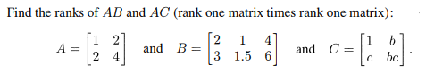
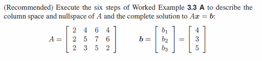
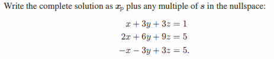
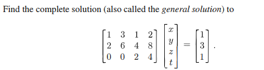
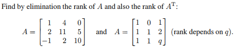
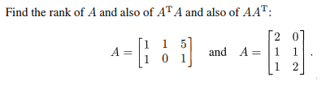
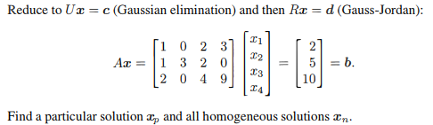

# 3.3 小節

## Problem 1

### 圖片

### 解題

### 題目復述
給定三個矩陣：
$A = \begin{bmatrix} 1 & 2 \\ 2 & 4 \end{bmatrix}$
$B = \begin{bmatrix} 2 & 1 & 4 \\ 3 & 1.5 & 6 \end{bmatrix}$
$C = \begin{bmatrix} 1 & b \\ c & bc \end{bmatrix}$
已知這三個皆為秩為 1 的矩陣（rank one matrix），請計算矩陣乘積 $AB$ 與 $AC$ 的秩（rank）。

### 解題過程
##### 1. 計算 $AB$ 的秩
首先計算矩陣乘積 $AB$：
$AB = \begin{bmatrix} 1 & 2 \\ 2 & 4 \end{bmatrix} \begin{bmatrix} 2 & 1 & 4 \\ 3 & 1.5 & 6 \end{bmatrix}$
$AB = \begin{bmatrix} (1\cdot2 + 2\cdot3) & (1\cdot1 + 2\cdot1.5) & (1\cdot4 + 2\cdot6) \\ (2\cdot2 + 4\cdot3) & (2\cdot1 + 4\cdot1.5) & (2\cdot4 + 4\cdot6) \end{bmatrix}$
$AB = \begin{bmatrix} 8 & 4 & 16 \\ 16 & 8 & 32 \end{bmatrix}$

觀察結果矩陣 $AB$ 的列向量：
第二列 $\begin{bmatrix} 16 & 8 & 32 \end{bmatrix}$ 正好是第一列 $\begin{bmatrix} 8 & 4 & 16 \end{bmatrix}$ 的 2 倍。
由於 $AB$ 不是零矩陣，且所有列向量皆共線，因此：
**$\text{rank}(AB) = 1$**

---

##### 2. 計算 $AC$ 的秩
接著計算矩陣乘積 $AC$：
$AC = \begin{bmatrix} 1 & 2 \\ 2 & 4 \end{bmatrix} \begin{bmatrix} 1 & b \\ c & bc \end{bmatrix}$
$AC = \begin{bmatrix} (1\cdot1 + 2\cdot c) & (1\cdot b + 2\cdot bc) \\ (2\cdot1 + 4\cdot c) & (2\cdot b + 4\cdot bc) \end{bmatrix}$
$AC = \begin{bmatrix} 1+2c & b(1+2c) \\ 2(1+2c) & 2b(1+2c) \end{bmatrix}$

我們可以將 $AC$ 寫成：
$AC = (1+2c) \begin{bmatrix} 1 & b \\ 2 & 2b \end{bmatrix}$

現在分析其秩：
- 若 $1+2c \neq 0$（即 $c \neq -\frac{1}{2}$），則 $AC$ 是一個非零矩陣，且其第二列是第一列的 2 倍，因此 $\text{rank}(AC) = 1$。
- 若 $1+2c = 0$（即 $c = -\frac{1}{2}$），則 $AC = \begin{bmatrix} 0 & 0 \\ 0 & 0 \end{bmatrix}$，即零矩陣，因此 $\text{rank}(AC) = 0$。

**答案：$\text{rank}(AC) = \begin{cases} 1, & \text{若 } c \neq -1/2 \\ 0, & \text{若 } c = -1/2 \end{cases}$**

### 用到的觀念
1. **矩陣的秩 (Rank)**：矩陣中線性獨立的列（或行）的最大數量。對於秩為 1 的矩陣，其所有非零列向量都彼此共線（成比例）。
2. **秩為 1 矩陣的乘積**：若 $A$ 和 $B$ 都是秩為 1 的矩陣，則可寫成 $A=uv^T$ 且 $B=wz^T$。其乘積 $AB = u(v^Tw)z^T$。因為 $v^Tw$ 是一個純量（scalar），所以 $AB$ 的秩只有兩種可能：
   - 若 $v^Tw \neq 0$，則 $\text{rank}(AB) = 1$。
   - 若 $v^Tw = 0$，則 $\text{rank}(AB) = 0$。
3. **矩陣乘法**：基本的行列相乘運算，用於求得結果矩陣。

---

## Problem 3

### 圖片

### 解題

### 題目復述

給定矩陣 $A$ 與向量 $b$ 如下：
$$A = \begin{bmatrix} 2 & 4 & 6 & 4 \\ 2 & 5 & 7 & 6 \\ 2 & 3 & 5 & 2 \end{bmatrix}, \quad b = \begin{bmatrix} 4 \\ 3 \\ 5 \end{bmatrix}$$
請描述 $A$ 的行空間 (Column Space)、零空間 (Nullspace)，以及線性方程組 $Ax = b$ 的完整解 (Complete Solution)。

### 解題過程

##### 1. 進行高斯消去法 (Gaussian Elimination)
首先建立增廣矩陣 $[A | b]$ 並將其化為精簡列梯形矩陣 (RREF)：
$$\begin{bmatrix} 2 & 4 & 6 & 4 & | & 4 \\ 2 & 5 & 7 & 6 & | & 3 \\ 2 & 3 & 5 & 2 & | & 5 \end{bmatrix}$$

*   執行 $R_2 - R_1 \to R_2$ 且 $R_3 - R_1 \to R_3$：
$$\begin{bmatrix} 2 & 4 & 6 & 4 & | & 4 \\ 0 & 1 & 1 & 2 & | & -1 \\ 0 & -1 & -1 & -2 & | & 1 \end{bmatrix}$$
*   執行 $R_3 + R_2 \to R_3$：
$$\begin{bmatrix} 2 & 4 & 6 & 4 & | & 4 \\ 0 & 1 & 1 & 2 & | & -1 \\ 0 & 0 & 0 & 0 & | & 0 \end{bmatrix}$$
*   執行 $R_1 / 2 \to R_1$：
$$\begin{bmatrix} 1 & 2 & 3 & 2 & | & 2 \\ 0 & 1 & 1 & 2 & | & -1 \\ 0 & 0 & 0 & 0 & | & 0 \end{bmatrix}$$
*   執行 $R_1 - 2R_2 \to R_1$：
$$\begin{bmatrix} 1 & 0 & 1 & -2 & | & 4 \\ 0 & 1 & 1 & 2 & | & -1 \\ 0 & 0 & 0 & 0 & | & 0 \end{bmatrix}$$
此即為 RREF 形式。

##### 2. 描述行空間 $C(A)$
行空間的基底由原矩陣 $A$ 中對應於 RREF 主元列 (pivot columns) 的列組成。
主元位於第 1 列與第 2 列，因此 $C(A)$ 的基底為：
$$\text{Basis for } C(A) = \left\{ \begin{bmatrix} 2 \\ 2 \\ 2 \end{bmatrix}, \begin{bmatrix} 4 \\ 5 \\ 3 \end{bmatrix} \right\}$$
(或簡化為 $\left\{ \begin{bmatrix} 1 \\ 1 \\ 1 \end{bmatrix}, \begin{bmatrix} 4 \\ 5 \\ 3 \end{bmatrix} \right\}$)

##### 3. 描述零空間 $N(A)$
解同次方程組 $Ax = 0$，由 RREF 可得：
$x_1 + x_3 - 2x_4 = 0 \implies x_1 = -x_3 + 2x_4$
$x_2 + x_3 + 2x_4 = 0 \implies x_2 = -x_3 - 2x_4$
令自由變數 $x_3 = s, x_4 = t$，則：
$$x = \begin{bmatrix} -s + 2t \\ -s - 2t \\ s \\ t \end{bmatrix} = s \begin{bmatrix} -1 \\ -1 \\ 1 \\ 0 \end{bmatrix} + t \begin{bmatrix} 2 \\ -2 \\ 0 \\ 1 \end{bmatrix}$$
因此 $N(A)$ 的基底為：
$$\text{Basis for } N(A) = \left\{ \begin{bmatrix} -1 \\ -1 \\ 1 \\ 0 \end{bmatrix}, \begin{bmatrix} 2 \\ -2 \\ 0 \\ 1 \end{bmatrix} \right\}$$

##### 4. 求 $Ax = b$ 的完整解
完整解由一個特解 $x_p$ 與零空間的通解 $x_n$ 組成：$x = x_p + x_n$。
令自由變數 $s = 0, t = 0$，由 RREF 可直接得出特解：
$x_p = \begin{bmatrix} 4 \\ -1 \\ 0 \\ 0 \end{bmatrix}$

**最終完整解為：**
$$x = \begin{bmatrix} 4 \\ -1 \\ 0 \\ 0 \end{bmatrix} + s \begin{bmatrix} -1 \\ -1 \\ 1 \\ 0 \end{bmatrix} + t \begin{bmatrix} 2 \\ -2 \\ 0 \\ 1 \end{bmatrix} \quad (s, t \in \mathbb{R})$$

### 用到的觀念

*   **精簡列梯形矩陣 (RREF)**：透過基本列運算將矩陣簡化，以便於分析矩陣的秩 (rank) 以及求解線性方程組。
*   **行空間 (Column Space)**：矩陣 $A$ 所有列向量的線性組合所構成的空間。其基底可由 RREF 的主元列對應原矩陣的列來確定。
*   **零空間 (Nullspace)**：滿足 $Ax = 0$ 的所有向量 $x$ 所構成的空間。解法是將變數分為主元變數與自由變數。
*   **完整解 (Complete Solution)**：非同次方程組 $Ax = b$ 的解可表示為一個特解 (particular solution) 加上對應同次方程組的通解 (homogeneous solution/nullspace)。

---

## Problem 4

### 圖片

### 解題

### 題目復述
請解以下線性方程組，並將完整解（complete solution）表示為一個特解 $\mathbf{x}_p$ 加上零空間（nullspace）中向量 $\mathbf{s}$ 的任意倍數：
$$x + 3y + 3z = 1$$
$$2x + 6y + 9z = 5$$
$$-x - 3y + 3z = 5$$

### 解題過程
首先，將方程組寫成增廣矩陣（augmented matrix）形式：
$$\left( \begin{array}{ccc|c} 1 & 3 & 3 & 1 \\ 2 & 6 & 9 & 5 \\ -1 & -3 & 3 & 5 \end{array} \right)$$

接下來，利用高斯消去法（Gaussian elimination）將矩陣轉換為簡化列階梯形矩陣（RREF）：
1. $\text{R}_2 \to \text{R}_2 - 2\text{R}_1$ 且 $\text{R}_3 \to \text{R}_3 + \text{R}_1$：
$$\left( \begin{array}{ccc|c} 1 & 3 & 3 & 1 \\ 0 & 0 & 3 & 3 \\ 0 & 0 & 6 & 6 \end{array} \right)$$

2. $\text{R}_2 \to \frac{1}{3}\text{R}_2$：
$$\left( \begin{array}{ccc|c} 1 & 3 & 3 & 1 \\ 0 & 0 & 1 & 1 \\ 0 & 0 & 6 & 6 \end{array} \right)$$

3. $\text{R}_3 \to \text{R}_3 - 6\text{R}_2$ 且 $\text{R}_1 \to \text{R}_1 - 3\text{R}_2$：
$$\left( \begin{array}{ccc|c} 1 & 3 & 0 & -2 \\ 0 & 0 & 1 & 1 \\ 0 & 0 & 0 & 0 \end{array} \right)$$

由上述 RREF 矩陣可得出方程組：
- $x + 3y = -2 \implies x = -2 - 3y$
- $z = 1$
- $y$ 為自由變數（free variable）

將解寫成向量形式：
$$\begin{pmatrix} x \\ y \\ z \end{pmatrix} = \begin{pmatrix} -2 - 3y \\ y \\ 1 \end{pmatrix} = \begin{pmatrix} -2 \\ 0 \\ 1 \end{pmatrix} + y \begin{pmatrix} -3 \\ 1 \\ 0 \end{pmatrix}$$

因此，完整解為：
$$\mathbf{x} = \mathbf{x}_p + c\mathbf{s} = \begin{pmatrix} -2 \\ 0 \\ 1 \end{pmatrix} + c \begin{pmatrix} -3 \\ 1 \\ 0 \end{pmatrix}$$
其中 $\mathbf{x}_p = \begin{pmatrix} -2 \\ 0 \\ 1 \end{pmatrix}$ 為特解，$\mathbf{s} = \begin{pmatrix} -3 \\ 1 \\ 0 \end{pmatrix}$ 為零空間中的向量，$c$ 為任意常數。

### 用到的觀念
1. **增廣矩陣 (Augmented Matrix)**：將線性方程組的係數與常數項組成矩陣，方便進行行運算。
2. **高斯消去法 (Gaussian Elimination)**：透過初等行運算將矩陣化為簡化列階梯形 (RREF)，以找出變數間的關係。
3. **自由變數 (Free Variable)**：在 RREF 矩陣中沒有主元 (pivot) 的列所對應的變數，可用於表示無限多組解。
4. **完整解的結構 (Complete Solution)**：非齊次線性方程組 $A\mathbf{x} = \mathbf{b}$ 的通解等於一個特解 $\mathbf{x}_p$ 加上對應齊次方程組 $A\mathbf{x} = \mathbf{0}$ 的通解（即零空間 $\text{Null}(A)$ 的線性組合）。

---

## Problem 18

### 圖片

### 解題

### 題目復述

求以下矩陣方程式的完整解（亦稱為通解）：
$$\begin{bmatrix} 1 & 3 & 1 & 2 \\ 2 & 6 & 4 & 8 \\ 0 & 0 & 2 & 4 \end{bmatrix} \begin{bmatrix} x \\ y \\ z \\ t \end{bmatrix} = \begin{bmatrix} 1 \\ 3 \\ 1 \end{bmatrix}$$

### 解題過程

首先，我們將方程式寫成擴增矩陣 (Augmented Matrix) 的形式：
$$\left[ \begin{array}{cccc|c} 1 & 3 & 1 & 2 & 1 \\ 2 & 6 & 4 & 8 & 3 \\ 0 & 0 & 2 & 4 & 1 \end{array} \right]$$

接下來，使用高斯-約當消去法 (Gauss-Jordan Elimination) 將其化為簡化列梯形矩陣 (RREF)：

1. 第二列減去第一列的 2 倍 ($R_2 \to R_2 - 2R_1$):
$$\left[ \begin{array}{cccc|c} 1 & 3 & 1 & 2 & 1 \\ 0 & 0 & 2 & 4 & 1 \\ 0 & 0 & 2 & 4 & 1 \end{array} \right]$$

2. 第三列減去第二列 ($R_3 \to R_3 - R_2$):
$$\left[ \begin{array}{cccc|c} 1 & 3 & 1 & 2 & 1 \\ 0 & 0 & 2 & 4 & 1 \\ 0 & 0 & 0 & 0 & 0 \end{array} \right]$$

3. 第二列除以 2 ($R_2 \to \frac{1}{2} R_2$):
$$\left[ \begin{array}{cccc|c} 1 & 3 & 1 & 2 & 1 \\ 0 & 0 & 1 & 2 & 1/2 \\ 0 & 0 & 0 & 0 & 0 \end{array} \right]$$

4. 第一列減去第二列 ($R_1 \to R_1 - R_2$):
$$\left[ \begin{array}{cccc|c} 1 & 3 & 0 & 0 & 1/2 \\ 0 & 0 & 1 & 2 & 1/2 \\ 0 & 0 & 0 & 0 & 0 \end{array} \right]$$

現在我們得到了簡化列梯形矩陣。觀察主元 (Pivot) 的位置，主元位於第一列 ($x$) 和第三列 ($z$)。因此，$x$ 和 $z$ 是主元變數，而 $y$ 和 $t$ 是自由變數。

令自由變數 $y = s$ 且 $t = u$（其中 $s, u$ 為任意實數），則方程式可以寫為：
- $x + 3s = 1/2 \implies x = 1/2 - 3s$
- $z + 2u = 1/2 \implies z = 1/2 - 2u$

將其寫成向量形式的完整解：
$$\begin{bmatrix} x \\ y \\ z \\ t \end{bmatrix} = \begin{bmatrix} 1/2 - 3s \\ s \\ 1/2 - 2u \\ u \end{bmatrix} = \begin{bmatrix} 1/2 \\ 0 \\ 1/2 \\ 0 \end{bmatrix} + s \begin{bmatrix} -3 \\ 1 \\ 0 \\ 0 \end{bmatrix} + u \begin{bmatrix} 0 \\ 0 \\ -2 \\ 1 \end{bmatrix}$$
其中 $s, u \in \mathbb{R}$。

### 用到的觀念

1. **擴增矩陣 (Augmented Matrix)**：將係數矩陣 $A$ 與常數向量 $b$ 合併在一起，以便對整個線性系統進行同步操作。
2. **高斯-約當消去法 (Gauss-Jordan Elimination)**：透過一系列的列運算（交換列、倍乘列、列相加），將矩陣轉化為簡化列梯形矩陣 (RREF)，以便直接讀出解。
3. **主元與自由變數 (Pivot and Free Variables)**：在 RREF 中，包含主元的列對應的變數稱為主元變數；不包含主元的列對應的變數稱為自由變數，可用參數表示。
4. **通解 (General Solution)**：當系統有無限多組解時，將所有可能的解用參數（如 $s, u$）表示的向量形式即為通解。

---

## Problem 19

### 圖片

### 解題

### 題目復述

請利用消去法（elimination）求出以下矩陣 $A$ 及其轉置矩陣 $A^T$ 的秩（rank）：

1) $A = \begin{bmatrix} 1 & 4 & 0 \\ 2 & 11 & 5 \\ -1 & 2 & 10 \end{bmatrix}$

2) $A = \begin{bmatrix} 1 & 0 & 1 \\ 1 & 1 & 2 \\ 1 & 1 & q \end{bmatrix}$ （此矩陣的秩取決於 $q$）

---

### 解題過程

##### 第一題：$A = \begin{bmatrix} 1 & 4 & 0 \\ 2 & 11 & 5 \\ -1 & 2 & 10 \end{bmatrix}$

我們使用高斯消去法將矩陣 $A$ 轉化為行階梯形（Row Echelon Form）：

1. 第一列作為基準，消除下方元素：
   - 第二列 $\to R_2 - 2R_1$： $\begin{bmatrix} 1 & 4 & 0 \\ 0 & 3 & 5 \\ -1 & 2 & 10 \end{bmatrix}$
   - 第三列 $\to R_3 + R_1$： $\begin{bmatrix} 1 & 4 & 0 \\ 0 & 3 & 5 \\ 0 & 6 & 10 \end{bmatrix}$

2. 第二列作為基準，消除下方元素：
   - 第三列 $\to R_3 - 2R_2$： $\begin{bmatrix} 1 & 4 & 0 \\ 0 & 3 & 5 \\ 0 & 0 & 0 \end{bmatrix}$

此時矩陣已處於行階梯形，非零行的數量為 2。
因此，$\text{rank}(A) = 2$。
根據線性代數定理 $\text{rank}(A) = \text{rank}(A^T)$，所以 $\text{rank}(A^T) = 2$。

**答案：$\text{rank}(A) = 2, \text{rank}(A^T) = 2$**

---

##### 第二題：$A = \begin{bmatrix} 1 & 0 & 1 \\ 1 & 1 & 2 \\ 1 & 1 & q \end{bmatrix}$

同樣使用高斯消去法：

1. 第一列作為基準，消除下方元素：
   - 第二列 $\to R_2 - R_1$： $\begin{bmatrix} 1 & 0 & 1 \\ 0 & 1 & 1 \\ 1 & 1 & q \end{bmatrix}$
   - 第三列 $\to R_3 - R_1$： $\begin{bmatrix} 1 & 0 & 1 \\ 0 & 1 & 1 \\ 0 & 1 & q-1 \end{bmatrix}$

2. 第二列作為基準，消除下方元素：
   - 第三列 $\to R_3 - R_2$： $\begin{bmatrix} 1 & 0 & 1 \\ 0 & 1 & 1 \\ 0 & 0 & q-2 \end{bmatrix}$

接下來，秩的大小取決於最後一個元素 $q-2$ 是否為零：
- **情況 1：若 $q \neq 2$**
  最後一列 $\begin{bmatrix} 0 & 0 & q-2 \end{bmatrix}$ 是非零行。此時有 3 個非零行。
  $\text{rank}(A) = 3$ 且 $\text{rank}(A^T) = 3$。

- **情況 2：若 $q = 2$**
  最後一列變為 $\begin{bmatrix} 0 & 0 & 0 \end{bmatrix}$。此時只有 2 個非零行。
  $\text{rank}(A) = 2$ 且 $\text{rank}(A^T) = 2$。

**答案：**
- **當 $q \neq 2$ 時，$\text{rank}(A) = \text{rank}(A^T) = 3$**
- **當 $q = 2$ 時，$\text{rank}(A) = \text{rank}(A^T) = 2$**

---

### 用到的觀念

1. **高斯消去法 (Gaussian Elimination)**：透過基本的列運算（交換列、將列乘以非零常數、將某一列的倍數加到另一列）將矩陣化為行階梯形，以便分析其性質。
2. **矩陣的秩 (Rank of a Matrix)**：矩陣在化為行階梯形後，其「非零行」的數量即為該矩陣的秩，代表矩陣中線性獨立的行或列的最大數量。
3. **轉置矩陣的秩 (Rank of Transpose)**：線性代數中的基本定理指出，任何矩陣 $A$ 及其轉置矩陣 $A^T$ 具有相同的秩，即 $\text{rank}(A) = \text{rank}(A^T)$。

---

## Problem 30

### 圖片

### 解題

### 題目復述
給定兩個矩陣 $A$（分別討論），請分別找出 $\text{rank}(A)$、$\text{rank}(A^T A)$ 以及 $\text{rank}(A A^T)$：
1) $A = \begin{bmatrix} 1 & 1 & 5 \\ 1 & 0 & 1 \end{bmatrix}$
2) $A = \begin{bmatrix} 2 & 0 \\ 1 & 1 \\ 1 & 2 \end{bmatrix}$

### 解題過程

##### 第一個矩陣：$A = \begin{bmatrix} 1 & 1 & 5 \\ 1 & 0 & 1 \end{bmatrix}$

1. **計算 $\text{rank}(A)$：**
   我們可以使用高斯消去法將其化為列階梯形矩陣：
   $$ \begin{bmatrix} 1 & 1 & 5 \\ 1 & 0 & 1 \end{bmatrix} \xrightarrow{R_2 - R_1} \begin{bmatrix} 1 & 1 & 5 \\ 0 & -1 & -4 \end{bmatrix} $$
   矩陣有兩個非零行，且兩行線性獨立，因此 $\text{rank}(A) = 2$。

2. **計算 $\text{rank}(A^T A)$ 與 $\text{rank}(A A^T)$：**
   根據線性代數中的重要性質：對於任何實矩陣 $A$，其 $\text{rank}(A) = \text{rank}(A^T A) = \text{rank}(A A^T)$。
   因此，$\text{rank}(A^T A) = 2$ 且 $\text{rank}(A A^T) = 2$。

   *(驗證計算如下)*：
   $A A^T = \begin{bmatrix} 1 & 1 & 5 \\ 1 & 0 & 1 \end{bmatrix} \begin{bmatrix} 1 & 1 \\ 1 & 0 \\ 5 & 1 \end{bmatrix} = \begin{bmatrix} 1+1+25 & 1+0+5 \\ 1+0+5 & 1+0+1 \end{bmatrix} = \begin{bmatrix} 27 & 6 \\ 6 & 2 \end{bmatrix}$
   行列式 $\det(A A^T) = (27 \times 2) - (6 \times 6) = 54 - 36 = 18 \neq 0$，故 $\text{rank}(A A^T) = 2$。

---

##### 第二個矩陣：$A = \begin{bmatrix} 2 & 0 \\ 1 & 1 \\ 1 & 2 \end{bmatrix}$

1. **計算 $\text{rank}(A)$：**
   觀察矩陣的兩個列向量 $\mathbf{v}_1 = \begin{bmatrix} 2 \\ 1 \\ 1 \end{bmatrix}$ 與 $\mathbf{v}_2 = \begin{bmatrix} 0 \\ 1 \\ 2 \end{bmatrix}$。
   顯然 $\mathbf{v}_1$ 與 $\mathbf{v}_2$ 並不成比例，因此這兩個列向量線性獨立。
   因此 $\text{rank}(A) = 2$。

2. **計算 $\text{rank}(A^T A)$ 與 $\text{rank}(A A^T)$：**
   同樣利用上述性質 $\text{rank}(A) = \text{rank}(A^T A) = \text{rank}(A A^T)$。
   因此，$\text{rank}(A^T A) = 2$ 且 $\text{rank}(A A^T) = 2$。

   *(驗證計算如下)*：
   $A^T A = \begin{bmatrix} 2 & 1 & 1 \\ 0 & 1 & 2 \end{bmatrix} \begin{bmatrix} 2 & 0 \\ 1 & 1 \\ 1 & 2 \end{bmatrix} = \begin{bmatrix} 4+1+1 & 0+1+2 \\ 0+1+2 & 0+1+4 \end{bmatrix} = \begin{bmatrix} 6 & 3 \\ 3 & 5 \end{bmatrix}$
   行列式 $\det(A^T A) = (6 \times 5) - (3 \times 3) = 30 - 9 = 21 \neq 0$，故 $\text{rank}(A^T A) = 2$。

**最終答案：**
對於這兩個題目，結果均為：$\text{rank}(A) = 2, \text{rank}(A^T A) = 2, \text{rank}(A A^T) = 2$。

### 用到的觀念
1. **矩陣的秩 ($\text{rank}$)**：定義為矩陣中線性獨立的列（column）或行（row）的最大數量。
2. **線性獨立 (Linear Independence)**：若一組向量中沒有任何一個向量可以由其他向量的線性組合表示，則稱該組向量線性獨立。
3. **轉置矩陣 (Transpose)**：將矩陣的行與列互換，記作 $A^T$。
4. **秩的等價性質**：對於實數矩陣 $A$，恆有 $\text{rank}(A) = \text{rank}(A^T) = \text{rank}(A^T A) = \text{rank}(A A^T)$。這是本題最快速的解題核心。

---

## Problem 32

### 圖片

### 解題

### 題目復述

給定線性方程組 $Ax = b$：
$$\begin{bmatrix} 1 & 0 & 2 & 3 \\ 1 & 3 & 2 & 0 \\ 2 & 0 & 4 & 9 \end{bmatrix} \begin{bmatrix} x_1 \\ x_2 \\ x_3 \\ x_4 \end{bmatrix} = \begin{bmatrix} 2 \\ 5 \\ 10 \end{bmatrix}$$

請執行以下步驟：
1. 使用高斯消去法（Gaussian elimination）將其化簡為上三角形式 $Ux = c$。
2. 使用高斯-若爾丹消去法（Gauss-Jordan elimination）進一步化簡為簡化列梯形矩陣形式 $Rx = d$。
3. 求出一個特解 $x_p$ 以及所有的齊次解 $x_n$。

---

### 解題過程

##### 1. 高斯消去法 (Gaussian Elimination) $\rightarrow Ux = c$
我們將係數矩陣 $A$ 與常數向量 $b$ 組合成增廣矩陣 $[A|b]$：
$$[A|b] = \begin{bmatrix} 1 & 0 & 2 & 3 & | & 2 \\ 1 & 3 & 2 & 0 & | & 5 \\ 2 & 0 & 4 & 9 & | & 10 \end{bmatrix}$$

進行列運算：
* $R_2 \leftarrow R_2 - R_1$
* $R_3 \leftarrow R_3 - 2R_1$
$$\begin{bmatrix} 1 & 0 & 2 & 3 & | & 2 \\ 0 & 3 & 0 & -3 & | & 3 \\ 0 & 0 & 0 & 3 & | & 6 \end{bmatrix}$$

此矩陣已為上三角形式，因此 $Ux = c$ 為：
$$\begin{bmatrix} 1 & 0 & 2 & 3 \\ 0 & 3 & 0 & -3 \\ 0 & 0 & 0 & 3 \end{bmatrix} \begin{bmatrix} x_1 \\ x_2 \\ x_3 \\ x_4 \end{bmatrix} = \begin{bmatrix} 2 \\ 3 \\ 6 \end{bmatrix}$$

##### 2. 高斯-若爾丹消去法 (Gauss-Jordan Elimination) $\rightarrow Rx = d$
繼續對上述矩陣進行化簡，目標是使主元（pivot）為 1 且主元上方為 0：

* 將 $R_2$ 除以 3，$R_3$ 除以 3：
$$\begin{bmatrix} 1 & 0 & 2 & 3 & | & 2 \\ 0 & 1 & 0 & -1 & | & 1 \\ 0 & 0 & 0 & 1 & | & 2 \end{bmatrix}$$

* 消去 $R_1$ 和 $R_2$ 中的 $x_4$ 項：
  * $R_1 \leftarrow R_1 - 3R_3$
  * $R_2 \leftarrow R_2 + R_3$
$$\begin{bmatrix} 1 & 0 & 2 & 0 & | & -4 \\ 0 & 1 & 0 & 0 & | & 3 \\ 0 & 0 & 0 & 1 & | & 2 \end{bmatrix}$$

此為簡化列梯形矩陣（RREF），因此 $Rx = d$ 為：
$$\begin{bmatrix} 1 & 0 & 2 & 0 \\ 0 & 1 & 0 & 0 \\ 0 & 0 & 0 & 1 \end{bmatrix} \begin{bmatrix} x_1 \\ x_2 \\ x_3 \\ x_4 \end{bmatrix} = \begin{bmatrix} -4 \\ 3 \\ 2 \end{bmatrix}$$

##### 3. 求特解 $x_p$ 與齊次解 $x_n$
從 $Rx = d$ 可得出方程：
1. $x_1 + 2x_3 = -4 \implies x_1 = -4 - 2x_3$
2. $x_2 = 3$
3. $x_4 = 2$
這裡 $x_3$ 是自由變數（free variable）。

**特解 $x_p$：**
令自由變數 $x_3 = 0$，則得：
$$x_p = \begin{bmatrix} -4 \\ 3 \\ 0 \\ 2 \end{bmatrix}$$

**齊次解 $x_n$：**
解 $Ax = 0$ (或 $Rx = 0$)，令 $x_3$ 為參數 $k$：
1. $x_1 + 2k = 0 \implies x_1 = -2k$
2. $x_2 = 0$
3. $x_4 = 0$
$$x_n = k \begin{bmatrix} -2 \\ 0 \\ 1 \\ 0 \end{bmatrix}, \quad k \in \mathbb{R}$$

**最終答案：**
特解 $x_p = \begin{bmatrix} -4 \\ 3 \\ 0 \\ 2 \end{bmatrix}$，齊次解 $x_n = \text{span} \left\{ \begin{bmatrix} -2 \\ 0 \\ 1 \\ 0 \end{bmatrix} \right\}$。

---

### 用到的觀念

1. **高斯消去法 (Gaussian Elimination)**：透過列運算將矩陣轉換為上三角矩陣（Row Echelon Form），便於使用回代法求解。
2. **高斯-若爾丹消去法 (Gauss-Jordan Elimination)**：進一步將矩陣化為簡化列梯形矩陣（Reduced Row Echelon Form, RREF），使解可以直接讀出。
3. **特解 (Particular Solution)**：滿足非齊次方程 $Ax = b$ 的任何一個特定解。
4. **齊次解 (Homogeneous Solution)**：滿足齊次方程 $Ax = 0$ 的所有解，這些解構成矩陣 $A$ 的零空間（Nullspace）。
5. **自由變數 (Free Variable)**：在 RREF 矩陣中，沒有主元（pivot）的列所對應的變數，可用作參數來表示所有可能的解。

---
