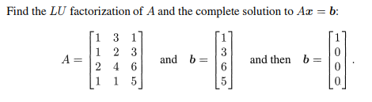
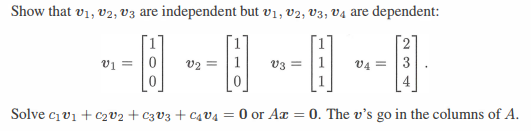
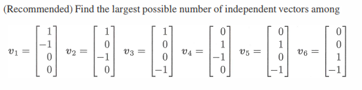
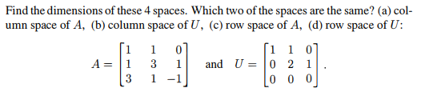
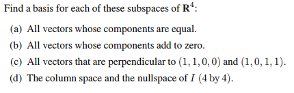
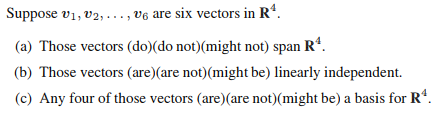
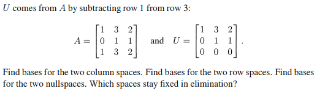
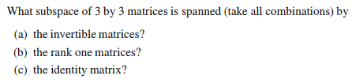

# 3.4 小節

## Problem 1

### 圖片

### 解題

### 題目復述

給定矩陣 $A = \begin{bmatrix} 1 & 3 & 1 \\ 1 & 2 & 3 \\ 2 & 4 & 6 \\ 1 & 1 & 5 \end{bmatrix}$，請完成以下要求：
1. 求矩陣 $A$ 的 $LU$ 分解。
2. 分別求線性方程組 $Ax = b$ 的完整解，其中 $b$ 分別為：
   - $\mathbf{b}_1 = \begin{bmatrix} 1 \\ 3 \\ 6 \\ 5 \end{bmatrix}$
   - $\mathbf{b}_2 = \begin{bmatrix} 1 \\ 0 \\ 0 \\ 0 \end{bmatrix}$

---

### 解題過程

##### 1. 求 $LU$ 分解
我們使用高斯消去法將 $A$ 轉化為上三角矩陣 $U$，並記錄消去過程中的倍數以構成下三角矩陣 $L$。

**步驟 1：消去第一列下方元素**
- $R_2 \to R_2 - 1 \cdot R_1$ （倍數 $l_{21} = 1$）
- $R_3 \to R_3 - 2 \cdot R_1$ （倍數 $l_{31} = 2$）
- $R_4 \to R_4 - 1 \cdot R_1$ （倍數 $l_{41} = 1$）
得到矩陣：$\begin{bmatrix} 1 & 3 & 1 \\ 0 & -1 & 2 \\ 0 & -2 & 4 \\ 0 & -2 & 4 \end{bmatrix}$

**步驟 2：消去第二列下方元素**
- $R_3 \to R_3 - 2 \cdot R_2$ （倍數 $l_{32} = 2$）
- $R_4 \to R_4 - 2 \cdot R_2$ （倍數 $l_{42} = 2$）
得到上三角矩陣 $U = \begin{bmatrix} 1 & 3 & 1 \\ 0 & -1 & 2 \\ 0 & 0 & 0 \\ 0 & 0 & 0 \end{bmatrix}$

**步驟 3：構造下三角矩陣 $L$**
將上述倍數填入單位矩陣的對應位置：
$L = \begin{bmatrix} 1 & 0 & 0 & 0 \\ 1 & 1 & 0 & 0 \\ 2 & 2 & 1 & 0 \\ 1 & 2 & 0 & 1 \end{bmatrix}$

因此，$A$ 的 $LU$ 分解為：
$A = LU = \begin{bmatrix} 1 & 0 & 0 & 0 \\ 1 & 1 & 0 & 0 \\ 2 & 2 & 1 & 0 \\ 1 & 2 & 0 & 1 \end{bmatrix} \begin{bmatrix} 1 & 3 & 1 \\ 0 & -1 & 2 \\ 0 & 0 & 0 \\ 0 & 0 & 0 \end{bmatrix}$

---

##### 2. 求解 $Ax = b$
利用 $LUx = b$，我們先解 $Ly = b$（前向代入），再解 $Ux = y$（後向代入）。

###### 當 $b = \begin{bmatrix} 1 \\ 3 \\ 6 \\ 5 \end{bmatrix}$ 時：
**解 $Ly = b$：**
- $y_1 = 1$
- $1(1) + y_2 = 3 \implies y_2 = 2$
- $2(1) + 2(2) + y_3 = 6 \implies y_3 = 0$
- $1(1) + 2(2) + 0(0) + y_4 = 5 \implies y_4 = 0$
得 $y = \begin{bmatrix} 1 \\ 2 \\ 0 \\ 0 \end{bmatrix}$

**解 $Ux = y$：**
$\begin{bmatrix} 1 & 3 & 1 \\ 0 & -1 & 2 \\ 0 & 0 & 0 \\ 0 & 0 & 0 \end{bmatrix} \begin{bmatrix} x_1 \\ x_2 \\ x_3 \end{bmatrix} = \begin{bmatrix} 1 \\ 2 \\ 0 \\ 0 \end{bmatrix}$
- 從第二列得：$-x_2 + 2x_3 = 2 \implies x_2 = 2x_3 - 2$
- 從第一列得：$x_1 + 3(2x_3 - 2) + x_3 = 1 \implies x_1 + 7x_3 - 6 = 1 \implies x_1 = 7 - 7x_3$
- 令 $x_3 = t$ 為自由變數，完整解為：
$x = \begin{bmatrix} 7 - 7t \\ -2 + 2t \\ t \end{bmatrix} = \begin{bmatrix} 7 \\ -2 \\ 0 \end{bmatrix} + t \begin{bmatrix} -7 \\ 2 \\ 1 \end{bmatrix}, \quad t \in \mathbb{R}$

###### 當 $b = \begin{bmatrix} 1 \\ 0 \\ 0 \\ 0 \end{bmatrix}$ 時：
**解 $Ly = b$：**
- $y_1 = 1$
- $1(1) + y_2 = 0 \implies y_2 = -1$
- $2(1) + 2(-1) + y_3 = 0 \implies y_3 = 0$
- $1(1) + 2(-1) + 0(0) + y_4 = 0 \implies y_4 = 1$
得 $y = \begin{bmatrix} 1 \\ -1 \\ 0 \\ 1 \end{bmatrix}$

**解 $Ux = y$：**
$\begin{bmatrix} 1 & 3 & 1 \\ 0 & -1 & 2 \\ 0 & 0 & 0 \\ 0 & 0 & 0 \end{bmatrix} \begin{bmatrix} x_1 \\ x_2 \\ x_3 \end{bmatrix} = \begin{bmatrix} 1 \\ -1 \\ 0 \\ 1 \end{bmatrix}$
觀察最後一列：$0x_1 + 0x_2 + 0x_3 = 1$，這是一個矛盾式 ($0 = 1$)。
因此，當 $b = \begin{bmatrix} 1 \\ 0 \\ 0 \\ 0 \end{bmatrix}$ 時，方程組**無解**。

---

### 用到的觀念

1. **$LU$ 分解 (LU Decomposition)**：將矩陣分解為一個下三角矩陣 $L$ 和一個上三角（或梯形）矩陣 $U$。這能將複雜的矩陣求逆或求解過程簡化為兩次簡單的三角矩陣求解。
2. **前向代入法 (Forward Substitution)**：用於求解 $Ly = b$。由於 $L$ 是下三角矩陣，可由上而下依次求出變數值。
3. **後向代入法 (Backward Substitution)**：用於求解 $Ux = y$。由於 $U$ 是上三角矩陣，可由下而上依次求出變數值。
4. **線性方程組的一致性 (Consistency)**：若在增廣矩陣的化簡過程中出現 $0 = \text{非零常數}$ 的情況，則該方程組是不一致的，即無解。
5. **自由變數 (Free Variable)**：當矩陣 $U$ 的主元數量少於未知數數量且方程組一致時，剩餘的變數可設為參數 $t$，形成無限多組解。

---

## Problem 2

### 圖片

### 解題

### 題目復述

證明向量 $v_1, v_2, v_3$ 是線性獨立的，但 $v_1, v_2, v_3, v_4$ 是線性相依的，其中給定向量如下：
$v_1 = \begin{bmatrix} 1 \\ 0 \\ 0 \end{bmatrix}, v_2 = \begin{bmatrix} 1 \\ 1 \\ 0 \end{bmatrix}, v_3 = \begin{bmatrix} 1 \\ 1 \\ 1 \end{bmatrix}, v_4 = \begin{bmatrix} 2 \\ 3 \\ 4 \end{bmatrix}$

提示：求解 $c_1v_1 + c_2v_2 + c_3v_3 + c_4v_4 = \mathbf{0}$ 或 $Ax = \mathbf{0}$，其中 $v$ 向量為矩陣 $A$ 的列向量（columns）。

### 解題過程

##### 1. 證明 $v_1, v_2, v_3$ 線性獨立
我們將 $v_1, v_2, v_3$ 組成一個 $3 \times 3$ 的矩陣 $A'$：
$A' = [v_1, v_2, v_3] = \begin{bmatrix} 1 & 1 & 1 \\ 0 & 1 & 1 \\ 0 & 0 & 1 \end{bmatrix}$

由於該矩陣是一個上三角矩陣，其行列式 $\det(A')$ 等於主對角線元素的乘積：
$\det(A') = 1 \times 1 \times 1 = 1$

因為 $\det(A') \neq 0$，根據線性代數定理，矩陣的列向量必定線性獨立。因此，$v_1, v_2, v_3$ 是線性獨立的。

---

##### 2. 證明 $v_1, v_2, v_3, v_4$ 線性相依
**方法一（理論推導）：**
向量 $v_1, v_2, v_3, v_4$ 均屬於 $\mathbb{R}^3$ 空間。在 $n$ 維空間中，任何超過 $n$ 個向量的集合必然是線性相依的。由於這裡有 4 個向量在 3 維空間中，因此它們必定線性相依。

**方法二（代數求解）：**
我們求解方程式 $c_1v_1 + c_2v_2 + c_3v_3 + c_4v_4 = \mathbf{0}$，對應的增廣矩陣（ augmented matrix）為：
$\begin{bmatrix} 1 & 1 & 1 & 2 & | & 0 \\ 0 & 1 & 1 & 3 & | & 0 \\ 0 & 0 & 1 & 4 & | & 0 \end{bmatrix}$

使用回代法（Back-substitution）：
1. 由第三列得：$c_3 + 4c_4 = 0 \implies c_3 = -4c_4$
2. 將 $c_3$ 代入第二列：$c_2 + (-4c_4) + 3c_4 = 0 \implies c_2 - c_4 = 0 \implies c_2 = c_4$
3. 將 $c_2, c_3$ 代入第一列：$c_1 + c_4 - 4c_4 + 2c_4 = 0 \implies c_1 - c_4 = 0 \implies c_1 = c_4$

令 $c_4 = 1$（非零解），則可得一組解：$c_1 = 1, c_2 = 1, c_3 = -4, c_4 = 1$。
驗算：$1v_1 + 1v_2 - 4v_3 + 1v_4 = \begin{bmatrix} 1 \\ 0 \\ 0 \end{bmatrix} + \begin{bmatrix} 1 \\ 1 \\ 0 \end{bmatrix} - \begin{bmatrix} 4 \\ 4 \\ 4 \end{bmatrix} + \begin{bmatrix} 2 \\ 3 \\ 4 \end{bmatrix} = \begin{bmatrix} 0 \\ 0 \\ 0 \end{bmatrix}$

由於存在非平凡解（non-trivial solution），故 $v_1, v_2, v_3, v_4$ 是線性相依的。

### 用到的觀念

1. **線性獨立 (Linear Independence)**：若一組向量的線性組合 $\sum c_i v_i = \mathbf{0}$ 只有平凡解（即所有 $c_i = 0$），則稱該組向量線性獨立。
2. **線性相依 (Linear Dependence)**：若存在不全為零的係數 $c_i$ 使得 $\sum c_i v_i = \mathbf{0}$，則稱該組向量線性相依。
3. **行列式與獨立性 (Determinant and Independence)**：對於方陣而言，若其行列式不為零，則其列向量集為線性獨立。
4. **空間維度 (Dimension)**：在 $n$ 維向量空間 $\mathbb{R}^n$ 中，任何包含超過 $n$ 個向量的集合一定線性相依。

---

## Problem 13

### 圖片

### 解題

### 題目復述
請找出以下六個向量中，最多可能有多少個線性獨立的向量：
$v_1 = \begin{bmatrix} 1 \\ -1 \\ 0 \\ 0 \end{bmatrix}, v_2 = \begin{bmatrix} 1 \\ 0 \\ -1 \\ 0 \end{bmatrix}, v_3 = \begin{bmatrix} 1 \\ 0 \\ 0 \\ -1 \end{bmatrix}, v_4 = \begin{bmatrix} 0 \\ 1 \\ -1 \\ 0 \end{bmatrix}, v_5 = \begin{bmatrix} 0 \\ 1 \\ 0 \\ -1 \end{bmatrix}, v_6 = \begin{bmatrix} 0 \\ 0 \\ 1 \\ -1 \end{bmatrix}$

### 解題過程
要找出這組向量中最多有多少個線性獨立的向量，等同於求這六個向量所構成之矩陣的**秩 (Rank)**。我們將這些向量作為列向量組成一個矩陣 $A$，並透過基底轉換（高斯消去法）將其化為列階梯形矩陣 (Row Echelon Form)：

$$A = \begin{bmatrix} 1 & 1 & 1 & 0 & 0 & 0 \\ -1 & 0 & 0 & 1 & 1 & 0 \\ 0 & -1 & 0 & -1 & 0 & 1 \\ 0 & 0 & -1 & 0 & -1 & -1 \end{bmatrix}$$

執行列運算：
1. 第二列加上第一列 ($R_2 \leftarrow R_2 + R_1$)：
$$\begin{bmatrix} 1 & 1 & 1 & 0 & 0 & 0 \\ 0 & 1 & 1 & 1 & 1 & 0 \\ 0 & -1 & 0 & -1 & 0 & 1 \\ 0 & 0 & -1 & 0 & -1 & -1 \end{bmatrix}$$

2. 第三列加上第二列 ($R_3 \leftarrow R_3 + R_2$)：
$$\begin{bmatrix} 1 & 1 & 1 & 0 & 0 & 0 \\ 0 & 1 & 1 & 1 & 1 & 0 \\ 0 & 0 & 1 & 0 & 1 & 1 \\ 0 & 0 & -1 & 0 & -1 & -1 \end{bmatrix}$$

3. 第四列加上第三列 ($R_4 \leftarrow R_4 + R_3$)：
$$\begin{bmatrix} 1 & 1 & 1 & 0 & 0 & 0 \\ 0 & 1 & 1 & 1 & 1 & 0 \\ 0 & 0 & 1 & 0 & 1 & 1 \\ 0 & 0 & 0 & 0 & 0 & 0 \end{bmatrix}$$

經過簡化後，矩陣中共有 3 個非零列（主元-pivot 數量為 3），因此該矩陣的秩 $\text{rank}(A) = 3$。

此外，觀察向量關係可發現：
$v_4 = v_2 - v_1$
$v_5 = v_3 - v_1$
$v_6 = v_3 - v_2$
這顯示 $v_4, v_5, v_6$ 均可由 $v_1, v_2, v_3$ 線性組合而成，而 $v_1, v_2, v_3$ 彼此線性獨立。

**最終答案：** 最多可能有 **3** 個線性獨立的向量。

### 用到的觀念
1. **線性獨立 (Linear Independence)**：若一組向量中沒有任何一個向量可以表示為其他向量的線性組合，則稱這組向量線性獨立。
2. **矩陣的秩 (Rank of a Matrix)**：矩陣的秩是指該矩陣中線性獨立的行（或列）的最大數量。
3. **高斯消去法 (Gaussian Elimination)**：透過基本的列運算將矩陣化為列階梯形，用以確定矩陣的秩以及向量的線性相依關係。
4. **基底與維度 (Basis and Dimension)**：由線性獨立向量所張成的空間之維度即為其獨立向量的數量。

---

## Problem 16

### 圖片

### 解題

### 題目復述
給定矩陣 $A = \begin{bmatrix} 1 & 1 & 0 \\ 1 & 3 & 1 \\ 3 & 1 & -1 \end{bmatrix}$ 與 $U = \begin{bmatrix} 1 & 1 & 0 \\ 0 & 2 & 1 \\ 0 & 0 & 0 \end{bmatrix}$。
請找出下列四個子空間的維度 (dimension)，並說明其中哪兩個空間是相同的：
(a) $A$ 的列空間 (column space)
(b) $U$ 的列空間 (column space)
(c) $A$ 的行空間 (row space)
(d) $U$ 的行空間 (row space)

### 解題過程
1. **分析矩陣 $U$ 的維度：**
   觀察矩陣 $U$，它已經處於行階梯形 (Row Echelon Form, REF)。
   - $U$ 具有 2 個非零行，因此其行空間的維度 $\dim(\text{Row}(U)) = 2$。
   - $U$ 具有 2 個主元列 (pivot columns)，因此其列空間的維度 $\dim(\text{Col}(U)) = 2$。

2. **分析矩陣 $A$ 與 $U$ 的關係：**
   我們對矩陣 $A$ 進行基本行運算 (Elementary Row Operations) 以將其化為行階梯形：
   - 第一步：$R_2 \to R_2 - R_1$ 且 $R_3 \to R_3 - 3R_1$
     $\begin{bmatrix} 1 & 1 & 0 \\ 0 & 2 & 1 \\ 0 & -2 & -1 \end{bmatrix}$
   - 第二步：$R_3 \to R_3 + R_2$
     $\begin{bmatrix} 1 & 1 & 0 \\ 0 & 2 & 1 \\ 0 & 0 & 0 \end{bmatrix} = U$
   由此可知，$U$ 正是 $A$ 的行階梯形。兩者的秩 (rank) 相同，皆為 2。
   因此：
   - $\dim(\text{Col}(A)) = \text{rank}(A) = 2$
   - $\dim(\text{Row}(A)) = \text{rank}(A) = 2$

3. **維度總結：**
   (a) $\dim(\text{Col}(A)) = 2$
   (b) $\dim(\text{Col}(U)) = 2$
   (c) $\dim(\text{Row}(A)) = 2$
   (d) $\dim(\text{Row}(U)) = 2$

4. **判定相同的空間：**
   - **行空間 (Row Space)：** 根據線性代數定理，基本行運算不會改變矩陣的行空間。既然 $U$ 是由 $A$ 經過行運算得到的，則 $\text{Row}(A) = \text{Row}(U)$。
   - **列空間 (Column Space)：** 基本行運算會改變列空間。觀察 $U$ 可知，其所有列向量的第三個分量皆為 0，這意味著 $U$ 的列空間位於 $xy$ 平面上。然而 $A$ 的列向量（如 $\begin{bmatrix} 1 & 1 & 3 \end{bmatrix}^T$）第三個分量不為 0，因此 $\text{Col}(A) \neq \text{Col}(U)$。

**最終答案：**
這四個空間的維度皆為 **2**。
相同的兩個空間是 **(c) $A$ 的行空間** 與 **(d) $U$ 的行空間**。

### 用到的觀念
1. **行空間 (Row Space)：** 矩陣所有行向量所生成的線性組合空間。基本行運算（如兩行互換、某行乘以非零常數、某行加上另一行的倍數）不會改變行空間。
2. **列空間 (Column Space)：** 矩陣所有列向量所生成的線性組合空間。基本行運算會改變列空間，但不會改變列向量之間的線性相關性。
3. **秩 (Rank)：** 一個矩陣的秩等於其行空間的維度，且必然等於其列空間的維度 ($\text{rank}(A) = \dim(\text{Row}(A)) = \dim(\text{Col}(A))$)。
4. **行階梯形 (Row Echelon Form, REF)：** 透過高斯消去法將矩陣化簡為此形式，可方便地判定矩陣的秩以及尋找基底。
5. **維度 (Dimension)：** 指一個向量空間中，其基底 (basis) 所包含的向量個數。

---

## Problem 18

### 圖片

### 解題

### 題目復述
找出 $\mathbb{R}^4$ 中以下子空間的基底 (basis)：
(a) 所有分量均相等的向量。
(b) 所有分量之和為零的向量。
(c) 所有與 $(1, 1, 0, 0)$ 及 $(1, 0, 1, 1)$ 垂直的向量。
(d) $4 \times 4$ 單位矩陣 $I$ 的行空間 (column space) 與零空間 (nullspace)。

### 解題過程
**(a)** 設向量 $\mathbf{v} = (x_1, x_2, x_3, x_4) \in \mathbb{R}^4$。
根據條件，所有分量均相等，即 $x_1 = x_2 = x_3 = x_4 = c$ (其中 $c$ 為任意實數)。
因此 $\mathbf{v} = (c, c, c, c) = c(1, 1, 1, 1)$。
該子空間由單個非零向量 $(1, 1, 1, 1)$ 生成，且單個非零向量必然線性獨立。
**答案：基底為 $\{(1, 1, 1, 1)\}$**。

**(b)** 設向量 $\mathbf{v} = (x_1, x_2, x_3, x_4) \in \mathbb{R}^4$。
條件為 $x_1 + x_2 + x_3 + x_4 = 0$，可將 $x_1$ 表示為其他分量的函數：$x_1 = -x_2 - x_3 - x_4$。
將其寫成參數形式：
$\begin{pmatrix} x_1 \\ x_2 \\ x_3 \\ x_4 \end{pmatrix} = \begin{pmatrix} -x_2 - x_3 - x_4 \\ x_2 \\ x_3 \\ x_4 \end{pmatrix} = x_2 \begin{pmatrix} -1 \\ 1 \\ 0 \\ 0 \end{pmatrix} + x_3 \begin{pmatrix} -1 \\ 0 \\ 1 \\ 0 \end{pmatrix} + x_4 \begin{pmatrix} -1 \\ 0 \\ 0 \\ 1 \end{pmatrix}$。
這三個向量線性獨立且能生成該空間。
**答案：基底為 $\{(-1, 1, 0, 0), (-1, 0, 1, 0), (-1, 0, 0, 1)\}$**。

**(c)** 設向量 $\mathbf{v} = (x_1, x_2, x_3, x_4) \in \mathbb{R}^4$。
向量垂直意味著其內積為零，可列出方程組：
1) $(x_1, x_2, x_3, x_4) \cdot (1, 1, 0, 0) = 0 \implies x_1 + x_2 = 0 \implies x_2 = -x_1$
2) $(x_1, x_2, x_3, x_4) \cdot (1, 0, 1, 1) = 0 \implies x_1 + x_3 + x_4 = 0 \implies x_1 = -x_3 - x_4$
代入得 $x_2 = -(-x_3 - x_4) = x_3 + x_4$。
將 $\mathbf{v}$ 表示為自由變數 $x_3, x_4$ 的線性組合：
$\mathbf{v} = (-x_3 - x_4, x_3 + x_4, x_3, x_4) = x_3(-1, 1, 1, 0) + x_4(-1, 1, 0, 1)$。
這兩個向量線性獨立且生成該空間。
**答案：基底為 $\{(-1, 1, 1, 0), (-1, 1, 0, 1)\}$**。

**(d)** 給定 $4 \times 4$ 單位矩陣 $I$。
- **行空間 (Column Space)**：$I$ 的行向量即為標準基底 $\mathbf{e}_1, \mathbf{e}_2, \mathbf{e}_3, \mathbf{e}_4$，它們彼此線性獨立且生成整個 $\mathbb{R}^4$。
**答案：行空間基底為 $\{(1, 0, 0, 0), (0, 1, 0, 0), (0, 0, 1, 0), (0, 0, 0, 1)\}$**。
- **零空間 (Nullspace)**：滿足 $I\mathbf{x} = \mathbf{0}$ 的所有向量 $\mathbf{x}$。由於 $I$ 是可逆矩陣，唯一解為 $\mathbf{x} = \mathbf{0}$。
零空間僅包含零向量 $\{\mathbf{0}\}$，其維度為 0。
**答案：零空間基底為 $\emptyset$ (空集)**。

### 用到的觀念
1. **基底 (Basis)**：一個向量空間的基底是一組線性獨立且能生成（span）該空間的所有向量。
2. **線性獨立 (Linear Independence)**：一組向量中，沒有任何一個向量可以表示為其他向量的線性組合。
3. **內積與正交 (Inner Product & Orthogonality)**：兩個向量垂直（正交）若且唯若它們的內積為零。
4. **行空間 (Column Space)**：矩陣所有行向量所生成的子空間。
5. **零空間 (Nullspace)**：所有滿足齊次線性方程組 $A\mathbf{x} = \mathbf{0}$ 的解向量 $\mathbf{x}$ 所構成的子空間。

---

## Problem 23

### 圖片

### 解題

### 題目復述
假設 $v_1, v_2, \dots, v_6$ 是 $\mathbb{R}^4$ 空間中的六個向量。
(a) 這些向量 (會) (不會) (可能不會) 生成 (span) $\mathbb{R}^4$。
(b) 這些向量 (是) (不是) (可能是) 線性獨立的 (linearly independent)。
(c) 其中任意四個向量 (是) (不是) (可能是) $\mathbb{R}^4$ 的一組基底 (basis)。

### 解題過程
(a) 在 $\mathbb{R}^4$ 空間中，要生成整個空間至少需要 4 個線性獨立的向量。雖然目前有 6 個向量，數量上足以生成 $\mathbb{R}^4$，但題目並未說明這些向量是否線性獨立。如果這 6 個向量全部共線或全部為零向量，則無法生成 $\mathbb{R}^4$。因此，這些向量**可能不會**生成 $\mathbb{R}^4$。

(b) 根據線性代數的定理，在 $n$ 維向量空間 $\mathbb{R}^n$ 中，任何包含超過 $n$ 個向量的集合必定是線性相依的 (linearly dependent)。本題中向量個數 $6 > 4$，因此這六個向量必然線性相依，即他們**不是**線性獨立的。

(c) 一組 $\mathbb{R}^4$ 的基底必須滿足兩個條件：包含恰好 4 個向量，且這 4 個向量必須線性獨立。雖然從 6 個向量中隨機挑選 4 個有可能組成基底（若原集合中包含 4 個線性獨立向量），但並非所有可能的組合都能組成基底（例如若挑選到了線性相依的向量）。因此，任意四個向量**可能是** $\mathbb{R}^4$ 的基底。

**最終答案：**
(a) 可能不會 (might not)
(b) 不是 (are not)
(c) 可能是 (might be)

### 用到的觀念
1. **生成 (Span)**：一個向量集合的生成空間是由該集合中所有向量的線性組合所構成的空間。要生成 $n$ 維空間，至少需要 $n$ 個向量且其中必須有 $n$ 個線性獨立。
2. **線性獨立 (Linear Independence)**：若一組向量中沒有任何一個向量可以用其他向量的線性組合表示，則稱該組向量線性獨立。
3. **維數與線性相依性**：在 $n$ 維空間中，任何個數超過 $n$ 個的向量集合必定線性相依。
4. **基底 (Basis)**：基底是指一組既能生成該空間且又是線性獨立的向量集合。對於 $\mathbb{R}^n$ 而言，任何包含恰好 $n$ 個線性獨立向量的集合即為其基底。

---

## Problem 29

### 圖片

### 解題

### 題目復述

矩陣 $U$ 是透過將矩陣 $A$ 的第一行（row 1）減去第三行（row 3）而得到的：
$A = \begin{bmatrix} 1 & 3 & 2 \\ 0 & 1 & 1 \\ 1 & 3 & 2 \end{bmatrix}$ 且 $U = \begin{bmatrix} 1 & 3 & 2 \\ 0 & 1 & 1 \\ 0 & 0 & 0 \end{bmatrix}$。

請完成以下要求：
1. 找出這兩個矩陣的列空間（column spaces）的基底。
2. 找出這兩個矩陣的行空間（row spaces）的基底。
3. 找出這兩個矩陣的零空間（nullspaces）的基底。
4. 判斷在消去法（elimination）過程中，哪些空間保持不變（stay fixed）？

---

### 解題過程

##### 1. 尋找列空間 (Column Spaces) 的基底

*   **對於 $U$**：
    $U$ 已經處於階梯形（echelon form），其主軸（pivot）位於第 1 欄與第 2 欄。因此，列空間 $C(U)$ 的基底為 $U$ 的前兩欄：
    $$\text{基底 for } C(U) = \left\{ \begin{bmatrix} 1 \\ 0 \\ 0 \end{bmatrix}, \begin{bmatrix} 3 \\ 1 \\ 0 \end{bmatrix} \right\}$$

*   **對於 $A$**：
    列空間的基底應取自**原矩陣 $A$** 中對應於 $U$ 之主軸位置的欄位（即第 1 欄與第 2 欄）：
    $$\text{基底 for } C(A) = \left\{ \begin{bmatrix} 1 \\ 0 \\ 1 \end{bmatrix}, \begin{bmatrix} 3 \\ 1 \\ 3 \end{bmatrix} \right\}$$

##### 2. 尋找行空間 (Row Spaces) 的基底

行運算（row operations）不會改變矩陣的行空間。因此 $C(A^T) = C(U^T)$。
我們可以直接使用 $U$ 中非零的行（rows）作為基底：
$$\text{基底 for } C(A^T) = \text{基底 for } C(U^T) = \left\{ \begin{bmatrix} 1 \\ 3 \\ 2 \end{bmatrix}, \begin{bmatrix} 0 \\ 1 \\ 1 \end{bmatrix} \right\}$$
(註：這裡將行向量寫成列向量形式表示基底)

##### 3. 尋找零空間 (Nullspaces) 的基底

由於 $U$ 是由 $A$ 經過行運算得到，兩者的零空間相同，$N(A) = N(U)$。
我們求解 $Ux = 0$：
$\begin{bmatrix} 1 & 3 & 2 \\ 0 & 1 & 1 \\ 0 & 0 & 0 \end{bmatrix} \begin{bmatrix} x_1 \\ x_2 \\ x_3 \end{bmatrix} = \begin{bmatrix} 0 \\ 0 \\ 0 \end{bmatrix}$

由第二行得：$x_2 + x_3 = 0 \implies x_2 = -x_3$
代入第一行：$x_1 + 3(-x_3) + 2x_3 = 0 \implies x_1 - x_3 = 0 \implies x_1 = x_3$
令自由變數 $x_3 = 1$，則 $x = \begin{bmatrix} 1 \\ -1 \\ 1 \end{bmatrix}$。
$$\text{基底 for } N(A) = \text{基底 for } N(U) = \left\{ \begin{bmatrix} 1 \\ -1 \\ 1 \end{bmatrix} \right\}$$

##### 4. 結論：哪些空間保持不變？

比較上述結果：
*   **列空間**：$C(A) \neq C(U)$ $\rightarrow$ **改變**
*   **行空間**：$C(A^T) = C(U^T)$ $\rightarrow$ **不變 (Fixed)**
*   **零空間**：$N(A) = N(U)$ $\rightarrow$ **不變 (Fixed)**

**最終答案：行空間 (Row space) 與 零空間 (Nullspace) 在消去法過程中保持不變。**

---

### 用到的觀念

1.  **列空間 (Column Space, $C(A)$)**：由矩陣所有欄向量所生成的線性組合空間。在消去法中，主軸位置決定了基底，但基底必須取自**原矩陣**。
2.  **行空間 (Row Space, $C(A^T)$)**：由矩陣所有行向量所生成的線性組合空間。**行運算不會改變行空間**，因此 $A$ 與其階梯形矩陣 $U$ 具有相同的行空間。
3.  **零空間 (Nullspace, $N(A)$)**：滿足 $Ax = 0$ 的所有向量 $x$ 組成的集合。因為行運算不改變方程式的解，所以 $A$ 與 $U$ 具有相同的零空間。
4.  **主軸 (Pivot)**：在矩陣消去法中，每一行第一個非零元素稱為主軸，它決定了矩陣的秩 (Rank) 以及列空間的基底位置。

---

## Problem 38

### 圖片

### 解題

### 題目復述
哪些 $3 \times 3$ 矩陣的子空間是由以下矩陣集所生成的（考慮所有線性組合）：
(a) 可逆矩陣 (Invertible matrices)？
(b) 秩為 1 的矩陣 (Rank one matrices)？
(c) 單位矩陣 (Identity matrix)？

### 解題過程
令 $V = M_{3 \times 3}(\mathbb{R})$ 為所有 $3 \times 3$ 實矩陣構成的向量空間，其維度為 $3^2 = 9$。

**(a) 可逆矩陣**
對於任何 $3 \times 3$ 矩陣 $A \in V$，我們可以將其表示為兩個矩陣之和：
$A = (A - \lambda I) + \lambda I$
由於矩陣 $A$ 只有有限個特徵值，我們一定可以找到一個純量 $\lambda \neq 0$，使得 $\lambda$ 不是 $-A$ 的特徵值。這樣一來，$\det(A - \lambda I) \neq 0$，意味著 $(A - \lambda I)$ 是可逆的；同時，由於 $\lambda \neq 0$，$\lambda I$ 也是可逆的。
因為任何矩陣 $A$ 都能表示為兩個可逆矩陣的線性組合（相加），所以可逆矩陣所生成的子空間是整個矩陣空間 $M_{3 \times 3}$。

**(b) 秩為 1 的矩陣**
考慮 $M_{3 \times 3}$ 的標準基底 $\{E_{ij} \mid 1 \le i, j \le 3\}$，其中 $E_{ij}$ 是在第 $i$ 列第 $j$ 行為 1，其餘位置皆為 0 的矩陣。
顯然，每個 $E_{ij}$ 的秩都恰好為 1。由於這 9 個秩為 1 的矩陣已經足以生成整個 $M_{3 \times 3}$ 空間，因此所有秩為 1 的矩陣所生成的子空間必然是整個矩陣空間 $M_{3 \times 3}$。

**(c) 單位矩陣**
這裡的生成集僅包含單一矩陣 $\{I\}$。
根據生成空間的定義，單個非零向量所生成的子空間即為該向量的所有純量倍數。
因此，生成的子空間為 $\{ cI \mid c \in \mathbb{R} \}$。這是一個一維子空間，包含所有純量矩陣（Scalar matrices）。

### 用到的觀念
*   **生成空間 (Span)**：一組向量的所有線性組合（Linear Combinations）所構成的集合。
*   **矩陣空間 $M_{n \times n}$**：所有 $n \times n$ 矩陣構成的向量空間，其維度為 $n^2$。
*   **可逆矩陣 (Invertible Matrix)**：行列式 $\det(A) \neq 0$ 的方陣，且存在逆矩陣 $A^{-1}$。
*   **秩 (Rank)**：矩陣中線性獨立的行或列的最大數量。秩為 1 的矩陣可以表示為兩個非零向量的外積 $uv^T$。
*   **單位矩陣 (Identity Matrix)**：主對角線元素全為 1，其餘元素全為 0 的方陣。

---
