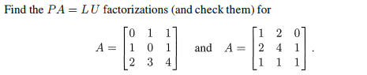

# 線性代數解題總整理（超大版）

此檔依你指定的章節與題號順序整理。每題排版為：圖片 -> 解題。

# 3.1 小節

## Problem 5

### 圖片

### 解題

### 題目復述
給定兩個矩陣 $A$ 與 $U$：
$$A = \begin{bmatrix} 1 & 1 & 0 \\ 1 & 3 & 1 \\ 3 & 1 & -1 \end{bmatrix}, \quad U = \begin{bmatrix} 1 & 1 & 0 \\ 0 & 2 & 1 \\ 0 & 0 & 0 \end{bmatrix}$$
請找出以下四個空間的維度 (dimension)，並指出其中哪兩個空間是相同的：
(a) $A$ 的列空間 (column space of $A$)
(b) $U$ 的列空間 (column space of $U$)
(c) $A$ 的行空間 (row space of $A$)
(d) $U$ 的行空間 (row space of $U$)

### 解題過程
**1. 求矩陣 $A$ 的階梯形矩陣 (Echelon Form)：**
對 $A$ 進行基於列 (row) 的初等運算：
- 第二列減去第一列 ($R_2 \to R_2 - R_1$)：$\begin{bmatrix} 1 & 1 & 0 \\ 0 & 2 & 1 \\ 3 & 1 & -1 \end{bmatrix}$
- 第三列減去三倍的第一列 ($R_3 \to R_3 - 3R_1$)：$\begin{bmatrix} 1 & 1 & 0 \\ 0 & 2 & 1 \\ 0 & -2 & -1 \end{bmatrix}$
- 第三列加上第二列 ($R_3 \to R_3 + R_2$)：$\begin{bmatrix} 1 & 1 & 0 \\ 0 & 2 & 1 \\ 0 & 0 & 0 \end{bmatrix}$
可以看到，$A$ 經過列運算後得到的階梯形矩陣正好就是 $U$。

**2. 計算維度 (Dimension)：**
矩陣的秩 (Rank) 定義為其主軸 (pivot) 的數量。由 $U$ 可見，主軸數量為 2 個（分別在第一列第一行與第二列第二行）。
- (a) $A$ 的列空間維度 = $\text{rank}(A) = 2$。
- (b) $U$ 的列空間維度 = $\text{rank}(U) = 2$。
- (c) $A$ 的行空間維度 = $\text{rank}(A) = 2$。
- (d) $U$ 的行空間維度 = $\text{rank}(U) = 2$。
因此，這四個空間的維度皆為 **2**。

**3. 判斷哪些空間相同：**
- **列空間 (Column Space)：** 列運算會改變矩陣的列空間。$A$ 的列空間是由 $A$ 的原列向量生成，而 $U$ 的列空間是由 $U$ 的列向量生成，兩者並不相同。
- **行空間 (Row Space)：** 基於列的初等運算（Elementary row operations）**不會改變**矩陣的行空間。由於 $U$ 是由 $A$ 透過列運算得來，因此 $A$ 的行空間與 $U$ 的行空間完全相同。

**最終答案：**
四個空間的維度均為 2；相同的兩個空間是 **(c) $A$ 的行空間** 與 **(d) $U$ 的行空間**。

### 用到的觀念
- **列空間 (Column Space)：** 矩陣所有列向量的線性組合所構成的空間，其維度等於矩陣的秩 $\text{rank}(A)$。
- **行空間 (Row Space)：** 矩陣所有行向量的線性組合所構成的空間，其維度同樣等於矩陣的秩。
- **秩 (Rank)：** 矩陣中線性獨立的行 (或列) 的最大數量，在階梯形矩陣中等於主軸 (pivot) 的數量。
- **列運算的性質：** 基礎列運算會改變列空間，但會保持行空間不變。

---

## Problem 9

### 圖片

### 解題

### 題目復述
假設 $M$ 為 $2 \times 2$ 矩陣空間。
(a) 描述一個包含矩陣 $A = \begin{bmatrix} 1 & 0 \\ 0 & 0 \end{bmatrix}$ 但不包含矩陣 $B = \begin{bmatrix} 0 & 0 \\ 0 & -1 \end{bmatrix}$ 的子空間。
(b) 如果 $M$ 的一個子空間包含 $A$ 和 $B$，則它是否一定包含單位矩陣 $I$？
(c) 描述一個不包含任何非零對角矩陣的 $M$ 之子空間。

### 解題過程
**(a)**
我們需要尋找一個子空間 $V \subseteq M$，滿足 $A \in V$ 且 $B \notin V$。
最簡單的方法是取由 $A$ 生成的張成空間（Span）：
$$V = \text{span}\{A\} = \{ c \begin{bmatrix} 1 & 0 \\ 0 & 0 \end{bmatrix} \mid c \in \mathbb{R} \} = \left\{ \begin{bmatrix} c & 0 \\ 0 & 0 \end{bmatrix} \mid c \in \mathbb{R} \right\}$$
在這個空間中，所有矩陣的第 $(2,2)$ 個元素都必須為 $0$。而矩陣 $B = \begin{bmatrix} 0 & 0 \\ 0 & -1 \end{bmatrix}$ 的第 $(2,2)$ 個元素為 $-1 \neq 0$，因此 $B$ 不在 $V$ 中。
**答案：** 子空間可描述為所有形如 $\begin{bmatrix} c & 0 \\ 0 & 0 \end{bmatrix}$ 的矩陣集合。

**(b)**
根據子空間的定義，子空間對於向量加法和純量乘法具有封閉性。
已知 $A = \begin{bmatrix} 1 & 0 \\ 0 & 0 \end{bmatrix}$ 和 $B = \begin{bmatrix} 0 & 0 \\ 0 & -1 \end{bmatrix}$ 都在子空間 $V$ 中。
1. 由於 $V$ 對純量乘法封閉，將 $B$ 乘以純量 $-1$，則 $-1 \cdot B = \begin{bmatrix} 0 & 0 \\ 0 & 1 \end{bmatrix}$ 也在 $V$ 中。
2. 由於 $V$ 對加法封閉，則 $A + (-B) = \begin{bmatrix} 1 & 0 \\ 0 & 0 \end{bmatrix} + \begin{bmatrix} 0 & 0 \\ 0 & 1 \end{bmatrix} = \begin{bmatrix} 1 & 0 \\ 0 & 1 \end{bmatrix} = I$ 也在 $V$ 中。
**答案：** 是的，它一定包含 $I$。

**(c)**
對角矩陣的形式為 $\begin{bmatrix} d_1 & 0 \\ 0 & d_2 \end{bmatrix}$。我們要找一個子空間 $V$，使其內部唯一的對角矩陣是零矩陣 $\begin{bmatrix} 0 & 0 \\ 0 & 0 \end{bmatrix}$。
我們可以定義一個由非對角線元素組成的子空間：
$$V = \left\{ \begin{bmatrix} 0 & b \\ c & 0 \end{bmatrix} \mid b, c \in \mathbb{R} \right\}$$
對於 $V$ 中的任意矩陣 $\begin{bmatrix} 0 & b \\ c & 0 \end{bmatrix}$，若它要成為對角矩陣，則必須滿足非對角線元素 $b=0$ 且 $c=0$，這會導致該矩陣變為零矩陣。
因此，此子空間不包含任何非零的對角矩陣。
**答案：** 子空間可描述為所有對角線元素（主對角線）均為 $0$ 的矩陣集合。

### 用到的觀念
1. **子空間 (Subspace)**：一個向量空間的子集，若其本身在同樣的運算下也構成向量空間（即包含零向量，且對加法和純量乘法封閉），則稱為子空間。
2. **張成空間 (Span)**：一組向量的所有線性組合所構成的集合，是包含這些向量的最小子空間。
3. **封閉性 (Closure)**：子空間必須滿足：若 $\mathbf{u}, \mathbf{v} \in V$ 且 $k$ 為純量，則 $\mathbf{u} + \mathbf{v} \in V$ 且 $k\mathbf{u} \in V$。
4. **對角矩陣 (Diagonal Matrix)**：所有非對角線元素（即 $i \neq j$ 的元素 $a_{ij}$）均為零的方陣。

---

## Problem 14

### 圖片

### 解題

### 題目復述

證明在子空間的定義中，其中一個要求可以滿足而另一個則失敗。請透過尋找以下集合來證明：

(a) $\mathbb{R}^2$ 中的一個向量集合，使得對於其中任意向量 $x, y$，其和 $x + y$ 仍在此集合中，但 $\frac{1}{2}x$ 可能不在其中。
(b) $\mathbb{R}^2$ 中的一個向量集合（除兩個四分平面外），使得對於任意純量 $c$ 和向量 $x$，其乘積 $cx$ 仍在此集合中，但 $x + y$ 可能不在其中。

### 解題過程

**(a) 尋找滿足加法封閉性但不滿足純量乘法封閉性的集合**

我們需要一個集合，其元素相加後仍在此集合中，但乘以某個純量（如 $1/2$）後會跳出該集合。

*   **構造集合**：令 $S$ 為 $\mathbb{R}^2$ 中所有分量皆為整數的向量集合（即整數格點 $\mathbb{Z}^2$）：
    $$S = \{ (a, b) \mid a, b \in \mathbb{Z} \}$$
*   **驗證加法封閉性**：
    設 $x = (a, b)$ 且 $y = (c, d)$ 為 $S$ 中的任意兩個向量，則 $a, b, c, d$ 均為整數。
    其和為 $x + y = (a+c, b+d)$。
    由於整數對加法封閉，$a+c$ 與 $b+d$ 仍為整數，因此 $x + y \in S$。
*   **驗證純量乘法失效**：
    取 $x = (1, 0) \in S$。
    計算 $\frac{1}{2}x = \frac{1}{2}(1, 0) = (0.5, 0)$。
    因為 $0.5$ 不是整數，所以 $\frac{1}{2}x \notin S$。

**結論：** 集合 $S = \mathbb{Z}^2$ 符合條件 (a)。

---

**(b) 尋找滿足純量乘法封閉性但不滿足加法封閉性的集合**

我們需要一個集合，使得任何向量在該集合中時，其所在的整條通過原點的直線也在集合中，但兩個不同方向向量的和不在其中。

*   **構造集合**：令 $S$ 為 $\mathbb{R}^2$ 中的 $x$ 軸與 $y$ 軸的聯集：
    $$S = \{ (x, 0) \mid x \in \mathbb{R} \} \cup \{ (0, y) \mid y \in \mathbb{R} \}$$
*   **驗證純量乘法封閉性**：
    設 $v \in S$ 且 $c$ 為任意純量。
    - 若 $v$ 在 $x$ 軸上，則 $v = (x, 0)$，則 $cv = (cx, 0)$ 仍在 $x$ 軸上 $\in S$。
    - 若 $v$ 在 $y$ 軸上，則 $v = (0, y)$，則 $cv = (0, cy)$ 仍在 $y$ 軸上 $\in S$。
    因此，對於所有 $c \in \mathbb{R}$ 和 $x \in S$，$cx \in S$。
*   **驗證加法失效**：
    取 $x = (1, 0) \in S$（在 $x$ 軸上）且 $y = (0, 1) \in S$（在 $y$ 軸上）。
    其和為 $x + y = (1, 1)$。
    向量 $(1, 1)$ 既不在 $x$ 軸上也不在 $y$ 軸上，因此 $x + y \notin S$。

**結論：** 集合 $S$（$x$ 軸與 $y$ 軸的聯集）符合條件 (b)，且它不是四分平面。

### 用到的觀念

1.  **子空間 (Subspace)**：一個向量空間的子集，若它本身在相同的向量加法與純量乘法下也構成一個向量空間，則稱為子空間。
2.  **加法封閉性 (Additive Closure)**：指集合中任意兩個元素相加後，結果仍屬於該集合。
3.  **純量乘法封閉性 (Scalar Multiplication Closure)**：指集合中任意元素與任意純量相乘後，結果仍屬於該集合。
4.  **$\mathbb{R}^2$ 的幾何意義**：在二維歐幾里得空間中，純量乘法封閉的集合必然是由一條或多條通過原點的直線（或原點本身）所組成。

---

## Problem 17

### 圖片

### 解題

### 題目復述

$\mathbb{R}^3$ 的子空間為平面、直線、$\mathbb{R}^3$ 本身，或僅包含 $(0, 0, 0)$ 的零空間。
(a) 請描述 $\mathbb{R}^2$ 的三種子空間類型。
(b) 請描述 $\mathbf{D}$（$2 \times 2$ 對角矩陣空間）的所有子空間。

### 解題過程

**(a) 描述 $\mathbb{R}^2$ 的三種子空間類型：**
$\mathbb{R}^2$ 是一個二維向量空間。根據線性代數理論，子空間的維度必須小於或等於原空間的維度。因此，$\mathbb{R}^2$ 的子空間維度只能是 0, 1 或 2。
1. **維度為 0**：僅包含原點 $(0, 0)$ 的集合，即零子空間 (Zero subspace)。
2. **維度為 1**：通過原點 $(0, 0)$ 的所有直線。
3. **維度為 2**：整個 $\mathbb{R}^2$ 空間本身。

**(b) 描述 $2 \times 2$ 對角矩陣空間 $\mathbf{D}$ 的所有子空間：**
首先，分析 $\mathbf{D}$ 的結構。任何一個 $2 \times 2$ 的對角矩陣可以表示為：
$$\begin{pmatrix} a & 0 \\ 0 & d \end{pmatrix} = a \begin{pmatrix} 1 & 0 \\ 0 & 0 \end{pmatrix} + d \begin{pmatrix} 0 & 0 \\ 0 & 1 \end{pmatrix}$$
其中 $a, d \in \mathbb{R}$。這表明 $\mathbf{D}$ 的基底為 $\left\{ \begin{pmatrix} 1 & 0 \\ 0 & 0 \end{pmatrix}, \begin{pmatrix} 0 & 0 \\ 0 & 1 \end{pmatrix} \right\}$，因此 $\dim(\mathbf{D}) = 2$。

由於 $\mathbf{D}$ 的維度為 2，其子空間的類型與 $\mathbb{R}^2$ 完全相同（兩者同構）：
1. **維度為 0**：僅包含零矩陣 $\begin{pmatrix} 0 & 0 \\ 0 & 0 \end{pmatrix}$ 的子空間。
2. **維度為 1**：由單個非零對角矩陣生成的直線。形式為 $\{ c \mathbf{A} \mid c \in \mathbb{R} \}$，其中 $\mathbf{A}$ 是某個特定的非零對角矩陣。
3. **維度為 2**：整個 $2 \times 2$ 對角矩陣空間 $\mathbf{D}$ 本身。

### 用到的觀念

*   **子空間 (Subspace)**：一個向量空間的子集，如果它在加法和純量乘法下封閉，且包含零向量，則稱為子空間。
*   **維度 (Dimension)**：子空間基底中向量的數量。對於 $n$ 維空間 $\mathbb{R}^n$，其子空間的維度 $k$ 必須滿足 $0 \le k \le n$。
*   **同構 (Isomorphism)**：如果兩個向量空間具有相同的維度，它們在代數性質上是等價的。在本題中，$\mathbf{D}$ 與 $\mathbb{R}^2$ 都具有維度 2，因此其子空間結構相同。
*   **對角矩陣 (Diagonal Matrix)**：除主對角線以外的所有元素都為 0 的方陣。

---

## Problem 19

### 圖片

### 解題

### 題目復述
(a) 證明 $M$ 中可逆矩陣（invertible matrices）的集合不是一個子空間。
(b) 證明 $M$ 中奇異矩陣（singular matrices）的集合不是一個子空間。

### 解題過程

**(a) 證明可逆矩陣的集合不是子空間**

要證明一個集合是向量空間的子空間，它必須滿足三個條件：包含零向量、對加法封閉、對純量乘法封閉。只要其中一個條件不成立，該集合就不是子空間。

1. **檢查零向量**：在矩陣空間 $M$ 中，零向量即為零矩陣 $\mathbf{0}$。
2. **可逆性分析**：一個矩陣可逆的必要條件是其行列式不為零 ($\det(A) \neq 0$)。然而，零矩陣 $\mathbf{0}$ 的行列式 $\det(\mathbf{0}) = 0$，因此零矩陣是不可逆的（奇異的）。
3. **結論**：由於可逆矩陣的集合不包含零矩陣，不符合子空間的第一個基本條件。

因此，可逆矩陣的集合不是一個子空間。

---

**(b) 證明奇異矩陣的集合不是子空間**

奇異矩陣的集合包含零矩陣，且對純量乘法封閉（若 $\det(A)=0$，則 $\det(kA) = k^n \det(A) = 0$），但它對**加法不封閉**。我們可以用反例來證明：

1. **設定反例**（以 $2 \times 2$ 矩陣為例）：
   設矩陣 $A = \begin{pmatrix} 1 & 0 \\ 0 & 0 \end{pmatrix}$，其 $\det(A) = (1 \times 0) - (0 \times 0) = 0$，所以 $A$ 是奇異矩陣。
   設矩陣 $B = \begin{pmatrix} 0 & 0 \\ 0 & 1 \end{pmatrix}$，其 $\det(B) = (0 \times 1) - (0 \times 0) = 0$，所以 $B$ 也是奇異矩陣。

2. **計算兩者之和**：
   $A + B = \begin{pmatrix} 1 & 0 \\ 0 & 0 \end{pmatrix} + \begin{pmatrix} 0 & 0 \\ 0 & 1 \end{pmatrix} = \begin{pmatrix} 1 & 0 \\ 0 & 1 \end{pmatrix} = I$
   其中 $I$ 是單位矩陣。

3. **檢查結果**：
   單位矩陣 $I$ 的行列式 $\det(I) = 1 \neq 0$，因此 $I$ 是可逆矩陣，不再是奇異矩陣。

4. **結論**：
   我們找到了兩個奇異矩陣，其和卻不是奇異矩陣。這證明了奇異矩陣的集合對加法不封閉。

因此，奇異矩陣的集合不是一個子空間。

### 用到的觀念

*   **子空間 (Subspace)**：若一個集合 $W$ 是向量空間 $V$ 的子集，且 $W$ 在相同的加法與純量乘法下仍構成一個向量空間（需滿足包含零向量、加法封閉、純量乘法封閉），則稱 $W$ 為 $V$ 的子空間。
*   **可逆矩陣 (Invertible Matrix)**：指存在一個矩陣 $A^{-1}$ 使得 $AA^{-1} = I$。其充要條件是矩陣的行列式 $\det(A) \neq 0$。
*   **奇異矩陣 (Singular Matrix)**：不可逆的方陣，其特徵是行列式 $\det(A) = 0$。
*   **零矩陣 (Zero Matrix)**：所有元素皆為 0 的矩陣，是矩陣空間中的零向量，且必然是奇異矩陣。

---

## Problem 20

### 圖片

### 解題

### 題目復述
請描述以下三個矩陣的行空間（Column Spaces），並說明它們分別是直線（lines）還是平面（planes）：
$A = \begin{bmatrix} 1 & 2 \\ 0 & 0 \\ 0 & 0 \end{bmatrix}$, $B = \begin{bmatrix} 1 & 0 \\ 0 & 2 \\ 0 & 0 \end{bmatrix}$, $C = \begin{bmatrix} 1 & 0 \\ 2 & 0 \\ 0 & 0 \end{bmatrix}$

### 解題過程
行空間是由矩陣的所有列向量（column vectors）的線性組合所構成的空間。

1.  **分析矩陣 $A$：**
    *   其列向量為 $\vec{a_1} = \begin{bmatrix} 1 \\ 0 \\ 0 \end{bmatrix}$ 和 $\vec{a_2} = \begin{bmatrix} 2 \\ 0 \\ 0 \end{bmatrix}$。
    *   觀察發現 $\vec{a_2} = 2\vec{a_1}$，這兩個向量線性相關（Linearly Dependent）。
    *   因此，行空間 $C(A) = \text{span}\left\{ \begin{bmatrix} 1 \\ 0 \\ 0 \end{bmatrix} \right\}$。
    *   **結論：** $C(A)$ 是一個維度為 1 的空間，在 $\mathbb{R}^3$ 中是一條**直線**（即 $x$ 軸）。

2.  **分析矩陣 $B$：**
    *   其列向量為 $\vec{b_1} = \begin{bmatrix} 1 \\ 0 \\ 0 \end{bmatrix}$ 和 $\vec{b_2} = \begin{bmatrix} 0 \\ 2 \\ 0 \end{bmatrix}$。
    *   這兩個向量並非彼此的倍數，因此線性獨立（Linearly Independent）。
    *   行空間 $C(B) = \text{span}\left\{ \begin{bmatrix} 1 \\ 0 \\ 0 \end{bmatrix}, \begin{bmatrix} 0 \\ 2 \\ 0 \end{bmatrix} \right\}$。
    *   **結論：** $C(B)$ 是一個維度為 2 的空間，在 $\mathbb{R}^3$ 中是一個**平面**（即 $xy$ 平面，滿足 $z=0$）。

3.  **分析矩陣 $C$：**
    *   其列向量為 $\vec{c_1} = \begin{bmatrix} 1 \\ 2 \\ 0 \end{bmatrix}$ 和 $\vec{c_2} = \begin{bmatrix} 0 \\ 0 \\ 0 \end{bmatrix}$。
    *   由於第二個列向量是零向量，它對空間的生成沒有貢獻。
    *   行空間 $C(C) = \text{span}\left\{ \begin{bmatrix} 1 \\ 2 \\ 0 \end{bmatrix} \right\}$。
    *   **結論：** $C(C)$ 是一個維度為 1 的空間，在 $\mathbb{R}^3$ 中是一條**直線**（通過原點與點 $(1, 2, 0)$ 的直線）。

### 用到的觀念
*   **行空間 (Column Space)**：矩陣所有列向量的線性組合（Linear Combinations）所形成的集合。
*   **線性獨立 (Linear Independence)**：若一組向量中沒有任何一個向量可以表示為其他向量的線性組合，則稱該組向量線性獨立。
*   **秩 (Rank)**：矩陣行空間的維度，等於矩陣中線性獨立列向量的最大數量。
*   **幾何解釋 (Geometric Interpretation)**：
    *   在 $\mathbb{R}^3$ 中，維度為 1 的子空間為**直線**。
    *   在 $\mathbb{R}^3$ 中，維度為 2 的子空間為**平面**。

---

## Problem 22

### 圖片

### 解題

### 題目復述

找出使得下列線性方程組有解（solvable）的右側向量 $(b_1, b_2, b_3)$ 必須滿足的條件：

(a) $\begin{bmatrix} 1 & 4 & 2 \\ 2 & 8 & 4 \\ -1 & -4 & -2 \end{bmatrix} \begin{bmatrix} x_1 \\ x_2 \\ x_3 \end{bmatrix} = \begin{bmatrix} b_1 \\ b_2 \\ b_3 \end{bmatrix}$

(b) $\begin{bmatrix} 1 & 4 \\ 2 & 9 \\ -1 & -4 \end{bmatrix} \begin{bmatrix} x_1 \\ x_2 \end{bmatrix} = \begin{bmatrix} b_1 \\ b_2 \\ b_3 \end{bmatrix}$

### 解題過程

**(a) 部分：**
觀察係數矩陣 $A = \begin{bmatrix} 1 & 4 & 2 \\ 2 & 8 & 4 \\ -1 & -4 & -2 \end{bmatrix}$ 的行向量：
- 第二列 $R_2 = [2, 8, 4] = 2 \times [1, 4, 2] = 2 R_1$
- 第三列 $R_3 = [-1, -4, -2] = -1 \times [1, 4, 2] = -R_1$

將矩陣方程展開為三個方程式：
1) $x_1 + 4x_2 + 2x_3 = b_1$
2) $2x_1 + 8x_2 + 4x_3 = b_2 \Rightarrow 2(x_1 + 4x_2 + 2x_3) = b_2$
3) $-x_1 - 4x_2 - 2x_3 = b_3 \Rightarrow -(x_1 + 4x_2 + 2x_3) = b_3$

將方程式 (1) 的結果代入 (2) 與 (3)，可得：
$b_2 = 2b_1$ 且 $b_3 = -b_1$
**答案：條件為 $b_2 = 2b_1$ 且 $b_3 = -b_1$。**

---

**(b) 部分：**
使用增廣矩陣 $[A | b]$ 並進行列運算（Row Reduction）將其化為階梯形：
$\begin{bmatrix} 1 & 4 & b_1 \\ 2 & 9 & b_2 \\ -1 & -4 & b_3 \end{bmatrix}$

執行 $R_2 \to R_2 - 2R_1$ 以及 $R_3 \to R_3 + R_1$：
$\begin{bmatrix} 1 & 4 & b_1 \\ 0 & 1 & b_2 - 2b_1 \\ 0 & 0 & b_3 + b_1 \end{bmatrix}$

為了使系統有解，最後一列必須滿足一致性（consistent），即其右側結果必須為 $0$：
$0 = b_3 + b_1 \Rightarrow b_3 = -b_1$
**答案：條件為 $b_1 + b_3 = 0$（或 $b_3 = -b_1$）。**

### 用到的觀念

1. **線性方程組的可解性 (Solvability)**：一個線性系統 $Ax = b$ 有解的充分必要條件是向量 $b$ 必須位於矩陣 $A$ 的行空間 (column space) 中，或者說增廣矩陣 $[A|b]$ 的秩 (rank) 必須等於係數矩陣 $A$ 的秩。
2. **高斯消去法 (Gaussian Elimination)**：透過初等列運算將增廣矩陣化為階梯形，可以快速找出使系統一致的參數限制條件。
3. **線性相關性 (Linear Dependence)**：當矩陣的列向量之間存在線性倍數關係時（如題目 a），右側的常數項必須遵循相同的線性關係，否則會出現矛盾（如 $0 = \text{非零常數}$）導致無解。

---

## Problem 25

### 圖片

### 解題

### 題目復述

找出對於哪些向量 $(b_1, b_2, b_3)$，以下三個線性方程組具有解：

1) $\begin{bmatrix} 1 & 1 & 1 \\ 0 & 1 & 1 \\ 0 & 0 & 1 \end{bmatrix} \begin{bmatrix} x_1 \\ x_2 \\ x_3 \end{bmatrix} = \begin{bmatrix} b_1 \\ b_2 \\ b_3 \end{bmatrix}$

2) $\begin{bmatrix} 1 & 1 & 1 \\ 0 & 1 & 1 \\ 0 & 0 & 0 \end{bmatrix} \begin{bmatrix} x_1 \\ x_2 \\ x_3 \end{bmatrix} = \begin{bmatrix} b_1 \\ b_2 \\ b_3 \end{bmatrix}$

3) $\begin{bmatrix} 1 & 1 & 1 \\ 0 & 0 & 1 \\ 0 & 0 & 1 \end{bmatrix} \begin{bmatrix} x_1 \\ x_2 \\ x_3 \end{bmatrix} = \begin{bmatrix} b_1 \\ b_2 \\ b_3 \end{bmatrix}$

### 解題過程

**系統 1：**
係數矩陣 $A_1 = \begin{bmatrix} 1 & 1 & 1 \\ 0 & 1 & 1 \\ 0 & 0 & 1 \end{bmatrix}$ 是一個上三角矩陣。其行列式 $\det(A_1)$ 為對角線元素之積：
$$\det(A_1) = 1 \times 1 \times 1 = 1 \neq 0$$
由於行列式不為零，矩陣 $A_1$ 是可逆的（non-singular）。因此，對於任何向量 $\mathbf{b} = (b_1, b_2, b_3)$，方程組 $\mathbf{Ax} = \mathbf{b}$ 必定有唯一解 $\mathbf{x} = A_1^{-1}\mathbf{b}$。
**答案：所有的向量 $(b_1, b_2, b_3)$。**

**系統 2：**
觀察係數矩陣 $A_2 = \begin{bmatrix} 1 & 1 & 1 \\ 0 & 1 & 1 \\ 0 & 0 & 0 \end{bmatrix}$。將其寫成增廣矩陣形式：
$$\left[ \begin{array}{ccc|c} 1 & 1 & 1 & b_1 \\ 0 & 1 & 1 & b_2 \\ 0 & 0 & 0 & b_3 \end{array} \right]$$
第三列對應的方程為 $0x_1 + 0x_2 + 0x_3 = b_3$。為了使該系統有解，必須滿足 $b_3 = 0$。當 $b_3 = 0$ 時，前兩列是線性獨立的，因此系統必定有解。
**答案：滿足 $b_3 = 0$ 的向量 $(b_1, b_2, b_3)$。**

**系統 3：**
考慮增廣矩陣：
$$\left[ \begin{array}{ccc|c} 1 & 1 & 1 & b_1 \\ 0 & 0 & 1 & b_2 \\ 0 & 0 & 1 & b_3 \end{array} \right]$$
對其進行列運算，將第三列減去第二列 ($R_3 \to R_3 - R_2$)：
$$\left[ \begin{array}{ccc|c} 1 & 1 & 1 & b_1 \\ 0 & 0 & 1 & b_2 \\ 0 & 0 & 0 & b_3 - b_2 \end{array} \right]$$
為了使系統有解，必須滿足最後一列的等式 $0 = b_3 - b_2$，即 $b_2 = b_3$。當此條件滿足時，系統將有解（且由於第二列缺少主元，會有無窮多組解）。
**答案：滿足 $b_2 = b_3$ 的向量 $(b_1, b_2, b_3)$。**

### 用到的觀念

*   **可逆矩陣 (Invertible Matrix)：** 若一個方陣的行列式 $\det(A) \neq 0$，則該矩陣可逆，對任何常數向量 $\mathbf{b}$，方程組 $A\mathbf{x} = \mathbf{b}$ 都有唯一解。
*   **增廣矩陣 (Augmented Matrix)：** 將係數矩陣與常數向量合併，以便使用高斯消去法進行行簡化。
*   **相容性 (Consistency)：** 一個線性方程組有解（相容）的必要條件是：在化為行階梯形 (Row Echelon Form) 後，不存在形如 $[0 \ 0 \ \dots \ 0 \ | \ c]$ (其中 $c \neq 0$) 的列。
*   **秩 (Rank)：** 系統有解的充要條件是係數矩陣的秩等於增廣矩陣的秩 $\text{rank}(A) = \text{rank}(A|b)$。

---

## Problem 26

### 圖片

### 解題

### 題目復述
假設線性方程組 $Ax = b$ 與 $Ay = b^*$ 均有解。則 $Az = b + b^*$ 亦有解。請問 $z$ 為何？
這可以轉譯為：若 $b$ 與 $b^*$ 均在 $A$ 的行空間 $C(A)$ 中，則 $b + b^*$ 亦在 $C(A)$ 中。

### 解題過程
1. 根據題目給定條件，我們已知以下兩個等式成立：
   $$Ax = b$$
   $$Ay = b^*$$

2. 我們目標是尋找向量 $z$，使得滿足：
   $$Az = b + b^*$$

3. 將上述兩個已知等式相加：
   $$Ax + Ay = b + b^*$$

4. 根據矩陣乘法的分配律（線性性質），我們可以將左側合併為：
   $$A(x + y) = b + b^*$$

5. 將此結果與目標等式 $Az = b + b^*$ 進行比對，可得：
   $$z = x + y$$

**最終答案：** $z = x + y$

### 用到的觀念
* **矩陣乘法的線性性質 (Linearity of Matrix Multiplication)**：矩陣乘法滿足分配律，即 $A(u + v) = Au + Av$。
* **行空間 (Column Space, $C(A)$)**：矩陣 $A$ 的行空間是由其所有行向量的線性組合所構成的集合。線性方程組 $Ax = b$ 有解，等同於向量 $b$ 落在 $A$ 的行空間 $C(A)$ 中。
* **子空間的封閉性 (Closure under Addition)**：行空間 $C(A)$ 是一個向量子空間，因此對於空間內的任意兩個向量 $b$ 與 $b^*$，其和 $b + b^*$ 必然也屬於該子空間。

---

## Problem 27

### 圖片

### 解題

### 題目復述
若 $A$ 是任意一個 $5 \times 5$ 的可逆矩陣（invertible matrix），則其行空間（column space）是 $\mathbb{R}^5$。為什麼？

### 解題過程
1. **分析已知條件**：題目給定 $A$ 是一個 $5 \times 5$ 的可逆矩陣。
2. **應用可逆矩陣定理**：根據線性代數中的「可逆矩陣定理（Invertible Matrix Theorem）」，一個 $n \times n$ 的方陣 $A$ 是可逆的，若且唯若它的列向量（column vectors）是線性獨立的。
3. **確定維度**：在本題中，$n=5$，因此矩陣 $A$ 擁有 5 個線性獨立的列向量，而這些向量都屬於 $\mathbb{R}^5$ 空間。
4. **推導生成空間**：在一個維度為 5 的向量空間 $\mathbb{R}^5$ 中，任何 5 個線性獨立的向量都必然構成該空間的一組基底（basis）。
5. **得出結論**：行空間的定義是所有列向量的線性組合（span）。既然這 5 個列向量構成 $\mathbb{R}^5$ 的基底，它們的線性組合可以產生 $\mathbb{R}^5$ 中的任何向量。

因此，矩陣 $A$ 的行空間就是 $\mathbb{R}^5$。

### 用到的觀念
* **可逆矩陣 (Invertible Matrix)**：一個方陣若存在逆矩陣，使得 $AA^{-1} = I$，則稱為可逆矩陣。
* **行空間 (Column Space)**：矩陣中所有列向量的線性組合所構成的子空間。
* **線性獨立 (Linear Independence)**：一組向量中，沒有任何一個向量可以表示為其他向量的線性組合。
* **基底 (Basis)**：一組向量若同時滿足「線性獨立」且能「生成（span）整個向量空間」，則稱之為該空間的基底。
* **可逆矩陣定理 (Invertible Matrix Theorem)**：將矩陣的可逆性、滿秩（full rank）、列向量線性獨立以及其行空間等於整個向量空間等性質相互聯繫的定理。

---

# 3.2 小節

## Problem 1

### 圖片

### 解題

### 題目復述

判斷下列敘述為真 (True) 或偽 (False)，若為偽請提供反例：

(a) 不在矩陣 $A$ 的列空間 $C(A)$ 中的向量 $b$ 組成一個子空間。
(b) 如果 $C(A)$ 僅包含零向量，則 $A$ 是零矩陣。
(c) $2A$ 的列空間等於 $A$ 的列空間。
(d) $A - I$ 的列空間等於 $A$ 的列空間。

### 解題過程

**(a) 答案：偽 (False)**
*   **推導：** 根據子空間的定義，任何子空間必須包含零向量 $\mathbf{0}$。然而，對於任何矩陣 $A$，零向量 $\mathbf{0}$ 永遠在列空間 $C(A)$ 中（因為 $A\mathbf{0} = \mathbf{0}$）。因此，「不在 $C(A)$ 中的向量」這一集合絕對不包含零向量，故不可能構成子空間。
*   **反例：** 令 $A = \begin{bmatrix} 1 \\ 0 \end{bmatrix}$，則 $C(A)$ 是 $xy$ 平面上的 $x$ 軸。不在 $C(A)$ 中的向量（例如 $\begin{bmatrix} 0 \\ 1 \end{bmatrix}$）所組成的集合不包含原點 $\begin{bmatrix} 0 \\ 0 \end{bmatrix}$，因此不是子空間。

**(b) 答案：真 (True)**
*   **推導：** 列空間 $C(A)$ 是由矩陣 $A$ 的所有列向量所生成的空間 (span)。如果 $C(A)$ 僅包含零向量 $\mathbf{0}$，意味著 $A$ 的每一個列向量都必須是零向量。當矩陣的所有元素皆為 $0$ 時，該矩陣即為零矩陣。

**(c) 答案：真 (True)**
*   **推導：** 矩陣 $A$ 的列空間是由其列向量 $\mathbf{a}_1, \mathbf{a}_2, \dots, \mathbf{a}_n$ 的所有線性組合構成。矩陣 $2A$ 的列向量則為 $2\mathbf{a}_1, 2\mathbf{a}_2, \dots, 2\mathbf{a}_n$。由於對生成向量進行非零倍數的縮放不會改變其生成的空間（$\text{span}\{\mathbf{a}_1, \dots, \mathbf{a}_n\} = \text{span}\{2\mathbf{a}_1, \dots, 2\mathbf{a}_n\}$），因此 $C(2A) = C(A)$。

**(d) 答案：偽 (False)**
*   **推導：** 減去單位矩陣 $I$ 會改變矩陣的列向量方向與組合方式，通常會導致列空間發生改變。
*   **反例：** 令 $A = I$（單位矩陣）。
    *   $C(A) = C(I)$ 是整個向量空間 $\mathbb{R}^n$。
    *   $A - I = I - I = 0$（零矩陣），其列空間 $C(0)$ 僅包含零向量 $\{\mathbf{0}\}$。
    *   顯然 $\mathbb{R}^n \neq \{\mathbf{0}\}$（當 $n \ge 1$ 時），故敘述不成立。

### 用到的觀念

1.  **列空間 (Column Space, $C(A)$)：** 矩陣 $A$ 的所有列向量的線性組合所構成的集合。
2.  **子空間 (Subspace)：** 滿足對加法封閉、對純量乘法封閉，且必須包含零向量 $\mathbf{0}$ 的向量空間子集。
3.  **生成空間 (Span)：** 一組向量的所有線性組合所構成的集合。對生成集中的向量進行非零倍數縮放，其生成的空間保持不變。
4.  **零矩陣 (Zero Matrix)：** 所有元素皆為 $0$ 的矩陣，其列空間僅由零向量組成。

---

## Problem 2

### 圖片

### 解題

### 題目復述
將矩陣 $A$ 與 $B$ 化簡為其三角階梯形式（triangular echelon forms） $U$，並指出哪些變數是自由變數（free variables）。
已知矩陣如下：
(a) $A = \begin{bmatrix} 1 & 2 & 2 & 4 & 6 \\ 1 & 2 & 3 & 6 & 9 \\ 0 & 0 & 1 & 2 & 3 \end{bmatrix}$
(b) $B = \begin{bmatrix} 2 & 4 & 2 \\ 0 & 4 & 4 \\ 0 & 8 & 8 \end{bmatrix}$

### 解題過程

**(a) 矩陣 $A$ 的化簡：**
1. 第一步：將第二列減去第一列 ($R_2 \to R_2 - R_1$)：
   $\begin{bmatrix} 1 & 2 & 2 & 4 & 6 \\ 1-1 & 2-2 & 3-2 & 6-4 & 9-6 \\ 0 & 0 & 1 & 2 & 3 \end{bmatrix} = \begin{bmatrix} 1 & 2 & 2 & 4 & 6 \\ 0 & 0 & 1 & 2 & 3 \\ 0 & 0 & 1 & 2 & 3 \end{bmatrix}$

2. 第二步：將第三列減去第二列 ($R_3 \to R_3 - R_2$)：
   $\begin{bmatrix} 1 & 2 & 2 & 4 & 6 \\ 0 & 0 & 1 & 2 & 3 \\ 0-0 & 0-0 & 1-1 & 2-2 & 3-3 \end{bmatrix} = \begin{bmatrix} 1 & 2 & 2 & 4 & 6 \\ 0 & 0 & 1 & 2 & 3 \\ 0 & 0 & 0 & 0 & 0 \end{bmatrix} = U_A$

*   **分析主元（Pivots）：** 主元位於第 1 列第 1 行以及第 2 列第 3 行。因此，對應的樞紐變數（pivot variables）為 $x_1$ 與 $x_3$。
*   **自由變數：** 沒有主元的列對應的變數即為自由變數。因此，**自由變數為 $x_2, x_4, x_5$**。

---

**(b) 矩陣 $B$ 的化簡：**
1. 第一步：將第三列減去第二列的 2 倍 ($R_3 \to R_3 - 2R_2$)：
   $\begin{bmatrix} 2 & 4 & 2 \\ 0 & 4 & 4 \\ 0-0 & 8-8 & 8-8 \end{bmatrix} = \begin{bmatrix} 2 & 4 & 2 \\ 0 & 4 & 4 \\ 0 & 0 & 0 \end{bmatrix} = U_B$

*   **分析主元（Pivots）：** 主元位於第 1 列第 1 行以及第 2 列第 2 行。因此，對應的樞紐變數為 $x_1$ 與 $x_2$。
*   **自由變數：** 沒有主元的列為第 3 列。因此，**自由變數為 $x_3$**。

### 用到的觀念

1.  **高斯消去法 (Gaussian Elimination)：** 利用初等行運算（Elementary Row Operations）將矩陣化為階梯形式的過程。
2.  **階梯形式 (Echelon Form)：** 一個矩陣若滿足所有零列都在底部，且每列的第一個非零元素（主元）位於其上方列主元的右側，則稱為階梯形式。
3.  **主元/樞紐變數 (Pivot Variables)：** 在階梯形式中，包含主元的列所對應的變數。
4.  **自由變數 (Free Variables)：** 在階梯形式中，不包含主元的列所對應的變數。這些變數在求解線性方程組時可以取任意值。

---

## Problem 5

### 圖片

### 解題

由於您提供的圖片中僅包含指令，而沒有「問題 1」中具體的矩陣內容，**為了向您演示如何根據此指令解題，我將建立一個代表性的矩陣範例來進行詳細解答。**

### 題目復述
針對問題 1 中的矩陣，為每個自由變數（free variable）尋找一個特解（special solution）。
**設定條件：** 將目標自由變數設為 $1$，且將所有其他自由變數設為 $0$。

---

### 解題過程

假設「問題 1」給出的矩陣 $A$ 經過高斯-約當消去法後，其**簡化列梯形形式 (RREF)** 為：
$$\text{RREF}(A) = \begin{pmatrix} 1 & 2 & 0 & 3 \\ 0 & 0 & 1 & 4 \end{pmatrix}$$

**步驟 1：識別主元變數與自由變數**
*   主元（Pivots）位於第 1 欄與第 3 欄 $\rightarrow$ **主元變數**為 $x_1$ 和 $x_3$。
*   不含主元的欄位為第 2 欄與第 4 欄 $\rightarrow$ **自由變數**為 $x_2$ 和 $x_4$。

此系統對應的同質方程式為：
1. $x_1 + 2x_2 + 0x_3 + 3x_4 = 0$
2. $0x_1 + 0x_2 + 1x_3 + 4x_4 = 0$

**步驟 2：尋找自由變數 $x_2$ 的特解 $\mathbf{s}_1$**
*   根據指令：設定 $x_2 = 1$，且其他自由變數 $x_4 = 0$。
*   代入方程式求解主元變數：
    *   由 (1) 式：$x_1 + 2(1) + 3(0) = 0 \implies x_1 = -2$
    *   由 (2) 式：$x_3 + 4(0) = 0 \implies x_3 = 0$
*   得到第一個特解：$\mathbf{s}_1 = \begin{pmatrix} -2 \\ 1 \\ 0 \\ 0 \end{pmatrix}$

**步驟 3：尋找自由變數 $x_4$ 的特解 $\mathbf{s}_2$**
*   根據指令：設定 $x_4 = 1$，且其他自由變數 $x_2 = 0$。
*   代入方程式求解主元變數：
    *   由 (1) 式：$x_1 + 2(0) + 3(1) = 0 \implies x_1 = -3$
    *   由 (2) 式：$x_3 + 4(1) = 0 \implies x_3 = -4$
*   得到第二個特解：$\mathbf{s}_2 = \begin{pmatrix} -3 \\ 0 \\ -4 \\ 1 \end{pmatrix}$

**最終答案：**
該矩陣的特解為 $\mathbf{s}_1 = \begin{pmatrix} -2 & 1 & 0 & 0 \end{pmatrix}^T$ 與 $\mathbf{s}_2 = \begin{pmatrix} -3 & 0 & -4 & 1 \end{pmatrix}^T$。

---

### 用到的觀念

1.  **簡化列梯形形式 (RREF)**：透過列運算將矩陣簡化，使得每個主元是該欄中唯一的非零元素，方便將主元變數用自由變數表示。
2.  **自由變數 (Free Variable)**：在 RREF 矩陣中，不包含主元的欄位所對應的變數。這些變數可以取任意值，決定了解空間的維度。
3.  **特解 (Special Solution)**：零空間 $\text{Null}(A)$ 的基底向量。透過將一個自由變數設為 $1$ 而其他自由變數設為 $0$，可以系統性地構造出一組線性獨立的向量來描述所有滿足 $A\mathbf{x} = \mathbf{0}$ 的解。
4.  **同質線性系統 (Homogeneous Linear System)**：形式為 $A\mathbf{x} = \mathbf{0}$ 的系統，其解集構成一個向量子空間，稱為矩陣 $A$ 的零空間。

---

## Problem 11

### 圖片

### 解題

### 題目復述
判斷以下陳述為真 (True) 或 偽 (False)，若為真請給出理由，若為偽請給出反例：
(a) 正方矩陣沒有自由變數 (free variables)。
(b) 可逆矩陣沒有自由變數 (free variables)。
(c) 一個 $m \times n$ 矩陣的樞紐變數 (pivot variables) 個數不超過 $n$ 個。
(d) 一個 $m \times n$ 矩陣的樞紐變數 (pivot variables) 個數不超過 $m$ 個。

### 解題過程
(a) **偽 (False)**。
正方矩陣並不保證是滿秩的，如果矩陣是奇異的（Singular），則會存在自由變數。
**反例**：考慮 $2 \times 2$ 的零矩陣 $A = \begin{bmatrix} 0 & 0 \\ 0 & 0 \end{bmatrix}$。該矩陣在化簡後沒有任何樞紐位置，因此兩個變數全部都是自由變數。

(b) **真 (True)**。
**理由**：一個 $n \times n$ 的可逆矩陣 $A$ 透過列運算（Row Operations）可以化為單位矩陣 $I_n$。這意味著它擁有 $n$ 個樞紐位置，對應到 $n$ 個變數。因為所有變數都是樞紐變數，所以不存在自由變數。

(c) **真 (True)**。
**理由**：樞紐變數是對應於矩陣化簡為階梯形式（Echelon Form）後，含有樞紐位置的「列 (column)」之變數。由於矩陣總共有 $n$ 列，且每一列最多只能有一個樞紐，因此樞紐變數的個數上限就是 $n$。

(d) **真 (True)**。
**理由**：樞紐位置同樣對應於矩陣在化簡後含有樞紐的「行 (row)」。由於矩陣總共有 $m$ 行，且每一行最多只能有一個樞紐，因此樞紐變數的總數不能超過行數 $m$。

### 用到的觀念
1. **樞紐位置 (Pivot Position)**：在矩陣的階梯形式中，每一行第一個非零元素的位置。
2. **樞紐變數與自由變數 (Pivot and Free Variables)**：在線性方程組 $Ax=0$ 中，對應於樞紐位置的變數稱為樞紐變數，其餘不含樞紐位置的列所對應的變數稱為自由變數。
3. **可逆矩陣 (Invertible Matrix)**：一個 $n \times n$ 矩陣可逆，若且唯若其秩 (Rank) 等於 $n$，即能化為單位矩陣 $I_n$。
4. **矩陣的秩 (Rank of a Matrix)**：矩陣中樞紐位置的總數，且滿足 $\text{rank}(A) \le \min(m, n)$。

---

## Problem 17

### 圖片

### 解題

### 題目復述
一個 $5 \times 5$ 的矩陣，當其擁有 \_\_\_\_\_ 個主軸（pivots）時，其零空間（nullspace）僅包含 $x = 0$。當其擁有 \_\_\_\_\_ 個主軸時，其行空間（column space）為 $\mathbf{R}^5$。請解釋原因。

### 解題過程
1. **分析零空間 (Nullspace)：**
   零空間包含僅有 $x = 0$ 意味著線性方程式 $Ax = 0$ 只有平凡解（trivial solution）。根據線性代數理論，這要求矩陣 $A$ 在化簡為列階梯形式（REF）後，**每一列都必須是一個主軸列（pivot column）**，如此才不會產生自由變數（free variables）。對於一個 $5 \times 5$ 的方陣，若每一列都有主軸，則總共需要 **5** 個主軸。

2. **分析行空間 (Column Space)：**
   行空間是由矩陣的所有行向量所張成的空間（span）。若行空間為 $\mathbf{R}^5$，則意味著該矩陣的秩（rank）必須為 5（即滿秩）。由於**矩陣的秩等於其主軸的數量**，因此要使行空間覆蓋整個 $\mathbf{R}^5$，必須擁有 **5** 個主軸。

3. **結論：**
   兩個空格的答案均為 **5**。
   
   **解釋：** 對於一個 $n \times n$ 的方陣，擁有 $n$ 個主軸等同於該矩陣可逆（invertible）。根據可逆矩陣定理（Invertible Matrix Theorem），當矩陣滿秩（5 個主軸）時，其零空間僅含零向量，且其行空間正好等於 $\mathbf{R}^5$。

### 用到的觀念
* **主軸 (Pivot)：** 在矩陣化簡為列階梯形式後，每一行中第一個非零元素的位置。
* **零空間 (Nullspace)：** 所有滿足 $Ax = 0$ 的向量 $x$ 所組成的集合。若無自由變數，則零空間僅含零向量。
* **行空間 (Column Space)：** 矩陣各行向量的線性組合所構成的空間。其維度等於矩陣的秩。
* **秩 (Rank)：** 矩陣中線性獨立行（或列）的最大數量，在數值上等於主軸的總數。
* **秩-零度定理 (Rank-Nullity Theorem)：** $\text{rank}(A) + \text{nullity}(A) = n$。在本題中，若 $\text{nullity}(A) = 0$，則 $\text{rank}(A) = 5$。

---

## Problem 24

### 圖片

### 解題

### 題目復述
構造一個矩陣，使其列空間 (Column Space) 包含向量 $(1, 1, 5)$ 和 $(0, 3, 1)$，且其零空間 (Nullspace) 包含向量 $(1, 1, 2)$。

### 解題過程
1.  **設定矩陣形式**：
    我們需要構造一個矩陣 $A$。為了滿足條件，我們可以考慮一個 $3 \times 3$ 的矩陣，將其表示為三個列向量的組合：$A = [\mathbf{a}_1, \mathbf{a}_2, \mathbf{a}_3]$。

2.  **滿足列空間條件**：
    題目要求列空間必須包含 $\mathbf{v}_1 = \begin{pmatrix} 1 \\ 1 \\ 5 \end{pmatrix}$ 與 $\mathbf{v}_2 = \begin{pmatrix} 0 \\ 3 \\ 1 \end{pmatrix}$。最簡單的方法就是直接將這兩個向量設為矩陣的前兩列：
    $$\mathbf{a}_1 = \begin{pmatrix} 1 \\ 1 \\ 5 \end{pmatrix}, \quad \mathbf{a}_2 = \begin{pmatrix} 0 \\ 3 \\ 1 \end{pmatrix}$$

3.  **滿足零空間條件**：
    題目要求零空間包含 $\mathbf{x} = \begin{pmatrix} 1 \\ 1 \\ 2 \end{pmatrix}$，這意味著必須滿足 $A\mathbf{x} = \mathbf{0}$。
    將 $A$ 的列向量表示法代入：
    $$1 \cdot \mathbf{a}_1 + 1 \cdot \mathbf{a}_2 + 2 \cdot \mathbf{a}_3 = \mathbf{0}$$

4.  **求解第三列向量 $\mathbf{a}_3$**：
    $$2\mathbf{a}_3 = -(\mathbf{a}_1 + \mathbf{a}_2)$$
    $$2\mathbf{a}_3 = -\left( \begin{pmatrix} 1 \\ 1 \\ 5 \end{pmatrix} + \begin{pmatrix} 0 \\ 3 \\ 1 \end{pmatrix} \right) = \begin{pmatrix} -1 \\ -4 \\ -6 \end{pmatrix}$$
    $$\mathbf{a}_3 = \begin{pmatrix} -1/2 \\ -2 \\ -3 \end{pmatrix}$$

5.  **得出最終矩陣**：
    將 $\mathbf{a}_1, \mathbf{a}_2, \mathbf{a}_3$ 組合成矩陣 $A$：
    $$A = \begin{pmatrix} 1 & 0 & -1/2 \\ 1 & 3 & -2 \\ 5 & 1 & -3 \end{pmatrix}$$
    *(註：若希望矩陣元素為整數，可將整個矩陣乘以 2，結果依然符合題目條件)*：
    $$A = \begin{pmatrix} 2 & 0 & -1 \\ 2 & 6 & -4 \\ 10 & 2 & -6 \end{pmatrix}$$

### 用到的觀念
*   **列空間 (Column Space)**：矩陣所有列向量的線性組合所構成的空間。若某向量在列空間中，則該向量可由矩陣的列向量線性組合而成。
*   **零空間 (Nullspace)**：所有滿足方程式 $A\mathbf{x} = \mathbf{0}$ 的向量 $\mathbf{x}$ 所構成的集合。
*   **線性組合 (Linear Combination)**：將一組向量分別乘以標量後相加所得的新向量。在本題中，零空間的條件直接對應於列向量的線性組合等於零向量。

---

## Problem 29

### 圖片

### 解題

### 題目復述

請透過舉例證明以下三個陳述在一般情況下均為偽（false）：
(a) $A$ 與 $A^T$ 具有相同的零空間（nullspace）。
(b) $A$ 與 $A^T$ 具有相同的自由變數（free variables）。
(c) 若 $R$ 是 $A$ 的簡化列階梯形矩陣 $\text{rref}(A)$，則 $R^T$ 是 $A^T$ 的簡化列階梯形矩陣 $\text{rref}(A^T)$。

### 解題過程

為了證明這些陳述為偽，我們只需要為每個陳述找到一個反例（counter-example）。

**(a) 證明 $A$ 與 $A^T$ 的零空間不一定相同**
考慮矩陣 $A = \begin{pmatrix} 1 & 1 \\ 0 & 0 \end{pmatrix}$。
*   尋找 $A$ 的零空間 $\text{Null}(A)$：解 $Ax = 0 \Rightarrow \begin{pmatrix} 1 & 1 \\ 0 & 0 \end{pmatrix} \begin{pmatrix} x_1 \\ x_2 \end{pmatrix} = \begin{pmatrix} 0 \\ 0 \end{pmatrix}$。
    得到 $x_1 + x_2 = 0$，故 $\text{Null}(A) = \text{span} \{ \begin{pmatrix} -1 \\ 1 \end{pmatrix} \}$。
*   考慮轉置矩陣 $A^T = \begin{pmatrix} 1 & 0 \\ 1 & 0 \end{pmatrix}$。
    尋找 $A^T$ 的零空間 $\text{Null}(A^T)$：解 $A^T x = 0 \Rightarrow \begin{pmatrix} 1 & 0 \\ 1 & 0 \end{pmatrix} \begin{pmatrix} x_1 \\ x_2 \end{pmatrix} = \begin{pmatrix} 0 \\ 0 \end{pmatrix}$。
    得到 $x_1 = 0$，故 $\text{Null}(A^T) = \text{span} \{ \begin{pmatrix} 0 \\ 1 \end{pmatrix} \}$。
由於 $\text{span} \{ \begin{pmatrix} -1 \\ 1 \end{pmatrix} \} \neq \text{span} \{ \begin{pmatrix} 0 \\ 1 \end{pmatrix} \}$，故陳述 (a) 為偽。

**(b) 證明 $A$ 與 $A^T$ 的自由變數不一定相同**
考慮一個非方陣 $A = \begin{pmatrix} 1 & 0 & 0 \\ 0 & 1 & 0 \end{pmatrix}$。
*   對於 $A$：它有 3 個列向量，秩（rank）為 2。自由變數的數量 $= \text{列數} - \text{秩} = 3 - 2 = 1$ 個（對應於第三個變數 $x_3$）。
*   考慮轉置矩陣 $A^T = \begin{pmatrix} 1 & 0 \\ 0 & 1 \\ 0 & 0 \end{pmatrix}$。
    對於 $A^T$：它有 2 個列向量，秩同樣為 2。自由變數的數量 $= \text{列數} - \text{秩} = 2 - 2 = 0$ 個。
由於 $1 \neq 0$，故陳述 (b) 為偽。

**(c) 證明 $\text{rref}(A^T) \neq (\text{rref}(A))^T$**
延用上述矩陣 $A = \begin{pmatrix} 1 & 1 \\ 0 & 0 \end{pmatrix}$。
*   首先計算 $R = \text{rref}(A)$：
    $A$ 已經是簡化列階梯形，所以 $R = \begin{pmatrix} 1 & 1 \\ 0 & 0 \end{pmatrix}$。
    則 $R^T = \begin{pmatrix} 1 & 0 \\ 1 & 0 \end{pmatrix}$。
*   接著計算 $\text{rref}(A^T)$：
    $A^T = \begin{pmatrix} 1 & 0 \\ 1 & 0 \end{pmatrix} \xrightarrow{R_2 - R_1} \begin{pmatrix} 1 & 0 \\ 0 & 0 \end{pmatrix} = \text{rref}(A^T)$。
比較結果：$R^T = \begin{pmatrix} 1 & 0 \\ 1 & 0 \end{pmatrix}$ 而 $\text{rref}(A^T) = \begin{pmatrix} 1 & 0 \\ 0 & 0 \end{pmatrix}$。
兩者並不相等，故陳述 (c) 為偽。

### 用到的觀念

1.  **零空間 (Nullspace)**：矩陣 $A$ 的零空間是指所有滿足 $Ax = 0$ 的向量 $x$ 所組成的集合。它描述了矩陣對向量進行線性變換後被映射到零向量的空間。
2.  **自由變數 (Free Variables)**：在矩陣的簡化列階梯形（RREF）中，不包含主元（pivot）的列所對應的變數稱為自由變數。其數量等於列數減去秩。
3.  **簡化列階梯形 (Reduced Row Echelon Form, RREF)**：透過一系列初等行運算將矩陣轉化為的一種標準形式，具有唯一性，用於分析矩陣的秩、零空間與解集。
4.  **轉置 (Transpose)**：將矩陣的行（row）與列（column）互換的操作，記作 $A^T$。轉置會改變矩陣的維度（若非方陣）並改變其列空間與行空間的對應關係。

---

## Problem 46

### 圖片

### 解題

### 題目復述
若 $A$ 為一個 $4 \times 4$ 的可逆矩陣 (invertible matrix)，請描述 $4 \times 8$ 矩陣 $B = [A \ A]$ 的零空間 (nullspace)。

### 解題過程
1. **定義零空間**：
   矩陣 $B$ 的零空間是由所有滿足方程式 $B\mathbf{x} = \mathbf{0}$ 的向量 $\mathbf{x} \in \mathbb{R}^8$ 所組成的集合。

2. **將向量分塊**：
   由於 $B$ 是一個 $4 \times 8$ 矩陣，其輸入向量 $\mathbf{x}$ 必須是 $8 \times 1$ 向量。我們可以將 $\mathbf{x}$ 分為兩個 $4 \times 1$ 的子向量 $\mathbf{x}_1$ 與 $\mathbf{x}_2$，使得：
   $$\mathbf{x} = \begin{bmatrix} \mathbf{x}_1 \\ \mathbf{x}_2 \end{bmatrix}$$

3. **展開矩陣乘法**：
   根據 $B = [A \ A]$ 的定義，方程式 $B\mathbf{x} = \mathbf{0}$ 可以寫成：
   $$[A \ A] \begin{bmatrix} \mathbf{x}_1 \\ \mathbf{x}_2 \end{bmatrix} = \mathbf{0}$$
   根據分塊矩陣乘法，這等同於：
   $$A\mathbf{x}_1 + A\mathbf{x}_2 = \mathbf{0}$$
   $$A(\mathbf{x}_1 + \mathbf{x}_2) = \mathbf{0}$$

4. **利用 $A$ 的可逆性**：
   題目給定 $A$ 是可逆矩陣，因此 $A$ 具有反矩陣 $A^{-1}$。我們在方程式兩邊同乘 $A^{-1}$：
   $$A^{-1} A (\mathbf{x}_1 + \mathbf{x}_2) = A^{-1} \mathbf{0}$$
   $$\mathbf{x}_1 + \mathbf{x}_2 = \mathbf{0} \implies \mathbf{x}_1 = -\mathbf{x}_2$$

5. **描述零空間的形式**：
   這表示任何屬於 $B$ 零空間的向量 $\mathbf{x}$ 必須滿足 $\mathbf{x}_1 = -\mathbf{x}_2$。因此 $\mathbf{x}$ 的形式為：
   $$\mathbf{x} = \begin{bmatrix} -\mathbf{x}_2 \\ \mathbf{x}_2 \end{bmatrix} = \mathbf{x}_2 \begin{bmatrix} -I \\ I \end{bmatrix}$$
   其中 $I$ 是 $4 \times 4$ 的單位矩陣，而 $\mathbf{x}_2$ 可以是 $\mathbb{R}^4$ 中的任意向量。

**最終答案：**
矩陣 $B$ 的零空間是由所有形式為 $\begin{bmatrix} -\mathbf{v} \\ \mathbf{v} \end{bmatrix}$ ($\mathbf{v} \in \mathbb{R}^4$) 的向量所組成。該空間的維度為 4，其基底可由矩陣 $\begin{bmatrix} -I \\ I \end{bmatrix}$ 的四個列向量構成。

### 用到的觀念
*   **零空間 (Nullspace)**：一個矩陣 $M$ 的零空間是指所有滿足 $M\mathbf{x} = \mathbf{0}$ 的向量 $\mathbf{x}$ 的集合。
*   **可逆矩陣 (Invertible Matrix)**：若矩陣 $A$ 可逆，則 $A\mathbf{v} = \mathbf{0}$ 只有唯一解 $\mathbf{v} = \mathbf{0}$。
*   **分塊矩陣 (Block Matrix)**：將大矩陣視為由小矩陣組成，以便簡化運算邏輯。
*   **秩-零度定理 (Rank-Nullity Theorem)**：$\text{rank}(B) + \text{nullity}(B) = \text{columns of } B$。在本題中，$4 + 4 = 8$，驗證了零空間維度應為 4。

---

# 3.3 小節

## Problem 1

### 圖片

### 解題

### 題目復述
給定三個矩陣：
$A = \begin{bmatrix} 1 & 2 \\ 2 & 4 \end{bmatrix}$
$B = \begin{bmatrix} 2 & 1 & 4 \\ 3 & 1.5 & 6 \end{bmatrix}$
$C = \begin{bmatrix} 1 & b \\ c & bc \end{bmatrix}$
已知這三個皆為秩為 1 的矩陣（rank one matrix），請計算矩陣乘積 $AB$ 與 $AC$ 的秩（rank）。

### 解題過程
##### 1. 計算 $AB$ 的秩
首先計算矩陣乘積 $AB$：
$AB = \begin{bmatrix} 1 & 2 \\ 2 & 4 \end{bmatrix} \begin{bmatrix} 2 & 1 & 4 \\ 3 & 1.5 & 6 \end{bmatrix}$
$AB = \begin{bmatrix} (1\cdot2 + 2\cdot3) & (1\cdot1 + 2\cdot1.5) & (1\cdot4 + 2\cdot6) \\ (2\cdot2 + 4\cdot3) & (2\cdot1 + 4\cdot1.5) & (2\cdot4 + 4\cdot6) \end{bmatrix}$
$AB = \begin{bmatrix} 8 & 4 & 16 \\ 16 & 8 & 32 \end{bmatrix}$

觀察結果矩陣 $AB$ 的列向量：
第二列 $\begin{bmatrix} 16 & 8 & 32 \end{bmatrix}$ 正好是第一列 $\begin{bmatrix} 8 & 4 & 16 \end{bmatrix}$ 的 2 倍。
由於 $AB$ 不是零矩陣，且所有列向量皆共線，因此：
**$\text{rank}(AB) = 1$**

---

##### 2. 計算 $AC$ 的秩
接著計算矩陣乘積 $AC$：
$AC = \begin{bmatrix} 1 & 2 \\ 2 & 4 \end{bmatrix} \begin{bmatrix} 1 & b \\ c & bc \end{bmatrix}$
$AC = \begin{bmatrix} (1\cdot1 + 2\cdot c) & (1\cdot b + 2\cdot bc) \\ (2\cdot1 + 4\cdot c) & (2\cdot b + 4\cdot bc) \end{bmatrix}$
$AC = \begin{bmatrix} 1+2c & b(1+2c) \\ 2(1+2c) & 2b(1+2c) \end{bmatrix}$

我們可以將 $AC$ 寫成：
$AC = (1+2c) \begin{bmatrix} 1 & b \\ 2 & 2b \end{bmatrix}$

現在分析其秩：
- 若 $1+2c \neq 0$（即 $c \neq -\frac{1}{2}$），則 $AC$ 是一個非零矩陣，且其第二列是第一列的 2 倍，因此 $\text{rank}(AC) = 1$。
- 若 $1+2c = 0$（即 $c = -\frac{1}{2}$），則 $AC = \begin{bmatrix} 0 & 0 \\ 0 & 0 \end{bmatrix}$，即零矩陣，因此 $\text{rank}(AC) = 0$。

**答案：$\text{rank}(AC) = \begin{cases} 1, & \text{若 } c \neq -1/2 \\ 0, & \text{若 } c = -1/2 \end{cases}$**

### 用到的觀念
1. **矩陣的秩 (Rank)**：矩陣中線性獨立的列（或行）的最大數量。對於秩為 1 的矩陣，其所有非零列向量都彼此共線（成比例）。
2. **秩為 1 矩陣的乘積**：若 $A$ 和 $B$ 都是秩為 1 的矩陣，則可寫成 $A=uv^T$ 且 $B=wz^T$。其乘積 $AB = u(v^Tw)z^T$。因為 $v^Tw$ 是一個純量（scalar），所以 $AB$ 的秩只有兩種可能：
   - 若 $v^Tw \neq 0$，則 $\text{rank}(AB) = 1$。
   - 若 $v^Tw = 0$，則 $\text{rank}(AB) = 0$。
3. **矩陣乘法**：基本的行列相乘運算，用於求得結果矩陣。

---

## Problem 3

### 圖片

### 解題

### 題目復述

給定矩陣 $A$ 與向量 $b$ 如下：
$$A = \begin{bmatrix} 2 & 4 & 6 & 4 \\ 2 & 5 & 7 & 6 \\ 2 & 3 & 5 & 2 \end{bmatrix}, \quad b = \begin{bmatrix} 4 \\ 3 \\ 5 \end{bmatrix}$$
請描述 $A$ 的行空間 (Column Space)、零空間 (Nullspace)，以及線性方程組 $Ax = b$ 的完整解 (Complete Solution)。

### 解題過程

##### 1. 進行高斯消去法 (Gaussian Elimination)
首先建立增廣矩陣 $[A | b]$ 並將其化為精簡列梯形矩陣 (RREF)：
$$\begin{bmatrix} 2 & 4 & 6 & 4 & | & 4 \\ 2 & 5 & 7 & 6 & | & 3 \\ 2 & 3 & 5 & 2 & | & 5 \end{bmatrix}$$

*   執行 $R_2 - R_1 \to R_2$ 且 $R_3 - R_1 \to R_3$：
$$\begin{bmatrix} 2 & 4 & 6 & 4 & | & 4 \\ 0 & 1 & 1 & 2 & | & -1 \\ 0 & -1 & -1 & -2 & | & 1 \end{bmatrix}$$
*   執行 $R_3 + R_2 \to R_3$：
$$\begin{bmatrix} 2 & 4 & 6 & 4 & | & 4 \\ 0 & 1 & 1 & 2 & | & -1 \\ 0 & 0 & 0 & 0 & | & 0 \end{bmatrix}$$
*   執行 $R_1 / 2 \to R_1$：
$$\begin{bmatrix} 1 & 2 & 3 & 2 & | & 2 \\ 0 & 1 & 1 & 2 & | & -1 \\ 0 & 0 & 0 & 0 & | & 0 \end{bmatrix}$$
*   執行 $R_1 - 2R_2 \to R_1$：
$$\begin{bmatrix} 1 & 0 & 1 & -2 & | & 4 \\ 0 & 1 & 1 & 2 & | & -1 \\ 0 & 0 & 0 & 0 & | & 0 \end{bmatrix}$$
此即為 RREF 形式。

##### 2. 描述行空間 $C(A)$
行空間的基底由原矩陣 $A$ 中對應於 RREF 主元列 (pivot columns) 的列組成。
主元位於第 1 列與第 2 列，因此 $C(A)$ 的基底為：
$$\text{Basis for } C(A) = \left\{ \begin{bmatrix} 2 \\ 2 \\ 2 \end{bmatrix}, \begin{bmatrix} 4 \\ 5 \\ 3 \end{bmatrix} \right\}$$
(或簡化為 $\left\{ \begin{bmatrix} 1 \\ 1 \\ 1 \end{bmatrix}, \begin{bmatrix} 4 \\ 5 \\ 3 \end{bmatrix} \right\}$)

##### 3. 描述零空間 $N(A)$
解同次方程組 $Ax = 0$，由 RREF 可得：
$x_1 + x_3 - 2x_4 = 0 \implies x_1 = -x_3 + 2x_4$
$x_2 + x_3 + 2x_4 = 0 \implies x_2 = -x_3 - 2x_4$
令自由變數 $x_3 = s, x_4 = t$，則：
$$x = \begin{bmatrix} -s + 2t \\ -s - 2t \\ s \\ t \end{bmatrix} = s \begin{bmatrix} -1 \\ -1 \\ 1 \\ 0 \end{bmatrix} + t \begin{bmatrix} 2 \\ -2 \\ 0 \\ 1 \end{bmatrix}$$
因此 $N(A)$ 的基底為：
$$\text{Basis for } N(A) = \left\{ \begin{bmatrix} -1 \\ -1 \\ 1 \\ 0 \end{bmatrix}, \begin{bmatrix} 2 \\ -2 \\ 0 \\ 1 \end{bmatrix} \right\}$$

##### 4. 求 $Ax = b$ 的完整解
完整解由一個特解 $x_p$ 與零空間的通解 $x_n$ 組成：$x = x_p + x_n$。
令自由變數 $s = 0, t = 0$，由 RREF 可直接得出特解：
$x_p = \begin{bmatrix} 4 \\ -1 \\ 0 \\ 0 \end{bmatrix}$

**最終完整解為：**
$$x = \begin{bmatrix} 4 \\ -1 \\ 0 \\ 0 \end{bmatrix} + s \begin{bmatrix} -1 \\ -1 \\ 1 \\ 0 \end{bmatrix} + t \begin{bmatrix} 2 \\ -2 \\ 0 \\ 1 \end{bmatrix} \quad (s, t \in \mathbb{R})$$

### 用到的觀念

*   **精簡列梯形矩陣 (RREF)**：透過基本列運算將矩陣簡化，以便於分析矩陣的秩 (rank) 以及求解線性方程組。
*   **行空間 (Column Space)**：矩陣 $A$ 所有列向量的線性組合所構成的空間。其基底可由 RREF 的主元列對應原矩陣的列來確定。
*   **零空間 (Nullspace)**：滿足 $Ax = 0$ 的所有向量 $x$ 所構成的空間。解法是將變數分為主元變數與自由變數。
*   **完整解 (Complete Solution)**：非同次方程組 $Ax = b$ 的解可表示為一個特解 (particular solution) 加上對應同次方程組的通解 (homogeneous solution/nullspace)。

---

## Problem 4

### 圖片

### 解題

### 題目復述
請解以下線性方程組，並將完整解（complete solution）表示為一個特解 $\mathbf{x}_p$ 加上零空間（nullspace）中向量 $\mathbf{s}$ 的任意倍數：
$$x + 3y + 3z = 1$$
$$2x + 6y + 9z = 5$$
$$-x - 3y + 3z = 5$$

### 解題過程
首先，將方程組寫成增廣矩陣（augmented matrix）形式：
$$\left( \begin{array}{ccc|c} 1 & 3 & 3 & 1 \\ 2 & 6 & 9 & 5 \\ -1 & -3 & 3 & 5 \end{array} \right)$$

接下來，利用高斯消去法（Gaussian elimination）將矩陣轉換為簡化列階梯形矩陣（RREF）：
1. $\text{R}_2 \to \text{R}_2 - 2\text{R}_1$ 且 $\text{R}_3 \to \text{R}_3 + \text{R}_1$：
$$\left( \begin{array}{ccc|c} 1 & 3 & 3 & 1 \\ 0 & 0 & 3 & 3 \\ 0 & 0 & 6 & 6 \end{array} \right)$$

2. $\text{R}_2 \to \frac{1}{3}\text{R}_2$：
$$\left( \begin{array}{ccc|c} 1 & 3 & 3 & 1 \\ 0 & 0 & 1 & 1 \\ 0 & 0 & 6 & 6 \end{array} \right)$$

3. $\text{R}_3 \to \text{R}_3 - 6\text{R}_2$ 且 $\text{R}_1 \to \text{R}_1 - 3\text{R}_2$：
$$\left( \begin{array}{ccc|c} 1 & 3 & 0 & -2 \\ 0 & 0 & 1 & 1 \\ 0 & 0 & 0 & 0 \end{array} \right)$$

由上述 RREF 矩陣可得出方程組：
- $x + 3y = -2 \implies x = -2 - 3y$
- $z = 1$
- $y$ 為自由變數（free variable）

將解寫成向量形式：
$$\begin{pmatrix} x \\ y \\ z \end{pmatrix} = \begin{pmatrix} -2 - 3y \\ y \\ 1 \end{pmatrix} = \begin{pmatrix} -2 \\ 0 \\ 1 \end{pmatrix} + y \begin{pmatrix} -3 \\ 1 \\ 0 \end{pmatrix}$$

因此，完整解為：
$$\mathbf{x} = \mathbf{x}_p + c\mathbf{s} = \begin{pmatrix} -2 \\ 0 \\ 1 \end{pmatrix} + c \begin{pmatrix} -3 \\ 1 \\ 0 \end{pmatrix}$$
其中 $\mathbf{x}_p = \begin{pmatrix} -2 \\ 0 \\ 1 \end{pmatrix}$ 為特解，$\mathbf{s} = \begin{pmatrix} -3 \\ 1 \\ 0 \end{pmatrix}$ 為零空間中的向量，$c$ 為任意常數。

### 用到的觀念
1. **增廣矩陣 (Augmented Matrix)**：將線性方程組的係數與常數項組成矩陣，方便進行行運算。
2. **高斯消去法 (Gaussian Elimination)**：透過初等行運算將矩陣化為簡化列階梯形 (RREF)，以找出變數間的關係。
3. **自由變數 (Free Variable)**：在 RREF 矩陣中沒有主元 (pivot) 的列所對應的變數，可用於表示無限多組解。
4. **完整解的結構 (Complete Solution)**：非齊次線性方程組 $A\mathbf{x} = \mathbf{b}$ 的通解等於一個特解 $\mathbf{x}_p$ 加上對應齊次方程組 $A\mathbf{x} = \mathbf{0}$ 的通解（即零空間 $\text{Null}(A)$ 的線性組合）。

---

## Problem 18

### 圖片

### 解題

### 題目復述

求以下矩陣方程式的完整解（亦稱為通解）：
$$\begin{bmatrix} 1 & 3 & 1 & 2 \\ 2 & 6 & 4 & 8 \\ 0 & 0 & 2 & 4 \end{bmatrix} \begin{bmatrix} x \\ y \\ z \\ t \end{bmatrix} = \begin{bmatrix} 1 \\ 3 \\ 1 \end{bmatrix}$$

### 解題過程

首先，我們將方程式寫成擴增矩陣 (Augmented Matrix) 的形式：
$$\left[ \begin{array}{cccc|c} 1 & 3 & 1 & 2 & 1 \\ 2 & 6 & 4 & 8 & 3 \\ 0 & 0 & 2 & 4 & 1 \end{array} \right]$$

接下來，使用高斯-約當消去法 (Gauss-Jordan Elimination) 將其化為簡化列梯形矩陣 (RREF)：

1. 第二列減去第一列的 2 倍 ($R_2 \to R_2 - 2R_1$):
$$\left[ \begin{array}{cccc|c} 1 & 3 & 1 & 2 & 1 \\ 0 & 0 & 2 & 4 & 1 \\ 0 & 0 & 2 & 4 & 1 \end{array} \right]$$

2. 第三列減去第二列 ($R_3 \to R_3 - R_2$):
$$\left[ \begin{array}{cccc|c} 1 & 3 & 1 & 2 & 1 \\ 0 & 0 & 2 & 4 & 1 \\ 0 & 0 & 0 & 0 & 0 \end{array} \right]$$

3. 第二列除以 2 ($R_2 \to \frac{1}{2} R_2$):
$$\left[ \begin{array}{cccc|c} 1 & 3 & 1 & 2 & 1 \\ 0 & 0 & 1 & 2 & 1/2 \\ 0 & 0 & 0 & 0 & 0 \end{array} \right]$$

4. 第一列減去第二列 ($R_1 \to R_1 - R_2$):
$$\left[ \begin{array}{cccc|c} 1 & 3 & 0 & 0 & 1/2 \\ 0 & 0 & 1 & 2 & 1/2 \\ 0 & 0 & 0 & 0 & 0 \end{array} \right]$$

現在我們得到了簡化列梯形矩陣。觀察主元 (Pivot) 的位置，主元位於第一列 ($x$) 和第三列 ($z$)。因此，$x$ 和 $z$ 是主元變數，而 $y$ 和 $t$ 是自由變數。

令自由變數 $y = s$ 且 $t = u$（其中 $s, u$ 為任意實數），則方程式可以寫為：
- $x + 3s = 1/2 \implies x = 1/2 - 3s$
- $z + 2u = 1/2 \implies z = 1/2 - 2u$

將其寫成向量形式的完整解：
$$\begin{bmatrix} x \\ y \\ z \\ t \end{bmatrix} = \begin{bmatrix} 1/2 - 3s \\ s \\ 1/2 - 2u \\ u \end{bmatrix} = \begin{bmatrix} 1/2 \\ 0 \\ 1/2 \\ 0 \end{bmatrix} + s \begin{bmatrix} -3 \\ 1 \\ 0 \\ 0 \end{bmatrix} + u \begin{bmatrix} 0 \\ 0 \\ -2 \\ 1 \end{bmatrix}$$
其中 $s, u \in \mathbb{R}$。

### 用到的觀念

1. **擴增矩陣 (Augmented Matrix)**：將係數矩陣 $A$ 與常數向量 $b$ 合併在一起，以便對整個線性系統進行同步操作。
2. **高斯-約當消去法 (Gauss-Jordan Elimination)**：透過一系列的列運算（交換列、倍乘列、列相加），將矩陣轉化為簡化列梯形矩陣 (RREF)，以便直接讀出解。
3. **主元與自由變數 (Pivot and Free Variables)**：在 RREF 中，包含主元的列對應的變數稱為主元變數；不包含主元的列對應的變數稱為自由變數，可用參數表示。
4. **通解 (General Solution)**：當系統有無限多組解時，將所有可能的解用參數（如 $s, u$）表示的向量形式即為通解。

---

## Problem 19

### 圖片

### 解題

### 題目復述

請利用消去法（elimination）求出以下矩陣 $A$ 及其轉置矩陣 $A^T$ 的秩（rank）：

1) $A = \begin{bmatrix} 1 & 4 & 0 \\ 2 & 11 & 5 \\ -1 & 2 & 10 \end{bmatrix}$

2) $A = \begin{bmatrix} 1 & 0 & 1 \\ 1 & 1 & 2 \\ 1 & 1 & q \end{bmatrix}$ （此矩陣的秩取決於 $q$）

---

### 解題過程

##### 第一題：$A = \begin{bmatrix} 1 & 4 & 0 \\ 2 & 11 & 5 \\ -1 & 2 & 10 \end{bmatrix}$

我們使用高斯消去法將矩陣 $A$ 轉化為行階梯形（Row Echelon Form）：

1. 第一列作為基準，消除下方元素：
   - 第二列 $\to R_2 - 2R_1$： $\begin{bmatrix} 1 & 4 & 0 \\ 0 & 3 & 5 \\ -1 & 2 & 10 \end{bmatrix}$
   - 第三列 $\to R_3 + R_1$： $\begin{bmatrix} 1 & 4 & 0 \\ 0 & 3 & 5 \\ 0 & 6 & 10 \end{bmatrix}$

2. 第二列作為基準，消除下方元素：
   - 第三列 $\to R_3 - 2R_2$： $\begin{bmatrix} 1 & 4 & 0 \\ 0 & 3 & 5 \\ 0 & 0 & 0 \end{bmatrix}$

此時矩陣已處於行階梯形，非零行的數量為 2。
因此，$\text{rank}(A) = 2$。
根據線性代數定理 $\text{rank}(A) = \text{rank}(A^T)$，所以 $\text{rank}(A^T) = 2$。

**答案：$\text{rank}(A) = 2, \text{rank}(A^T) = 2$**

---

##### 第二題：$A = \begin{bmatrix} 1 & 0 & 1 \\ 1 & 1 & 2 \\ 1 & 1 & q \end{bmatrix}$

同樣使用高斯消去法：

1. 第一列作為基準，消除下方元素：
   - 第二列 $\to R_2 - R_1$： $\begin{bmatrix} 1 & 0 & 1 \\ 0 & 1 & 1 \\ 1 & 1 & q \end{bmatrix}$
   - 第三列 $\to R_3 - R_1$： $\begin{bmatrix} 1 & 0 & 1 \\ 0 & 1 & 1 \\ 0 & 1 & q-1 \end{bmatrix}$

2. 第二列作為基準，消除下方元素：
   - 第三列 $\to R_3 - R_2$： $\begin{bmatrix} 1 & 0 & 1 \\ 0 & 1 & 1 \\ 0 & 0 & q-2 \end{bmatrix}$

接下來，秩的大小取決於最後一個元素 $q-2$ 是否為零：
- **情況 1：若 $q \neq 2$**
  最後一列 $\begin{bmatrix} 0 & 0 & q-2 \end{bmatrix}$ 是非零行。此時有 3 個非零行。
  $\text{rank}(A) = 3$ 且 $\text{rank}(A^T) = 3$。

- **情況 2：若 $q = 2$**
  最後一列變為 $\begin{bmatrix} 0 & 0 & 0 \end{bmatrix}$。此時只有 2 個非零行。
  $\text{rank}(A) = 2$ 且 $\text{rank}(A^T) = 2$。

**答案：**
- **當 $q \neq 2$ 時，$\text{rank}(A) = \text{rank}(A^T) = 3$**
- **當 $q = 2$ 時，$\text{rank}(A) = \text{rank}(A^T) = 2$**

---

### 用到的觀念

1. **高斯消去法 (Gaussian Elimination)**：透過基本的列運算（交換列、將列乘以非零常數、將某一列的倍數加到另一列）將矩陣化為行階梯形，以便分析其性質。
2. **矩陣的秩 (Rank of a Matrix)**：矩陣在化為行階梯形後，其「非零行」的數量即為該矩陣的秩，代表矩陣中線性獨立的行或列的最大數量。
3. **轉置矩陣的秩 (Rank of Transpose)**：線性代數中的基本定理指出，任何矩陣 $A$ 及其轉置矩陣 $A^T$ 具有相同的秩，即 $\text{rank}(A) = \text{rank}(A^T)$。

---

## Problem 30

### 圖片

### 解題

### 題目復述
給定兩個矩陣 $A$（分別討論），請分別找出 $\text{rank}(A)$、$\text{rank}(A^T A)$ 以及 $\text{rank}(A A^T)$：
1) $A = \begin{bmatrix} 1 & 1 & 5 \\ 1 & 0 & 1 \end{bmatrix}$
2) $A = \begin{bmatrix} 2 & 0 \\ 1 & 1 \\ 1 & 2 \end{bmatrix}$

### 解題過程

##### 第一個矩陣：$A = \begin{bmatrix} 1 & 1 & 5 \\ 1 & 0 & 1 \end{bmatrix}$

1. **計算 $\text{rank}(A)$：**
   我們可以使用高斯消去法將其化為列階梯形矩陣：
   $$ \begin{bmatrix} 1 & 1 & 5 \\ 1 & 0 & 1 \end{bmatrix} \xrightarrow{R_2 - R_1} \begin{bmatrix} 1 & 1 & 5 \\ 0 & -1 & -4 \end{bmatrix} $$
   矩陣有兩個非零行，且兩行線性獨立，因此 $\text{rank}(A) = 2$。

2. **計算 $\text{rank}(A^T A)$ 與 $\text{rank}(A A^T)$：**
   根據線性代數中的重要性質：對於任何實矩陣 $A$，其 $\text{rank}(A) = \text{rank}(A^T A) = \text{rank}(A A^T)$。
   因此，$\text{rank}(A^T A) = 2$ 且 $\text{rank}(A A^T) = 2$。

   *(驗證計算如下)*：
   $A A^T = \begin{bmatrix} 1 & 1 & 5 \\ 1 & 0 & 1 \end{bmatrix} \begin{bmatrix} 1 & 1 \\ 1 & 0 \\ 5 & 1 \end{bmatrix} = \begin{bmatrix} 1+1+25 & 1+0+5 \\ 1+0+5 & 1+0+1 \end{bmatrix} = \begin{bmatrix} 27 & 6 \\ 6 & 2 \end{bmatrix}$
   行列式 $\det(A A^T) = (27 \times 2) - (6 \times 6) = 54 - 36 = 18 \neq 0$，故 $\text{rank}(A A^T) = 2$。

---

##### 第二個矩陣：$A = \begin{bmatrix} 2 & 0 \\ 1 & 1 \\ 1 & 2 \end{bmatrix}$

1. **計算 $\text{rank}(A)$：**
   觀察矩陣的兩個列向量 $\mathbf{v}_1 = \begin{bmatrix} 2 \\ 1 \\ 1 \end{bmatrix}$ 與 $\mathbf{v}_2 = \begin{bmatrix} 0 \\ 1 \\ 2 \end{bmatrix}$。
   顯然 $\mathbf{v}_1$ 與 $\mathbf{v}_2$ 並不成比例，因此這兩個列向量線性獨立。
   因此 $\text{rank}(A) = 2$。

2. **計算 $\text{rank}(A^T A)$ 與 $\text{rank}(A A^T)$：**
   同樣利用上述性質 $\text{rank}(A) = \text{rank}(A^T A) = \text{rank}(A A^T)$。
   因此，$\text{rank}(A^T A) = 2$ 且 $\text{rank}(A A^T) = 2$。

   *(驗證計算如下)*：
   $A^T A = \begin{bmatrix} 2 & 1 & 1 \\ 0 & 1 & 2 \end{bmatrix} \begin{bmatrix} 2 & 0 \\ 1 & 1 \\ 1 & 2 \end{bmatrix} = \begin{bmatrix} 4+1+1 & 0+1+2 \\ 0+1+2 & 0+1+4 \end{bmatrix} = \begin{bmatrix} 6 & 3 \\ 3 & 5 \end{bmatrix}$
   行列式 $\det(A^T A) = (6 \times 5) - (3 \times 3) = 30 - 9 = 21 \neq 0$，故 $\text{rank}(A^T A) = 2$。

**最終答案：**
對於這兩個題目，結果均為：$\text{rank}(A) = 2, \text{rank}(A^T A) = 2, \text{rank}(A A^T) = 2$。

### 用到的觀念
1. **矩陣的秩 ($\text{rank}$)**：定義為矩陣中線性獨立的列（column）或行（row）的最大數量。
2. **線性獨立 (Linear Independence)**：若一組向量中沒有任何一個向量可以由其他向量的線性組合表示，則稱該組向量線性獨立。
3. **轉置矩陣 (Transpose)**：將矩陣的行與列互換，記作 $A^T$。
4. **秩的等價性質**：對於實數矩陣 $A$，恆有 $\text{rank}(A) = \text{rank}(A^T) = \text{rank}(A^T A) = \text{rank}(A A^T)$。這是本題最快速的解題核心。

---

## Problem 32

### 圖片

### 解題

### 題目復述

給定線性方程組 $Ax = b$：
$$\begin{bmatrix} 1 & 0 & 2 & 3 \\ 1 & 3 & 2 & 0 \\ 2 & 0 & 4 & 9 \end{bmatrix} \begin{bmatrix} x_1 \\ x_2 \\ x_3 \\ x_4 \end{bmatrix} = \begin{bmatrix} 2 \\ 5 \\ 10 \end{bmatrix}$$

請執行以下步驟：
1. 使用高斯消去法（Gaussian elimination）將其化簡為上三角形式 $Ux = c$。
2. 使用高斯-若爾丹消去法（Gauss-Jordan elimination）進一步化簡為簡化列梯形矩陣形式 $Rx = d$。
3. 求出一個特解 $x_p$ 以及所有的齊次解 $x_n$。

---

### 解題過程

##### 1. 高斯消去法 (Gaussian Elimination) $\rightarrow Ux = c$
我們將係數矩陣 $A$ 與常數向量 $b$ 組合成增廣矩陣 $[A|b]$：
$$[A|b] = \begin{bmatrix} 1 & 0 & 2 & 3 & | & 2 \\ 1 & 3 & 2 & 0 & | & 5 \\ 2 & 0 & 4 & 9 & | & 10 \end{bmatrix}$$

進行列運算：
* $R_2 \leftarrow R_2 - R_1$
* $R_3 \leftarrow R_3 - 2R_1$
$$\begin{bmatrix} 1 & 0 & 2 & 3 & | & 2 \\ 0 & 3 & 0 & -3 & | & 3 \\ 0 & 0 & 0 & 3 & | & 6 \end{bmatrix}$$

此矩陣已為上三角形式，因此 $Ux = c$ 為：
$$\begin{bmatrix} 1 & 0 & 2 & 3 \\ 0 & 3 & 0 & -3 \\ 0 & 0 & 0 & 3 \end{bmatrix} \begin{bmatrix} x_1 \\ x_2 \\ x_3 \\ x_4 \end{bmatrix} = \begin{bmatrix} 2 \\ 3 \\ 6 \end{bmatrix}$$

##### 2. 高斯-若爾丹消去法 (Gauss-Jordan Elimination) $\rightarrow Rx = d$
繼續對上述矩陣進行化簡，目標是使主元（pivot）為 1 且主元上方為 0：

* 將 $R_2$ 除以 3，$R_3$ 除以 3：
$$\begin{bmatrix} 1 & 0 & 2 & 3 & | & 2 \\ 0 & 1 & 0 & -1 & | & 1 \\ 0 & 0 & 0 & 1 & | & 2 \end{bmatrix}$$

* 消去 $R_1$ 和 $R_2$ 中的 $x_4$ 項：
  * $R_1 \leftarrow R_1 - 3R_3$
  * $R_2 \leftarrow R_2 + R_3$
$$\begin{bmatrix} 1 & 0 & 2 & 0 & | & -4 \\ 0 & 1 & 0 & 0 & | & 3 \\ 0 & 0 & 0 & 1 & | & 2 \end{bmatrix}$$

此為簡化列梯形矩陣（RREF），因此 $Rx = d$ 為：
$$\begin{bmatrix} 1 & 0 & 2 & 0 \\ 0 & 1 & 0 & 0 \\ 0 & 0 & 0 & 1 \end{bmatrix} \begin{bmatrix} x_1 \\ x_2 \\ x_3 \\ x_4 \end{bmatrix} = \begin{bmatrix} -4 \\ 3 \\ 2 \end{bmatrix}$$

##### 3. 求特解 $x_p$ 與齊次解 $x_n$
從 $Rx = d$ 可得出方程：
1. $x_1 + 2x_3 = -4 \implies x_1 = -4 - 2x_3$
2. $x_2 = 3$
3. $x_4 = 2$
這裡 $x_3$ 是自由變數（free variable）。

**特解 $x_p$：**
令自由變數 $x_3 = 0$，則得：
$$x_p = \begin{bmatrix} -4 \\ 3 \\ 0 \\ 2 \end{bmatrix}$$

**齊次解 $x_n$：**
解 $Ax = 0$ (或 $Rx = 0$)，令 $x_3$ 為參數 $k$：
1. $x_1 + 2k = 0 \implies x_1 = -2k$
2. $x_2 = 0$
3. $x_4 = 0$
$$x_n = k \begin{bmatrix} -2 \\ 0 \\ 1 \\ 0 \end{bmatrix}, \quad k \in \mathbb{R}$$

**最終答案：**
特解 $x_p = \begin{bmatrix} -4 \\ 3 \\ 0 \\ 2 \end{bmatrix}$，齊次解 $x_n = \text{span} \left\{ \begin{bmatrix} -2 \\ 0 \\ 1 \\ 0 \end{bmatrix} \right\}$。

---

### 用到的觀念

1. **高斯消去法 (Gaussian Elimination)**：透過列運算將矩陣轉換為上三角矩陣（Row Echelon Form），便於使用回代法求解。
2. **高斯-若爾丹消去法 (Gauss-Jordan Elimination)**：進一步將矩陣化為簡化列梯形矩陣（Reduced Row Echelon Form, RREF），使解可以直接讀出。
3. **特解 (Particular Solution)**：滿足非齊次方程 $Ax = b$ 的任何一個特定解。
4. **齊次解 (Homogeneous Solution)**：滿足齊次方程 $Ax = 0$ 的所有解，這些解構成矩陣 $A$ 的零空間（Nullspace）。
5. **自由變數 (Free Variable)**：在 RREF 矩陣中，沒有主元（pivot）的列所對應的變數，可用作參數來表示所有可能的解。

---

# 3.4 小節

## Problem 1

### 圖片

### 解題

### 題目復述

給定矩陣 $A = \begin{bmatrix} 1 & 3 & 1 \\ 1 & 2 & 3 \\ 2 & 4 & 6 \\ 1 & 1 & 5 \end{bmatrix}$，請完成以下要求：
1. 求矩陣 $A$ 的 $LU$ 分解。
2. 分別求線性方程組 $Ax = b$ 的完整解，其中 $b$ 分別為：
   - $\mathbf{b}_1 = \begin{bmatrix} 1 \\ 3 \\ 6 \\ 5 \end{bmatrix}$
   - $\mathbf{b}_2 = \begin{bmatrix} 1 \\ 0 \\ 0 \\ 0 \end{bmatrix}$

---

### 解題過程

##### 1. 求 $LU$ 分解
我們使用高斯消去法將 $A$ 轉化為上三角矩陣 $U$，並記錄消去過程中的倍數以構成下三角矩陣 $L$。

**步驟 1：消去第一列下方元素**
- $R_2 \to R_2 - 1 \cdot R_1$ （倍數 $l_{21} = 1$）
- $R_3 \to R_3 - 2 \cdot R_1$ （倍數 $l_{31} = 2$）
- $R_4 \to R_4 - 1 \cdot R_1$ （倍數 $l_{41} = 1$）
得到矩陣：$\begin{bmatrix} 1 & 3 & 1 \\ 0 & -1 & 2 \\ 0 & -2 & 4 \\ 0 & -2 & 4 \end{bmatrix}$

**步驟 2：消去第二列下方元素**
- $R_3 \to R_3 - 2 \cdot R_2$ （倍數 $l_{32} = 2$）
- $R_4 \to R_4 - 2 \cdot R_2$ （倍數 $l_{42} = 2$）
得到上三角矩陣 $U = \begin{bmatrix} 1 & 3 & 1 \\ 0 & -1 & 2 \\ 0 & 0 & 0 \\ 0 & 0 & 0 \end{bmatrix}$

**步驟 3：構造下三角矩陣 $L$**
將上述倍數填入單位矩陣的對應位置：
$L = \begin{bmatrix} 1 & 0 & 0 & 0 \\ 1 & 1 & 0 & 0 \\ 2 & 2 & 1 & 0 \\ 1 & 2 & 0 & 1 \end{bmatrix}$

因此，$A$ 的 $LU$ 分解為：
$A = LU = \begin{bmatrix} 1 & 0 & 0 & 0 \\ 1 & 1 & 0 & 0 \\ 2 & 2 & 1 & 0 \\ 1 & 2 & 0 & 1 \end{bmatrix} \begin{bmatrix} 1 & 3 & 1 \\ 0 & -1 & 2 \\ 0 & 0 & 0 \\ 0 & 0 & 0 \end{bmatrix}$

---

##### 2. 求解 $Ax = b$
利用 $LUx = b$，我們先解 $Ly = b$（前向代入），再解 $Ux = y$（後向代入）。

###### 當 $b = \begin{bmatrix} 1 \\ 3 \\ 6 \\ 5 \end{bmatrix}$ 時：
**解 $Ly = b$：**
- $y_1 = 1$
- $1(1) + y_2 = 3 \implies y_2 = 2$
- $2(1) + 2(2) + y_3 = 6 \implies y_3 = 0$
- $1(1) + 2(2) + 0(0) + y_4 = 5 \implies y_4 = 0$
得 $y = \begin{bmatrix} 1 \\ 2 \\ 0 \\ 0 \end{bmatrix}$

**解 $Ux = y$：**
$\begin{bmatrix} 1 & 3 & 1 \\ 0 & -1 & 2 \\ 0 & 0 & 0 \\ 0 & 0 & 0 \end{bmatrix} \begin{bmatrix} x_1 \\ x_2 \\ x_3 \end{bmatrix} = \begin{bmatrix} 1 \\ 2 \\ 0 \\ 0 \end{bmatrix}$
- 從第二列得：$-x_2 + 2x_3 = 2 \implies x_2 = 2x_3 - 2$
- 從第一列得：$x_1 + 3(2x_3 - 2) + x_3 = 1 \implies x_1 + 7x_3 - 6 = 1 \implies x_1 = 7 - 7x_3$
- 令 $x_3 = t$ 為自由變數，完整解為：
$x = \begin{bmatrix} 7 - 7t \\ -2 + 2t \\ t \end{bmatrix} = \begin{bmatrix} 7 \\ -2 \\ 0 \end{bmatrix} + t \begin{bmatrix} -7 \\ 2 \\ 1 \end{bmatrix}, \quad t \in \mathbb{R}$

###### 當 $b = \begin{bmatrix} 1 \\ 0 \\ 0 \\ 0 \end{bmatrix}$ 時：
**解 $Ly = b$：**
- $y_1 = 1$
- $1(1) + y_2 = 0 \implies y_2 = -1$
- $2(1) + 2(-1) + y_3 = 0 \implies y_3 = 0$
- $1(1) + 2(-1) + 0(0) + y_4 = 0 \implies y_4 = 1$
得 $y = \begin{bmatrix} 1 \\ -1 \\ 0 \\ 1 \end{bmatrix}$

**解 $Ux = y$：**
$\begin{bmatrix} 1 & 3 & 1 \\ 0 & -1 & 2 \\ 0 & 0 & 0 \\ 0 & 0 & 0 \end{bmatrix} \begin{bmatrix} x_1 \\ x_2 \\ x_3 \end{bmatrix} = \begin{bmatrix} 1 \\ -1 \\ 0 \\ 1 \end{bmatrix}$
觀察最後一列：$0x_1 + 0x_2 + 0x_3 = 1$，這是一個矛盾式 ($0 = 1$)。
因此，當 $b = \begin{bmatrix} 1 \\ 0 \\ 0 \\ 0 \end{bmatrix}$ 時，方程組**無解**。

---

### 用到的觀念

1. **$LU$ 分解 (LU Decomposition)**：將矩陣分解為一個下三角矩陣 $L$ 和一個上三角（或梯形）矩陣 $U$。這能將複雜的矩陣求逆或求解過程簡化為兩次簡單的三角矩陣求解。
2. **前向代入法 (Forward Substitution)**：用於求解 $Ly = b$。由於 $L$ 是下三角矩陣，可由上而下依次求出變數值。
3. **後向代入法 (Backward Substitution)**：用於求解 $Ux = y$。由於 $U$ 是上三角矩陣，可由下而上依次求出變數值。
4. **線性方程組的一致性 (Consistency)**：若在增廣矩陣的化簡過程中出現 $0 = \text{非零常數}$ 的情況，則該方程組是不一致的，即無解。
5. **自由變數 (Free Variable)**：當矩陣 $U$ 的主元數量少於未知數數量且方程組一致時，剩餘的變數可設為參數 $t$，形成無限多組解。

---

## Problem 2

### 圖片

### 解題

### 題目復述

證明向量 $v_1, v_2, v_3$ 是線性獨立的，但 $v_1, v_2, v_3, v_4$ 是線性相依的，其中給定向量如下：
$v_1 = \begin{bmatrix} 1 \\ 0 \\ 0 \end{bmatrix}, v_2 = \begin{bmatrix} 1 \\ 1 \\ 0 \end{bmatrix}, v_3 = \begin{bmatrix} 1 \\ 1 \\ 1 \end{bmatrix}, v_4 = \begin{bmatrix} 2 \\ 3 \\ 4 \end{bmatrix}$

提示：求解 $c_1v_1 + c_2v_2 + c_3v_3 + c_4v_4 = \mathbf{0}$ 或 $Ax = \mathbf{0}$，其中 $v$ 向量為矩陣 $A$ 的列向量（columns）。

### 解題過程

##### 1. 證明 $v_1, v_2, v_3$ 線性獨立
我們將 $v_1, v_2, v_3$ 組成一個 $3 \times 3$ 的矩陣 $A'$：
$A' = [v_1, v_2, v_3] = \begin{bmatrix} 1 & 1 & 1 \\ 0 & 1 & 1 \\ 0 & 0 & 1 \end{bmatrix}$

由於該矩陣是一個上三角矩陣，其行列式 $\det(A')$ 等於主對角線元素的乘積：
$\det(A') = 1 \times 1 \times 1 = 1$

因為 $\det(A') \neq 0$，根據線性代數定理，矩陣的列向量必定線性獨立。因此，$v_1, v_2, v_3$ 是線性獨立的。

---

##### 2. 證明 $v_1, v_2, v_3, v_4$ 線性相依
**方法一（理論推導）：**
向量 $v_1, v_2, v_3, v_4$ 均屬於 $\mathbb{R}^3$ 空間。在 $n$ 維空間中，任何超過 $n$ 個向量的集合必然是線性相依的。由於這裡有 4 個向量在 3 維空間中，因此它們必定線性相依。

**方法二（代數求解）：**
我們求解方程式 $c_1v_1 + c_2v_2 + c_3v_3 + c_4v_4 = \mathbf{0}$，對應的增廣矩陣（ augmented matrix）為：
$\begin{bmatrix} 1 & 1 & 1 & 2 & | & 0 \\ 0 & 1 & 1 & 3 & | & 0 \\ 0 & 0 & 1 & 4 & | & 0 \end{bmatrix}$

使用回代法（Back-substitution）：
1. 由第三列得：$c_3 + 4c_4 = 0 \implies c_3 = -4c_4$
2. 將 $c_3$ 代入第二列：$c_2 + (-4c_4) + 3c_4 = 0 \implies c_2 - c_4 = 0 \implies c_2 = c_4$
3. 將 $c_2, c_3$ 代入第一列：$c_1 + c_4 - 4c_4 + 2c_4 = 0 \implies c_1 - c_4 = 0 \implies c_1 = c_4$

令 $c_4 = 1$（非零解），則可得一組解：$c_1 = 1, c_2 = 1, c_3 = -4, c_4 = 1$。
驗算：$1v_1 + 1v_2 - 4v_3 + 1v_4 = \begin{bmatrix} 1 \\ 0 \\ 0 \end{bmatrix} + \begin{bmatrix} 1 \\ 1 \\ 0 \end{bmatrix} - \begin{bmatrix} 4 \\ 4 \\ 4 \end{bmatrix} + \begin{bmatrix} 2 \\ 3 \\ 4 \end{bmatrix} = \begin{bmatrix} 0 \\ 0 \\ 0 \end{bmatrix}$

由於存在非平凡解（non-trivial solution），故 $v_1, v_2, v_3, v_4$ 是線性相依的。

### 用到的觀念

1. **線性獨立 (Linear Independence)**：若一組向量的線性組合 $\sum c_i v_i = \mathbf{0}$ 只有平凡解（即所有 $c_i = 0$），則稱該組向量線性獨立。
2. **線性相依 (Linear Dependence)**：若存在不全為零的係數 $c_i$ 使得 $\sum c_i v_i = \mathbf{0}$，則稱該組向量線性相依。
3. **行列式與獨立性 (Determinant and Independence)**：對於方陣而言，若其行列式不為零，則其列向量集為線性獨立。
4. **空間維度 (Dimension)**：在 $n$ 維向量空間 $\mathbb{R}^n$ 中，任何包含超過 $n$ 個向量的集合一定線性相依。

---

## Problem 13

### 圖片

### 解題

### 題目復述
請找出以下六個向量中，最多可能有多少個線性獨立的向量：
$v_1 = \begin{bmatrix} 1 \\ -1 \\ 0 \\ 0 \end{bmatrix}, v_2 = \begin{bmatrix} 1 \\ 0 \\ -1 \\ 0 \end{bmatrix}, v_3 = \begin{bmatrix} 1 \\ 0 \\ 0 \\ -1 \end{bmatrix}, v_4 = \begin{bmatrix} 0 \\ 1 \\ -1 \\ 0 \end{bmatrix}, v_5 = \begin{bmatrix} 0 \\ 1 \\ 0 \\ -1 \end{bmatrix}, v_6 = \begin{bmatrix} 0 \\ 0 \\ 1 \\ -1 \end{bmatrix}$

### 解題過程
要找出這組向量中最多有多少個線性獨立的向量，等同於求這六個向量所構成之矩陣的**秩 (Rank)**。我們將這些向量作為列向量組成一個矩陣 $A$，並透過基底轉換（高斯消去法）將其化為列階梯形矩陣 (Row Echelon Form)：

$$A = \begin{bmatrix} 1 & 1 & 1 & 0 & 0 & 0 \\ -1 & 0 & 0 & 1 & 1 & 0 \\ 0 & -1 & 0 & -1 & 0 & 1 \\ 0 & 0 & -1 & 0 & -1 & -1 \end{bmatrix}$$

執行列運算：
1. 第二列加上第一列 ($R_2 \leftarrow R_2 + R_1$)：
$$\begin{bmatrix} 1 & 1 & 1 & 0 & 0 & 0 \\ 0 & 1 & 1 & 1 & 1 & 0 \\ 0 & -1 & 0 & -1 & 0 & 1 \\ 0 & 0 & -1 & 0 & -1 & -1 \end{bmatrix}$$

2. 第三列加上第二列 ($R_3 \leftarrow R_3 + R_2$)：
$$\begin{bmatrix} 1 & 1 & 1 & 0 & 0 & 0 \\ 0 & 1 & 1 & 1 & 1 & 0 \\ 0 & 0 & 1 & 0 & 1 & 1 \\ 0 & 0 & -1 & 0 & -1 & -1 \end{bmatrix}$$

3. 第四列加上第三列 ($R_4 \leftarrow R_4 + R_3$)：
$$\begin{bmatrix} 1 & 1 & 1 & 0 & 0 & 0 \\ 0 & 1 & 1 & 1 & 1 & 0 \\ 0 & 0 & 1 & 0 & 1 & 1 \\ 0 & 0 & 0 & 0 & 0 & 0 \end{bmatrix}$$

經過簡化後，矩陣中共有 3 個非零列（主元-pivot 數量為 3），因此該矩陣的秩 $\text{rank}(A) = 3$。

此外，觀察向量關係可發現：
$v_4 = v_2 - v_1$
$v_5 = v_3 - v_1$
$v_6 = v_3 - v_2$
這顯示 $v_4, v_5, v_6$ 均可由 $v_1, v_2, v_3$ 線性組合而成，而 $v_1, v_2, v_3$ 彼此線性獨立。

**最終答案：** 最多可能有 **3** 個線性獨立的向量。

### 用到的觀念
1. **線性獨立 (Linear Independence)**：若一組向量中沒有任何一個向量可以表示為其他向量的線性組合，則稱這組向量線性獨立。
2. **矩陣的秩 (Rank of a Matrix)**：矩陣的秩是指該矩陣中線性獨立的行（或列）的最大數量。
3. **高斯消去法 (Gaussian Elimination)**：透過基本的列運算將矩陣化為列階梯形，用以確定矩陣的秩以及向量的線性相依關係。
4. **基底與維度 (Basis and Dimension)**：由線性獨立向量所張成的空間之維度即為其獨立向量的數量。

---

## Problem 16

### 圖片

### 解題

### 題目復述
給定矩陣 $A = \begin{bmatrix} 1 & 1 & 0 \\ 1 & 3 & 1 \\ 3 & 1 & -1 \end{bmatrix}$ 與 $U = \begin{bmatrix} 1 & 1 & 0 \\ 0 & 2 & 1 \\ 0 & 0 & 0 \end{bmatrix}$。
請找出下列四個子空間的維度 (dimension)，並說明其中哪兩個空間是相同的：
(a) $A$ 的列空間 (column space)
(b) $U$ 的列空間 (column space)
(c) $A$ 的行空間 (row space)
(d) $U$ 的行空間 (row space)

### 解題過程
1. **分析矩陣 $U$ 的維度：**
   觀察矩陣 $U$，它已經處於行階梯形 (Row Echelon Form, REF)。
   - $U$ 具有 2 個非零行，因此其行空間的維度 $\dim(\text{Row}(U)) = 2$。
   - $U$ 具有 2 個主元列 (pivot columns)，因此其列空間的維度 $\dim(\text{Col}(U)) = 2$。

2. **分析矩陣 $A$ 與 $U$ 的關係：**
   我們對矩陣 $A$ 進行基本行運算 (Elementary Row Operations) 以將其化為行階梯形：
   - 第一步：$R_2 \to R_2 - R_1$ 且 $R_3 \to R_3 - 3R_1$
     $\begin{bmatrix} 1 & 1 & 0 \\ 0 & 2 & 1 \\ 0 & -2 & -1 \end{bmatrix}$
   - 第二步：$R_3 \to R_3 + R_2$
     $\begin{bmatrix} 1 & 1 & 0 \\ 0 & 2 & 1 \\ 0 & 0 & 0 \end{bmatrix} = U$
   由此可知，$U$ 正是 $A$ 的行階梯形。兩者的秩 (rank) 相同，皆為 2。
   因此：
   - $\dim(\text{Col}(A)) = \text{rank}(A) = 2$
   - $\dim(\text{Row}(A)) = \text{rank}(A) = 2$

3. **維度總結：**
   (a) $\dim(\text{Col}(A)) = 2$
   (b) $\dim(\text{Col}(U)) = 2$
   (c) $\dim(\text{Row}(A)) = 2$
   (d) $\dim(\text{Row}(U)) = 2$

4. **判定相同的空間：**
   - **行空間 (Row Space)：** 根據線性代數定理，基本行運算不會改變矩陣的行空間。既然 $U$ 是由 $A$ 經過行運算得到的，則 $\text{Row}(A) = \text{Row}(U)$。
   - **列空間 (Column Space)：** 基本行運算會改變列空間。觀察 $U$ 可知，其所有列向量的第三個分量皆為 0，這意味著 $U$ 的列空間位於 $xy$ 平面上。然而 $A$ 的列向量（如 $\begin{bmatrix} 1 & 1 & 3 \end{bmatrix}^T$）第三個分量不為 0，因此 $\text{Col}(A) \neq \text{Col}(U)$。

**最終答案：**
這四個空間的維度皆為 **2**。
相同的兩個空間是 **(c) $A$ 的行空間** 與 **(d) $U$ 的行空間**。

### 用到的觀念
1. **行空間 (Row Space)：** 矩陣所有行向量所生成的線性組合空間。基本行運算（如兩行互換、某行乘以非零常數、某行加上另一行的倍數）不會改變行空間。
2. **列空間 (Column Space)：** 矩陣所有列向量所生成的線性組合空間。基本行運算會改變列空間，但不會改變列向量之間的線性相關性。
3. **秩 (Rank)：** 一個矩陣的秩等於其行空間的維度，且必然等於其列空間的維度 ($\text{rank}(A) = \dim(\text{Row}(A)) = \dim(\text{Col}(A))$)。
4. **行階梯形 (Row Echelon Form, REF)：** 透過高斯消去法將矩陣化簡為此形式，可方便地判定矩陣的秩以及尋找基底。
5. **維度 (Dimension)：** 指一個向量空間中，其基底 (basis) 所包含的向量個數。

---

## Problem 18

### 圖片

### 解題

### 題目復述
找出 $\mathbb{R}^4$ 中以下子空間的基底 (basis)：
(a) 所有分量均相等的向量。
(b) 所有分量之和為零的向量。
(c) 所有與 $(1, 1, 0, 0)$ 及 $(1, 0, 1, 1)$ 垂直的向量。
(d) $4 \times 4$ 單位矩陣 $I$ 的行空間 (column space) 與零空間 (nullspace)。

### 解題過程
**(a)** 設向量 $\mathbf{v} = (x_1, x_2, x_3, x_4) \in \mathbb{R}^4$。
根據條件，所有分量均相等，即 $x_1 = x_2 = x_3 = x_4 = c$ (其中 $c$ 為任意實數)。
因此 $\mathbf{v} = (c, c, c, c) = c(1, 1, 1, 1)$。
該子空間由單個非零向量 $(1, 1, 1, 1)$ 生成，且單個非零向量必然線性獨立。
**答案：基底為 $\{(1, 1, 1, 1)\}$**。

**(b)** 設向量 $\mathbf{v} = (x_1, x_2, x_3, x_4) \in \mathbb{R}^4$。
條件為 $x_1 + x_2 + x_3 + x_4 = 0$，可將 $x_1$ 表示為其他分量的函數：$x_1 = -x_2 - x_3 - x_4$。
將其寫成參數形式：
$\begin{pmatrix} x_1 \\ x_2 \\ x_3 \\ x_4 \end{pmatrix} = \begin{pmatrix} -x_2 - x_3 - x_4 \\ x_2 \\ x_3 \\ x_4 \end{pmatrix} = x_2 \begin{pmatrix} -1 \\ 1 \\ 0 \\ 0 \end{pmatrix} + x_3 \begin{pmatrix} -1 \\ 0 \\ 1 \\ 0 \end{pmatrix} + x_4 \begin{pmatrix} -1 \\ 0 \\ 0 \\ 1 \end{pmatrix}$。
這三個向量線性獨立且能生成該空間。
**答案：基底為 $\{(-1, 1, 0, 0), (-1, 0, 1, 0), (-1, 0, 0, 1)\}$**。

**(c)** 設向量 $\mathbf{v} = (x_1, x_2, x_3, x_4) \in \mathbb{R}^4$。
向量垂直意味著其內積為零，可列出方程組：
1) $(x_1, x_2, x_3, x_4) \cdot (1, 1, 0, 0) = 0 \implies x_1 + x_2 = 0 \implies x_2 = -x_1$
2) $(x_1, x_2, x_3, x_4) \cdot (1, 0, 1, 1) = 0 \implies x_1 + x_3 + x_4 = 0 \implies x_1 = -x_3 - x_4$
代入得 $x_2 = -(-x_3 - x_4) = x_3 + x_4$。
將 $\mathbf{v}$ 表示為自由變數 $x_3, x_4$ 的線性組合：
$\mathbf{v} = (-x_3 - x_4, x_3 + x_4, x_3, x_4) = x_3(-1, 1, 1, 0) + x_4(-1, 1, 0, 1)$。
這兩個向量線性獨立且生成該空間。
**答案：基底為 $\{(-1, 1, 1, 0), (-1, 1, 0, 1)\}$**。

**(d)** 給定 $4 \times 4$ 單位矩陣 $I$。
- **行空間 (Column Space)**：$I$ 的行向量即為標準基底 $\mathbf{e}_1, \mathbf{e}_2, \mathbf{e}_3, \mathbf{e}_4$，它們彼此線性獨立且生成整個 $\mathbb{R}^4$。
**答案：行空間基底為 $\{(1, 0, 0, 0), (0, 1, 0, 0), (0, 0, 1, 0), (0, 0, 0, 1)\}$**。
- **零空間 (Nullspace)**：滿足 $I\mathbf{x} = \mathbf{0}$ 的所有向量 $\mathbf{x}$。由於 $I$ 是可逆矩陣，唯一解為 $\mathbf{x} = \mathbf{0}$。
零空間僅包含零向量 $\{\mathbf{0}\}$，其維度為 0。
**答案：零空間基底為 $\emptyset$ (空集)**。

### 用到的觀念
1. **基底 (Basis)**：一個向量空間的基底是一組線性獨立且能生成（span）該空間的所有向量。
2. **線性獨立 (Linear Independence)**：一組向量中，沒有任何一個向量可以表示為其他向量的線性組合。
3. **內積與正交 (Inner Product & Orthogonality)**：兩個向量垂直（正交）若且唯若它們的內積為零。
4. **行空間 (Column Space)**：矩陣所有行向量所生成的子空間。
5. **零空間 (Nullspace)**：所有滿足齊次線性方程組 $A\mathbf{x} = \mathbf{0}$ 的解向量 $\mathbf{x}$ 所構成的子空間。

---

## Problem 23

### 圖片

### 解題

### 題目復述
假設 $v_1, v_2, \dots, v_6$ 是 $\mathbb{R}^4$ 空間中的六個向量。
(a) 這些向量 (會) (不會) (可能不會) 生成 (span) $\mathbb{R}^4$。
(b) 這些向量 (是) (不是) (可能是) 線性獨立的 (linearly independent)。
(c) 其中任意四個向量 (是) (不是) (可能是) $\mathbb{R}^4$ 的一組基底 (basis)。

### 解題過程
(a) 在 $\mathbb{R}^4$ 空間中，要生成整個空間至少需要 4 個線性獨立的向量。雖然目前有 6 個向量，數量上足以生成 $\mathbb{R}^4$，但題目並未說明這些向量是否線性獨立。如果這 6 個向量全部共線或全部為零向量，則無法生成 $\mathbb{R}^4$。因此，這些向量**可能不會**生成 $\mathbb{R}^4$。

(b) 根據線性代數的定理，在 $n$ 維向量空間 $\mathbb{R}^n$ 中，任何包含超過 $n$ 個向量的集合必定是線性相依的 (linearly dependent)。本題中向量個數 $6 > 4$，因此這六個向量必然線性相依，即他們**不是**線性獨立的。

(c) 一組 $\mathbb{R}^4$ 的基底必須滿足兩個條件：包含恰好 4 個向量，且這 4 個向量必須線性獨立。雖然從 6 個向量中隨機挑選 4 個有可能組成基底（若原集合中包含 4 個線性獨立向量），但並非所有可能的組合都能組成基底（例如若挑選到了線性相依的向量）。因此，任意四個向量**可能是** $\mathbb{R}^4$ 的基底。

**最終答案：**
(a) 可能不會 (might not)
(b) 不是 (are not)
(c) 可能是 (might be)

### 用到的觀念
1. **生成 (Span)**：一個向量集合的生成空間是由該集合中所有向量的線性組合所構成的空間。要生成 $n$ 維空間，至少需要 $n$ 個向量且其中必須有 $n$ 個線性獨立。
2. **線性獨立 (Linear Independence)**：若一組向量中沒有任何一個向量可以用其他向量的線性組合表示，則稱該組向量線性獨立。
3. **維數與線性相依性**：在 $n$ 維空間中，任何個數超過 $n$ 個的向量集合必定線性相依。
4. **基底 (Basis)**：基底是指一組既能生成該空間且又是線性獨立的向量集合。對於 $\mathbb{R}^n$ 而言，任何包含恰好 $n$ 個線性獨立向量的集合即為其基底。

---

## Problem 29

### 圖片

### 解題

### 題目復述

矩陣 $U$ 是透過將矩陣 $A$ 的第一行（row 1）減去第三行（row 3）而得到的：
$A = \begin{bmatrix} 1 & 3 & 2 \\ 0 & 1 & 1 \\ 1 & 3 & 2 \end{bmatrix}$ 且 $U = \begin{bmatrix} 1 & 3 & 2 \\ 0 & 1 & 1 \\ 0 & 0 & 0 \end{bmatrix}$。

請完成以下要求：
1. 找出這兩個矩陣的列空間（column spaces）的基底。
2. 找出這兩個矩陣的行空間（row spaces）的基底。
3. 找出這兩個矩陣的零空間（nullspaces）的基底。
4. 判斷在消去法（elimination）過程中，哪些空間保持不變（stay fixed）？

---

### 解題過程

##### 1. 尋找列空間 (Column Spaces) 的基底

*   **對於 $U$**：
    $U$ 已經處於階梯形（echelon form），其主軸（pivot）位於第 1 欄與第 2 欄。因此，列空間 $C(U)$ 的基底為 $U$ 的前兩欄：
    $$\text{基底 for } C(U) = \left\{ \begin{bmatrix} 1 \\ 0 \\ 0 \end{bmatrix}, \begin{bmatrix} 3 \\ 1 \\ 0 \end{bmatrix} \right\}$$

*   **對於 $A$**：
    列空間的基底應取自**原矩陣 $A$** 中對應於 $U$ 之主軸位置的欄位（即第 1 欄與第 2 欄）：
    $$\text{基底 for } C(A) = \left\{ \begin{bmatrix} 1 \\ 0 \\ 1 \end{bmatrix}, \begin{bmatrix} 3 \\ 1 \\ 3 \end{bmatrix} \right\}$$

##### 2. 尋找行空間 (Row Spaces) 的基底

行運算（row operations）不會改變矩陣的行空間。因此 $C(A^T) = C(U^T)$。
我們可以直接使用 $U$ 中非零的行（rows）作為基底：
$$\text{基底 for } C(A^T) = \text{基底 for } C(U^T) = \left\{ \begin{bmatrix} 1 \\ 3 \\ 2 \end{bmatrix}, \begin{bmatrix} 0 \\ 1 \\ 1 \end{bmatrix} \right\}$$
(註：這裡將行向量寫成列向量形式表示基底)

##### 3. 尋找零空間 (Nullspaces) 的基底

由於 $U$ 是由 $A$ 經過行運算得到，兩者的零空間相同，$N(A) = N(U)$。
我們求解 $Ux = 0$：
$\begin{bmatrix} 1 & 3 & 2 \\ 0 & 1 & 1 \\ 0 & 0 & 0 \end{bmatrix} \begin{bmatrix} x_1 \\ x_2 \\ x_3 \end{bmatrix} = \begin{bmatrix} 0 \\ 0 \\ 0 \end{bmatrix}$

由第二行得：$x_2 + x_3 = 0 \implies x_2 = -x_3$
代入第一行：$x_1 + 3(-x_3) + 2x_3 = 0 \implies x_1 - x_3 = 0 \implies x_1 = x_3$
令自由變數 $x_3 = 1$，則 $x = \begin{bmatrix} 1 \\ -1 \\ 1 \end{bmatrix}$。
$$\text{基底 for } N(A) = \text{基底 for } N(U) = \left\{ \begin{bmatrix} 1 \\ -1 \\ 1 \end{bmatrix} \right\}$$

##### 4. 結論：哪些空間保持不變？

比較上述結果：
*   **列空間**：$C(A) \neq C(U)$ $\rightarrow$ **改變**
*   **行空間**：$C(A^T) = C(U^T)$ $\rightarrow$ **不變 (Fixed)**
*   **零空間**：$N(A) = N(U)$ $\rightarrow$ **不變 (Fixed)**

**最終答案：行空間 (Row space) 與 零空間 (Nullspace) 在消去法過程中保持不變。**

---

### 用到的觀念

1.  **列空間 (Column Space, $C(A)$)**：由矩陣所有欄向量所生成的線性組合空間。在消去法中，主軸位置決定了基底，但基底必須取自**原矩陣**。
2.  **行空間 (Row Space, $C(A^T)$)**：由矩陣所有行向量所生成的線性組合空間。**行運算不會改變行空間**，因此 $A$ 與其階梯形矩陣 $U$ 具有相同的行空間。
3.  **零空間 (Nullspace, $N(A)$)**：滿足 $Ax = 0$ 的所有向量 $x$ 組成的集合。因為行運算不改變方程式的解，所以 $A$ 與 $U$ 具有相同的零空間。
4.  **主軸 (Pivot)**：在矩陣消去法中，每一行第一個非零元素稱為主軸，它決定了矩陣的秩 (Rank) 以及列空間的基底位置。

---

## Problem 38

### 圖片

### 解題

### 題目復述
哪些 $3 \times 3$ 矩陣的子空間是由以下矩陣集所生成的（考慮所有線性組合）：
(a) 可逆矩陣 (Invertible matrices)？
(b) 秩為 1 的矩陣 (Rank one matrices)？
(c) 單位矩陣 (Identity matrix)？

### 解題過程
令 $V = M_{3 \times 3}(\mathbb{R})$ 為所有 $3 \times 3$ 實矩陣構成的向量空間，其維度為 $3^2 = 9$。

**(a) 可逆矩陣**
對於任何 $3 \times 3$ 矩陣 $A \in V$，我們可以將其表示為兩個矩陣之和：
$A = (A - \lambda I) + \lambda I$
由於矩陣 $A$ 只有有限個特徵值，我們一定可以找到一個純量 $\lambda \neq 0$，使得 $\lambda$ 不是 $-A$ 的特徵值。這樣一來，$\det(A - \lambda I) \neq 0$，意味著 $(A - \lambda I)$ 是可逆的；同時，由於 $\lambda \neq 0$，$\lambda I$ 也是可逆的。
因為任何矩陣 $A$ 都能表示為兩個可逆矩陣的線性組合（相加），所以可逆矩陣所生成的子空間是整個矩陣空間 $M_{3 \times 3}$。

**(b) 秩為 1 的矩陣**
考慮 $M_{3 \times 3}$ 的標準基底 $\{E_{ij} \mid 1 \le i, j \le 3\}$，其中 $E_{ij}$ 是在第 $i$ 列第 $j$ 行為 1，其餘位置皆為 0 的矩陣。
顯然，每個 $E_{ij}$ 的秩都恰好為 1。由於這 9 個秩為 1 的矩陣已經足以生成整個 $M_{3 \times 3}$ 空間，因此所有秩為 1 的矩陣所生成的子空間必然是整個矩陣空間 $M_{3 \times 3}$。

**(c) 單位矩陣**
這裡的生成集僅包含單一矩陣 $\{I\}$。
根據生成空間的定義，單個非零向量所生成的子空間即為該向量的所有純量倍數。
因此，生成的子空間為 $\{ cI \mid c \in \mathbb{R} \}$。這是一個一維子空間，包含所有純量矩陣（Scalar matrices）。

### 用到的觀念
*   **生成空間 (Span)**：一組向量的所有線性組合（Linear Combinations）所構成的集合。
*   **矩陣空間 $M_{n \times n}$**：所有 $n \times n$ 矩陣構成的向量空間，其維度為 $n^2$。
*   **可逆矩陣 (Invertible Matrix)**：行列式 $\det(A) \neq 0$ 的方陣，且存在逆矩陣 $A^{-1}$。
*   **秩 (Rank)**：矩陣中線性獨立的行或列的最大數量。秩為 1 的矩陣可以表示為兩個非零向量的外積 $uv^T$。
*   **單位矩陣 (Identity Matrix)**：主對角線元素全為 1，其餘元素全為 0 的方陣。

---

# Chapter 1-1

## Problem 1

### 圖片

### 解題

### 題目復述
請問下列哪些選項是 $\mathbb{R}^3$ 的基底 (bases)？
(a) $(1, 2, 0)$ 與 $(0, 1, -1)$
(b) $(1, 1, -1), (2, 3, 4), (4, 1, -1), (0, 1, -1)$
(c) $(1, 2, 2), (-1, 2, 1), (0, 8, 0)$
(d) $(1, 2, 2), (-1, 2, 1), (0, 8, 6)$

### 解題過程
要判斷一組向量是否為 $\mathbb{R}^3$ 的基底，必須滿足兩個條件：
1. 向量的數量必須正好等於空間的維度（對於 $\mathbb{R}^3$ 來說，必須恰好有 3 個向量）。
2. 這組向量必須是線性獨立的 (Linearly Independent)。

我們逐一分析選項：

*   **(a) 選項**：僅提供 2 個向量。由於基底數量不足 3 個，無法生成整個 $\mathbb{R}^3$ 空間，因此**不是**基底。
*   **(b) 選項**：提供了 4 個向量。在 $\mathbb{R}^3$ 空間中，任何超過 3 個向量的集合必然是線性相依的，因此**不是**基底。
*   **(c) 選項**：提供了 3 個向量。我們將其組成矩陣並計算行列式 (Determinant) 以檢查線性獨立性：
    $$\det \begin{bmatrix} 1 & -1 & 0 \\ 2 & 2 & 8 \\ 2 & 1 & 0 \end{bmatrix}$$
    沿著第三列展開：
    $$\det = -8 \times \det \begin{bmatrix} 1 & -1 \\ 2 & 1 \end{bmatrix} = -8 \times (1 \times 1 - (-1) \times 2) = -8 \times 3 = -24$$
    因為行列式 $\neq 0$，這三個向量線性獨立，且數量為 3，因此**是**基底。
*   **(d) 選項**：提供了 3 個向量。同樣計算其行列式：
    $$\det \begin{bmatrix} 1 & -1 & 0 \\ 2 & 2 & 8 \\ 2 & 1 & 6 \end{bmatrix}$$
    沿著第一列展開：
    $$\det = 1 \times (2 \times 6 - 8 \times 1) - (-1) \times (2 \times 6 - 8 \times 2) + 0$$
    $$\det = 1 \times (12 - 8) + 1 \times (12 - 16) = 4 - 4 = 0$$
    因為行列式 $= 0$，這三個向量線性相依，因此**不是**基底。

**最終答案：(c)**

### 用到的觀念
*   **基底 (Basis)**：一個向量空間的基底是指一組線性獨立且能生成該空間的所有向量。
*   **維度 (Dimension)**：空間中基底所包含的向量數量。$\mathbb{R}^3$ 的維度為 3，因此其基底必須恰好包含 3 個線性獨立向量。
*   **線性獨立 (Linear Independence)**：一組向量中，沒有任何一個向量可以被表示為其他向量的線性組合。
*   **行列式 (Determinant)**：對於方陣而言，若行列式不為零，則該矩陣的列向量（或行向量）線性獨立。

---

## Problem 4

### 圖片

### 解題

### 題目復述

請從幾何角度（直線、平面或整個 $\mathbb{R}^3$ 空間）描述以下向量所有線性組合所構成的集合：

(a) $\begin{bmatrix} 1 \\ 2 \\ 3 \end{bmatrix}$ 與 $\begin{bmatrix} 3 \\ 6 \\ 9 \end{bmatrix}$
(b) $\begin{bmatrix} 1 \\ 0 \\ 0 \end{bmatrix}$ 與 $\begin{bmatrix} 0 \\ 2 \\ 3 \end{bmatrix}$
(c) $\begin{bmatrix} 2 \\ 0 \\ 0 \end{bmatrix}$、$\begin{bmatrix} 0 \\ 2 \\ 2 \end{bmatrix}$ 與 $\begin{bmatrix} 2 \\ 2 \\ 3 \end{bmatrix}$

### 解題過程

**(a) 分析：**
觀察兩個向量 $\mathbf{v}_1 = \begin{bmatrix} 1 \\ 2 \\ 3 \end{bmatrix}$ 和 $\mathbf{v}_2 = \begin{bmatrix} 3 \\ 6 \\ 9 \end{bmatrix}$。
可以發現 $\mathbf{v}_2 = 3 \mathbf{v}_1$，這表示兩個向量彼此共線（線性相依）。
由於這兩個向量位於同一條通過原點的直線上，其所有線性組合仍然會落在這條直線上。
**結論：直線 (Line)**

**(b) 分析：**
觀察兩個向量 $\mathbf{v}_1 = \begin{bmatrix} 1 \\ 0 \\ 0 \end{bmatrix}$ 和 $\mathbf{v}_2 = \begin{bmatrix} 0 \\ 2 \\ 3 \end{bmatrix}$。
這兩個向量並非彼此的倍數，因此它們是線性獨立的。
在 $\mathbb{R}^3$ 空間中，兩個線性獨立向量的所有線性組合（即它們的生成空間 Span）會構成一個通過原點的平面。
**結論：平面 (Plane)**

**(c) 分析：**
考慮三個向量 $\mathbf{v}_1 = \begin{bmatrix} 2 \\ 0 \\ 0 \end{bmatrix}$、$\mathbf{v}_2 = \begin{bmatrix} 0 \\ 2 \\ 2 \end{bmatrix}$ 和 $\mathbf{v}_3 = \begin{bmatrix} 2 \\ 2 \\ 3 \end{bmatrix}$。
我們可以使用行列式來判斷這三個向量是否線性獨立：
$\det \begin{bmatrix} 2 & 0 & 2 \\ 0 & 2 & 2 \\ 0 & 2 & 3 \end{bmatrix} = 2 \times (2 \cdot 3 - 2 \cdot 2) - 0 + 2 \times (0 \cdot 2 - 0 \cdot 2) = 2 \times (6 - 4) = 4$
由於行列式 $\neq 0$，這三個向量在 $\mathbb{R}^3$ 中是線性獨立的。
三個線性獨立的向量可以生成整個 $\mathbb{R}^3$ 空間。
**結論：整個 $\mathbb{R}^3$ (All of $\mathbb{R}^3$)**

### 用到的觀念

1. **線性組合 (Linear Combination)：** 給定向量 $\mathbf{v}_1, \dots, \mathbf{v}_n$，其線性組合是指形式為 $c_1\mathbf{v}_1 + \dots + c_n\mathbf{v}_n$ 的所有可能向量（其中 $c_i$ 為任意純量）。
2. **生成空間 (Span)：** 一組向量所有線性組合所構成的集合稱為該組向量的生成空間。
3. **線性獨立與相依 (Linear Independence and Dependence)：** 
   - 若一組向量中沒有任何一個向量可以由其他向量的線性組合表示，則稱其為線性獨立。
   - 若其中至少有一個向量可由其他向量組合而成，則稱其為線性相依。
4. **幾何解釋：**
   - 在 $\mathbb{R}^3$ 中，一個非零向量的 Span 是一條**直線**。
   - 兩個線性獨立向量的 Span 是一個**平面**。
   - 三個線性獨立向量的 Span 是**整個 $\mathbb{R}^3$ 空間**。

---

## Problem 15

### 圖片

### 解題

### 題目復述
已知向量 $v = \begin{bmatrix} 2 \\ 1 \end{bmatrix}$ 且 $w = \begin{bmatrix} 1 \\ 2 \end{bmatrix}$，請求出 $3v + w$ 與 $cv + dw$ 的分量。

### 解題過程
**1. 計算 $3v + w$：**
首先將純量 $3$ 乘以向量 $v$：
$$3v = 3 \begin{bmatrix} 2 \\ 1 \end{bmatrix} = \begin{bmatrix} 3 \times 2 \\ 3 \times 1 \end{bmatrix} = \begin{bmatrix} 6 \\ 3 \end{bmatrix}$$
接著將結果與向量 $w$ 相加：
$$3v + w = \begin{bmatrix} 6 \\ 3 \end{bmatrix} + \begin{bmatrix} 1 \\ 2 \end{bmatrix} = \begin{bmatrix} 6 + 1 \\ 3 + 2 \end{bmatrix} = \begin{bmatrix} 7 \\ 5 \end{bmatrix}$$

**2. 計算 $cv + dw$：**
首先將純量 $c$ 乘以 $v$ 以及純量 $d$ 乘以 $w$：
$$cv = c \begin{bmatrix} 2 \\ 1 \end{bmatrix} = \begin{bmatrix} 2c \\ c \end{bmatrix}, \quad dw = d \begin{bmatrix} 1 \\ 2 \end{bmatrix} = \begin{bmatrix} d \\ 2d \end{bmatrix}$$
接著將兩者相加：
$$cv + dw = \begin{bmatrix} 2c \\ c \end{bmatrix} + \begin{bmatrix} d \\ 2d \end{bmatrix} = \begin{bmatrix} 2c + d \\ c + 2d \end{bmatrix}$$

**最終答案：**
$3v + w = \begin{bmatrix} 7 \\ 5 \end{bmatrix}$，且 $cv + dw = \begin{bmatrix} 2c + d \\ c + 2d \end{bmatrix}$。

### 用到的觀念
*   **純量乘法 (Scalar Multiplication)**：將一個純量（常數）乘以一個向量，結果是將該向量的每一個分量都乘以該純量。
*   **向量加法 (Vector Addition)**：兩個相同維度的向量相加，其結果是將對應位置的分量分別相加。
*   **線性組合 (Linear Combination)**：將一組向量分別乘以純量後再相加而成的表達式（如 $cv + dw$），是線性代數的核心概念。

---

## Problem 25

### 圖片

### 解題

### 題目復述
圖 1.5a 顯示了點 $\frac{1}{2}v + \frac{1}{2}w$。請標記出點 $\frac{3}{4}v + \frac{1}{4}w$、$\frac{1}{4}v + \frac{1}{4}w$ 以及 $v + w$。

### 解題過程
假設向量 $v$ 與 $w$ 分別從原點 $O$ 出發至其終點。

1.  **標記 $\frac{3}{4}v + \frac{1}{4}w$**：
    *   觀察係數 $\frac{3}{4} + \frac{1}{4} = 1$。在線性代數中，當係數總和為 1 且皆為正數時，該點位於向量 $v$ 與 $w$ 的終點所連成的線段上。
    *   具體位置：該點位於線段 $vw$ 上，距離 $v$ 的距離為線段總長的 $\frac{1}{4}$（或距離 $w$ 的距離為 $\frac{3}{4}$）。

2.  **標記 $\frac{1}{4}v + \frac{1}{4}w$**：
    *   將此式改寫為 $\frac{1}{2}(\frac{1}{2}v + \frac{1}{2}w)$。
    *   題目已知 $\frac{1}{2}v + \frac{1}{2}w$ 是 $v$ 與 $w$ 終點的中點。
    *   因此，$\frac{1}{4}v + \frac{1}{4}w$ 即位於原點 $O$ 與該中點 $\frac{1}{2}v + \frac{1}{2}w$ 之間的中點。

3.  **標記 $v + w$**：
    *   根據向量加法的「平行四邊形法則」，$v + w$ 是以 $v$ 和 $w$ 為鄰邊的平行四邊形中，對角於原點的那個頂點。
    *   另一種思考方式：$v + w = 2 \times (\frac{1}{2}v + \frac{1}{2}w)$。因此，將原點到中點 $\frac{1}{2}v + \frac{1}{2}w$ 的向量方向延伸一倍長度即可到達 $v + w$。

### 用到的觀念
*   **線性組合 (Linear Combination)**：將向量乘以純量（Scalar）後相加的形式，如 $av + bw$。
*   **凸組合 (Convex Combination)**：一種特殊的線性組合，其中所有係數 $\sum a_i = 1$ 且 $a_i \ge 0$。其結果必然落在這些向量終點所構成的凸包（在此為線段）之內。
*   **平行四邊形法則 (Parallelogram Law)**：兩個向量之和在幾何上等於以這兩個向量為鄰邊的平行四邊形的對角線向量。
*   **向量純量乘法 (Scalar Multiplication)**：對向量進行縮放。例如 $\frac{1}{2}u$ 表示將向量 $u$ 的長度減半但方向不變。

---

# Chapter 1-2

## Problem 1

### 圖片

### 解題

### 題目復述
1. 繪製向量 $u, v, w$，使得它們的線性組合 $cu + dv + ew$ 僅填充一條直線。
2. 尋找向量 $u, v, w$，使得它們的線性組合 $cu + dv + ew$ 僅填充一個平面。

### 解題過程
這道題目探討的是向量的**生成空間（Span）**及其維度。線性組合 $cu + dv + ew$ 所能到達的所有點的集合即為 $\text{span}\{u, v, w\}$。

**1. 使組合僅填充一條直線：**
*   **分析：** 若所有線性組合僅能形成一條直線，則該子空間的維度必須為 1。這意味著這三個向量必須彼此共線（即彼此為純量倍數），且至少有一個向量不能為零向量。
*   **作圖/設定：** 
    *   我們可以令 $u$ 為任意非零向量，而 $v$ 和 $w$ 分別為 $u$ 的倍數。
    *   例如：令 $u = (1, 0)$，$v = (2, 0)$，$w = (-1, 0)$。
    *   **繪圖描述：** 在座標平面上，將 $u, v, w$ 全部畫在同一條直線（例如 x 軸）上，方向可以相同或相反。
*   **結論：** 當 $u, v, w$ 共線時，其線性組合僅能填充一條直線。

**2. 使組合僅填充一個平面：**
*   **分析：** 若所有線性組合僅能形成一個平面，則該子空間的維度必須為 2。這意味著在 $u, v, w$ 中，必須有兩個向量是線性獨立的（不共線），而第三個向量必須能由這兩個向量線性組合而得（即第三個向量落在前兩個向量定義的平面內）。
*   **設定：**
    *   選取兩個線性獨立的向量 $u$ 和 $v$ 以定義一個平面。例如：$u = (1, 0, 0)$ 和 $v = (0, 1, 0)$（定義了 $xy$ 平面）。
    *   選取第三個向量 $w$ 為前兩者的線性組合。例如：$w = u + v = (1, 1, 0)$。
*   **驗證：** 任何組合 $cu + dv + ew$ 都可以寫成 $cu + dv + e(u+v) = (c+e)u + (d+e)v$。這仍然只是 $u$ 和 $v$ 的線性組合，因此結果永遠落在 $u, v$ 所定義的平面內。
*   **結論：** 當其中兩個向量線性獨立且第三個向量線性相依於它們時，其線性組合僅填充一個平面。

### 用到的觀念
*   **線性組合 (Linear Combination)：** 給定一組向量及一組純量，將向量乘以純量後相加而得的新向量。
*   **生成空間 (Span)：** 一組向量所有可能的線性組合所構成的集合。
*   **線性獨立 (Linear Independence)：** 若一組向量中沒有任何一個向量可以表示為其他向量的線性組合，則稱這組向量線性獨立。
*   **維度 (Dimension)：** 生成空間中最大線性獨立向量組的個數。維度為 1 代表直線，維度為 2 代表平面。

---

## Problem 3

### 圖片

### 解題

### 題目復述
給定三個向量：
$u = \begin{bmatrix} -0.6 \\ 0.8 \end{bmatrix}$，$v = \begin{bmatrix} 4 \\ 3 \end{bmatrix}$，$w = \begin{bmatrix} 1 \\ 2 \end{bmatrix}$。
請計算以下點積（dot products）：
1. $u \cdot v$
2. $u \cdot w$
3. $u \cdot (v + w)$
4. $w \cdot v$

### 解題過程
1. **計算 $u \cdot v$：**
   $u \cdot v = (-0.6 \times 4) + (0.8 \times 3)$
   $u \cdot v = -2.4 + 2.4 = 0$

2. **計算 $u \cdot w$：**
   $u \cdot w = (-0.6 \times 1) + (0.8 \times 2)$
   $u \cdot w = -0.6 + 1.6 = 1.0$

3. **計算 $u \cdot (v + w)$：**
   首先計算向量加法 $v + w$：
   $v + w = \begin{bmatrix} 4 + 1 \\ 3 + 2 \end{bmatrix} = \begin{bmatrix} 5 \\ 5 \end{bmatrix}$
   接著計算點積：
   $u \cdot (v + w) = (-0.6 \times 5) + (0.8 \times 5)$
   $u \cdot (v + w) = -3.0 + 4.0 = 1.0$
   *(註：亦可利用分配律驗算 $u \cdot v + u \cdot w = 0 + 1.0 = 1.0$)*

4. **計算 $w \cdot v$：**
   $w \cdot v = (1 \times 4) + (2 \times 3)$
   $w \cdot v = 4 + 6 = 10$

**最終答案：**
$u \cdot v = 0$
$u \cdot w = 1.0$
$u \cdot (v + w) = 1.0$
$w \cdot v = 10$

### 用到的觀念
*   **點積 (Dot Product)：** 兩個相同維度向量的對應分量相乘後將結果相加，所得結果為一個標量（Scalar）。
*   **向量加法 (Vector Addition)：** 將兩個向量的對應分量直接相加，所得結果仍為一個向量。
*   **點積的分配律 (Distributive Property)：** 點積對向量加法具有分配律，即 $u \cdot (v + w) = u \cdot v + u \cdot w$。
*   **點積的交換律 (Commutative Property)：** 點積的順序不影響結果，即 $w \cdot v = v \cdot w$。

---

## Problem 7

### 圖片

### 解題

由於您提供的圖片中僅包含題目，但未提供該題目所指的「問題 1 (Problem 1)」中向量 $\mathbf{v}$ 與 $\mathbf{w}$ 的具體數值。為了向您演示完整的解題流程，**我將設定一組範例向量 $\mathbf{v} = \begin{bmatrix} 1 \\ 2 \\ -2 \end{bmatrix}$ 與 $\mathbf{w} = \begin{bmatrix} 0 \\ 3 \\ 4 \end{bmatrix}$ 來進行計算。** 若您有具體的數值，只需將其代入以下步驟即可。

### 題目復述
找出「問題 1」中向量 $\mathbf{v}$ 與 $\mathbf{w}$ 方向的單位向量，以及兩向量夾角 $\theta$ 的餘弦值 ($\cos \theta$)。此外，請選取三個向量 $\mathbf{a}, \mathbf{b}, \mathbf{c}$，使其與向量 $\mathbf{w}$ 的夾角分別為 $0^\circ$、$90^\circ$ 與 $180^\circ$。

### 解題過程
**設定範例數值：** $\mathbf{v} = \begin{bmatrix} 1 \\ 2 \\ -2 \end{bmatrix}$, $\mathbf{w} = \begin{bmatrix} 0 \\ 3 \\ 4 \end{bmatrix}$

**1. 求方向單位向量**
單位向量的定義為將原向量除以其模長（長度）。
*   對於 $\mathbf{v}$：
    模長 $\|\mathbf{v}\| = \sqrt{1^2 + 2^2 + (-2)^2} = \sqrt{1 + 4 + 4} = \sqrt{9} = 3$
    單位向量 $\mathbf{u}_v = \frac{1}{3} \begin{bmatrix} 1 \\ 2 \\ -2 \end{bmatrix} = \begin{bmatrix} 1/3 \\ 2/3 \\ -2/3 \end{bmatrix}$
*   對於 $\mathbf{w}$：
    模長 $\|\mathbf{w}\| = \sqrt{0^2 + 3^2 + 4^2} = \sqrt{0 + 9 + 16} = \sqrt{25} = 5$
    單位向量 $\mathbf{u}_w = \frac{1}{5} \begin{bmatrix} 0 \\ 3 \\ 4 \end{bmatrix} = \begin{bmatrix} 0 \\ 3/5 \\ 4/5 \end{bmatrix}$

**2. 求夾角 $\theta$ 的餘弦值 ($\cos \theta$)**
利用內積公式 $\mathbf{v} \cdot \mathbf{w} = \|\mathbf{v}\| \|\mathbf{w}\| \cos \theta$：
*   計算內積 $\mathbf{v} \cdot \mathbf{w} = (1)(0) + (2)(3) + (-2)(4) = 0 + 6 - 8 = -2$
*   代入公式 $\cos \theta = \frac{\mathbf{v} \cdot \mathbf{w}}{\|\mathbf{v}\| \|\mathbf{w}\|} = \frac{-2}{3 \times 5} = -\frac{2}{15}$

**3. 選取與 $\mathbf{w}$ 夾角為 $0^\circ, 90^\circ, 180^\circ$ 的向量**
*   **夾角 $0^\circ$ ($\mathbf{a}$)**：向量 $\mathbf{a}$ 必須與 $\mathbf{w}$ 同向。最簡單的選擇是 $\mathbf{a} = \mathbf{w}$。
    $\mathbf{a} = \begin{bmatrix} 0 \\ 3 \\ 4 \end{bmatrix}$
*   **夾角 $90^\circ$ ($\mathbf{b}$)**：向量 $\mathbf{b}$ 必須與 $\mathbf{w}$ 正交（內積為 0）。
    令 $\mathbf{b} = \begin{bmatrix} 1 \\ 0 \\ 0 \end{bmatrix}$，檢查內積：$(1)(0) + (0)(3) + (0)(4) = 0$。符合條件。
    $\mathbf{b} = \begin{bmatrix} 1 \\ 0 \\ 0 \end{bmatrix}$
*   **夾角 $180^\circ$ ($\mathbf{c}$)**：向量 $\mathbf{c}$ 必須與 $\mathbf{w}$ 完全反向。最簡單的選擇是 $\mathbf{c} = -\mathbf{w}$。
    $\mathbf{c} = \begin{bmatrix} 0 \\ -3 \\ -4 \end{bmatrix}$

### 用到的觀念
*   **單位向量 (Unit Vector)**：模長為 1 且方向與原向量相同的向量，計算方式為 $\mathbf{u} = \frac{\mathbf{v}}{\|\mathbf{v}\|}$。
*   **向量模長 (Norm/Magnitude)**：向量在歐幾里得空間中的長度，計算方式為各分量平方和的平方根。
*   **內積 (Dot Product)**：兩個向量對應分量相乘後求和，結果為純量。
*   **夾角餘弦公式**：$\cos \theta = \frac{\mathbf{v} \cdot \mathbf{w}}{\|\mathbf{v}\| \|\mathbf{w}\|}$，可用於計算兩個向量之間的夾角。
*   **正交 (Orthogonality)**：若兩個非零向量的內積為 0，則這兩個向量互相垂直（夾角為 $90^\circ$）。
*   **共線向量 (Collinear Vectors)**：若 $\mathbf{a} = k\mathbf{w}$，當 $k > 0$ 時夾角為 $0^\circ$；當 $k < 0$ 時夾角為 $180^\circ$。

---

## Problem 8

### 圖片

### 解題

### 題目復述

求以下每組向量之間的夾角 $\theta$（透過其餘弦值 $\cos\theta$ 求得）：

(a) $v = \begin{bmatrix} 1 \\ \sqrt{3} \end{bmatrix}$ 且 $w = \begin{bmatrix} 1 \\ 0 \end{bmatrix}$
(b) $v = \begin{bmatrix} 2 \\ 2 \\ -1 \end{bmatrix}$ 且 $w = \begin{bmatrix} 2 \\ -1 \\ 2 \end{bmatrix}$
(c) $v = \begin{bmatrix} 1 \\ \sqrt{3} \end{bmatrix}$ 且 $w = \begin{bmatrix} -1 \\ \sqrt{3} \end{bmatrix}$
(d) $v = \begin{bmatrix} 3 \\ 1 \end{bmatrix}$ 且 $w = \begin{bmatrix} -1 \\ -2 \end{bmatrix}$

### 解題過程

計算兩個向量 $v$ 與 $w$ 之間夾角 $\theta$ 的公式為：
$$\cos\theta = \frac{v \cdot w}{\|v\| \|w\|}$$
其中 $v \cdot w$ 是內積，$\|v\|$ 與 $\|w\|$ 分別是向量的長度（範數）。

**(a)**
1. 計算內積：$v \cdot w = (1)(1) + (\sqrt{3})(0) = 1$
2. 計算長度：$\|v\| = \sqrt{1^2 + (\sqrt{3})^2} = \sqrt{1+3} = 2$；$\|w\| = \sqrt{1^2 + 0^2} = 1$
3. 代入公式：$\cos\theta = \frac{1}{2 \times 1} = \frac{1}{2}$
4. 結論：$\theta = \arccos(\frac{1}{2}) = 60^\circ$ (或 $\frac{\pi}{3}$ 弧度)

**(b)**
1. 計算內積：$v \cdot w = (2)(2) + (2)(-1) + (-1)(2) = 4 - 2 - 2 = 0$
2. 由於內積為 0，兩向量正交（垂直）。
3. 代入公式：$\cos\theta = \frac{0}{\|v\| \|w\|} = 0$
4. 結論：$\theta = \arccos(0) = 90^\circ$ (或 $\frac{\pi}{2}$ 弧度)

**(c)**
1. 計算內積：$v \cdot w = (1)(-1) + (\sqrt{3})(\sqrt{3}) = -1 + 3 = 2$
2. 計算長度：$\|v\| = \sqrt{1^2 + (\sqrt{3})^2} = 2$；$\|w\| = \sqrt{(-1)^2 + (\sqrt{3})^2} = \sqrt{1+3} = 2$
3. 代入公式：$\cos\theta = \frac{2}{2 \times 2} = \frac{2}{4} = \frac{1}{2}$
4. 結論：$\theta = \arccos(\frac{1}{2}) = 60^\circ$ (或 $\frac{\pi}{3}$ 弧度)

**(d)**
1. 計算內積：$v \cdot w = (3)(-1) + (1)(-2) = -3 - 2 = -5$
2. 計算長度：$\|v\| = \sqrt{3^2 + 1^2} = \sqrt{10}$；$\|w\| = \sqrt{(-1)^2 + (-2)^2} = \sqrt{1+4} = \sqrt{5}$
3. 代入公式：$\cos\theta = \frac{-5}{\sqrt{10} \times \sqrt{5}} = \frac{-5}{\sqrt{50}} = \frac{-5}{5\sqrt{2}} = -\frac{1}{\sqrt{2}} = -\frac{\sqrt{2}}{2}$
4. 結論：$\theta = \arccos(-\frac{\sqrt{2}}{2}) = 135^\circ$ (或 $\frac{3\pi}{4}$ 弧度)

### 用到的觀念

1. **向量內積 (Dot Product)**：兩個向量對應分量相乘後求和。若結果為 0，則兩向量相互垂直（正交）。
2. **向量長度/範數 (Vector Norm/Magnitude)**：向量所有分量的平方和之平方根，代表向量在空間中的物理長度。
3. **夾角公式 (Angle Formula)**：利用內積與長度的關係 $\cos\theta = \frac{v \cdot w}{\|v\| \|w\|}$ 來定義歐幾里得空間中兩個向量之間的夾角。

---

## Problem 13

### 圖片

### 解題

### 題目復述

判斷下列敘述為真 (True) 或偽 (False)，若為真請給出理由，若為偽請找出反例：

(a) 若 $u = (1, 1, 1)$ 與 $v$ 和 $w$ 垂直，則 $v$ 與 $w$ 平行。
(b) 若 $u$ 與 $v$ 和 $w$ 垂直，則 $u$ 與 $v + 2w$ 垂直。
(c) 若 $u$ 與 $v$ 是互相垂直的單位向量，則 $\|u - v\| = \sqrt{2}$。

### 解題過程

**(a) 答案：False (偽)**
*   **理由/反例：**
    在三維空間中，與一個給定向量 $u$ 垂直的所有向量構成一個平面。在這個平面內的任意兩個向量不一定平行。
    令 $u = (1, 1, 1)$。
    我們找兩個與 $u$ 內積為 $0$ 的向量 $v$ 與 $w$：
    設 $v = (1, -1, 0) \implies u \cdot v = 1(1) + 1(-1) + 1(0) = 0$
    設 $w = (1, 0, -1) \implies u \cdot w = 1(1) + 1(0) + 1(-1) = 0$
    雖然 $v$ 和 $w$ 都與 $u$ 垂直，但 $v$ 與 $w$ 並不成比例（不存在純量 $k$ 使得 $v = kw$），因此 $v$ 與 $w$ 不平行。

**(b) 答案：True (真)**
*   **理由：**
    已知 $u$ 與 $v$ 垂直 $\implies u \cdot v = 0$。
    已知 $u$ 與 $w$ 垂直 $\implies u \cdot w = 0$。
    根據內積的分配律與純量乘法性質：
    $u \cdot (v + 2w) = u \cdot v + u \cdot (2w) = u \cdot v + 2(u \cdot w)$
    將已知條件代入：
    $u \cdot (v + 2w) = 0 + 2(0) = 0$
    因為內積為 $0$，所以 $u$ 與 $v + 2w$ 垂直。

**(c) 答案：True (真)**
*   **理由：**
    已知 $u, v$ 是單位向量 $\implies \|u\| = 1$ 且 $\|v\| = 1$。
    已知 $u, v$ 互相垂直 $\implies u \cdot v = 0$。
    利用向量長度平方與內積的關係：
    $\|u - v\|^2 = (u - v) \cdot (u - v)$
    $= u \cdot u - 2(u \cdot v) + v \cdot v$
    $= \|u\|^2 - 2(u \cdot v) + \|v\|^2$
    代入數值：
    $\|u - v\|^2 = 1^2 - 2(0) + 1^2 = 1 + 1 = 2$
    因此，$\|u - v\| = \sqrt{2}$。

### 用到的觀念

1.  **向量垂直 (Orthogonality)**：兩個向量互相垂直的充分必要條件是它們的內積為零 ($u \cdot v = 0$)。
2.  **向量平行 (Parallelism)**：兩個非零向量平行是指其中一個向量可以表示為另一個向量的純量倍數 ($v = kw$)。
3.  **內積的線性 (Linearity of Dot Product)**：內積滿足分配律 $u \cdot (v + w) = u \cdot v + u \cdot w$ 以及純量乘法性質 $u \cdot (kv) = k(u \cdot v)$。
4.  **向量長度 (Norm)**：向量的長度平方等於該向量與自身的內積 ($\|u\|^2 = u \cdot u$)；單位向量是指長度為 $1$ 的向量。

---

# Chapter 1-3

## Problem 1

### 圖片

### 解題

### 題目復述
找出兩個非零向量 $v$ 與 $w$，使得它們都與向量 $(1, 0, 1)$ 垂直，且 $v$ 與 $w$ 彼此之間也相互垂直。

### 解題過程
1. **設定已知條件**：
   令已知向量 $\mathbf{u} = (1, 0, 1)$。我們需要尋找非零向量 $\mathbf{v}$ 與 $\mathbf{w}$，滿足以下三個條件：
   - $\mathbf{v} \cdot \mathbf{u} = 0$
   - $\mathbf{w} \cdot \mathbf{u} = 0$
   - $\mathbf{v} \cdot \mathbf{w} = 0$

2. **尋找向量 $\mathbf{v}$**：
   設 $\mathbf{v} = (x, y, z)$。根據 $\mathbf{v} \cdot \mathbf{u} = 0$ 可得：
   $x(1) + y(0) + z(1) = 0 \implies x + z = 0$
   為了簡化計算，我們可以令 $x = 0, z = 0$，但 $\mathbf{v}$ 必須是非零向量，因此我們可以令 $y = 1$。
   由此得到 $\mathbf{v} = (0, 1, 0)$。

3. **尋找向量 $\mathbf{w}$**：
   設 $\mathbf{w} = (a, b, c)$。 $\mathbf{w}$ 必須同時與 $\mathbf{u}$ 和 $\mathbf{v}$ 垂直：
   - 由 $\mathbf{w} \cdot \mathbf{v} = 0$ 可得：
     $(a, b, c) \cdot (0, 1, 0) = b = 0$
   - 由 $\mathbf{w} \cdot \mathbf{u} = 0$ 可得：
     $(a, 0, c) \cdot (1, 0, 1) = a + c = 0 \implies c = -a$
   為了讓 $\mathbf{w}$ 為非零向量，我們可以令 $a = 1$，則 $c = -1$。
   由此得到 $\mathbf{w} = (1, 0, -1)$。

4. **驗算**：
   - $\mathbf{v} \cdot \mathbf{u} = (0, 1, 0) \cdot (1, 0, 1) = 0 + 0 + 0 = 0$ （正確）
   - $\mathbf{w} \cdot \mathbf{u} = (1, 0, -1) \cdot (1, 0, 1) = 1 + 0 - 1 = 0$ （正確）
   - $\mathbf{v} \cdot \mathbf{w} = (0, 1, 0) \cdot (1, 0, -1) = 0 + 0 + 0 = 0$ （正確）

**最終答案：**
$\mathbf{v} = (0, 1, 0)$，$\mathbf{w} = (1, 0, -1)$（此答案不唯一，任何滿足上述條件的非零向量均可）。

### 用到的觀念
- **內積 (Dot Product)**：兩個向量 $\mathbf{a} = (a_1, a_2, a_3)$ 與 $\mathbf{b} = (b_1, b_2, b_3)$ 的內積定義為 $\mathbf{a} \cdot \mathbf{b} = a_1b_1 + a_2b_2 + a_3b_3$。
- **正交性/垂直 (Orthogonality)**：在歐幾里得空間中，兩個非零向量相互垂直的充要條件是它們的內積等於 0。
- **線性方程組 (System of Linear Equations)**：透過設定分量並利用垂直條件建立方程式，來求解符合要求的向量分量。

---

## Problem 2

### 圖片

### 解題

### 題目復述
給定三個向量 $s_1 = \begin{bmatrix} 1 \\ 1 \\ 1 \end{bmatrix}$, $s_2 = \begin{bmatrix} 0 \\ 1 \\ 1 \end{bmatrix}$, $s_3 = \begin{bmatrix} 0 \\ 0 \\ 1 \end{bmatrix}$。請完成以下任務：
1. 計算線性組合 $3s_1 + 4s_2 + 5s_3 = b$ 並求出 $b$。
2. 將 $b$ 表示為矩陣與向量的乘法 $Sx$，其中 $3, 4, 5$ 構成向量 $x$，而 $s_1, s_2, s_3$ 作為矩陣 $S$ 的行（columns）。
3. 計算 $S$ 的每一列（row）與向量 $x$ 的三個內積（dot products）。

### 解題過程
**1. 計算線性組合 $b$：**
$$b = 3s_1 + 4s_2 + 5s_3$$
$$b = 3 \begin{bmatrix} 1 \\ 1 \\ 1 \end{bmatrix} + 4 \begin{bmatrix} 0 \\ 1 \\ 1 \end{bmatrix} + 5 \begin{bmatrix} 0 \\ 0 \\ 1 \end{bmatrix} = \begin{bmatrix} 3 \\ 3 \\ 3 \end{bmatrix} + \begin{bmatrix} 0 \\ 4 \\ 4 \end{bmatrix} + \begin{bmatrix} 0 \\ 0 \\ 5 \end{bmatrix} = \begin{bmatrix} 3+0+0 \\ 3+4+0 \\ 3+4+5 \end{bmatrix} = \begin{bmatrix} 3 \\ 7 \\ 12 \end{bmatrix}$$

**2. 將 $b$ 表示為矩陣-向量乘法 $Sx$：**
將 $s_1, s_2, s_3$ 放入矩陣 $S$ 的各行，將係數 $3, 4, 5$ 放入向量 $x$：
$$S = \begin{bmatrix} 1 & 0 & 0 \\ 1 & 1 & 0 \\ 1 & 1 & 1 \end{bmatrix}, \quad x = \begin{bmatrix} 3 \\ 4 \\ 5 \end{bmatrix}$$
因此，$b = Sx = \begin{bmatrix} 1 & 0 & 0 \\ 1 & 1 & 0 \\ 1 & 1 & 1 \end{bmatrix} \begin{bmatrix} 3 \\ 4 \\ 5 \end{bmatrix}$

**3. 計算三個內積（矩陣的每一列 $\cdot x$）：**
* 第一列 $\cdot x$：$\begin{bmatrix} 1 & 0 & 0 \end{bmatrix} \cdot \begin{bmatrix} 3 \\ 4 \\ 5 \end{bmatrix} = (1 \times 3) + (0 \times 4) + (0 \times 5) = 3$
* 第二列 $\cdot x$：$\begin{bmatrix} 1 & 1 & 0 \end{bmatrix} \cdot \begin{bmatrix} 3 \\ 4 \\ 5 \end{bmatrix} = (1 \times 3) + (1 \times 4) + (0 \times 5) = 7$
* 第三列 $\cdot x$：$\begin{bmatrix} 1 & 1 & 1 \end{bmatrix} \cdot \begin{bmatrix} 3 \\ 4 \\ 5 \end{bmatrix} = (1 \times 3) + (1 \times 4) + (1 \times 5) = 12$

計算結果為 $\begin{bmatrix} 3 \\ 7 \\ 12 \end{bmatrix}$，與步驟 1 的結果完全一致。

### 用到的觀念
* **線性組合 (Linear Combination)**：將一組向量分別乘以純量（係數）後相加，所得的新向量即為該組向量的線性組合。
* **矩陣-向量乘法 (Matrix-Vector Multiplication)**：
    * **行視角 (Column View)**：矩陣 $S$ 乘以向量 $x$ 可視為將 $S$ 的各行向量以 $x$ 的分量為係數進行線性組合。
    * **列視角 (Row View)**：結果向量的每一個分量，是由矩陣 $S$ 的對應列（row）與向量 $x$ 進行內積（dot product）所得。
* **內積 (Dot Product)**：兩個維度相同的向量，對應位置元素相乘後求和的運算。

---

## Problem 4

### 圖片

### 解題

### 題目復述
解以下兩個線性方程組 $Sy = b$，其中 $S$ 的列向量為 $s_1, s_2, s_3$：
1. $\begin{bmatrix} 1 & 0 & 0 \\ 1 & 1 & 0 \\ 1 & 1 & 1 \end{bmatrix} \begin{bmatrix} y_1 \\ y_2 \\ y_3 \end{bmatrix} = \begin{bmatrix} 1 \\ 1 \\ 1 \end{bmatrix}$
2. $\begin{bmatrix} 1 & 0 & 0 \\ 1 & 1 & 0 \\ 1 & 1 & 1 \end{bmatrix} \begin{bmatrix} y_1 \\ y_2 \\ y_3 \end{bmatrix} = \begin{bmatrix} 1 \\ 4 \\ 9 \end{bmatrix}$

此外，已知 $S$ 為加總矩陣（sum matrix），請填空：前 5 個奇數的總和是 \_\_\_\_\_\_。

### 解題過程
矩陣 $S$ 是一個下三角矩陣，我們可以利用**前向替代法 (Forward Substitution)** 從上到下逐一求解變數。

**1. 求解第一個方程組：**
將矩陣乘法展開為方程式組：
$$\begin{cases} 1 \cdot y_1 = 1 \\ 1 \cdot y_1 + 1 \cdot y_2 = 1 \\ 1 \cdot y_1 + 1 \cdot y_2 + 1 \cdot y_3 = 1 \end{cases}$$
- 由第一式得：$y_1 = 1$
- 將 $y_1$ 代入第二式：$1 + y_2 = 1 \implies y_2 = 0$
- 將 $y_1, y_2$ 代入第三式：$1 + 0 + y_3 = 1 \implies y_3 = 0$
**第一個方程組的解為：** $y = \begin{bmatrix} 1 \\ 0 \\ 0 \end{bmatrix}$

**2. 求解第二個方程組：**
將矩陣乘法展開為方程式組：
$$\begin{cases} 1 \cdot y_1 = 1 \\ 1 \cdot y_1 + 1 \cdot y_2 = 4 \\ 1 \cdot y_1 + 1 \cdot y_2 + 1 \cdot y_3 = 9 \end{cases}$$
- 由第一式得：$y_1 = 1$
- 將 $y_1$ 代入第二式：$1 + y_2 = 4 \implies y_2 = 3$
- 將 $y_1, y_2$ 代入第三式：$1 + 3 + y_3 = 9 \implies 4 + y_3 = 9 \implies y_3 = 5$
**第二個方程組的解為：** $y = \begin{bmatrix} 1 \\ 3 \\ 5 \end{bmatrix}$

**3. 填空部分：**
觀察第二個方程組的結果，解向量 $y$ 正好是前 3 個奇數 $\{1, 3, 5\}$，而結果向量 $b$ 的分量則是這些奇數的累積和（$1, 1+3=4, 1+3+5=9$）。
前 5 個奇數為：$1, 3, 5, 7, 9$。
其總和為：$1 + 3 + 5 + 7 + 9 = 25$。
（亦可使用數學公式：前 $n$ 個奇數之和為 $n^2$，因此 $5^2 = 25$）。

**答案：25**

### 用到的觀念
1. **下三角矩陣 (Lower Triangular Matrix)**：指矩陣主對角線以上的所有元素皆為 0 的方陣。
2. **前向替代法 (Forward Substitution)**：一種求解下三角線性系統的高效方法，透過從第一個變數開始順序求解，將已知值代入後續方程式。
3. **線性方程組 (System of Linear Equations)**：使用矩陣形式 $Sy=b$ 將多個一次方程整合，其中 $S$ 為係數矩陣，$y$ 為未知數向量，$b$ 為常數向量。
4. **加總矩陣 (Sum Matrix)**：在此脈絡下，$S$ 的作用是將輸入向量 $y$ 的元素進行前綴和（prefix sum）計算。

---

## Problem 7

### 圖片

### 解題

### 題目復述

給定三個向量：
$\mathbf{w}_1 = \begin{bmatrix} 1 \\ 2 \\ 3 \end{bmatrix}$, $\mathbf{w}_2 = \begin{bmatrix} 4 \\ 5 \\ 6 \end{bmatrix}$, $\mathbf{w}_3 = \begin{bmatrix} 7 \\ 8 \\ 9 \end{bmatrix}$

請完成以下要求：
1. 尋找一組線性組合 $x_1 \mathbf{w}_1 + x_2 \mathbf{w}_2 + x_3 \mathbf{w}_3 = \mathbf{0}$，且滿足條件 $x_1 = 1$。
2. 判斷這三個向量是線性獨立 (independent) 還是線性相依 (dependent)。
3. 這三個向量位於一個 \_\_\_\_\_\_ 中。
4. 題目已知：以這三個向量為行向量（columns）的矩陣 $W$ 是不可逆的 (not invertible)。

### 解題過程

**1. 求解線性組合**
根據題目要求 $x_1 = 1$，我們需要求解 $x_2$ 與 $x_3$ 使得：
$1 \begin{bmatrix} 1 \\ 2 \\ 3 \end{bmatrix} + x_2 \begin{bmatrix} 4 \\ 5 \\ 6 \end{bmatrix} + x_3 \begin{bmatrix} 7 \\ 8 \\ 9 \end{bmatrix} = \begin{bmatrix} 0 \\ 0 \\ 0 \end{bmatrix}$

這可以寫成一個線性方程組：
(1) $1 + 4x_2 + 7x_3 = 0$
(2) $2 + 5x_2 + 8x_3 = 0$
(3) $3 + 6x_2 + 9x_3 = 0$

我們使用方程式 (1) 和 (2) 來求解：
由 (1) 得：$4x_2 + 7x_3 = -1$
由 (2) 得：$5x_2 + 8x_3 = -2$

將 (1) 式乘以 5，(2) 式乘以 4：
$20x_2 + 35x_3 = -5$
$20x_2 + 32x_3 = -8$

兩式相減：
$(35x_3 - 32x_3) = -5 - (-8)$
$3x_3 = 3 \implies x_3 = 1$

將 $x_3 = 1$ 代入 (1) 式：
$1 + 4x_2 + 7(1) = 0$
$4x_2 + 8 = 0 \implies x_2 = -2$

驗算 (3) 式：$3 + 6(-2) + 9(1) = 3 - 12 + 9 = 0$。結果正確。
因此，該線性組合為：$1\mathbf{w}_1 - 2\mathbf{w}_2 + 1\mathbf{w}_3 = \mathbf{0}$。

**2. 判斷線性相依性**
因為存在一組不全為零的係數 $(x_1, x_2, x_3) = (1, -2, 1)$ 使得線性組合等於零向量，根據定義，這些向量是 **線性相依 (dependent)** 的。

**3. 幾何位置**
在 $\mathbb{R}^3$ 空間中，三個線性相依且不共線的向量所生成的空間維度為 2。因此，這三個向量位於一個 **平面 (plane)** 中。

**最終答案：**
*   線性組合：$1\mathbf{w}_1 - 2\mathbf{w}_2 + 1\mathbf{w}_3 = \mathbf{0}$
*   向量性質：**dependent** (線性相依)
*   幾何位置：**plane** (平面)

### 用到的觀念

*   **線性組合 (Linear Combination)**：將向量乘以係數後相加。若 $\sum c_i \mathbf{v}_i = \mathbf{0}$ 且係數不全為 0，則稱該組向量線性相依。
*   **線性相依與獨立 (Linear Dependence/Independence)**：
    *   線性獨立：只有當所有係數皆為 0 時，組合結果才為零向量。
    *   線性相依：存在至少一個非零係數使得組合結果為零向量。
*   **矩陣可逆性 (Matrix Invertibility)**：一個方陣可逆的充分必要條件是其行向量（或列向量）必須線性獨立。本題中矩陣 $W$ 不可逆，直接暗示了其行向量 $\mathbf{w}_1, \mathbf{w}_2, \mathbf{w}_3$ 必然線性相依。
*   **向量空間的維度 (Dimension)**：在三維空間中，若三個向量線性相依但其中兩個線性獨立，它們所張成的空間（Span）是一個二維平面。

---

# Chapter 2-1

## Problem 2

### 圖片

### 解題

### 題目復述

如果矩陣的列向量（columns）組合為 $Ax = 0$，則矩陣的每一行向量（rows）$r$ 滿足 $r \cdot x = 0$。
給定方程式：
$$\begin{bmatrix} a_1 & a_2 & a_3 \end{bmatrix} \begin{bmatrix} x_1 \\ x_2 \\ x_3 \end{bmatrix} = \begin{bmatrix} 0 \\ 0 \\ 0 \end{bmatrix}$$
從行向量（rows）的角度來看，其結果為：
$$\begin{bmatrix} r_1 \cdot x \\ r_2 \cdot x \\ r_3 \cdot x \end{bmatrix} = \begin{bmatrix} 0 \\ 0 \\ 0 \end{bmatrix}$$
這三個行向量 $r_1, r_2, r_3$ 同樣位於一個平面上。請問為什麼該平面垂直於向量 $x$？

### 解題過程

1. **分析內積關係**：根據題目給出的行向量視角，矩陣 $A$ 的每一行 $r_i$ 與向量 $x$ 的內積（dot product）均為 0：
   $$r_1 \cdot x = 0$$
   $$r_2 \cdot x = 0$$
   $$r_3 \cdot x = 0$$

2. **內積的幾何意義**：在線性代數中，若兩個非零向量的內積為 0，則這兩個向量在幾何上是**正交（orthogonal）**的，也就是彼此垂直。

3. **定義平面**：在三維空間 $\mathbb{R}^3$ 中，所有與給定向量 $x$ 正交的向量 $r$ 的集合，其構成的幾何形狀是一個通過原點的平面。在這個定義中，向量 $x$ 被稱為該平面的**法向量（normal vector）**。

4. **得出結論**：既然 $r_1, r_2, r_3$ 這三個向量都滿足與 $x$ 的內積為 0，這意味著這三個向量都位於由 $x$ 作為法向量的同一個平面上。因為法向量的定義就是垂直於平面上所有向量的向量，因此該平面必然垂直於向量 $x$。

### 用到的觀念

* **矩陣乘法的行視角 (Row View of Matrix Multiplication)**：矩陣 $Ax$ 的結果向量中，每一個分量是矩陣 $A$ 的對應行向量與向量 $x$ 的內積。
* **內積與正交 (Dot Product and Orthogonality)**：兩個向量的內積為 0 $\iff$ 兩個向量互相垂直（正交）。
* **平面的法向量 (Normal Vector of a Plane)**：在三維空間中，一個平面可以由一個通過原點的點以及一個垂直於該平面的向量（法向量）來唯一確定。方程式 $n \cdot v = 0$ 定義了所有垂直於 $n$ 的向量 $v$ 所組成的平面。

---

## Problem 5

### 圖片

### 解題

### 題目復述

若將問題 1 中的方程式分別乘以 $2, 3, 4$，它們變成了 $DX = B$：
$$2x + 0y + 0z = 4$$
$$0x + 3y + 0z = 9$$
$$0x + 0y + 4z = 16$$
或者寫成矩陣形式：
$$\begin{bmatrix} 2 & 0 & 0 \\ 0 & 3 & 0 \\ 0 & 0 & 4 \end{bmatrix} \begin{bmatrix} x \\ y \\ z \end{bmatrix} = \begin{bmatrix} 4 \\ 9 \\ 16 \end{bmatrix}$$
請回答以下問題：
1. 為什麼行圖（row picture）是相同的？
2. 解 $\mathbf{X}$ 是否與原問題 1 的解 $\mathbf{x}$ 相同？
3. 在列圖（column picture）中，改變的是「列向量（columns）」還是「為了得到 $\mathbf{B}$ 而需要的線性組合（right combination）」？

### 解題過程

**1. 關於行圖（Row Picture）：**
在行圖中，每一個線性方程式代表 $\mathbb{R}^3$ 空間中的一個平面。原問題 1 的方程式分別為 $x=2, y=3, z=4$。當我們將這些方程式分別乘以 $2, 3, 4$ 時，得到了 $2x=4, 3y=9, 4z=16$。
由於將一個方程式的兩邊同時乘以一個非零常數，其所代表的幾何平面在空間中的位置完全不會改變。因此，這三個平面的交點依然位於同一位置，所以行圖是相同的。

**2. 關於解 $\mathbf{X}$：**
我們直接求解該系統：
- 由 $2x = 4$ 得 $x = 2$
- 由 $3y = 9$ 得 $y = 3$
- 由 $4z = 16$ 得 $z = 4$
因此，解為 $\mathbf{X} = \begin{bmatrix} 2 \\ 3 \\ 4 \end{bmatrix}$。這與原問題 1 的解完全相同。

**3. 關於列圖（Column Picture）：**
列圖將方程式視為列向量的線性組合：
- 原問題 1 的列圖：$x \begin{bmatrix} 1 \\ 0 \\ 0 \end{bmatrix} + y \begin{bmatrix} 0 \\ 1 \\ 0 \end{bmatrix} + z \begin{bmatrix} 0 \\ 0 \\ 1 \end{bmatrix} = \begin{bmatrix} 2 \\ 3 \\ 4 \end{bmatrix}$
- 本題的列圖：$x \begin{bmatrix} 2 \\ 0 \\ 0 \end{bmatrix} + y \begin{bmatrix} 0 \\ 3 \\ 0 \end{bmatrix} + z \begin{bmatrix} 0 \\ 0 \\ 4 \end{bmatrix} = \begin{bmatrix} 4 \\ 9 \\ 16 \end{bmatrix}$

對比兩者，我們可以看到：
- **列向量（Columns）改變了**：原本的單位向量變成了其倍數（$2\mathbf{e}_1, 3\mathbf{e}_2, 4\mathbf{e}_3$）。
- **線性組合的係數（Combination）沒變**：為了得到結果向量 $\mathbf{B}$，我們依然需要使用相同的係數 $x=2, y=3, z=4$。
- **結果向量 $\mathbf{B}$ 也改變了**。

因此，改變的是**列向量（columns）**，而為了得到 $\mathbf{B}$ 的線性組合係數（即解 $\mathbf{X}$）則保持不變。

### 用到的觀念

1. **行圖 (Row Picture)**：將線性方程組的每個方程式視為高維空間中的超平面，方程組的解即為這些平面的共同交點。
2. **列圖 (Column Picture)**：將矩陣乘法視為矩陣各列向量的線性組合，尋找一組權重（解 $\mathbf{X}$）使得組合後的向量等於目標向量 $\mathbf{B}$。
3. **方程式的等價性 (Equivalent Equations)**：將方程式兩邊同時乘以非零常數，不會改變該方程式的解集，也不會改變其幾何表示（平面）。
4. **線性組合 (Linear Combination)**：指將一組向量乘以對應的純量後相加的運算。

---

## Problem 12

### 圖片

### 解題

### 題目復述
給定三個線性方程式：
1) $x + y + z = 2$
2) $x + 2y + z = 3$
3) $2x + 3y + 2z = 5$

題目指出第一個方程式加上第二個方程式等於第三個方程式。前兩個平面交於一條直線 $L$，而第三個平面也包含這條直線，因為如果 $x, y, z$ 滿足前兩個方程式，則它們也 $\underline{\hspace{1cm}}$。由於此方程組有無限多組解（即整條直線 $L$），請找出直線 $L$ 上的三組解。

### 解題過程
**1. 填空部分：**
由於第三個方程式是前兩個方程式的相加結果，因此若一組解 $(x, y, z)$ 同時滿足前兩個方程式，則其總和必然滿足第三個方程式。
空格應填入：**「滿足第三個方程式」**。

**2. 求解直線 $L$ 的一般解：**
為了找出直線 $L$ 上的點，我們只需解由前兩個方程式組成的系統：
(1) $x + y + z = 2$
(2) $x + 2y + z = 3$

將方程式 (2) 減去方程式 (1)：
$(x + 2y + z) - (x + y + z) = 3 - 2$
$y = 1$

將 $y = 1$ 代回方程式 (1)：
$x + 1 + z = 2$
$x + z = 1 \implies x = 1 - z$

因此，直線 $L$ 上的任意一點可以用參數 $z$ 來表示，其一般解為：
$(x, y, z) = (1 - z, 1, z)$

**3. 找出三組具體解：**
我們可以隨意賦予 $z$ 不同的數值來獲得三組解：
* 當 $z = 0$ 時，$x = 1 - 0 = 1$，$y = 1$ $\implies$ 解為 **$(1, 1, 0)$**
* 當 $z = 1$ 時，$x = 1 - 1 = 0$，$y = 1$ $\implies$ 解為 **$(0, 1, 1)$**
* 當 $z = 2$ 時，$x = 1 - 2 = -1$，$y = 1$ $\implies$ 解為 **$(-1, 1, 2)$**

（註：任何符合 $(1-z, 1, z)$ 形式的點均為正確答案）

### 用到的觀念
* **線性組合 (Linear Combination)**：當一個方程式可以由其他方程式透過加減或倍數相加得到時，該方程式與原方程式組是線性相關的。在本題中，第三式是前兩式的線性組合，因此它沒有提供額外的約束條件。
* **平面的交集 (Intersection of Planes)**：在三維空間中，兩個不平行的平面相交會形成一條直線。
* **自由變數 (Free Variable)**：當方程組的獨立方程式數量少於變數數量時，會存在自由變數（本題中 $z$ 為自由變數），這導致系統有無限多組解。
* **參數方程 (Parametric Equation)**：利用一個參數（如 $z$ 或 $t$）來描述直線或曲線上的所有點的方法。

---

## Problem 13

### 圖片

### 解題

### 題目復述
計算矩陣 $A$ 與向量 $x$ 的乘積 $Ax$ 以找出其三個分量，分別針對以下三組運算：
1) $\begin{bmatrix} 0 & 0 & 1 \\ 0 & 1 & 0 \\ 1 & 0 & 0 \end{bmatrix} \begin{bmatrix} x \\ y \\ z \end{bmatrix}$
2) $\begin{bmatrix} 2 & 1 & 3 \\ 1 & 2 & 3 \\ 3 & 3 & 6 \end{bmatrix} \begin{bmatrix} 1 \\ 1 \\ -1 \end{bmatrix}$
3) $\begin{bmatrix} 2 & 1 \\ 1 & 2 \\ 3 & 3 \end{bmatrix} \begin{bmatrix} 1 \\ 1 \end{bmatrix}$

### 解題過程
1) $\begin{bmatrix} 0 & 0 & 1 \\ 0 & 1 & 0 \\ 1 & 0 & 0 \end{bmatrix} \begin{bmatrix} x \\ y \\ z \end{bmatrix} = \begin{bmatrix} 0 \cdot x + 0 \cdot y + 1 \cdot z \\ 0 \cdot x + 1 \cdot y + 0 \cdot z \\ 1 \cdot x + 0 \cdot y + 0 \cdot z \end{bmatrix} = \begin{bmatrix} z \\ y \\ x \end{bmatrix}$

2) $\begin{bmatrix} 2 & 1 & 3 \\ 1 & 2 & 3 \\ 3 & 3 & 6 \end{bmatrix} \begin{bmatrix} 1 \\ 1 \\ -1 \end{bmatrix} = \begin{bmatrix} (2 \times 1) + (1 \times 1) + (3 \times -1) \\ (1 \times 1) + (2 \times 1) + (3 \times -1) \\ (3 \times 1) + (3 \times 1) + (6 \times -1) \end{bmatrix} = \begin{bmatrix} 2 + 1 - 3 \\ 1 + 2 - 3 \\ 3 + 3 - 6 \end{bmatrix} = \begin{bmatrix} 0 \\ 0 \\ 0 \end{bmatrix}$

3) $\begin{bmatrix} 2 & 1 \\ 1 & 2 \\ 3 & 3 \end{bmatrix} \begin{bmatrix} 1 \\ 1 \end{bmatrix} = \begin{bmatrix} (2 \times 1) + (1 \times 1) \\ (1 \times 1) + (2 \times 1) \\ (3 \times 1) + (3 \times 1) \end{bmatrix} = \begin{bmatrix} 3 \\ 3 \\ 6 \end{bmatrix}$

### 用到的觀念
* **矩陣與向量乘法 (Matrix-Vector Multiplication)**：結果向量的第 $i$ 個分量，是由矩陣 $A$ 的第 $i$ 行向量與向量 $x$ 進行內積（dot product）計算而得。
* **線性組合 (Linear Combination)**：矩陣乘法也可視為將矩陣 $A$ 的各個行向量，以向量 $x$ 的分量作為權重進行線性組合。

---

## Problem 18

### 圖片

### 解題

### 題目復述

(a) 一個具有 $m$ 列 (rows) 和 $n$ 行 (columns) 的矩陣，乘以一個具有 \_\_\_\_\_ 個分量的向量，會產生一個具有 \_\_\_\_\_ 個分量的向量。

(b) 由 $m$ 個方程式組成的 $Ax = b$ 中的平面位於 \_\_\_\_\_ 維空間中。矩陣 $A$ 的行向量 (columns) 之線性組合位於 \_\_\_\_\_ 維空間中。

### 解題過程

**(a) 關於矩陣與向量的乘法：**
根據矩陣乘法的定義，若一個矩陣 $A$ 的維度為 $m \times n$（$m$ 列 $n$ 行），為了能與向量 $x$ 進行乘法運算 $Ax$，向量 $x$ 的分量個數（維度）必須與矩陣 $A$ 的**行數 (columns)** 相匹配。因此，向量 $x$ 必須有 $n$ 個分量。
相乘後的結果向量 $y = Ax$ 的維度將會等於矩陣 $A$ 的**列數 (rows)**。因此，結果向量具有 $m$ 個分量。
**答案：第一個空格為 $n$，第二個空格為 $m$。**

**(b) 關於 $Ax = b$ 的幾何解釋：**
1. 在方程式 $Ax = b$ 中，$x$ 是一個包含 $n$ 個未知數的向量 $\begin{bmatrix} x_1 & x_2 & \dots & x_n \end{bmatrix}^T$。每一個單獨的線性方程式 $\sum_{j=1}^n a_{ij}x_j = b_i$ 都定義了 $n$ 維空間 $\mathbb{R}^n$ 中的一個超平面 (hyperplane)。因此，這些平面位於 **$n$ 維空間**。
2. 矩陣 $A$ 的每一行 (column) 都是一個具有 $m$ 個分量的向量（因為有 $m$ 列）。矩陣與向量的乘積 $Ax$ 實際上就是矩陣 $A$ 的行向量之線性組合：
   $Ax = x_1 \mathbf{a}_1 + x_2 \mathbf{a}_2 + \dots + x_n \mathbf{a}_n$
   由於每個行向量 $\mathbf{a}_i$ 都在 $\mathbb{R}^m$ 中，因此它們的任何線性組合結果必然仍位於 **$m$ 維空間**。
**答案：第一個空格為 $n$，第二個空格為 $m$。**

### 用到的觀念

*   **矩陣乘法維度匹配 (Matrix Multiplication Dimensions)：** 矩陣 $A(m \times n)$ 乘以向量 $x(n \times 1)$ 得到向量 $b(m \times 1)$。這決定了輸入與輸出向量的維度。
*   **超平面 (Hyperplane)：** 在 $n$ 維空間中，一個線性方程式定義了一個 $(n-1)$ 維的子空間（或其平移），稱為超平面。
*   **列空間 (Column Space)：** 矩陣 $A$ 所有行向量的線性組合所構成的集合，稱為 $A$ 的列空間 $C(A)$，該空間是 $\mathbb{R}^m$ 的子空間。

---

## Problem 19

### 圖片

### 解題

### 題目復述
找出一個 $2 \times 2$ 矩陣 $E$，使其在與一個向量相乘時，能將該向量的第一個分量從第二個分量中減去。同樣地，找出一個 $3 \times 3$ 矩陣 $E$ 能達成相同的操作。

題目給出的範例為：
- 對於 $2 \times 2$ 情況：$E \begin{bmatrix} 3 \\ 5 \end{bmatrix} = \begin{bmatrix} 3 \\ 2 \end{bmatrix}$ （其中 $5 - 3 = 2$）
- 對於 $3 \times 3$ 情況：$E \begin{bmatrix} 3 \\ 5 \\ 7 \end{bmatrix} = \begin{bmatrix} 3 \\ 2 \\ 7 \end{bmatrix}$ （其中 $5 - 3 = 2$，其餘分量不變）

### 解題過程

##### 1. 求解 $2 \times 2$ 矩陣 $E$
假設矩陣 $E = \begin{bmatrix} a & b \\ c & d \end{bmatrix}$，且輸入向量為 $\begin{bmatrix} x_1 \\ x_2 \end{bmatrix}$。
根據題目要求，變換後的結果應為 $\begin{bmatrix} x_1 \\ x_2 - x_1 \end{bmatrix}$。

我們可以建立以下方程式：
$$\begin{bmatrix} a & b \\ c & d \end{bmatrix} \begin{bmatrix} x_1 \\ x_2 \end{bmatrix} = \begin{bmatrix} ax_1 + bx_2 \\ cx_1 + dx_2 \end{bmatrix} = \begin{bmatrix} x_1 \\ -x_1 + x_2 \end{bmatrix}$$

對比對應分量：
- 第一列：$ax_1 + bx_2 = x_1 \implies a = 1, b = 0$
- 第二列：$cx_1 + dx_2 = -x_1 + x_2 \implies c = -1, d = 1$

因此，$2 \times 2$ 矩陣 $E = \begin{bmatrix} 1 & 0 \\ -1 & 1 \end{bmatrix}$。

---

##### 2. 求解 $3 \times 3$ 矩陣 $E$
同理，假設輸入向量為 $\begin{bmatrix} x_1 \\ x_2 \\ x_3 \end{bmatrix}$，目標結果為 $\begin{bmatrix} x_1 \\ x_2 - x_1 \\ x_3 \end{bmatrix}$。

我們需要建構一個矩陣，使得每一列的線性組合符合目標結果：
- 第一列結果為 $x_1$ $\implies$ 係數為 $\begin{bmatrix} 1 & 0 & 0 \end{bmatrix}$
- 第二列結果為 $-x_1 + x_2$ $\implies$ 係數為 $\begin{bmatrix} -1 & 1 & 0 \end{bmatrix}$
- 第三列結果為 $x_3$ $\implies$ 係數為 $\begin{bmatrix} 0 & 0 & 1 \end{bmatrix}$

將其組合起來，得到 $3 \times 3$ 矩陣 $E = \begin{bmatrix} 1 & 0 & 0 \\ -1 & 1 & 0 \\ 0 & 0 & 1 \end{bmatrix}$。

### 用到的觀念
1. **矩陣與向量相乘 (Matrix-Vector Multiplication)**：矩陣乘以向量的結果是矩陣每一列與向量的內積，決定了輸出向量的每個分量。
2. **初等矩陣 (Elementary Matrix)**：本題所求的 $E$ 是一種初等矩陣，對應於高斯消去法中的「列運算 (Row Operation)」——將某一列的倍數加到另一列上。
3. **線性變換 (Linear Transformation)**：將輸入空間的向量映射到輸出空間，本題描述的是一種特定的線性映射，其作用是改變向量的特定分量。

---

## Problem 27

### 圖片

### 解題

### 題目復述
哪個 $3 \times 3$ 矩陣 $E$ 乘以向量 $(x, y, z)$ 會得到 $(x, y, z + x)$？哪個矩陣 $E^{-1}$ 乘以向量 $(x, y, z)$ 會得到 $(x, y, z - x)$？如果你將向量 $(3, 4, 5)$ 乘以 $E$，接著再乘以 $E^{-1}$，這兩次的計算結果分別是 $(\_\_\_\_\_)$ 與 $(\_\_\_\_\_)$。

### 解題過程
**1. 求矩陣 $E$**
我們需要找一個矩陣 $E$，使得：
$$E \begin{pmatrix} x \\ y \\ z \end{pmatrix} = \begin{pmatrix} x \\ y \\ z + x \end{pmatrix}$$
觀察輸出結果：
- 第一個分量 $x = 1 \cdot x + 0 \cdot y + 0 \cdot z$
- 第二個分量 $y = 0 \cdot x + 1 \cdot y + 0 \cdot z$
- 第三個分量 $z + x = 1 \cdot x + 0 \cdot y + 1 \cdot z$

因此，矩陣 $E$ 為：
$$E = \begin{pmatrix} 1 & 0 & 0 \\ 0 & 1 & 0 \\ 1 & 0 & 1 \end{pmatrix}$$

**2. 求矩陣 $E^{-1}$**
我們需要找一個矩陣 $E^{-1}$，使得：
$$E^{-1} \begin{pmatrix} x \\ y \\ z \end{pmatrix} = \begin{pmatrix} x \\ y \\ z - x \end{pmatrix}$$
觀察輸出結果：
- 第一個分量 $x = 1 \cdot x + 0 \cdot y + 0 \cdot z$
- 第二個分量 $y = 0 \cdot x + 1 \cdot y + 0 \cdot z$
- 第三個分量 $z - x = -1 \cdot x + 0 \cdot y + 1 \cdot z$

因此，矩陣 $E^{-1}$ 為：
$$E^{-1} = \begin{pmatrix} 1 & 0 & 0 \\ 0 & 1 & 0 \\ -1 & 0 & 1 \end{pmatrix}$$
（可驗證 $E \cdot E^{-1} = I$，即單位矩陣）

**3. 數值計算**
給定起始向量 $v = (3, 4, 5)$：
- 第一步：將 $v$ 乘以 $E$
$$E \begin{pmatrix} 3 \\ 4 \\ 5 \end{pmatrix} = \begin{pmatrix} 3 \\ 4 \\ 5 + 3 \end{pmatrix} = \begin{pmatrix} 3 \\ 4 \\ 8 \end{pmatrix}$$
- 第二步：將上述結果乘以 $E^{-1}$
$$E^{-1} \begin{pmatrix} 3 \\ 4 \\ 8 \end{pmatrix} = \begin{pmatrix} 3 \\ 4 \\ 8 - 3 \end{pmatrix} = \begin{pmatrix} 3 \\ 4 \\ 5 \end{pmatrix}$$

**最終答案：**
兩個結果分別是 **$(3, 4, 8)$** 與 **$(3, 4, 5)$**。

### 用到的觀念
- **矩陣與向量乘法 (Matrix-Vector Multiplication)**：將矩陣作用於向量，可以看作是對向量的座標進行線性變換。
- **基本矩陣 (Elementary Matrix)**：對單位矩陣進行一次基本行運算（例如將第一列加到第三列）所得到的矩陣。
- **逆矩陣 (Inverse Matrix)**：若矩陣 $E$ 代表某種線性變換，則其逆矩陣 $E^{-1}$ 代表將該變換「還原」的反向操作。
- **單位矩陣 (Identity Matrix)**：任何矩陣乘以其逆矩陣後會得到單位矩陣 $I$，而任何向量乘以 $I$ 都會保持原樣。

---

# Chapter 2-2

## Problem 5

### 圖片

### 解題

### 題目復述
對於三個未知數 $x, y, z$ 的兩個線性方程式，其「列圖形」(row picture) 會在 (2 或 3) 維空間中顯示 (2 或 3) 個 (直線或平面)。其「行圖形」(column picture) 則位於 (2 或 3) 維空間中。其解集通常位於一條 \_\_\_\_\_\_ 上。

### 解題過程
1. **分析列圖形 (Row Picture)**：
   在線性代數中，列圖形是指將每個方程式單獨視為一個幾何對象。對於三個未知數 $x, y, z$ 的單個線性方程式（例如 $ax + by + cz = d$），它在三維空間中代表一個**平面 (plane)**。題目中給出的是兩個方程式，因此會顯示 **2** 個平面，且這些平面存在於 **3** 維空間中。

2. **分析行圖形 (Column Picture)**：
   行圖形是指將方程組視為列向量的線性組合。方程組可以寫成 $x\mathbf{v}_1 + y\mathbf{v}_2 + z\mathbf{v}_3 = \mathbf{b}$。其中 $\mathbf{b}$ 是結果向量，其維度等於方程式的數量。由於本題有兩個方程式，$\mathbf{b}$ 是一個二維向量，因此行圖形位於 **2** 維空間中。

3. **分析解集 (Solutions)**：
   從列圖形的角度來看，解集就是這兩個平面的交集。在三維空間中，兩個不平行且不重合的平面相交，其交集通常是一條**直線 (line)**。

**最終答案填空：**
列圖形會顯示 (**2**) 個 (**planes**) 在 (**3**)-維空間中。行圖形在 (**2**)-維空間中。解集通常位於一條 **直線 (line)** 上。

### 用到的觀念
*   **列圖形 (Row Picture)**：將線性方程組的每一個方程式視為一個幾何對象（在 2D 是直線，在 3D 是平面），解為這些對象的共同交點。
*   **行圖形 (Column Picture)**：將線性方程組視為列向量的線性組合，尋找係數 $x, y, z$ 使得向量組合後能合成結果向量 $\mathbf{b}$。
*   **維度 (Dimension)**：未知數的個數決定了列圖形所在的空間維度；方程式的個數決定了行圖形中結果向量所在的空間維度。
*   **平面的交集**：在 $\mathbb{R}^3$ 中，兩個不平行平面的相交結果為一條直線。

---

## Problem 9

### 圖片

### 解題

### 題目復述
給定一個奇異系統（Singular system）：
$3x + 2y = 10$
$6x + 4y = \text{?}$

請選擇一個右側數值使得該系統**無解**，以及另一個右側數值使得該系統有**無限多組解**。此外，針對有無限多組解的情況，請提供其中兩組解。

### 解題過程
1. **分析係數關係**：
   觀察兩個方程式的左側，第二個方程式的係數 $(6x + 4y)$ 正好是第一個方程式 $(3x + 2y)$ 的 2 倍。
   即：$6x + 4y = 2(3x + 2y)$。

2. **尋找無解的情況**：
   若要使系統無解，代表這兩條直線必須**平行且不重合**。
   根據上述倍數關係，如果右側數值$\neq 10 \times 2$（即 $\neq 20$），則會產生矛盾。
   **選擇右側數值為 $5$**（或任何不等於 20 的數）：
   系統變為：
   $3x + 2y = 10$
   $6x + 4y = 5$
   將第一式乘 2 得 $6x + 4y = 20$，與第二式 $6x + 4y = 5$ 矛盾 $\implies$ **無解**。

3. **尋找無限多組解的情況**：
   若要使系統有無限多組解，代表這兩條直線必須**完全重合**。
   因此，右側數值必須剛好是 $10$ 的 2 倍。
   **選擇右側數值為 $20$**：
   系統變為：
   $3x + 2y = 10$
   $6x + 4y = 20$
   此時第二個方程式等同於第一個方程式 $\implies$ **無限多組解**。

4. **找出兩組解**：
   我們只需在方程式 $3x + 2y = 10$ 中代入任意數值即可：
   - 令 $x = 0$，則 $2y = 10 \implies y = 5$。第一組解為 **$(0, 5)$**。
   - 令 $y = 2$，則 $3x + 4 = 10 \implies 3x = 6 \implies x = 2$。第二組解為 **$(2, 2)$**。

**最終答案：**
- 無解的右側數值：$5$（或其他 $\neq 20$ 的數）
- 無限多解的右側數值：$20$
- 兩組解：$(0, 5)$ 與 $(2, 2)$

### 用到的觀念
- **奇異系統 (Singular System)**：指其係數矩陣的行列式（Determinant）為零，這意味著方程式之間存在線性相關性，系統不會有唯一的解（不是無解就是無限多解）。
- **平行線與重合線**：
    - 若兩直線的斜率相同但截距不同，則兩線平行，系統**無解**。
    - 若兩直線的斜率相同且截距也相同，則兩線重合，系統有**無限多組解**。
- **線性相關 (Linear Dependence)**：當一個方程式可以透過將另一個方程式乘以常數而得到時，這兩個方程式是線性相關的。

---

## Problem 12

### 圖片

### 解題

### 題目復述
給定以下兩個線性方程式：
$3x - 2y = b_1$
$6x - 4y = b_2$

請回答：
1. 關於 $b_1$ 與 $b_2$ 的什麼測試（條件）可以決定這兩個方程式是否有解？
2. 若有解，則會有多少個解？
3. 分別針對 $b = (1, 2)$ 與 $b = (1, 0)$ 繪製其列向量圖（column picture）。

### 解題過程
**1. 判定有解的測試條件：**
觀察兩個方程式的左側：
第一式：$3x - 2y$
第二式：$6x - 4y = 2(3x - 2y)$
可以發現第二個方程式的左側正好是第一個方程式左側的 2 倍。為了使系統不產生矛盾（即有解），右側的常數項必須滿足相同的比例關係。
因此，判定測試為：**$b_2 = 2b_1$**。
* 若 $b_2 = 2b_1$，則系統有解。
* 若 $b_2 \neq 2b_1$，則系統矛盾，無解。

**2. 解的數量：**
當滿足 $b_2 = 2b_1$ 時，這兩個方程式實際上代表同一條直線（第二式是第一式的倍數，屬於冗餘方程式）。在二維平面中，一個方程式與兩個未知數會形成一條直線。
因此，此時會有**無限多組解**。

**3. 列向量圖 (Column Picture) 分析：**
將方程式改寫為列向量形式：
$x \begin{bmatrix} 3 \\ 6 \end{bmatrix} + y \begin{bmatrix} -2 \\ -4 \end{bmatrix} = \begin{bmatrix} b_1 \\ b_2 \end{bmatrix}$
這裡的列向量為 $\mathbf{v_1} = \begin{bmatrix} 3 \\ 6 \end{bmatrix}$ 與 $\mathbf{v_2} = \begin{bmatrix} -2 \\ -4 \end{bmatrix}$。注意 $\mathbf{v_2} = -\frac{2}{3}\mathbf{v_1}$，這表示兩個向量共線，落在通過原點且斜率為 2 的同一條直線上。

* **當 $b = (1, 2)$ 時：**
  目標向量 $\mathbf{b} = \begin{bmatrix} 1 \\ 2 \end{bmatrix}$。因為 $2 = 2 \times 1$，$\mathbf{b}$ 恰好落在 $\mathbf{v_1}$ 與 $\mathbf{v_2}$ 所在的直線上。
  **繪圖描述：** 在座標軸上，$\mathbf{v_1}, \mathbf{v_2}, \mathbf{b}$ 三個向量全部落在同一條穿過原點的直線上，因此 $\mathbf{b}$ 可以由 $\mathbf{v_1}$ 和 $\mathbf{v_2}$ 的線性組合達成。

* **當 $b = (1, 0)$ 時：**
  目標向量 $\mathbf{b} = \begin{bmatrix} 1 \\ 0 \end{bmatrix}$。因為 $0 \neq 2 \times 1$，$\mathbf{b}$ 不在 $\mathbf{v_1}$ 與 $\mathbf{v_2}$ 所在的直線上。
  **繪圖描述：** $\mathbf{v_1}$ 與 $\mathbf{v_2}$ 仍在同一條直線上，但 $\mathbf{b}$ 向量指向右方（x軸），脫離了該直線。因此無法透過 $\mathbf{v_1}$ 和 $\mathbf{v_2}$ 的組合到達 $\mathbf{b}$，無解。

### 用到的觀念
* **線性組合 (Linear Combination)：** 將向量乘以純量（係數）後相加，用以表示方程式的解。
* **列向量圖 (Column Picture)：** 將線性方程組視為「列向量的線性組合等於目標向量 $b$」的幾何視角。
* **線性相依 (Linear Dependence)：** 當一組向量中存在某個向量可以由其他向量表示（如本題 $\mathbf{v_1}$ 與 $\mathbf{v_2}$ 共線），則稱其為線性相依。
* **一致性 (Consistency)：** 若方程式系統存在至少一組解，則稱其為一致的 (Consistent)；否則為不一致 (Inconsistent)。

---

## Problem 19

### 圖片

### 解題

### 題目復述
請將下列線性方程組透過兩次列運算（row operations）簡化為上三角形式（upper triangular form）：
$2x + 3y + z = 8$
$4x + 7y + 5z = 20$
$-2y + 2z = 0$

接著請標出主元（pivots），並利用回代法（back substitution）求出 $z, y, x$ 的解。

### 解題過程
首先，將方程式轉換為增廣矩陣（Augmented Matrix）：
$\begin{bmatrix} 2 & 3 & 1 & | & 8 \\ 4 & 7 & 5 & | & 20 \\ 0 & -2 & 2 & | & 0 \end{bmatrix}$

**第一步：消除第二列的第一個元素**
執行列運算 $R_2 \to R_2 - 2R_1$：
$R_2: [4 - 2(2), 7 - 2(3), 5 - 2(1), | 20 - 2(8)] = [0, 1, 3, | 4]$
矩陣變為：
$\begin{bmatrix} 2 & 3 & 1 & | & 8 \\ 0 & 1 & 3 & | & 4 \\ 0 & -2 & 2 & | & 0 \end{bmatrix}$

**第二步：消除第三列的第二個元素**
執行列運算 $R_3 \to R_3 + 2R_2$：
$R_3: [0 + 2(0), -2 + 2(1), 2 + 2(3), | 0 + 2(4)] = [0, 0, 8, | 8]$
矩陣變為上三角形式：
$\begin{bmatrix} \mathbf{2} & 3 & 1 & | & 8 \\ 0 & \mathbf{1} & 3 & | & 4 \\ 0 & 0 & \mathbf{8} & | & 8 \end{bmatrix}$
（其中粗體部分 $\mathbf{2, 1, 8}$ 即為**主元 pivots**）

**第三步：使用回代法求解**
1. 由第三列得：$8z = 8 \implies \mathbf{z = 1}$
2. 將 $z=1$ 代入第二列：$y + 3(1) = 4 \implies y = 4 - 3 \implies \mathbf{y = 1}$
3. 將 $y=1, z=1$ 代入第一列：$2x + 3(1) + 1 = 8 \implies 2x + 4 = 8 \implies 2x = 4 \implies \mathbf{x = 2}$

**最終答案：**
$x = 2, y = 1, z = 1$

### 用到的觀念
*   **增廣矩陣 (Augmented Matrix)**：將線性方程組的係數與常數項組成矩陣，方便進行運算。
*   **高斯消去法 (Gaussian Elimination)**：透過列運算（如將一列的倍數加到另一列）將矩陣化為上三角形式。
*   **上三角形式 (Upper Triangular Form)**：矩陣中主對角線下方的所有元素皆為 0 的形式。
*   **主元 (Pivot)**：在消去過程中，每一列中第一個非零的元素，用於消除其下方列的對應項。
*   **回代法 (Back Substitution)**：從最後一個變數開始，由下而上地將已求得的解代回原方程以求出其餘未知數。

---

## Problem 27

### 圖片

### 解題

### 題目復述

給定以下線性方程組：
$$x + 4y - 2z = 1$$
$$x + 7y - 6z = 6$$
$$3y + qz = t$$

請回答以下問題：
1. 哪個數字 $q$ 會使此系統變成奇異的（singular）？
2. 哪個右側數值 $t$ 會使系統有無限多組解？
3. 在上述條件下，求出滿足 $z = 1$ 的解。

### 解題過程

我們可以使用增廣矩陣（Augmented Matrix）並透過高斯消去法（Gaussian Elimination）來求解。

**步驟 1：建立增廣矩陣並進行列運算**
增廣矩陣為：
$$\begin{bmatrix} 1 & 4 & -2 & | & 1 \\ 1 & 7 & -6 & | & 6 \\ 0 & 3 & q & | & t \end{bmatrix}$$

執行列運算 $R_2 \to R_2 - R_1$：
$$\begin{bmatrix} 1 & 4 & -2 & | & 1 \\ 0 & 3 & -4 & | & 5 \\ 0 & 3 & q & | & t \end{bmatrix}$$

執行列運算 $R_3 \to R_3 - R_2$：
$$\begin{bmatrix} 1 & 4 & -2 & | & 1 \\ 0 & 3 & -4 & | & 5 \\ 0 & 0 & q+4 & | & t-5 \end{bmatrix}$$

**步驟 2：找出使系統奇異的 $q$**
一個系統是奇異的（singular），意味著其係數矩陣的行列式為 0，或者在行階梯形矩陣中出現零行。
由最後一列的係數部分可知，當 $q + 4 = 0$ 時，系統為奇異。
$$\therefore q = -4$$

**步驟 3：找出使系統有無限多組解的 $t$**
當 $q = -4$ 時，最後一行變為 $[0 \quad 0 \quad 0 \quad | \quad t-5]$。
若要使系統有解（一致性）且具有無限多組解，則最後一列必須全為 0，即：
$$t - 5 = 0 \implies t = 5$$
$$\therefore t = 5$$

**步驟 4：求出 $z = 1$ 時的解**
在 $q = -4$ 且 $t = 5$ 的條件下，方程組簡化為：
1. $x + 4y - 2z = 1$
2. $3y - 4z = 5$

已知 $z = 1$，代入方程式 (2)：
$$3y - 4(1) = 5 \implies 3y = 9 \implies y = 3$$

將 $y = 3, z = 1$ 代入方程式 (1)：
$$x + 4(3) - 2(1) = 1$$
$$x + 12 - 2 = 1$$
$$x + 10 = 1 \implies x = -11 + 2 \text{ (錯) } \to x = 1 - 10 = -9$$
$$\therefore x = -9$$

**最終答案：**
- $q = -4$
- $t = 5$
- 當 $z = 1$ 時，解為 $(x, y, z) = (-9, 3, 1)$。

### 用到的觀念

1. **奇異矩陣 (Singular Matrix)**：當一個方陣的行列式為 0 時，該矩陣稱為奇異矩陣，這意味著它不可逆，且對應的線性方程組 either 無解或有無限多組解。
2. **高斯消去法 (Gaussian Elimination)**：透過基本的列運算（如兩列相加減）將矩陣轉化為行階梯形（Row Echelon Form），以便分析解的性質。
3. **無限多組解 (Infinitely Many Solutions)**：在增廣矩陣化簡後，若出現 $0 = 0$ 的情況且自由變數（free variable）數量大於 0，則系統具有無限多組解。
4. **增廣矩陣 (Augmented Matrix)**：將係數矩陣與常數項向量合併在一起的矩陣，用於方便地進行線性方程組的運算。

---

# Chapter 2-3

## Problem 3

### 圖片

### 解題

### 題目復述
依照通常的消去法順序，此「下三角」系統會得到什麼矩陣 $U$？以及該系統的解為何？我們實際上是透過「前向代入法」(forward substitution) 來求解以下系統：
$3x = 3$
$6x + 2y = 8$
$9x - 2y + z = 9$

### 解題過程
**1. 求解矩陣 $U$**
首先，將該線性系統寫成矩陣形式 $Ax = b$，其中係數矩陣 $A$ 為：
$$A = \begin{pmatrix} 3 & 0 & 0 \\ 6 & 2 & 0 \\ 9 & -2 & 1 \end{pmatrix}$$
我們使用高斯消去法（Gaussian Elimination）將其轉化為上三角矩陣 $U$：
*   **第一步：** 消去第一列下方的元素。
    *   第二列 $\text{R}_2 \leftarrow \text{R}_2 - 2\text{R}_1$
    *   第三列 $\text{R}_3 \leftarrow \text{R}_3 - 3\text{R}_1$
    得到：$\begin{pmatrix} 3 & 0 & 0 \\ 0 & 2 & 0 \\ 0 & -2 & 1 \end{pmatrix}$
*   **第二步：** 消去第二列下方的元素。
    *   第三列 $\text{R}_3 \leftarrow \text{R}_3 + 1\text{R}_2$
    得到：$\begin{pmatrix} 3 & 0 & 0 \\ 0 & 2 & 0 \\ 0 & 0 & 1 \end{pmatrix}$

因此，矩陣 $U = \begin{pmatrix} 3 & 0 & 0 \\ 0 & 2 & 0 \\ 0 & 0 & 1 \end{pmatrix}$。

**2. 求解線性系統（前向代入法）**
由於原系統是下三角形式，我們直接由上而下求解：
*   由第一式 $3x = 3 \implies \mathbf{x = 1}$
*   將 $x = 1$ 代入第二式：
    $6(1) + 2y = 8$
    $2y = 2 \implies \mathbf{y = 1}$
*   將 $x = 1, y = 1$ 代入第三式：
    $9(1) - 2(1) + z = 9$
    $7 + z = 9 \implies \mathbf{z = 2}$

**最終答案：**
矩陣 $U = \begin{pmatrix} 3 & 0 & 0 \\ 0 & 2 & 0 \\ 0 & 0 & 1 \end{pmatrix}$，解為 $x = 1, y = 1, z = 2$。

### 用到的觀念
*   **高斯消去法 (Gaussian Elimination)**：利用列運算將矩陣轉化為上三角矩陣 $U$ 的過程，以便於求解線性方程組。
*   **上三角矩陣 (Upper Triangular Matrix)**：主對角線下方所有元素皆為 0 的矩陣。
*   **下三角矩陣 (Lower Triangular Matrix)**：主對角線上方所有元素皆為 0 的矩陣。
*   **前向代入法 (Forward Substitution)**：專門用於求解下三角系統的方法，由第一個變數開始依序求解。

---

## Problem 12

### 圖片

### 解題

### 題目復述

給定矩陣 $A = \begin{bmatrix} 1 & 1 & 0 \\ 4 & 6 & 1 \\ -2 & 2 & 0 \end{bmatrix}$，請找出三個基本矩陣 $E_{21}, E_{31}, E_{32}$，使得透過左乘操作 $E_{32}E_{31}E_{21}A = U$，能將 $A$ 轉換為上三角形式 $U$。最後，請將這三個基本矩陣相乘，求得一個消去矩陣 $M$，使得 $MA = U$。

### 解題過程

我們使用高斯消去法（Gaussian Elimination）來將矩陣 $A$ 轉換為上三角形式 $U$，每一步的操作對應一個基本矩陣 $E$。

**第一步：消去 $A_{21}$（第二列第一行）**
為了將 $A_{21} = 4$ 變為 $0$，我們將第二列減去第一列的 4 倍（$R_2 \leftarrow R_2 - 4R_1$）。
對應的基本矩陣為：
$$E_{21} = \begin{bmatrix} 1 & 0 & 0 \\ -4 & 1 & 0 \\ 0 & 0 & 1 \end{bmatrix}$$
操作後矩陣 $A^{(1)} = E_{21}A = \begin{bmatrix} 1 & 1 & 0 \\ 0 & 2 & 1 \\ -2 & 2 & 0 \end{bmatrix}$

**第二步：消去 $A_{31}$（第三列第一行）**
為了將 $A_{31} = -2$ 變為 $0$，我們將第三列加上第一列的 2 倍（$R_3 \leftarrow R_3 + 2R_1$）。
對應的基本矩陣為：
$$E_{31} = \begin{bmatrix} 1 & 0 & 0 \\ 0 & 1 & 0 \\ 2 & 0 & 1 \end{bmatrix}$$
操作後矩陣 $A^{(2)} = E_{31}A^{(1)} = \begin{bmatrix} 1 & 1 & 0 \\ 0 & 2 & 1 \\ 0 & 4 & 0 \end{bmatrix}$

**第三步：消去 $A_{32}$（第三列第二行）**
為了將 $A_{32} = 4$ 變為 $0$，我們將第三列減去第二列的 2 倍（$R_3 \leftarrow R_3 - 2R_2$）。
對應的基本矩陣為：
$$E_{32} = \begin{bmatrix} 1 & 0 & 0 \\ 0 & 1 & 0 \\ 0 & -2 & 1 \end{bmatrix}$$
操作後得到上三角矩陣 $U = E_{32}A^{(2)} = \begin{bmatrix} 1 & 1 & 0 \\ 0 & 2 & 1 \\ 0 & 0 & -2 \end{bmatrix}$

**最後步驟：計算消去矩陣 $M$**
矩陣 $M = E_{32}E_{31}E_{21}$。我們先計算 $E_{31}E_{21}$：
$$E_{31}E_{21} = \begin{bmatrix} 1 & 0 & 0 \\ 0 & 1 & 0 \\ 2 & 0 & 1 \end{bmatrix} \begin{bmatrix} 1 & 0 & 0 \\ -4 & 1 & 0 \\ 0 & 0 & 1 \end{bmatrix} = \begin{bmatrix} 1 & 0 & 0 \\ -4 & 1 & 0 \\ 2 & 0 & 1 \end{bmatrix}$$
再乘以 $E_{32}$：
$$M = E_{32}(E_{31}E_{21}) = \begin{bmatrix} 1 & 0 & 0 \\ 0 & 1 & 0 \\ 0 & -2 & 1 \end{bmatrix} \begin{bmatrix} 1 & 0 & 0 \\ -4 & 1 & 0 \\ 2 & 0 & 1 \end{bmatrix} = \begin{bmatrix} 1 & 0 & 0 \\ -4 & 1 & 0 \\ 10 & -2 & 1 \end{bmatrix}$$

**最終答案：**
三個基本矩陣分別為：
$E_{21} = \begin{bmatrix} 1 & 0 & 0 \\ -4 & 1 & 0 \\ 0 & 0 & 1 \end{bmatrix}, E_{31} = \begin{bmatrix} 1 & 0 & 0 \\ 0 & 1 & 0 \\ 2 & 0 & 1 \end{bmatrix}, E_{32} = \begin{bmatrix} 1 & 0 & 0 \\ 0 & 1 & 0 \\ 0 & -2 & 1 \end{bmatrix}$
消去矩陣 $M = \begin{bmatrix} 1 & 0 & 0 \\ -4 & 1 & 0 \\ 10 & -2 & 1 \end{bmatrix}$

### 用到的觀念

1. **上三角矩陣 (Upper Triangular Matrix)**：所有主對角線下方元素均為 0 的方陣。
2. **基本矩陣 (Elementary Matrix)**：對單位矩陣進行一次基本列操作（如兩列互換、將一列乘以非零常數、將一列的倍數加到另一列）所得到的矩陣。
3. **高斯消去法 (Gaussian Elimination)**：透過一系列基本列操作將矩陣化為上三角形式的過程。
4. **矩陣乘法與列操作的關係**：在矩陣 $A$ 的左側乘以一個基本矩陣 $E$，等同於對 $A$ 執行該基本矩陣所代表的列操作。

---

## Problem 14

### 圖片

### 解題

### 題目復述

請計算以下矩陣的乘積：
1. $\begin{bmatrix} 0 & 0 & 1 \\ 0 & 1 & 0 \\ 1 & 0 & 0 \end{bmatrix} \begin{bmatrix} 1 & 2 & 3 \\ 4 & 5 & 6 \\ 7 & 8 & 9 \end{bmatrix} \begin{bmatrix} 0 & 0 & 1 \\ 0 & 1 & 0 \\ 1 & 0 & 0 \end{bmatrix}$
2. $\begin{bmatrix} 1 & 0 & 0 \\ -1 & 1 & 0 \\ -1 & 0 & 1 \end{bmatrix} \begin{bmatrix} 1 & 2 & 3 \\ 1 & 3 & 1 \\ 1 & 4 & 0 \end{bmatrix}$

### 解題過程

**第一題：**
令 $P = \begin{bmatrix} 0 & 0 & 1 \\ 0 & 1 & 0 \\ 1 & 0 & 0 \end{bmatrix}$ 且 $A = \begin{bmatrix} 1 & 2 & 3 \\ 4 & 5 & 6 \\ 7 & 8 & 9 \end{bmatrix}$。題目要求計算 $P A P$。

第一步：計算 $PA$
$PA = \begin{bmatrix} 0 & 0 & 1 \\ 0 & 1 & 0 \\ 1 & 0 & 0 \end{bmatrix} \begin{bmatrix} 1 & 2 & 3 \\ 4 & 5 & 6 \\ 7 & 8 & 9 \end{bmatrix} = \begin{bmatrix} 7 & 8 & 9 \\ 4 & 5 & 6 \\ 1 & 2 & 3 \end{bmatrix}$
（此步驟實際上是將矩陣 $A$ 的第一列與第三列互換）

第二步：計算 $(PA)P$
$(PA)P = \begin{bmatrix} 7 & 8 & 9 \\ 4 & 5 & 6 \\ 1 & 2 & 3 \end{bmatrix} \begin{bmatrix} 0 & 0 & 1 \\ 0 & 1 & 0 \\ 1 & 0 & 0 \end{bmatrix} = \begin{bmatrix} 9 & 8 & 7 \\ 6 & 5 & 4 \\ 3 & 2 & 1 \end{bmatrix}$
（此步驟實際上是將結果的第一行與第三行互換）

最終答案：$\begin{bmatrix} 9 & 8 & 7 \\ 6 & 5 & 4 \\ 3 & 2 & 1 \end{bmatrix}$

---

**第二題：**
計算 $\begin{bmatrix} 1 & 0 & 0 \\ -1 & 1 & 0 \\ -1 & 0 & 1 \end{bmatrix} \begin{bmatrix} 1 & 2 & 3 \\ 1 & 3 & 1 \\ 1 & 4 & 0 \end{bmatrix}$

根據矩陣乘法定義，結果矩陣的第 $(i, j)$ 個元素是左矩陣第 $i$ 列與右矩陣第 $j$ 行的內積：

- 第一列：
  - $(1,1)$ 位元：$1\cdot1 + 0\cdot1 + 0\cdot1 = 1$
  - $(1,2)$ 位元：$1\cdot2 + 0\cdot3 + 0\cdot4 = 2$
  - $(1,3)$ 位元：$1\cdot3 + 0\cdot1 + 0\cdot0 = 3$
- 第二列：
  - $(2,1)$ 位元：$-1\cdot1 + 1\cdot1 + 0\cdot1 = 0$
  - $(2,2)$ 位元：$-1\cdot2 + 1\cdot3 + 0\cdot4 = 1$
  - $(2,3)$ 位元：$-1\cdot3 + 1\cdot1 + 0\cdot0 = -2$
- 第三列：
  - $(3,1)$ 位元：$-1\cdot1 + 0\cdot1 + 1\cdot1 = 0$
  - $(3,2)$ 位元：$-1\cdot2 + 0\cdot3 + 1\cdot4 = 2$
  - $(3,3)$ 位元：$-1\cdot3 + 0\cdot1 + 1\cdot0 = -3$

最終答案：$\begin{bmatrix} 1 & 2 & 3 \\ 0 & 1 & -2 \\ 0 & 2 & -3 \end{bmatrix}$

### 用到的觀念

- **矩陣乘法 (Matrix Multiplication)**：計算兩個矩陣乘積時，結果矩陣的元素是由左矩陣的橫列 (Row) 與右矩陣的直行 (Column) 進行對應元素相乘後求和而得。
- **置換矩陣 (Permutation Matrix)**：在第一題中，矩陣 $P$ 是一種特殊的初等矩陣。
  - 左乘置換矩陣會導致結果矩陣的「列 (Row)」發生互換。
  - 右乘置換矩陣會導致結果矩陣的「行 (Column)」發生互換。
- **內積 (Dot Product)**：矩陣乘法在運算本質上是將左矩陣的每一列向量與右矩陣的每一行向量進行內積運算。

---

## Problem 25

### 圖片

### 解題

### 題目復述

給定一個 $4 \times 4$ 的矩陣 $A$：
$$A = \begin{bmatrix} 2 & -1 & 0 & 0 \\ -1 & 2 & -1 & 0 \\ 0 & -1 & 2 & -1 \\ 0 & 0 & -1 & 2 \end{bmatrix}$$
若要透過高斯消去法將其轉換為上三角矩陣，需要使用三個消去矩陣 $E_{21}$、$E_{32}$ 和 $E_{43}$。請找出這三個矩陣。

### 解題過程

消去矩陣 $E_{ij}$ 的目的是將矩陣 $A$ 中第 $i$ 列第 $j$ 行的元素變為 $0$。其運算方式為 $R_i \leftarrow R_i - m_{ij}R_j$，其中 $m_{ij} = \frac{a_{ij}}{a_{jj}}$ 為乘數。消去矩陣 $E_{ij}$ 即為單位矩陣 $I$ 在 $(i, j)$ 位置填入 $-m_{ij}$。

**1. 求 $E_{21}$：**
我們要消去 $A_{21} = -1$，使用主元 (pivot) $A_{11} = 2$。
乘數 $m_{21} = \frac{A_{21}}{A_{11}} = \frac{-1}{2} = -0.5$。
列操作為 $R_2 \leftarrow R_2 - (-0.5)R_1 = R_2 + 0.5R_1$。
因此，在 $E_{21}$ 的 $(2, 1)$ 位置填入 $-(-0.5) = 0.5$：
$$E_{21} = \begin{bmatrix} 1 & 0 & 0 & 0 \\ 1/2 & 1 & 0 & 0 \\ 0 & 0 & 1 & 0 \\ 0 & 0 & 0 & 1 \end{bmatrix}$$

**2. 求 $E_{32}$：**
首先計算執行 $E_{21}A$ 後的矩陣 $A'$ 之第 2 列第 2 行元素（新主元）：
$A'_{22} = A_{22} - m_{21}A_{12} = 2 - (-0.5)(-1) = 2 - 0.5 = 1.5$。
現在要消去 $A'_{32} = -1$，使用主元 $A'_{22} = 1.5 = \frac{3}{2}$。
乘數 $m_{32} = \frac{A'_{32}}{A'_{22}} = \frac{-1}{3/2} = -\frac{2}{3}$。
列操作為 $R_3 \leftarrow R_3 - (-\frac{2}{3})R_2 = R_3 + \frac{2}{3}R_2$。
因此，在 $E_{32}$ 的 $(3, 2)$ 位置填入 $\frac{2}{3}$：
$$E_{32} = \begin{bmatrix} 1 & 0 & 0 & 0 \\ 0 & 1 & 0 & 0 \\ 0 & 2/3 & 1 & 0 \\ 0 & 0 & 0 & 1 \end{bmatrix}$$

**3. 求 $E_{43}$：**
計算執行 $E_{32} E_{21} A$ 後的矩陣 $A''$ 之第 3 列第 3 行元素（新主元）：
$A''_{33} = A'_{33} - m_{32}A'_{23} = 2 - (-\frac{2}{3})(-1) = 2 - \frac{2}{3} = \frac{4}{3}$。
現在要消去 $A''_{43} = -1$，使用主元 $A''_{33} = \frac{4}{3}$。
乘數 $m_{43} = \frac{A''_{43}}{A''_{33}} = \frac{-1}{4/3} = -\frac{3}{4}$。
列操作為 $R_4 \leftarrow R_4 - (-\frac{3}{4})R_3 = R_4 + \frac{3}{4}R_3$。
因此，在 $E_{43}$ 的 $(4, 3)$ 位置填入 $\frac{3}{4}$：
$$E_{43} = \begin{bmatrix} 1 & 0 & 0 & 0 \\ 0 & 1 & 0 & 0 \\ 0 & 0 & 1 & 0 \\ 0 & 0 & 3/4 & 1 \end{bmatrix}$$

**最終答案：**
$$E_{21} = \begin{bmatrix} 1 & 0 & 0 & 0 \\ 1/2 & 1 & 0 & 0 \\ 0 & 0 & 1 & 0 \\ 0 & 0 & 0 & 1 \end{bmatrix}, \quad E_{32} = \begin{bmatrix} 1 & 0 & 0 & 0 \\ 0 & 1 & 0 & 0 \\ 0 & 2/3 & 1 & 0 \\ 0 & 0 & 0 & 1 \end{bmatrix}, \quad E_{43} = \begin{bmatrix} 1 & 0 & 0 & 0 \\ 0 & 1 & 0 & 0 \\ 0 & 0 & 1 & 0 \\ 0 & 0 & 3/4 & 1 \end{bmatrix}$$

### 用到的觀念

*   **高斯消去法 (Gaussian Elimination)**：一種透過初等列操作將矩陣轉換為上三角矩陣（Upper Triangular Matrix）的演算法，用於求解線性方程組或計算行列式。
*   **消去矩陣 (Elimination Matrix)**：一種特殊的初等矩陣，左乘於原矩陣 $A$ 之後，可以將特定位置的元素消為 $0$。其形式為在單位矩陣 $I$ 的 $(i, j)$ 位置填入乘數的相反數 $-m_{ij}$。
*   **主元 (Pivot)**：在消去過程中，用來消去下方元素的對角線元素 $a_{jj}$。
*   **乘數 (Multiplier)**：定義為 $m_{ij} = \frac{a_{ij}}{a_{jj}}$，代表需要將第 $j$ 列乘以多少倍後減去第 $i$ 列，才能使 $a_{ij}$ 變為 $0$。

---

## Problem 27

### 圖片

### 解題

### 題目復述
對 $3 \times 4$ 的增廣矩陣 $[A \quad b]$ 進行消去法。如何得知此線性方程組無解？請修改向量 $b$ 中的最後一個數字 $6$，使得該系統有解。
給定方程式 $Ax = b$：
$$ \begin{bmatrix} 1 & 2 & 3 \\ 2 & 3 & 4 \\ 3 & 5 & 7 \end{bmatrix} \begin{bmatrix} x \\ y \\ z \end{bmatrix} = \begin{bmatrix} 1 \\ 2 \\ 6 \end{bmatrix} $$

### 解題過程
**1. 建立增廣矩陣 $[A \quad b]$：**
$$ [A \quad b] = \left[ \begin{array}{ccc|c} 1 & 2 & 3 & 1 \\ 2 & 3 & 4 & 2 \\ 3 & 5 & 7 & 6 \end{array} \right] $$

**2. 使用高斯消去法（Gaussian Elimination）將其化為行階梯形矩陣：**
*   第一步：將第二列減去第一列的 2 倍 ($R_2 \to R_2 - 2R_1$)，將第三列減去第一列的 3 倍 ($R_3 \to R_3 - 3R_1$)：
$$ \left[ \begin{array}{ccc|c} 1 & 2 & 3 & 1 \\ 0 & -1 & -2 & 0 \\ 0 & -1 & -2 & 3 \end{array} \right] $$

*   第二步：將第三列減去第二列 ($R_3 \to R_3 - R_2$)：
$$ \left[ \begin{array}{ccc|c} 1 & 2 & 3 & 1 \\ 0 & -1 & -2 & 0 \\ 0 & 0 & 0 & 3 \end{array} \right] $$

**3. 分析結果：**
觀察最後一列，我們得到了方程式 $0x + 0y + 0z = 3$，即 $0 = 3$。這是一個明顯的矛盾（Contradiction），因此該系統**無解**。

**4. 修改最後一個數字使系統有解：**
為了讓系統有解，最後一列必須是一致的（Consistent），即最後一列的增廣部分必須為 $0$。
根據上述消去過程，最後一列的常數項是由 $b_3 - 3b_1 - (b_2 - 2b_1) = b_3 - b_1 - b_2$ 算得的。
要使結果為 $0$，需滿足：
$$ b_3 - 1 - 2 = 0 \implies b_3 = 3 $$
（或者從矩陣 $A$ 可以發現，第三列等於第一列加上第二列，因此為了有解，$b$ 的第三個元素也必須等於前兩個元素的和：$1 + 2 = 3$）。

**最終答案：** 將最後一個數字 $6$ 修改為 **$3$**，系統將會有解。

### 用到的觀念
*   **增廣矩陣 (Augmented Matrix)**：將係數矩陣 $A$ 與常數向量 $b$ 合併，方便使用矩陣運算求解線性方程組。
*   **高斯消去法 (Gaussian Elimination)**：透過行運算（Row Operations）將矩陣化為上三角形式，以判定解的情況。
*   **一致性 (Consistency)**：若消去後出現 $0 = \text{非零常數}$ 的情況，則稱該系統為「不一致」（Inconsistent），即無解。
*   **線性相依 (Linear Dependence)**：本題中 $A$ 的第三列是前兩列的線性組合（$R_1 + R_2 = R_3$），因此 $b$ 向量也必須遵循相同的線性組合關係才能使系統有解。

---

# Chapter 2-4

## Problem 7

### 圖片

### 解題

### 題目復述
給定一個擴增矩陣 $[A \mid \mathbf{b}] = \begin{bmatrix} 1 & 2 & 3 & a \\ 0 & 4 & 5 & b \\ 0 & 0 & d & c \end{bmatrix}$，請選擇數值 $a, b, c, d$ 使得該線性系統：
(a) 無解 (no solution)
(b) 有無限多組解 (infinitely many solutions)

此外，請問在 $a, b, c, d$ 之中，哪些數字對系統的可解性（solvability）沒有影響？

### 解題過程
該擴增矩陣已經處於階梯形（Row-Echelon Form），我們可以將其轉換回線性方程組來分析。令變數為 $x_1, x_2, x_3$，則對應的方程組為：
1) $1x_1 + 2x_2 + 3x_3 = a$
2) $0x_1 + 4x_2 + 5x_3 = b$
3) $0x_1 + 0x_2 + dx_3 = c$

關鍵在於第三個方程式 $dx_3 = c$。

**(a) 使系統無解的情況：**
若要使系統無解，必須出現矛盾的方程式（例如 $0 = \text{非零常數}$）。
當我們設定 **$d = 0$ 且 $c \neq 0$** 時，第三個方程式變為 $0 = c$（其中 $c \neq 0$），這在數學上是不可能的。
因此，只要 $d=0, c \neq 0$（例如 $d=0, c=1$），無論 $a, b$ 取何值，系統均無解。

**(b) 使系統有無限多組解的情況：**
若要使系統有無限多組解，系統必須首先是可解的（一致的），且至少存在一個自由變數（free variable）。
當我們設定 **$d = 0$ 且 $c = 0$** 時，第三個方程式變為 $0 = 0$，這永遠成立。此時，變數 $x_3$ 成為自由變數。
因此，只要 $d=0, c=0$，無論 $a, b$ 取何值，系統都有無限多組解。

**關於對可解性沒有影響的數字：**
從上述分析可知，決定系統是「唯一解」、「無解」還是「無限多解」的條件僅與 $c$ 和 $d$ 有關：
- 若 $d \neq 0$，則必有唯一解。
- 若 $d = 0$ 且 $c \neq 0$，則無解。
- 若 $d = 0$ 且 $c = 0$，則有無限多組解。

而 $a$ 和 $b$ 僅會影響解的具體數值，而不會改變解的存在性或數量。
因此，**$a$ 和 $b$ 對可解性沒有影響**。

### 用到的觀念
1. **擴增矩陣 (Augmented Matrix)**：將線性方程組的係數矩陣 $A$ 與常數向量 $\mathbf{b}$ 合併在一起，方便使用高斯消去法處理。
2. **階梯形矩陣 (Row-Echelon Form)**：矩陣的一種形式，可用於快速判斷系統的解的情況。
3. **可解性分析 (Solvability Analysis)**：
    - **矛盾行 (Contradictory Row)**：若出現 $[0, 0, \dots, 0 \mid \text{non-zero}]$ 的形式，則系統無解。
    - **自由變數 (Free Variable)**：若係數矩陣的主元（pivot）數量少於變數數量，且系統一致，則存在自由變數，導致無限多組解。
4. **主元 (Pivot)**：每行中第一個非零元素。在本題中，第三行是否有主元（即 $d$ 是否為零）決定了系統的性質。

---

## Problem 12

### 圖片

### 解題

### 題目復述

判斷下列敘述之正誤。若為錯誤，請提供一個具體的反例：

(a) 若矩陣 $B$ 的第 1 列（column）與第 3 列相同，則矩陣 $AB$ 的第 1 列與第 3 列也相同。
(b) 若矩陣 $B$ 的第 1 行（row）與第 3 行相同，則矩陣 $AB$ 的第 1 行與第 3 行也相同。
(c) 若矩陣 $A$ 的第 1 行與第 3 行相同，則矩陣 $ABC$ 的第 1 行與第 3 行也相同。
(d) $(AB)^2 = A^2B^2$。

---

### 解題過程

**(a) 正確 (True)**
根據矩陣乘法定義，乘積矩陣 $AB$ 的第 $j$ 列等於矩陣 $A$ 乘以 $B$ 的第 $j$ 列向量。
設 $b_1$ 和 $b_3$ 分別為 $B$ 的第 1 列與第 3 列向量。
已知 $b_1 = b_3$，則 $AB$ 的第 1 列為 $Ab_1$，第 3 列為 $Ab_3$。
因為 $b_1 = b_3$，所以 $Ab_1 = Ab_3$。因此 $AB$ 的第 1 列與第 3 列相同。

**(b) 錯誤 (False)**
矩陣 $AB$ 的第 $i$ 行是矩陣 $B$ 各行的線性組合，權重由 $A$ 的第 $i$ 行決定。
即使 $B$ 的第 1 行與第 3 行相同，但如果 $A$ 的第 1 行與第 3 行不同，結果將會不同。
**反例：**
設 $A = \begin{bmatrix} 1 & 0 & 0 \\ 0 & 0 & 0 \\ 0 & 0 & 0 \end{bmatrix}$，$B = \begin{bmatrix} 1 & 1 \\ 0 & 0 \\ 1 & 1 \end{bmatrix}$。
這裡 $B$ 的第 1 行 $[1, 1]$ 與第 3 行 $[1, 1]$ 相同。
計算 $AB = \begin{bmatrix} 1 & 0 & 0 \\ 0 & 0 & 0 \\ 0 & 0 & 0 \end{bmatrix} \begin{bmatrix} 1 & 1 \\ 0 & 0 \\ 1 & 1 \end{bmatrix} = \begin{bmatrix} 1 & 1 \\ 0 & 0 \\ 0 & 0 \end{bmatrix}$。
此時 $AB$ 的第 1 行為 $[1, 1]$，第 3 行為 $[0, 0]$，兩者不同。

**(c) 正確 (True)**
令 $M = BC$。題目等同於詢問：若 $A$ 的第 1 行與第 3 行相同，則 $AM$ 的第 1 行與第 3 行是否相同。
$AM$ 的第 $i$ 行可表示為 $\sum_{k} A_{ik} (\text{M 的第 } k \text{ 行})$。
既然 $A$ 的第 1 行與第 3 行相同，代表對於所有 $k$，都有 $A_{1k} = A_{3k}$。
因此，$\sum_{k} A_{1k} (\text{M 的第 } k \text{ 行}) = \sum_{k} A_{3k} (\text{M 的第 } k \text{ 行})$。
故 $ABC$ 的第 1 行與第 3 行必然相同。

**(d) 錯誤 (False)**
根據定義，$(AB)^2 = (AB)(AB) = ABAB$。而 $A^2B^2 = AABB$。
這兩者相等的前提是 $BA = AB$（即 $A$ 與 $B$ 可交換），但一般矩陣乘法不滿足交換律。
**反例：**
設 $A = \begin{bmatrix} 1 & 1 \\ 0 & 1 \end{bmatrix}$，$B = \begin{bmatrix} 1 & 0 \\ 1 & 1 \end{bmatrix}$。
$AB = \begin{bmatrix} 2 & 1 \\ 1 & 1 \end{bmatrix} \implies (AB)^2 = \begin{bmatrix} 2 & 1 \\ 1 & 1 \end{bmatrix} \begin{bmatrix} 2 & 1 \\ 1 & 1 \end{bmatrix} = \begin{bmatrix} 5 & 3 \\ 3 & 2 \end{bmatrix}$。
$A^2 = \begin{bmatrix} 1 & 2 \\ 0 & 1 \end{bmatrix}$，$B^2 = \begin{bmatrix} 1 & 0 \\ 2 & 1 \end{bmatrix} \implies A^2B^2 = \begin{bmatrix} 1 & 2 \\ 0 & 1 \end{bmatrix} \begin{bmatrix} 1 & 0 \\ 2 & 1 \end{bmatrix} = \begin{bmatrix} 5 & 2 \\ 2 & 1 \end{bmatrix}$。
顯然 $\begin{bmatrix} 5 & 3 \\ 3 & 2 \end{bmatrix} \neq \begin{bmatrix} 5 & 2 \\ 2 & 1 \end{bmatrix}$。

---

### 用到的觀念

1.  **矩陣乘法之列視角 (Column View of Matrix Multiplication)**：乘積 $AB$ 的第 $j$ 列是 $A$ 乘以 $B$ 的第 $j$ 列向量。
2.  **矩陣乘法之行視角 (Row View of Matrix Multiplication)**：乘積 $AB$ 的第 $i$ 行是 $B$ 各行的線性組合，係數由 $A$ 的第 $i$ 行元素決定。
3.  **矩陣乘法不滿足交換律 (Non-commutativity of Matrix Multiplication)**：一般而言 $AB \neq BA$，因此 $(AB)^2 \neq A^2B^2$。
4.  **結合律 (Associativity)**：矩陣乘法滿足 $(AB)C = A(BC)$，這在分析 $ABC$ 的行/列性質時非常有用。

---

## Problem 15

### 圖片

### 解題

### 題目復述

給定 $3 \times 3$ 矩陣 $A$ 與 $B$，請找出唯一的矩陣 $B$，使得對於所有 $3 \times 3$ 矩陣 $A$ 均滿足以下條件：
(a) $BA = 4A$
(b) $BA = 4B$
(c) $BA$ 的第一列與第三列為 $A$ 的第一列與第三列互換，且第二列保持不變。
(d) $BA$ 的所有列都與 $A$ 的第一列相同。

### 解題過程

由於題目要求條件對於「所有」矩陣 $A$ 都成立，最簡單的驗證方法是令 $A$ 為單位矩陣 $I$（因為 $BI = B$），藉此直接求出 $B$ 的形式，隨後再驗證其普遍性。

**(a) 求解 $BA = 4A$**
1. 令 $A = I$，則方程式變為 $BI = 4I$，因此 $B = 4I$。
2. 驗證：當 $B = 4I$ 時，對於任何 $A$，有 $BA = (4I)A = 4(IA) = 4A$。
3. **答案：** $B = \begin{pmatrix} 4 & 0 & 0 \\ 0 & 4 & 0 \\ 0 & 0 & 4 \end{pmatrix}$。

**(b) 求解 $BA = 4B$**
1. 令 $A = 0$（零矩陣），則方程式變為 $B \cdot 0 = 4B$，即 $0 = 4B$，因此 $B = 0$。
2. 驗證：當 $B = 0$ 時，對於任何 $A$，有 $0 \cdot A = 0$ 且 $4 \cdot 0 = 0$，等式成立。
3. **答案：** $B = \begin{pmatrix} 0 & 0 & 0 \\ 0 & 0 & 0 \\ 0 & 0 & 0 \end{pmatrix}$。

**(c) 求解 $BA$ 互換 $A$ 的第一列與第三列，第二列不變**
1. 令 $A = I = \begin{pmatrix} e_1 \\ e_2 \\ e_3 \end{pmatrix}$（其中 $e_i$ 為標準基底向量）。
2. 根據條件，$BA$ 應為 $\begin{pmatrix} e_3 \\ e_2 \\ e_1 \end{pmatrix}$。
3. 因為 $BI = B$，所以 $B = \begin{pmatrix} 0 & 0 & 1 \\ 0 & 1 & 0 \\ 1 & 0 & 0 \end{pmatrix}$。
4. 驗證：左乘此置換矩陣 $B$ 正好會將 $A$ 的第一列與第三列互換。
5. **答案：** $B = \begin{pmatrix} 0 & 0 & 1 \\ 0 & 1 & 0 \\ 1 & 0 & 0 \end{pmatrix}$。

**(d) 求解 $BA$ 的所有列都與 $A$ 的第一列相同**
1. 令 $A = I = \begin{pmatrix} e_1 \\ e_2 \\ e_3 \end{pmatrix}$。
2. 根據條件，$BA$ 的每一列都應等於 $A$ 的第一列 $e_1$，因此 $BA = \begin{pmatrix} e_1 \\ e_1 \\ e_1 \end{pmatrix}$。
3. 因為 $BI = B$，所以 $B = \begin{pmatrix} 1 & 0 & 0 \\ 1 & 0 & 0 \\ 1 & 0 & 0 \end{pmatrix}$。
4. 驗證：左乘此矩陣後，$BA$ 的每一列皆為 $B$ 的該列與 $A$ 的線性組合，此處每一列皆為 $1 \cdot (\text{row 1 of } A) + 0 + 0$。
5. **答案：** $B = \begin{pmatrix} 1 & 0 & 0 \\ 1 & 0 & 0 \\ 1 & 0 & 0 \end{pmatrix}$。

### 用到的觀念

1. **單位矩陣 (Identity Matrix, $I$)**：單位矩陣是矩陣乘法的單位元，滿足 $AI = IA = A$。在尋找滿足特定條件的矩陣 $B$ 時，令 $A=I$ 可以迅速將 $B$ 孤立出來。
2. **矩陣左乘的幾何意義**：在線性代數中，將矩陣 $B$ 左乘於 $A$ ($BA$)，相當於對 $A$ 進行**列操作 (Row Operations)**。
3. **置換矩陣 (Permutation Matrix)**：一種特殊的正則矩陣，左乘它可以對原矩陣的列進行重新排序（如本題 (c) 的列互換）。
4. **線性組合**：$BA$ 的第 $i$ 列是 $A$ 的所有列以 $B$ 的第 $i$ 列元素為權重的線性組合。在本題 (d) 中，為了讓結果列等於 $A$ 的第一列， $B$ 的每一列必須是 $[1, 0, 0]$。

---

## Problem 19

### 圖片

### 解題

### 題目復述
判斷下列敘述為真 (True) 或 假 (False)：
(a) 如果 $A^2$ 有定義，則 $A$ 必定是方陣。
(b) 如果 $AB$ 和 $BA$ 都有定義，則 $A$ 和 $B$ 必定是方陣。
(c) 如果 $AB$ 和 $BA$ 都有定義，則 $AB$ 和 $BA$ 必定是方陣。
(d) 如果 $AB = B$，則 $A = I$。

### 解題過程
(a) **真 (True)**
矩陣乘法 $A \cdot A$ 有定義的前提是，第一個矩陣的列數 (columns) 必須等於第二個矩陣的行數 (rows)。若 $A$ 的維度為 $m \times n$，則為了讓 $A^2$ 有定義，必須滿足 $n = m$。因此，$A$ 必須是一個 $m \times m$ 的方陣。

(b) **假 (False)**
假設 $A$ 是 $m \times n$ 矩陣，而 $B$ 是 $n \times m$ 矩陣。
- 因為 $A$ 有 $n$ 列且 $B$ 有 $n$ 行，所以 $AB$ 有定義（結果為 $m \times m$ 矩陣）。
- 因為 $B$ 有 $m$ 列且 $A$ 有 $m$ 行，所以 $BA$ 有定義（結果為 $n \times n$ 矩陣）。
即使 $m \neq n$，$AB$ 和 $BA$ 仍然有定義，但此時 $A$ 和 $B$ 都不是方陣。例如 $A$ 為 $2 \times 3$ 矩陣，$B$ 為 $3 \times 2$ 矩陣。

(c) **真 (True)**
承接 (b) 的分析，若 $A$ 為 $m \times n$ 且 $B$ 為 $n \times m$，則：
- $AB$ 的維度為 $m \times m$，是一個方陣。
- $BA$ 的維度為 $n \times n$，是一個方陣。
因此，只要 $AB$ 和 $BA$ 同時有定義，這兩個乘積結果必然是方陣。

(d) **假 (False)**
即便 $AB = B$ 成立，$A$ 也不一定等於單位矩陣 $I$。
- **反例 1**：令 $B$ 為零矩陣 $\mathbf{0}$。對於任何維度匹配的矩陣 $A$，恆有 $A\mathbf{0} = \mathbf{0}$，但 $A$ 可以是任何矩陣而非僅限於 $I$。
- **反例 2**：設 $A = \begin{pmatrix} 1 & 1 \\ 0 & 1 \end{pmatrix}, B = \begin{pmatrix} 1 & 0 \\ 0 & 0 \end{pmatrix}$。
計算 $AB = \begin{pmatrix} 1 & 1 \\ 0 & 1 \end{pmatrix} \begin{pmatrix} 1 & 0 \\ 0 & 0 \end{pmatrix} = \begin{pmatrix} 1 & 0 \\ 0 & 0 \end{pmatrix} = B$。
雖然 $AB = B$ 成立，但 $A \neq I$。

### 用到的觀念
1. **矩陣乘法定義**：兩個矩陣 $A$ ($m \times n$) 與 $B$ ($p \times q$) 相乘 $AB$ 有定義的充分必要條件是 $n = p$。
2. **方陣 (Square Matrix)**：行數與列數相等的矩陣。
3. **單位矩陣 (Identity Matrix, $I$)**：一個特殊的方陣，使得任何可乘矩陣與之相乘後保持不變 ($AI = A$ 且 $IA = A$)。
4. **反例法 (Counterexample)**：在邏輯證明中，只要能找到一個符合條件但結論不成立的特例，即可證明原命題為假。

---

## Problem 26

### 圖片

### 解題

### 題目復述
請描述以下每一類矩陣的名稱，並為每一類提供一個 $3 \times 3$ 的矩陣範例。最後，請指出哪一種矩陣同時屬於這四類。

(a) 當 $i \neq j$ 時，$a_{ij} = 0$
(b) 當 $i < j$ 時，$a_{ij} = 0$
(c) $a_{ij} = a_{ji}$
(d) $a_{ij} = a_{1j}$

### 解題過程

**(a) 條件：$a_{ij} = 0$ if $i \neq j$**
這意味著只有主對角線（即 $i=j$ 的位置）上的元素可以是非零的，其餘所有元素皆為 0。
*   **描述：** 對角矩陣 (Diagonal Matrix)
*   **$3 \times 3$ 範例：** $\begin{bmatrix} 2 & 0 & 0 \\ 0 & -1 & 0 \\ 0 & 0 & 5 \end{bmatrix}$

**(b) 條件：$a_{ij} = 0$ if $i < j$**
這意味著主對角線以上的所有元素都必須為 0。
*   **描述：** 下三角矩陣 (Lower Triangular Matrix)
*   **$3 \times 3$ 範例：** $\begin{bmatrix} 1 & 0 & 0 \\ 4 & 2 & 0 \\ 7 & 8 & 3 \end{bmatrix}$

**(c) 條件：$a_{ij} = a_{ji}$**
這意味著矩陣關於主對角線對稱，或者說該矩陣等於其轉置矩陣 ($A = A^T$)。
*   **描述：** 對稱矩陣 (Symmetric Matrix)
*   **$3 \times 3$ 範例：** $\begin{bmatrix} 1 & 2 & 3 \\ 2 & 4 & 5 \\ 3 & 5 & 6 \end{bmatrix}$

**(d) 條件：$a_{ij} = a_{1j}$**
這意味著矩陣中每一列（row）的元素都與第一列的元素完全相同。
*   **描述：** 所有行皆相同的矩陣 (Matrix with identical rows)
*   **$3 \times 3$ 範例：** $\begin{bmatrix} 1 & 2 & 3 \\ 1 & 2 & 3 \\ 1 & 2 & 3 \end{bmatrix}$

**找出同時屬於這四類的矩陣：**
若一個 $3 \times 3$ 矩陣 $A$ 同時滿足上述四個條件：
1.  由 (a) 可知，$A$ 必須是對角矩陣 $\begin{bmatrix} a & 0 & 0 \\ 0 & b & 0 \\ 0 & 0 & c \end{bmatrix}$。
2.  對角矩陣自動滿足 (b) 下三角矩陣與 (c) 對稱矩陣的條件。
3.  由 (d) 可知，所有行必須相同。因此：
    *   第一行 $[a, 0, 0]$ 必須等於第二行 $[0, b, 0]$ $\rightarrow$ 推得 $a=0$ 且 $b=0$。
    *   第一行 $[a, 0, 0]$ 必須等於第三行 $[0, 0, c]$ $\rightarrow$ 推得 $a=0$ 且 $c=0$。
4.  因此，$a=b=c=0$，該矩陣必須為零矩陣。

**最終答案：** 零矩陣 (Zero Matrix $\mathbf{0}_{3\times3}$) 同時屬於這四類。

### 用到的觀念

*   **對角矩陣 (Diagonal Matrix)：** 只有主對角線元素可能非零的方陣。
*   **下三角矩陣 (Lower Triangular Matrix)：** 主對角線以上元素全部為零的方陣。
*   **對稱矩陣 (Symmetric Matrix)：** 滿足 $A = A^T$ 的方陣，即元素關於主對角線鏡像相等。
*   **零矩陣 (Zero Matrix)：** 所有元素皆為 0 的矩陣。

---

## Problem 28

### 圖片

### 解題

### 題目復述
請使用「行乘以列」（columns times rows）的方法計算矩陣乘法 $AB$。
已知矩陣為：
$A = \begin{bmatrix} 1 & 0 \\ 2 & 4 \\ 2 & 1 \end{bmatrix}$，$B = \begin{bmatrix} 3 & 3 & 0 \\ 1 & 2 & 1 \end{bmatrix}$
請完成以下填空式：
$AB = \begin{bmatrix} 1 \\ 2 \\ 2 \end{bmatrix} \begin{bmatrix} 3 & 3 & 0 \end{bmatrix} + \text{\_\_\_\_\_\_} = \text{\_\_\_\_\_\_}$

### 解題過程
「行乘以列」的方法是指將矩陣乘法視為 $A$ 的每一行（column）與 $B$ 的對應行（row）之外積（outer product）的總和。

**第一步：分解矩陣**
矩陣 $A$ 的兩行分別為 $\text{col}_1 = \begin{bmatrix} 1 \\ 2 \\ 2 \end{bmatrix}$，$\text{col}_2 = \begin{bmatrix} 0 \\ 4 \\ 1 \end{bmatrix}$。
矩陣 $B$ 的兩列分別為 $\text{row}_1 = \begin{bmatrix} 3 & 3 & 0 \end{bmatrix}$，$\text{row}_2 = \begin{bmatrix} 1 & 2 & 1 \end{bmatrix}$。

因此，$AB = \text{col}_1 \cdot \text{row}_1 + \text{col}_2 \cdot \text{row}_2$。

**第二步：計算第一個外積（題目已給出部分）**
$\begin{bmatrix} 1 \\ 2 \\ 2 \end{bmatrix} \begin{bmatrix} 3 & 3 & 0 \end{bmatrix} = \begin{bmatrix} 1\times3 & 1\times3 & 1\times0 \\ 2\times3 & 2\times3 & 2\times0 \\ 2\times3 & 2\times3 & 2\times0 \end{bmatrix} = \begin{bmatrix} 3 & 3 & 0 \\ 6 & 6 & 0 \\ 6 & 6 & 0 \end{bmatrix}$

**第三步：計算第二個外積（填入第一個空格）**
$\begin{bmatrix} 0 \\ 4 \\ 1 \end{bmatrix} \begin{bmatrix} 1 & 2 & 1 \end{bmatrix} = \begin{bmatrix} 0\times1 & 0\times2 & 0\times1 \\ 4\times1 & 4\times2 & 4\times1 \\ 1\times1 & 1\times2 & 1\times1 \end{bmatrix} = \begin{bmatrix} 0 & 0 & 0 \\ 4 & 8 & 4 \\ 1 & 2 & 1 \end{bmatrix}$

**第四步：將兩個結果相加（得出最終答案）**
$AB = \begin{bmatrix} 3 & 3 & 0 \\ 6 & 6 & 0 \\ 6 & 6 & 0 \end{bmatrix} + \begin{bmatrix} 0 & 0 & 0 \\ 4 & 8 & 4 \\ 1 & 2 & 1 \end{bmatrix} = \begin{bmatrix} 3+0 & 3+0 & 0+0 \\ 6+4 & 6+8 & 0+4 \\ 6+1 & 6+2 & 0+1 \end{bmatrix} = \begin{bmatrix} 3 & 3 & 0 \\ 10 & 14 & 4 \\ 7 & 8 & 1 \end{bmatrix}$

**最終填空結果：**
$AB = \begin{bmatrix} 1 \\ 2 \\ 2 \end{bmatrix} \begin{bmatrix} 3 & 3 & 0 \end{bmatrix} + \begin{bmatrix} 0 \\ 4 \\ 1 \end{bmatrix} \begin{bmatrix} 1 & 2 & 1 \end{bmatrix} = \begin{bmatrix} 3 & 3 & 0 \\ 10 & 14 & 4 \\ 7 & 8 & 1 \end{bmatrix}$

### 用到的觀念
1. **外積 (Outer Product)**：一個列向量（column vector）乘以一個行向量（row vector），結果會產生一個矩陣。
2. **矩陣乘法的外積形式 (Matrix Multiplication as a Sum of Outer Products)**：若 $A$ 為 $m \times n$ 矩陣且 $B$ 為 $n \times p$ 矩陣，則 $AB$ 可以表示為 $A$ 的 $n$ 個行向量與 $B$ 的 $n$ 個列向量對應相乘後之總和，即 $AB = \sum_{i=1}^{n} \text{col}_i(A) \text{row}_i(B)$。
3. **秩-1 矩陣 (Rank-1 Matrix)**：每個外積 $\text{col}_i \cdot \text{row}_i$ 所形成的矩陣其秩（rank）最大為 1。這意味著矩陣乘法本質上是將結果矩陣分解為多個秩-1 矩陣之和。

---

## Problem 29

### 圖片

### 解題

### 題目復述

請在矩陣 $A$（$2 \times 3$）、矩陣 $B$（$3 \times 4$）以及乘積矩陣 $AB$（$2 \times 4$）中畫出切分線（cuts），以展示以下四種矩陣乘法規則實際上是如何透過「分塊矩陣乘法」（block multiplication）來實現的：

(1) 矩陣 $A$ 乘以 $B$ 的各個**行向量 (columns)** $\rightarrow$ 得到 $AB$ 的各個**行向量**。
(2) $A$ 的各個**列向量 (rows)** 乘以矩陣 $B$ $\rightarrow$ 得到 $AB$ 的各個**列向量**。
(3) $A$ 的各個**列向量 (rows)** 乘以 $B$ 的各個**行向量 (columns)** $\rightarrow$ 得到 $AB$ 中的**內積 (inner products)**（即 $AB$ 中的單個數值）。
(4) $A$ 的各個**行向量 (columns)** 乘以 $B$ 的各個**列向量 (rows)** $\rightarrow$ 得到**外積 (outer products)**（這些矩陣相加後等於 $AB$）。

---

### 解題過程

假設矩陣 $A$ 的維度為 $2 \times 3$，矩陣 $B$ 的維度為 $3 \times 4$，則乘積 $AB$ 的維度為 $2 \times 4$。我們透過不同的切分方式來分析這四種視角：

##### (1) 矩陣 $A$ 乘以 $B$ 的行向量 $\rightarrow$ $AB$ 的行向量
*   **切分方式**：
    *   $A$：不切分（視為一個整體 $2 \times 3$ 塊）。
    *   $B$：**垂直切分**成 4 個 $3 \times 1$ 的行向量 $[b_1, b_2, b_3, b_4]$。
    *   $AB$：**垂直切分**成 4 個 $2 \times 1$ 的行向量。
*   **邏輯**：$AB = [Ab_1, Ab_2, Ab_3, Ab_4]$。每一列的結果是由 $A$ 作用於 $B$ 的對應行向量而得。

##### (2) $A$ 的列向量 乘以矩陣 $B$ $\rightarrow$ $AB$ 的列向量
*   **切分方式**：
    *   $A$：**水平切分**成 2 個 $1 \times 3$ 的列向量 $\begin{bmatrix} a_1^T \\ a_2^T \end{bmatrix}$。
    *   $B$：不切分（視為一個整體 $3 \times 4$ 塊）。
    *   $AB$：**水平切分**成 2 個 $1 \times 4$ 的列向量。
*   **邏輯**：$AB = \begin{bmatrix} a_1^T B \\ a_2^T B \end{bmatrix}$。每一列的結果是由 $A$ 的對應列向量與 $B$ 乘積而得。

##### (3) $A$ 的列向量 乘以 $B$ 的行向量 $\rightarrow$ $AB$ 中的內積 (數值)
*   **切分方式**：
    *   $A$：**水平切分**成 2 個 $1 \times 3$ 的列向量。
    *   $B$：**垂直切分**成 4 個 $3 \times 1$ 的行向量。
    *   $AB$：**同時水平與垂直切分**，將其分為 $2 \times 4 = 8$ 個 $1 \times 1$ 的單元格。
*   **邏輯**：$(AB)_{ij} = (\text{row } i \text{ of } A) \cdot (\text{column } j \text{ of } B)$。這是最經典的定義，每個元素是兩個向量的內積。

##### (4) $A$ 的行向量 乘以 $B$ 的列向量 $\rightarrow$ 外積 (矩陣相加)
*   **切分方式**：
    *   $A$：**垂直切分**成 3 個 $2 \times 1$ 的行向量 $[c_1, c_2, c_3]$。
    *   $B$：**水平切分**成 3 個 $1 \times 4$ 的列向量 $\begin{bmatrix} r_1^T \\ r_2^T \\ r_3^T \end{bmatrix}$。
    *   $AB$：不切分（最終結果是 3 個 $2 \times 4$ 矩陣的總和）。
*   **邏輯**：$AB = c_1 r_1^T + c_2 r_2^T + c_3 r_3^T$。矩陣乘法被視為 3 個秩為 1 的矩陣（外積）之和。

---

### 用到的觀念

1.  **分塊矩陣乘法 (Block Matrix Multiplication)**：將大矩陣切分為較小的子矩陣（塊），只要維度匹配，分塊矩陣的乘法規則與普通矩陣乘法相同。
2.  **內積 (Inner Product)**：一個行向量與一個行向量的乘積 $\text{(1xK)} \times \text{(Kx1)}$，結果是一個純量（數值）。
3.  **外積 (Outer Product)**：一個行向量與一個列向量的乘積 $\text{(Mx1)} \times \text{(1xN)}$，結果是一個 $M \times N$ 的矩陣。
4.  **矩陣乘法的多重解釋**：
    *   **列視角**：乘積的每一列是 $A$ 對 $B$ 每一列的線性組合。
    *   **行視角**：乘積的每一行是 $B$ 每一行的線性組合（權重由 $A$ 決定）。
    *   **元素視角**：每個元素是 $A$ 的列與 $B$ 的行的內積。
    *   **秩-1 分解視角**：矩陣乘法是多個外積矩陣的累加。

---

# Chapter 2-5

## Problem 1

### 圖片

### 解題

### 題目復述
給定矩陣 $A = \begin{bmatrix} 2 & 1 & 0 \\ -2 & 0 & 1 \\ 8 & 5 & 3 \end{bmatrix}$。
1. 尋找基本矩陣 $E_{21}$ 與 $E_{31}$，使得乘積 $E_{21}A$ 的第 $(2, 1)$ 位置以及 $E_{31}A$ 的第 $(3, 1)$ 位置變為 0。
2. 求出單一矩陣 $E = E_{31}E_{21}$，使其能一次將上述兩個位置變為 0，並計算 $EA$ 的結果。

### 解題過程

**1. 尋找 $E_{21}$：**
目標是使 $A$ 的第 2 列第 1 行（元素為 $-2$）變為 0。
觀察第 1 列第 1 行的元素為 $2$，我們可以執行列運算：$\text{Row}_2 \leftarrow \text{Row}_2 + 1 \cdot \text{Row}_1$。
對單位矩陣 $I$ 執行相同操作，可得基本矩陣 $E_{21}$：
$$E_{21} = \begin{bmatrix} 1 & 0 & 0 \\ 1 & 1 & 0 \\ 0 & 0 & 1 \end{bmatrix}$$

**2. 尋找 $E_{31}$：**
目標是使 $A$ 的第 3 列第 1 行（元素為 $8$）變為 0。
觀察第 1 列第 1 行的元素為 $2$，我們可以執行列運算：$\text{Row}_3 \leftarrow \text{Row}_3 - 4 \cdot \text{Row}_1$。
對單位矩陣 $I$ 執行相同操作，可得基本矩陣 $E_{31}$：
$$E_{31} = \begin{bmatrix} 1 & 0 & 0 \\ 0 & 1 & 0 \\ -4 & 0 & 1 \end{bmatrix}$$

**3. 計算單一矩陣 $E = E_{31}E_{21}$：**
$$E = \begin{bmatrix} 1 & 0 & 0 \\ 0 & 1 & 0 \\ -4 & 0 & 1 \end{bmatrix} \begin{bmatrix} 1 & 0 & 0 \\ 1 & 1 & 0 \\ 0 & 0 & 1 \end{bmatrix} = \begin{bmatrix} 1 & 0 & 0 \\ 1 & 1 & 0 \\ -4 & 0 & 1 \end{bmatrix}$$

**4. 計算乘積 $EA$：**
$$EA = \begin{bmatrix} 1 & 0 & 0 \\ 1 & 1 & 0 \\ -4 & 0 & 1 \end{bmatrix} \begin{bmatrix} 2 & 1 & 0 \\ -2 & 0 & 1 \\ 8 & 5 & 3 \end{bmatrix}$$
進行矩陣乘法：
- 第一列：$[1 \cdot 2 + 0 + 0, \quad 1 \cdot 1 + 0 + 0, \quad 1 \cdot 0 + 0 + 0] = [2, 1, 0]$
- 第二列：$[1 \cdot 2 + 1 \cdot (-2) + 0, \quad 1 \cdot 1 + 1 \cdot 0 + 0, \quad 1 \cdot 0 + 1 \cdot 1 + 0] = [0, 1, 1]$
- 第三列：$[-4 \cdot 2 + 0 + 1 \cdot 8, \quad -4 \cdot 1 + 0 + 1 \cdot 5, \quad -4 \cdot 0 + 0 + 1 \cdot 3] = [0, 1, 3]$

最終結果為：
$$EA = \begin{bmatrix} 2 & 1 & 0 \\ 0 & 1 & 1 \\ 0 & 1 & 3 \end{bmatrix}$$

### 用到的觀念

*   **基本矩陣 (Elementary Matrix)：** 對單位矩陣進行一次基本列運算後所得到的矩陣。將基本矩陣左乘於原矩陣 $A$，等同於對 $A$ 執行該次列運算。
*   **基本列運算 (Elementary Row Operations)：** 包括交換兩列、將某一列乘以非零常數、將某一列的倍數加到另一列上。本題使用了「將一列的倍數加到另一列」來消除元素。
*   **矩陣乘法 (Matrix Multiplication)：** 用於組合多個基本運算（透過 $E_{31}E_{21}$）以及將運算結果應用於原矩陣 $A$。
*   **高斯消去法 (Gaussian Elimination)：** 本題的操作是高斯消去法的第一步，旨在將矩陣轉化為上三角矩陣（或行階梯形矩陣），以利於求解線性方程組或求逆矩陣。

---

## Problem 5

### 圖片

### 解題

### 題目復述
找出矩陣 $A, B, C$ 的反矩陣（可直接計算或使用 $2 \times 2$ 矩陣的反矩陣公式）：
$A = \begin{bmatrix} 0 & 3 \\ 4 & 0 \end{bmatrix}$, $B = \begin{bmatrix} 2 & 0 \\ 4 & 2 \end{bmatrix}$, $C = \begin{bmatrix} 3 & 4 \\ 5 & 7 \end{bmatrix}$。

### 解題過程
對於一個 $2 \times 2$ 矩陣 $M = \begin{bmatrix} a & b \\ c & d \end{bmatrix}$，其反矩陣公式為：
$M^{-1} = \frac{1}{\det(M)} \begin{bmatrix} d & -b \\ -c & a \end{bmatrix}$，其中 $\det(M) = ad - bc$。

**1. 計算 $A$ 的反矩陣：**
*   行列式 $\det(A) = (0)(0) - (3)(4) = -12$
*   $A^{-1} = \frac{1}{-12} \begin{bmatrix} 0 & -3 \\ -4 & 0 \end{bmatrix} = \begin{bmatrix} 0 & \frac{-3}{-12} \\ \frac{-4}{-12} & 0 \end{bmatrix} = \begin{bmatrix} 0 & \frac{1}{4} \\ \frac{1}{3} & 0 \end{bmatrix}$

**2. 計算 $B$ 的反矩陣：**
*   行列式 $\det(B) = (2)(2) - (0)(4) = 4$
*   $B^{-1} = \frac{1}{4} \begin{bmatrix} 2 & 0 \\ -4 & 2 \end{bmatrix} = \begin{bmatrix} \frac{2}{4} & 0 \\ \frac{-4}{4} & \frac{2}{4} \end{bmatrix} = \begin{bmatrix} \frac{1}{2} & 0 \\ -1 & \frac{1}{2} \end{bmatrix}$

**3. 計算 $C$ 的反矩陣：**
*   行列式 $\det(C) = (3)(7) - (4)(5) = 21 - 20 = 1$
*   $C^{-1} = \frac{1}{1} \begin{bmatrix} 7 & -4 \\ -5 & 3 \end{bmatrix} = \begin{bmatrix} 7 & -4 \\ -5 & 3 \end{bmatrix}$

**最終答案：**
$A^{-1} = \begin{bmatrix} 0 & \frac{1}{4} \\ \frac{1}{3} & 0 \end{bmatrix}, \quad B^{-1} = \begin{bmatrix} \frac{1}{2} & 0 \\ -1 & \frac{1}{2} \end{bmatrix}, \quad C^{-1} = \begin{bmatrix} 7 & -4 \\ -5 & 3 \end{bmatrix}$

### 用到的觀念
*   **行列式 (Determinant)：** 對於 $2 \times 2$ 矩陣 $\begin{bmatrix} a & b \\ c & d \end{bmatrix}$，其行列式定義為 $ad - bc$。行列式不為零是矩陣可逆的必要條件。
*   **反矩陣 (Inverse Matrix)：** 若矩陣 $M$ 可逆，則存在一個矩陣 $M^{-1}$ 使得 $M \cdot M^{-1} = M^{-1} \cdot M = I$（$I$ 為單位矩陣）。
*   **$2 \times 2$ 反矩陣公式：** 一種快速求得二階方陣反矩陣的方法，透過交換主對角線元素、變更副對角線元素符號，並除以行列式來達成。

---

## Problem 8

### 圖片

### 解題

### 題目復述
請找一個上三角矩陣 $U$（且不能是對角矩陣），使得 $U^2 = I$（其中 $I$ 為單位矩陣），進而滿足 $U = U^{-1}$。

### 解題過程
為了簡化計算，我們假設 $U$ 為一個 $2 \times 2$ 的矩陣。

1. **設定矩陣形式**：
   定義一個上三角矩陣 $U$ 為：
   $$U = \begin{pmatrix} a & b \\ 0 & c \end{pmatrix}$$
   根據題目要求，$U$ 不能是對角矩陣，因此必須滿足 $b \neq 0$。

2. **計算 $U^2$**：
   $$U^2 = \begin{pmatrix} a & b \\ 0 & c \end{pmatrix} \begin{pmatrix} a & b \\ 0 & c \end{pmatrix} = \begin{pmatrix} a^2 & ab + bc \\ 0 & c^2 \end{pmatrix}$$

3. **建立方程式組**：
   令 $U^2 = I = \begin{pmatrix} 1 & 0 \\ 0 & 1 \end{pmatrix}$，我們可以得到以下三個方程式：
   - $a^2 = 1 \implies a = \pm 1$
   - $c^2 = 1 \implies c = \pm 1$
   - $ab + bc = 0 \implies b(a + c) = 0$

4. **求解參數**：
   - 由於題目規定 $b \neq 0$，為了使 $b(a + c) = 0$ 成立，必須滿足 $a + c = 0$，即 $a = -c$。
   - 選擇 $a = 1$，則 $c = -1$。
   - $b$ 可以是任何非零實數，我們取 $b = 1$。

5. **得出結果並驗算**：
   我們得到矩陣 $U = \begin{pmatrix} 1 & 1 \\ 0 & -1 \end{pmatrix}$。
   驗算其平方：
   $$U^2 = \begin{pmatrix} 1 & 1 \\ 0 & -1 \end{pmatrix} \begin{pmatrix} 1 & 1 \\ 0 & -1 \end{pmatrix} = \begin{pmatrix} (1\cdot 1 + 1\cdot 0) & (1\cdot 1 + 1\cdot -1) \\ (0\cdot 1 + -1\cdot 0) & (0\cdot 1 + -1\cdot -1) \end{pmatrix} = \begin{pmatrix} 1 & 0 \\ 0 & 1 \end{pmatrix} = I$$
   因為 $U^2 = I$，所以 $U$ 的逆矩陣 $U^{-1}$ 即為 $U$ 本身。

**最終答案：**
一個符合條件的矩陣為 $U = \begin{pmatrix} 1 & 1 \\ 0 & -1 \end{pmatrix}$。

### 用到的觀念
*   **上三角矩陣 (Upper Triangular Matrix)**：主對角線下方所有元素皆為 $0$ 的方陣。
*   **對角矩陣 (Diagonal Matrix)**：除主對角線以外所有元素皆為 $0$ 的方陣。
*   **單位矩陣 (Identity Matrix, $I$)**：主對角線元素皆為 $1$，其餘元素皆為 $0$ 的方陣，在矩陣乘法中扮演乘法單位元的角色。
*   **對合矩陣 (Involutory Matrix)**：滿足 $A^2 = I$ 的矩陣，其特性是該矩陣等於其自身的逆矩陣 ($A = A^{-1}$)。
*   **矩陣乘法 (Matrix Multiplication)**：定義兩個矩陣相乘的方式，用於推導 $U^2$ 的元素。

---

## Problem 10

### 圖片

### 解題

### 題目復述

若一個 $3 \times 3$ 矩陣 $A$ 滿足「第 1 行 + 第 2 行 = 第 3 行」（column 1 + column 2 = column 3），請證明 $A$ 是不可逆的：

(a) 找出 $Ax = 0$ 的一個非零解 $x$。
(b) 說明為何消去法（Elimination）會保持「第 1 行 + 第 2 行 = 第 3 行」的關係，並解釋為何沒有第三個主元（pivot）。

### 解題過程

**(a) 尋找 $Ax = 0$ 的非零解**

令矩陣 $A$ 的三個行向量（column vectors）分別為 $\mathbf{a_1}, \mathbf{a_2}, \mathbf{a_3}$。
根據題目給定條件：
$$\mathbf{a_1} + \mathbf{a_2} = \mathbf{a_3}$$
將其移項可得：
$$\mathbf{a_1} + \mathbf{a_2} - \mathbf{a_3} = \mathbf{0}$$

根據矩陣乘法的定義，$Ax$ 可以看作是 $A$ 的各行向量的線性組合：
$$Ax = x_1 \mathbf{a_1} + x_2 \mathbf{a_2} + x_3 \mathbf{a_3}$$

為了讓 $Ax = \mathbf{0}$，我們可以對照上述的線性關係，取 $x_1 = 1, x_2 = 1, x_3 = -1$。
因此，非零解 $\mathbf{x}$ 為：
$$\mathbf{x} = \begin{bmatrix} 1 \\ 1 \\ -1 \end{bmatrix}$$
驗算：$A \begin{bmatrix} 1 \\ 1 \\ -1 \end{bmatrix} = 1\mathbf{a_1} + 1\mathbf{a_2} - 1\mathbf{a_3} = \mathbf{a_1} + \mathbf{a_2} - \mathbf{a_3} = \mathbf{0}$。

**(b) 消去法與主元的分析**

1. **為何消去法保持該關係**：
   消去法是由基本行運算（Elementary Row Operations）組成的，其中最核心的操作是將某一列（row）的倍數加到另一列。
   假設矩陣中每一列 $i$ 滿足 $a_{i1} + a_{i2} = a_{i3}$。當我們執行行運算（例如將第 $i$ 列的 $k$ 倍加到第 $j$ 列）時，新的一列元素將變為：
   $$(a_{j1} + k a_{i1}) + (a_{j2} + k a_{i2}) = (a_{j1} + a_{j2}) + k(a_{i1} + a_{i2}) = a_{j3} + k a_{i3}$$
   這顯示行運算後，每一列的元素依然滿足「第 1 個元素 + 第 2 個元素 = 第 3 個元素」。因此，整個矩陣的行向量關係 $\mathbf{u_1} + \mathbf{u_2} = \mathbf{u_3}$ 在消去過程中會一直保持。

2. **為何沒有第三個主元**：
   當矩陣 $A$ 經過消去法化為上三角矩陣 $U$ 時，其行向量 $\mathbf{u_1}, \mathbf{u_2}, \mathbf{u_3}$ 依然滿足 $\mathbf{u_1} + \mathbf{u_2} = \mathbf{u_3}$。
   在上三角矩陣 $U$ 中，第三行（最後一行）的前兩個元素 $u_{31}$ 和 $u_{32}$ 必定為 $0$。
   根據行關係 $\mathbf{u_1} + \mathbf{u_2} = \mathbf{u_3}$，在第三行中必須滿足：
   $$u_{31} + u_{32} = u_{33} \implies 0 + 0 = u_{33} \implies u_{33} = 0$$
   由於對角線上的第三個元素 $u_{33}$ 為 $0$，因此不存在第三個主元。一個 $3 \times 3$ 矩陣若主元少於 3 個，則該矩陣不可逆。

### 用到的觀念

*   **線性組合（Linear Combination）**：矩陣乘法 $Ax$ 實質上是將 $A$ 的行向量以 $x$ 的分量作為權重進行加權總和。
*   **可逆矩陣（Invertible Matrix）**：一個方陣可逆的充分必要條件是 $Ax = 0$ 只有零解，或者其化簡後的上三角形式具有滿主元（full pivots）。
*   **行運算（Row Operations）**：行運算會改變矩陣的列空間（row space），但不會改變行向量之間的線性相關性（linear dependence）。
*   **主元（Pivot）**：在消去法化成的上三角矩陣中，對角線上的非零元素稱為主元，其數量決定了矩陣的秩（Rank）。

---

## Problem 15

### 圖片

### 解題

### 題目復述
求以下兩個矩陣的逆矩陣（可用任何合法方法）：
$A = \begin{bmatrix} 0 & 0 & 0 & 2 \\ 0 & 0 & 3 & 0 \\ 0 & 4 & 0 & 0 \\ 5 & 0 & 0 & 0 \end{bmatrix}$ 以及 $B = \begin{bmatrix} 3 & 2 & 0 & 0 \\ 4 & 3 & 0 & 0 \\ 0 & 0 & 6 & 5 \\ 0 & 0 & 7 & 6 \end{bmatrix}$

### 解題過程

**1. 求 $A$ 的逆矩陣 $A^{-1}$：**
矩陣 $A$ 是一個對角線上只有單一非零元素的排列矩陣（經縮放）。我們可以設定 $A A^{-1} = I$，令 $A^{-1} = X$，則有：
$\begin{bmatrix} 0 & 0 & 0 & 2 \\ 0 & 0 & 3 & 0 \\ 0 & 4 & 0 & 0 \\ 5 & 0 & 0 & 0 \end{bmatrix} \begin{bmatrix} x_{11} & x_{12} & x_{13} & x_{14} \\ x_{21} & x_{22} & x_{23} & x_{24} \\ x_{31} & x_{32} & x_{33} & x_{34} \\ x_{41} & x_{42} & x_{43} & x_{44} \end{bmatrix} = \begin{bmatrix} 1 & 0 & 0 & 0 \\ 0 & 1 & 0 & 0 \\ 0 & 0 & 1 & 0 \\ 0 & 0 & 0 & 1 \end{bmatrix}$

根據矩陣乘法：
* 第一列：$2x_{41}=1, 2x_{42}=0, 2x_{43}=0, 2x_{44}=0 \implies x_{41}=\frac{1}{2}, x_{42}=0, x_{43}=0, x_{44}=0$
* 第二列：$3x_{31}=0, 3x_{32}=1, 3x_{33}=0, 3x_{34}=0 \implies x_{31}=0, x_{32}=\frac{1}{3}, x_{33}=0, x_{34}=0$
* 第三列：$4x_{21}=0, 4x_{22}=0, 4x_{23}=1, 4x_{24}=0 \implies x_{21}=0, x_{22}=0, x_{23}=\frac{1}{4}, x_{24}=0$
* 第四列：$5x_{11}=0, 5x_{12}=0, 5x_{13}=0, 5x_{14}=1 \implies x_{11}=0, x_{12}=0, x_{13}=0, x_{14}=\frac{1}{5}$

因此，$A^{-1} = \begin{bmatrix} 0 & 0 & 0 & 1/5 \\ 0 & 0 & 1/4 & 0 \\ 0 & 1/3 & 0 & 0 \\ 1/2 & 0 & 0 & 0 \end{bmatrix}$

---

**2. 求 $B$ 的逆矩陣 $B^{-1}$：**
觀察矩陣 $B$，它是一個分塊對角矩陣 (Block Diagonal Matrix)：
$B = \begin{bmatrix} B_1 & 0 \\ 0 & B_2 \end{bmatrix}$，其中 $B_1 = \begin{bmatrix} 3 & 2 \\ 4 & 3 \end{bmatrix}$ 且 $B_2 = \begin{bmatrix} 6 & 5 \\ 7 & 6 \end{bmatrix}$。
分塊對角矩陣的逆矩陣為其各個對角分塊之逆矩陣的對角組合：$B^{-1} = \begin{bmatrix} B_1^{-1} & 0 \\ 0 & B_2^{-1} \end{bmatrix}$。

* 計算 $B_1^{-1}$：
$\det(B_1) = (3)(3) - (2)(4) = 9 - 8 = 1$
$B_1^{-1} = \frac{1}{1} \begin{bmatrix} 3 & -2 \\ -4 & 3 \end{bmatrix} = \begin{bmatrix} 3 & -2 \\ -4 & 3 \end{bmatrix}$

* 計算 $B_2^{-1}$：
$\det(B_2) = (6)(6) - (5)(7) = 36 - 35 = 1$
$B_2^{-1} = \frac{1}{1} \begin{bmatrix} 6 & -5 \\ -7 & 6 \end{bmatrix} = \begin{bmatrix} 6 & -5 \\ -7 & 6 \end{bmatrix}$

因此，$B^{-1} = \begin{bmatrix} 3 & -2 & 0 & 0 \\ -4 & 3 & 0 & 0 \\ 0 & 0 & 6 & -5 \\ 0 & 0 & -7 & 6 \end{bmatrix}$

### 用到的觀念
1. **逆矩陣 (Inverse Matrix)**：若矩陣 $A$ 存在逆矩陣 $A^{-1}$，則滿足 $AA^{-1} = A^{-1}A = I$（$I$ 為單位矩陣）。
2. **分塊對角矩陣 (Block Diagonal Matrix)**：一種特殊矩陣，其非零元素僅集中在對角線上的方塊中。其逆矩陣可透過分別對每個方塊求逆來獲得。
3. **$2 \times 2$ 矩陣求逆公式**：對於矩陣 $\begin{bmatrix} a & b \\ c & d \end{bmatrix}$，其逆矩陣為 $\frac{1}{ad-bc} \begin{bmatrix} d & -b \\ -c & a \end{bmatrix}$，前提是行列式 $ad-bc \neq 0$。

---

## Problem 23

### 圖片

### 解題

### 題目復述
證明一個具有全零列（column of zeros）的矩陣不可逆（不能有反矩陣）。

### 解題過程
我們可以使用反證法來證明此命題：

1. **設定條件**：假設 $A$ 是一個 $n \times n$ 的方陣，且其第 $j$ 列為全零列。
2. **構造特殊向量**：構造一個非零向量 $\mathbf{x}$，使得其第 $j$ 個分量 $x_j = 1$，而其餘所有分量 $x_k = 0$（對於所有 $k \neq j$）。
3. **計算矩陣乘法**：考慮 $A\mathbf{x}$ 的結果。根據矩陣乘法的定義，$A\mathbf{x}$ 等於 $A$ 的各列向量以 $\mathbf{x}$ 的分量為權重的線性組合：
   $$A\mathbf{x} = x_1\mathbf{a}_1 + x_2\mathbf{a}_2 + \dots + x_j\mathbf{a}_j + \dots + x_n\mathbf{a}_n$$
   其中 $\mathbf{a}_i$ 代表 $A$ 的第 $i$ 列。
4. **代入已知條件**：將 $\mathbf{x}$ 的分量代入上式，由於只有 $x_j=1$ 其餘皆為 $0$，因此：
   $$A\mathbf{x} = 1 \cdot \mathbf{a}_j = \mathbf{a}_j$$
   因為題目已知第 $j$ 列是全零列（$\mathbf{a}_j = \mathbf{0}$），所以得到：
   $$A\mathbf{x} = \mathbf{0}$$
5. **利用反證法**：假設 $A$ 具有反矩陣 $A^{-1}$。
6. **推導矛盾**：在等式 $A\mathbf{x} = \mathbf{0}$ 的兩邊同時左乘 $A^{-1}$：
   $$A^{-1}(A\mathbf{x}) = A^{-1}\mathbf{0}$$
   $$(A^{-1}A)\mathbf{x} = \mathbf{0}$$
   $$I\mathbf{x} = \mathbf{0}$$
   $$\mathbf{x} = \mathbf{0}$$
7. **結論**：這與我們在步驟 2 中設定 $\mathbf{x}$ 為非零向量（$x_j=1$）產生矛盾。因此，原假設（$A$ 具有反矩陣）不成立。

**最終結論：一個具有全零列的矩陣不能有反矩陣。**

### 用到的觀念
* **反矩陣 (Inverse Matrix)**：若方陣 $A$ 存在一個矩陣 $A^{-1}$ 使得 $A^{-1}A = I$（單位矩陣），則稱 $A$ 為可逆矩陣。
* **矩陣乘法與列向量的線性組合**：矩陣與向量的乘積 $A\mathbf{x}$ 可以視為 $A$ 的列向量以 $\mathbf{x}$ 的分量為係數的線性組合。
* **奇異矩陣 (Singular Matrix)**：若一個方陣存在非零向量 $\mathbf{x}$ 使得 $A\mathbf{x} = \mathbf{0}$，則該矩陣稱為奇異矩陣，且必然不可逆。
* **反證法 (Proof by Contradiction)**：先假設命題的相反結論成立，透過邏輯推導得出矛盾，進而證明原命題必須成立。

---

## Problem 27

### 圖片

### 解題

### 題目復述
給定一個增廣矩陣 $[A \ I] = \begin{bmatrix} 2 & 1 & 0 & 1 & 0 & 0 \\ 1 & 2 & 1 & 0 & 1 & 0 \\ 0 & 1 & 2 & 0 & 0 & 1 \end{bmatrix}$，請使用高斯-若爾丹消去法（Gauss-Jordan elimination），透過消除主元（pivots）上方與下方的元素，將其化簡為 $[I \ A^{-1}]$，從而求出矩陣 $A$ 的逆矩陣 $A^{-1}$。

### 解題過程
我們將對增廣矩陣 $[A \ I]$ 進行列運算（Row Operations）來達成目標：

$$[A \ I] = \begin{bmatrix} 2 & 1 & 0 & 1 & 0 & 0 \\ 1 & 2 & 1 & 0 & 1 & 0 \\ 0 & 1 & 2 & 0 & 0 & 1 \end{bmatrix}$$

**步驟 1：處理第一列主元 (1,1)**
- 將第一列除以 $2$ ($R_1 \to \frac{1}{2} R_1$):
$$\begin{bmatrix} 1 & 1/2 & 0 & 1/2 & 0 & 0 \\ 1 & 2 & 1 & 0 & 1 & 0 \\ 0 & 1 & 2 & 0 & 0 & 1 \end{bmatrix}$$
- 消去第二列第一列元素 ($R_2 \to R_2 - R_1$):
$$\begin{bmatrix} 1 & 1/2 & 0 & 1/2 & 0 & 0 \\ 0 & 3/2 & 1 & -1/2 & 1 & 0 \\ 0 & 1 & 2 & 0 & 0 & 1 \end{bmatrix}$$

**步驟 2：處理第二列主元 (2,2)**
- 將第二列乘以 $\frac{2}{3}$ ($R_2 \to \frac{2}{3} R_2$):
$$\begin{bmatrix} 1 & 1/2 & 0 & 1/2 & 0 & 0 \\ 0 & 1 & 2/3 & -1/3 & 2/3 & 0 \\ 0 & 1 & 2 & 0 & 0 & 1 \end{bmatrix}$$
- 消去第一列第二列元素 ($R_1 \to R_1 - \frac{1}{2} R_2$):
$$\begin{bmatrix} 1 & 0 & -1/3 & 2/3 & -1/3 & 0 \\ 0 & 1 & 2/3 & -1/3 & 2/3 & 0 \\ 0 & 1 & 2 & 0 & 0 & 1 \end{bmatrix}$$
- 消去第三列第二列元素 ($R_3 \to R_3 - R_2$):
$$\begin{bmatrix} 1 & 0 & -1/3 & 2/3 & -1/3 & 0 \\ 0 & 1 & 2/3 & -1/3 & 2/3 & 0 \\ 0 & 0 & 4/3 & 1/3 & -2/3 & 1 \end{bmatrix}$$

**步驟 3：處理第三列主元 (3,3)**
- 將第三列乘以 $\frac{3}{4}$ ($R_3 \to \frac{3}{4} R_3$):
$$\begin{bmatrix} 1 & 0 & -1/3 & 2/3 & -1/3 & 0 \\ 0 & 1 & 2/3 & -1/3 & 2/3 & 0 \\ 0 & 0 & 1 & 1/4 & -1/2 & 3/4 \end{bmatrix}$$
- 消去第一列第三列元素 ($R_1 \to R_1 + \frac{1}{3} R_3$):
$$\begin{bmatrix} 1 & 0 & 0 & 3/4 & -1/2 & 1/4 \\ 0 & 1 & 2/3 & -1/3 & 2/3 & 0 \\ 0 & 0 & 1 & 1/4 & -1/2 & 3/4 \end{bmatrix}$$
- 消去第二列第三列元素 ($R_2 \to R_2 - \frac{2}{3} R_3$):
$$\begin{bmatrix} 1 & 0 & 0 & 3/4 & -1/2 & 1/4 \\ 0 & 1 & 0 & -1/2 & 1 & -1/2 \\ 0 & 0 & 1 & 1/4 & -1/2 & 3/4 \end{bmatrix}$$

至此，左側已化為單位矩陣 $I$，右側即為所求的逆矩陣 $A^{-1}$。
最終答案為：
$$A^{-1} = \begin{bmatrix} 3/4 & -1/2 & 1/4 \\ -1/2 & 1 & -1/2 \\ 1/4 & -1/2 & 3/4 \end{bmatrix} = \frac{1}{4} \begin{bmatrix} 3 & -2 & 1 \\ -2 & 4 & -2 \\ 1 & -2 & 3 \end{bmatrix}$$

### 用到的觀念
1. **增廣矩陣 (Augmented Matrix)**：將原矩陣 $A$ 與單位矩陣 $I$ 並列放置，以便對兩者同步進行相同的列運算。
2. **高斯-若爾丹消去法 (Gauss-Jordan Elimination)**：透過基礎列運算將矩陣化為簡化列階梯形（RREF）的演算法，常用於解線性方程組或求逆矩陣。
3. **逆矩陣 (Inverse Matrix)**：若矩陣 $A$ 可逆，則存在 $A^{-1}$ 使得 $A A^{-1} = I$。利用 $[A \ I] \to [I \ A^{-1}]$ 的過程可有效地求得逆矩陣。
4. **基礎列運算 (Elementary Row Operations)**：包括互換兩行、將某行乘以非零常數、以及將某行的倍數加到另一行。

---

# Chapter 2-6

## Problem 5

### 圖片

### 解題

### 題目復述
使用 Gauss-Jordan 消去法，從增廣矩陣 $[A \quad I]$ 開始，求出以下兩個矩陣 $A$ 的反矩陣：
1) $A = \begin{bmatrix} 1 & 0 & 0 \\ 2 & 1 & 3 \\ 0 & 0 & 1 \end{bmatrix}$
2) $A = \begin{bmatrix} 1 & 1 & 1 \\ 1 & 2 & 2 \\ 1 & 2 & 3 \end{bmatrix}$

### 解題過程

##### 第一題：$A = \begin{bmatrix} 1 & 0 & 0 \\ 2 & 1 & 3 \\ 0 & 0 & 1 \end{bmatrix}$

建立增廣矩陣 $[A \mid I]$：
$$\begin{bmatrix} 1 & 0 & 0 & \mid & 1 & 0 & 0 \\ 2 & 1 & 3 & \mid & 0 & 1 & 0 \\ 0 & 0 & 1 & \mid & 0 & 0 & 1 \end{bmatrix}$$

**步驟 1：** 將第二列的第一個元素變為 0。執行 $R_2 \to R_2 - 2R_1$
$$\begin{bmatrix} 1 & 0 & 0 & \mid & 1 & 0 & 0 \\ 0 & 1 & 3 & \mid & -2 & 1 & 0 \\ 0 & 0 & 1 & \mid & 0 & 0 & 1 \end{bmatrix}$$

**步驟 2：** 將第二列的第三個元素變為 0。執行 $R_2 \to R_2 - 3R_3$
$$\begin{bmatrix} 1 & 0 & 0 & \mid & 1 & 0 & 0 \\ 0 & 1 & 0 & \mid & -2 & 1 & -3 \\ 0 & 0 & 1 & \mid & 0 & 0 & 1 \end{bmatrix}$$

左側已變為單位矩陣 $I$，因此右側即為反矩陣 $A^{-1}$：
$$A^{-1} = \begin{bmatrix} 1 & 0 & 0 \\ -2 & 1 & -3 \\ 0 & 0 & 1 \end{bmatrix}$$

---

##### 第二題：$A = \begin{bmatrix} 1 & 1 & 1 \\ 1 & 2 & 2 \\ 1 & 2 & 3 \end{bmatrix}$

建立增廣矩陣 $[A \mid I]$：
$$\begin{bmatrix} 1 & 1 & 1 & \mid & 1 & 0 & 0 \\ 1 & 2 & 2 & \mid & 0 & 1 & 0 \\ 1 & 2 & 3 & \mid & 0 & 0 & 1 \end{bmatrix}$$

**步驟 1：** 將第一列下方元素變為 0。執行 $R_2 \to R_2 - R_1$ 且 $R_3 \to R_3 - R_1$
$$\begin{bmatrix} 1 & 1 & 1 & \mid & 1 & 0 & 0 \\ 0 & 1 & 1 & \mid & -1 & 1 & 0 \\ 0 & 1 & 2 & \mid & -1 & 0 & 1 \end{bmatrix}$$

**步驟 2：** 將第二列下方元素變為 0。執行 $R_3 \to R_3 - R_2$
$$\begin{bmatrix} 1 & 1 & 1 & \mid & 1 & 0 & 0 \\ 0 & 1 & 1 & \mid & -1 & 1 & 0 \\ 0 & 0 & 1 & \mid & 0 & -1 & 1 \end{bmatrix}$$

**步驟 3：** 將第三列上方元素變為 0。執行 $R_1 \to R_1 - R_3$ 且 $R_2 \to R_2 - R_3$
$$\begin{bmatrix} 1 & 1 & 0 & \mid & 1 & 1 & -1 \\ 0 & 1 & 0 & \mid & -1 & 2 & -1 \\ 0 & 0 & 1 & \mid & 0 & -1 & 1 \end{bmatrix}$$

**步驟 4：** 將第二列上方元素變為 0。執行 $R_1 \to R_1 - R_2$
$$\begin{bmatrix} 1 & 0 & 0 & \mid & 2 & -1 & 0 \\ 0 & 1 & 0 & \mid & -1 & 2 & -1 \\ 0 & 0 & 1 & \mid & 0 & -1 & 1 \end{bmatrix}$$

左側已變為單位矩陣 $I$，因此右側即為反矩陣 $A^{-1}$：
$$A^{-1} = \begin{bmatrix} 2 & -1 & 0 \\ -1 & 2 & -1 \\ 0 & -1 & 1 \end{bmatrix}$$

### 用到的觀念

*   **反矩陣 (Inverse Matrix)**：若矩陣 $A$ 存在反矩陣 $A^{-1}$，則滿足 $AA^{-1} = A^{-1}A = I$（$I$ 為單位矩陣）。
*   **增廣矩陣 (Augmented Matrix)**：將原矩陣 $A$ 與單位矩陣 $I$ 並列放置，形成一個 $[A \mid I]$ 形式的矩陣，以便同步進行行運算。
*   **Gauss-Jordan 消去法 (Gauss-Jordan Elimination)**：一種透過初等行運算將矩陣 $A$ 轉換為單位矩陣 $I$ 的過程。當左側轉換為 $I$ 時，右側的 $I$ 同時會被轉換為 $A^{-1}$。
*   **初等行運算 (Elementary Row Operations)**：包含三種操作：
    1. 交換兩列的位置。
    2. 將某一列乘以一個非零常數。
    3. 將某一列加上另一列的若干倍。

---

## Problem 6

### 圖片

### 解題

### 題目復述
給定矩陣 $A = \begin{bmatrix} 2 & 1 & 0 \\ 0 & 4 & 2 \\ 6 & 3 & 5 \end{bmatrix}$。
請找出一個矩陣 $E$，使得 $EA = U$（其中 $U$ 為上三角矩陣），並利用 $E^{-1} = L$ 將 $A$ 分解為 $LU$ 形式。

### 解題過程
**1. 透過高斯消去法將 $A$ 轉換為上三角矩陣 $U$：**
我們觀察矩陣 $A$：
$$A = \begin{bmatrix} 2 & 1 & 0 \\ 0 & 4 & 2 \\ 6 & 3 & 5 \end{bmatrix}$$
* 第一列已可作為基準列。
* 第二列的第一個元素已是 $0$，無需處理。
* 第三列的第一個元素是 $6$，我們需要將其變為 $0$。執行列運算：$R_3 \to R_3 - 3R_1$。
  $$\begin{bmatrix} 6 & 3 & 5 \end{bmatrix} - 3 \times \begin{bmatrix} 2 & 1 & 0 \end{bmatrix} = \begin{bmatrix} 0 & 0 & 5 \end{bmatrix}$$
因此，得到上三角矩陣 $U$：
$$U = \begin{bmatrix} 2 & 1 & 0 \\ 0 & 4 & 2 \\ 0 & 0 & 5 \end{bmatrix}$$

**2. 找出消去矩陣 $E$：**
矩陣 $E$ 代表上述的列運算 $R_3 \to R_3 - 3R_1$。對單位矩陣 $I$ 執行相同的操作即可得到 $E$：
$$E = \begin{bmatrix} 1 & 0 & 0 \\ 0 & 1 & 0 \\ -3 & 0 & 1 \end{bmatrix}$$
驗算 $EA = U$：
$$\begin{bmatrix} 1 & 0 & 0 \\ 0 & 1 & 0 \\ -3 & 0 & 1 \end{bmatrix} \begin{bmatrix} 2 & 1 & 0 \\ 0 & 4 & 2 \\ 6 & 3 & 5 \end{bmatrix} = \begin{bmatrix} 2 & 1 & 0 \\ 0 & 4 & 2 \\ -6+6 & -3+3 & 0+5 \end{bmatrix} = \begin{bmatrix} 2 & 1 & 0 \\ 0 & 4 & 2 \\ 0 & 0 & 5 \end{bmatrix}$$

**3. 找出 $L$ 並完成 $LU$ 分解：**
$L$ 是 $E$ 的逆矩陣 $E^{-1}$。將 $E$ 的操作反轉（$R_3 \to R_3 + 3R_1$）：
$$L = E^{-1} = \begin{bmatrix} 1 & 0 & 0 \\ 0 & 1 & 0 \\ 3 & 0 & 1 \end{bmatrix}$$
最終的 $LU$ 分解結果為：
$$A = LU = \begin{bmatrix} 1 & 0 & 0 \\ 0 & 1 & 0 \\ 3 & 0 & 1 \end{bmatrix} \begin{bmatrix} 2 & 1 & 0 \\ 0 & 4 & 2 \\ 0 & 0 & 5 \end{bmatrix}$$

**最終答案：**
$E = \begin{bmatrix} 1 & 0 & 0 \\ 0 & 1 & 0 \\ -3 & 0 & 1 \end{bmatrix}$, $L = \begin{bmatrix} 1 & 0 & 0 \\ 0 & 1 & 0 \\ 3 & 0 & 1 \end{bmatrix}$, $U = \begin{bmatrix} 2 & 1 & 0 \\ 0 & 4 & 2 \\ 0 & 0 & 5 \end{bmatrix}$

### 用到的觀念
1. **高斯消去法 (Gaussian Elimination)**：利用列運算將矩陣轉換為上三角形式，以便於求解線性方程組或進行矩陣分解。
2. **基本矩陣 (Elementary Matrix)**：對單位矩陣執行一次基本列運算所得到的矩陣。左乘一個基本矩陣等同於對原矩陣執行該列運算。
3. **LU 分解 (LU Decomposition)**：將一個方陣 $A$ 分解為一個下三角矩陣 $L$ (Lower triangular) 和一個上三角矩陣 $U$ (Upper triangular) 的乘積。
4. **上三角矩陣 (Upper Triangular Matrix)**：主對角線以下的所有元素均為 $0$ 的方陣。

---

## Problem 16

### 圖片

### 解題

### 題目復述
給定矩陣 $A = \begin{bmatrix} 1 & 1 & 1 \\ 2 & 4 & 5 \\ 0 & 4 & 0 \end{bmatrix}$。請找出兩個消去矩陣 $E_{21}$ 與 $E_{32}$，使得 $E_{32}E_{21}A = U$ 為一個上三角矩陣。隨後，透過乘以 $E_{32}^{-1}$ 與 $E_{21}^{-1}$ 將 $A$ 分解為 $LU = E_{21}^{-1}E_{32}^{-1}U$。

### 解題過程

**1. 尋找消去矩陣 $E_{21}$**
為了將 $A$ 轉換為上三角矩陣，首先需要消去第二列第一行的元素 (2)。我們需要執行行運算：將第一列乘以 2 後從第二列中減去 ($R_2 \to R_2 - 2R_1$)。
對應的消去矩陣為：
$$E_{21} = \begin{bmatrix} 1 & 0 & 0 \\ -2 & 1 & 0 \\ 0 & 0 & 1 \end{bmatrix}$$
計算 $E_{21}A$：
$$E_{21}A = \begin{bmatrix} 1 & 0 & 0 \\ -2 & 1 & 0 \\ 0 & 0 & 1 \end{bmatrix} \begin{bmatrix} 1 & 1 & 1 \\ 2 & 4 & 5 \\ 0 & 4 & 0 \end{bmatrix} = \begin{bmatrix} 1 & 1 & 1 \\ 0 & 2 & 3 \\ 0 & 4 & 0 \end{bmatrix}$$

**2. 尋找消去矩陣 $E_{32}$**
接下來，需要消去上述結果第三列第二行的元素 (4)。我們利用第二列的主元 (2)，執行行運算：將第二列乘以 2 後從第三列中減去 ($R_3 \to R_3 - 2R_2$)。
對應的消去矩陣為：
$$E_{32} = \begin{bmatrix} 1 & 0 & 0 \\ 0 & 1 & 0 \\ 0 & -2 & 1 \end{bmatrix}$$
計算 $U = E_{32}(E_{21}A)$：
$$U = \begin{bmatrix} 1 & 0 & 0 \\ 0 & 1 & 0 \\ 0 & -2 & 1 \end{bmatrix} \begin{bmatrix} 1 & 1 & 1 \\ 0 & 2 & 3 \\ 0 & 4 & 0 \end{bmatrix} = \begin{bmatrix} 1 & 1 & 1 \\ 0 & 2 & 3 \\ 0 & 0 & -6 \end{bmatrix}$$
此時 $U$ 已為上三角矩陣。

**3. 進行 LU 分解**
根據題目， $E_{32}E_{21}A = U$，因此 $A = E_{21}^{-1}E_{32}^{-1}U$。
首先求出消去矩陣的逆矩陣（即將負號變為正號）：
$$E_{21}^{-1} = \begin{bmatrix} 1 & 0 & 0 \\ 2 & 1 & 0 \\ 0 & 0 & 1 \end{bmatrix}, \quad E_{32}^{-1} = \begin{bmatrix} 1 & 0 & 0 \\ 0 & 1 & 0 \\ 0 & 2 & 1 \end{bmatrix}$$
計算下三角矩陣 $L = E_{21}^{-1}E_{32}^{-1}$：
$$L = \begin{bmatrix} 1 & 0 & 0 \\ 2 & 1 & 0 \\ 0 & 0 & 1 \end{bmatrix} \begin{bmatrix} 1 & 0 & 0 \\ 0 & 1 & 0 \\ 0 & 2 & 1 \end{bmatrix} = \begin{bmatrix} 1 & 0 & 0 \\ 2 & 1 & 0 \\ 0 & 2 & 1 \end{bmatrix}$$
最終的 $LU$ 分解結果為：
$$A = LU = \begin{bmatrix} 1 & 0 & 0 \\ 2 & 1 & 0 \\ 0 & 2 & 1 \end{bmatrix} \begin{bmatrix} 1 & 1 & 1 \\ 0 & 2 & 3 \\ 0 & 0 & -6 \end{bmatrix}$$

### 用到的觀念

1. **消去矩陣 (Elimination Matrix)**：一種特殊的初等矩陣，用於表示高斯消去法中的行運算。例如 $E_{21}$ 表示將第 1 列乘以某倍數後從第 2 列減去。
2. **上三角矩陣 (Upper Triangular Matrix)**：主對角線下方所有元素皆為 0 的方陣。
3. **LU 分解 (LU Decomposition)**：將一個方陣 $A$ 分解為一個下三角矩陣 $L$ (Lower triangular) 與一個上三角矩陣 $U$ (Upper triangular) 之乘積，常用於簡化求解線性方程組。
4. **矩陣逆運算 (Matrix Inversion)**：對於初等行運算矩陣而言，其逆矩陣即為該操作的相反運算（例如減法變加法）。

---

# Chapter 2-7

## Problem 1

### 圖片

### 解題

### 題目復述

已知矩陣 $L = \begin{bmatrix} 1 & 0 & 0 \\ 1 & 1 & 0 \\ 1 & 1 & 1 \end{bmatrix}$、$U = \begin{bmatrix} 1 & 1 & 1 \\ 0 & 1 & 1 \\ 0 & 0 & 1 \end{bmatrix}$ 以及向量 $b = \begin{bmatrix} 4 \\ 5 \\ 6 \end{bmatrix}$。

請完成以下步驟：
1. 解線性方程組 $Lc = b$ 以求出向量 $c$。
2. 接著解線性方程組 $Ux = c$ 以求出向量 $x$。
3. 求出原矩陣 $A$（其中 $A = LU$）。

### 解題過程

##### 1. 求解 $Lc = b$ (前向代入法 Forward Substitution)
方程式為：
$$\begin{bmatrix} 1 & 0 & 0 \\ 1 & 1 & 0 \\ 1 & 1 & 1 \end{bmatrix} \begin{bmatrix} c_1 \\ c_2 \\ c_3 \end{bmatrix} = \begin{bmatrix} 4 \\ 5 \\ 6 \end{bmatrix}$$

*   由第一列得：$c_1 = 4$
*   由第二列得：$c_1 + c_2 = 5 \implies 4 + c_2 = 5 \implies c_2 = 1$
*   由第三列得：$c_1 + c_2 + c_3 = 6 \implies 4 + 1 + c_3 = 6 \implies c_3 = 1$

因此，$\mathbf{c = \begin{bmatrix} 4 \\ 1 \\ 1 \end{bmatrix}}$。

---

##### 2. 求解 $Ux = c$ (後向代入法 Backward Substitution)
方程式為：
$$\begin{bmatrix} 1 & 1 & 1 \\ 0 & 1 & 1 \\ 0 & 0 & 1 \end{bmatrix} \begin{bmatrix} x_1 \\ x_2 \\ x_3 \end{bmatrix} = \begin{bmatrix} 4 \\ 1 \\ 1 \end{bmatrix}$$

*   由第三列得：$x_3 = 1$
*   由第二列得：$x_2 + x_3 = 1 \implies x_2 + 1 = 1 \implies x_2 = 0$
*   由第一列得：$x_1 + x_2 + x_3 = 4 \implies x_1 + 0 + 1 = 4 \implies x_1 = 3$

因此，$\mathbf{x = \begin{bmatrix} 3 \\ 0 \\ 1 \end{bmatrix}}$。

---

##### 3. 求矩陣 $A$
根據 LU 分解的定義，$A = LU$：
$$A = \begin{bmatrix} 1 & 0 & 0 \\ 1 & 1 & 0 \\ 1 & 1 & 1 \end{bmatrix} \begin{bmatrix} 1 & 1 & 1 \\ 0 & 1 & 1 \\ 0 & 0 & 1 \end{bmatrix}$$

計算矩陣乘法：
*   第一列：
    *   $A_{11} = (1)(1) + (0)(0) + (0)(0) = 1$
    *   $A_{12} = (1)(1) + (0)(1) + (0)(0) = 1$
    *   $A_{13} = (1)(1) + (0)(1) + (0)(1) = 1$
*   第二列：
    *   $A_{21} = (1)(1) + (1)(0) + (0)(0) = 1$
    *   $A_{22} = (1)(1) + (1)(1) + (0)(0) = 2$
    *   $A_{23} = (1)(1) + (1)(1) + (0)(1) = 2$
*   第三列：
    *   $A_{31} = (1)(1) + (1)(0) + (1)(0) = 1$
    *   $A_{32} = (1)(1) + (1)(1) + (1)(0) = 2$
    *   $A_{33} = (1)(1) + (1)(1) + (1)(1) = 3$

因此，$\mathbf{A = \begin{bmatrix} 1 & 1 & 1 \\ 1 & 2 & 2 \\ 1 & 2 & 3 \end{bmatrix}}$。

### 用到的觀念

1.  **LU 分解 (LU Decomposition)**：將一個矩陣 $A$ 分解為一個下三角矩陣 $L$ (Lower triangular matrix) 和一個上三角矩陣 $U$ (Upper triangular matrix) 的乘積，以便更高效地求解線性方程組 $Ax = b$。
2.  **前向代入法 (Forward Substitution)**：用於求解下三角矩陣方程 $Lc = b$。從第一個變數開始依次向下求解。
3.  **後向代入法 (Backward Substitution)**：用於求解上三角矩陣方程 $Ux = c$。從最後一個變數開始依次向上求解。
4.  **矩陣乘法 (Matrix Multiplication)**：計算 $A = LU$ 時，將 $L$ 的每一列與 $U$ 的每一行進行內積運算來得到結果矩陣的對應元素。

---

## Problem 11

### 圖片

### 解題

### 題目復述
給定矩陣 $A$，請分別計算其轉置矩陣 $A^T$、逆矩陣 $A^{-1}$、逆矩陣的轉置 $(A^{-1})^T$ 以及轉置矩陣的逆 $(A^T)^{-1}$。
題目提供了兩種不同的矩陣 $A$：
1) $A = \begin{bmatrix} 1 & 0 \\ 9 & 3 \end{bmatrix}$
2) $A = \begin{bmatrix} 1 & c \\ c & 0 \end{bmatrix}$

### 解題過程

##### 情況 1：$A = \begin{bmatrix} 1 & 0 \\ 9 & 3 \end{bmatrix}$

1. **計算轉置矩陣 $A^T$**（將行變為列）：
   $$A^T = \begin{bmatrix} 1 & 9 \\ 0 & 3 \end{bmatrix}$$

2. **計算逆矩陣 $A^{-1}$**：
   首先計算行列式 $\det(A) = (1)(3) - (0)(9) = 3$。
   根據 $2 \times 2$ 矩陣逆矩陣公式 $A^{-1} = \frac{1}{\det(A)} \begin{bmatrix} d & -b \\ -c & a \end{bmatrix}$：
   $$A^{-1} = \frac{1}{3} \begin{bmatrix} 3 & 0 \\ -9 & 1 \end{bmatrix} = \begin{bmatrix} 1 & 0 \\ -3 & \frac{1}{3} \end{bmatrix}$$

3. **計算 $(A^{-1})^T$**：
   對 $A^{-1}$ 進行轉置：
   $$(A^{-1})^T = \begin{bmatrix} 1 & -3 \\ 0 & \frac{1}{3} \end{bmatrix}$$

4. **計算 $(A^T)^{-1}$**：
   對 $A^T$ 求逆，其行列式 $\det(A^T) = \det(A) = 3$：
   $$(A^T)^{-1} = \frac{1}{3} \begin{bmatrix} 3 & -9 \\ 0 & 1 \end{bmatrix} = \begin{bmatrix} 1 & -3 \\ 0 & \frac{1}{3} \end{bmatrix}$$
   （可見 $(A^{-1})^T = (A^T)^{-1}$）

---

##### 情況 2：$A = \begin{bmatrix} 1 & c \\ c & 0 \end{bmatrix}$

1. **計算轉置矩陣 $A^T$**：
   $$A^T = \begin{bmatrix} 1 & c \\ c & 0 \end{bmatrix}$$
   （此矩陣是對稱矩陣，故 $A^T = A$）

2. **計算逆矩陣 $A^{-1}$**：
   首先計算行列式 $\det(A) = (1)(0) - (c)(c) = -c^2$（假設 $c \neq 0$）。
   $$A^{-1} = \frac{1}{-c^2} \begin{bmatrix} 0 & -c \\ -c & 1 \end{bmatrix} = \begin{bmatrix} 0 & \frac{1}{c} \\ \frac{1}{c} & -\frac{1}{c^2} \end{bmatrix}$$

3. **計算 $(A^{-1})^T$**：
   由於 $A^{-1}$ 也是對稱矩陣，其轉置與自身相同：
   $$(A^{-1})^T = \begin{bmatrix} 0 & \frac{1}{c} \\ \frac{1}{c} & -\frac{1}{c^2} \end{bmatrix}$$

4. **計算 $(A^T)^{-1}$**：
   由於 $A^T = A$，因此 $(A^T)^{-1} = A^{-1}$：
   $$(A^T)^{-1} = \begin{bmatrix} 0 & \frac{1}{c} \\ \frac{1}{c} & -\frac{1}{c^2} \end{bmatrix}$$

### 用到的觀念

*   **轉置矩陣 (Transpose Matrix, $A^T$)**：將矩陣的行 (row) 與列 (column) 對調，即 $A_{ij}^T = A_{ji}$。
*   **逆矩陣 (Inverse Matrix, $A^{-1}$)**：滿足 $AA^{-1} = A^{-1}A = I$ (單位矩陣) 的矩陣。對於 $2 \times 2$ 矩陣 $\begin{bmatrix} a & b \\ c & d \end{bmatrix}$，逆矩陣為 $\frac{1}{ad-bc} \begin{bmatrix} d & -b \\ -c & a \end{bmatrix}$。
*   **行列式 (Determinant)**：決定矩陣是否可逆的數值。若 $\det(A) = 0$，則矩陣不可逆。
*   **對稱矩陣 (Symmetric Matrix)**：滿足 $A = A^T$ 的矩陣。
*   **運算性質**：在線性代數中，轉置與求逆的順序可以互換，即 $(A^{-1})^T = (A^T)^{-1}$。

---

## Problem 17

### 圖片

### 解題

### 題目復述

給定矩陣 $A = \begin{bmatrix} 0 & 0 & 6 \\ 1 & 2 & 3 \\ 0 & 4 & 5 \end{bmatrix}$。請回答以下問題：
1. 哪一個置換矩陣 (Permutation matrix) $P$ 能使 $PA$ 成為上三角矩陣？
2. 哪些置換矩陣 $P_1$ 與 $P_2$ 能使 $P_1 A P_2$ 成為下三角矩陣？
3. 填充空格：「在 $A$ 的右側乘以 $P_2$ 會交換 $A$ 的 \_\_\_\_\_。」

---

### 解題過程

##### 1. 尋找使 $PA$ 為上三角矩陣的 $P$
上三角矩陣要求主對角線以下的所有元素皆為 0。觀察矩陣 $A$ 的列 (row) 分佈：
- 第一列 $R_1 = [0, 0, 6]$
- 第二列 $R_2 = [1, 2, 3]$
- 第三列 $R_3 = [0, 4, 5]$

為了使其成為上三角矩陣，我們需要將具有非零首項的列移至上方：
- 第一行 (column 1) 的非零項在 $R_2$，因此將 $R_2$ 移至第一列。
- 第二行 (column 2) 的非零項在 $R_3$，因此將 $R_3$ 移至第二列。
- 第三行 (column 3) 的非零項在 $R_1$，因此將 $R_1$ 移至第三列。

重新排列後的矩陣為：
$PA = \begin{bmatrix} 1 & 2 & 3 \\ 0 & 4 & 5 \\ 0 & 0 & 6 \end{bmatrix}$（這是一個上三角矩陣）。

對應的置換矩陣 $P$ 將原本的第 2 列移到 1，第 3 列移到 2，第 1 列移到 3：
$P = \begin{bmatrix} 0 & 1 & 0 \\ 0 & 0 & 1 \\ 1 & 0 & 0 \end{bmatrix}$

##### 2. 尋找使 $P_1 A P_2$ 為下三角矩陣的 $P_1, P_2$
下三角矩陣要求主對角線以上的所有元素皆為 0。
我們已經知道 $PA$ 是上三角矩陣 $U = \begin{bmatrix} 1 & 2 & 3 \\ 0 & 4 & 5 \\ 0 & 0 & 6 \end{bmatrix}$。
一種簡單的方法是將上三角矩陣的列與行同時完全反轉，即可得到下三角矩陣。

令 $J = \begin{bmatrix} 0 & 0 & 1 \\ 0 & 1 & 0 \\ 1 & 0 & 0 \end{bmatrix}$ 為反轉矩陣 (Exchange matrix)。
則 $P_1 A P_2 = J(PA)J = (JP)AJ$。
因此，我們可以設定：
$P_1 = JP = \begin{bmatrix} 0 & 0 & 1 \\ 0 & 1 & 0 \\ 1 & 0 & 0 \end{bmatrix} \begin{bmatrix} 0 & 1 & 0 \\ 0 & 0 & 1 \\ 1 & 0 & 0 \end{bmatrix} = \begin{bmatrix} 1 & 0 & 0 \\ 0 & 0 & 1 \\ 0 & 1 & 0 \end{bmatrix}$
$P_2 = J = \begin{bmatrix} 0 & 0 & 1 \\ 0 & 1 & 0 \\ 1 & 0 & 0 \end{bmatrix}$

**驗算：**
$P_1 A = \begin{bmatrix} 1 & 0 & 0 \\ 0 & 0 & 1 \\ 0 & 1 & 0 \end{bmatrix} \begin{bmatrix} 0 & 0 & 6 \\ 1 & 2 & 3 \\ 0 & 4 & 5 \end{bmatrix} = \begin{bmatrix} 0 & 0 & 6 \\ 0 & 4 & 5 \\ 1 & 2 & 3 \end{bmatrix}$
$P_1 A P_2 = \begin{bmatrix} 0 & 0 & 6 \\ 0 & 4 & 5 \\ 1 & 2 & 3 \end{bmatrix} \begin{bmatrix} 0 & 0 & 1 \\ 0 & 1 & 0 \\ 1 & 0 & 0 \end{bmatrix} = \begin{bmatrix} 6 & 0 & 0 \\ 5 & 4 & 0 \\ 3 & 2 & 1 \end{bmatrix}$
結果為下三角矩陣。

##### 3. 填充空格
在線性代數中，左乘置換矩陣會交換矩陣的「列 (rows)」，而右乘置換矩陣則會交換矩陣的「行 (columns)」。
因此，空格應填入：**行 (columns)**。

---

### 用到的觀念

1. **置換矩陣 (Permutation Matrix)**：一種特殊的方陣，每行每列恰有一個 1，其餘為 0。它可用於重新排列矩陣的行或列。
2. **左乘與右乘的影響**：
   - **左乘 (Left Multiplication)**：若 $P$ 為置換矩陣，$PA$ 的結果是將 $A$ 的**列 (rows)** 重新排列。
   - **右乘 (Right Multiplication)**：若 $P$ 為置換矩陣，$AP$ 的結果是將 $A$ 的**行 (columns)** 重新排列。
3. **上三角與下三角矩陣**：
   - **上三角矩陣 (Upper Triangular Matrix)**：主對角線下方的所有元素皆為 0。
   - **下三角矩陣 (Lower Triangular Matrix)**：主對角線上方的所有元素皆為 0。

---

## Problem 20

### 圖片

### 解題

### 題目復述

尋找滿足以下條件的 $2 \times 2$ 對稱矩陣 $S = S^T$：

(a) $S$ 不可逆（not invertible）。
(b) $S$ 可逆，但不能分解為 $LU$ 分解（需要進行列交換 row exchanges）。
(c) $S$ 可以分解為 $LDL^T$ 分解，但不能分解為 $LL^T$ 分解（因為 $D$ 包含負值）。

---

### 解題過程

假設 $2 \times 2$ 對稱矩陣的形式為 $S = \begin{pmatrix} a & b \\ b & c \end{pmatrix}$。

**(a) $S$ 不可逆**
矩陣不可逆的條件是其行列式 $\det(S) = 0$。
$\det(S) = ac - b^2 = 0$。
我們可以令 $a=1, b=1, c=1$，則 $\det(S) = 1(1) - 1^2 = 0$。
**答案：** $S = \begin{pmatrix} 1 & 1 \\ 1 & 1 \end{pmatrix}$

**(b) $S$ 可逆但不能進行 $LU$ 分解**
$LU$ 分解失敗的條件是高斯消去法過程中出現主軸（pivot）為 0 的情況。對於 $2 \times 2$ 矩陣，若左上角元素 $a = 0$，則必須進行列交換才能繼續，因此不存在 $LU$ 分解。
同時，題目要求 $S$ 必須可逆，即 $\det(S) = ac - b^2 \neq 0$。
若令 $a=0$，則 $\det(S) = -b^2$。只要 $b \neq 0$，矩陣即為可逆。
令 $a=0, b=1, c=0$。
**答案：** $S = \begin{pmatrix} 0 & 1 \\ 1 & 0 \end{pmatrix}$ （此時 $\det(S) = -1 \neq 0$）

**(c) $S$ 可分解為 $LDL^T$ 但不能分解為 $LL^T$**
對於對稱矩陣，$LDL^T$ 分解中 $D$ 是對角矩陣。$LL^T$ 分解（即 Cholesky 分解）要求矩陣必須是正定矩陣（Positive Definite），這意味著 $LDL^T$ 分解中的對角元素 $d_i$ 必須全部為正數。
若 $D$ 中包含負數，則無法進行實數範圍內的 $LL^T$ 分解（因為會出現虛數平方根）。
最簡單的例子是令 $L=I$（單位矩陣），則 $S = D$。
令 $D = \begin{pmatrix} 1 & 0 \\ 0 & -1 \end{pmatrix}$。
**答案：** $S = \begin{pmatrix} 1 & 0 \\ 0 & -1 \end{pmatrix}$
（驗證：$L=I, D=\text{diag}(1, -1)$，則 $S=LDL^T$ 成立；但 $LL^T$ 要求 $L_{22}^2 = -1$，在實數域無解。）

---

### 用到的觀念

*   **對稱矩陣 (Symmetric Matrix)：** 滿足 $S = S^T$ 的矩陣，其主對角線兩側的元素相對稱。
*   **可逆性 (Invertibility)：** 一個方陣可逆的充分必要條件是其行列式 $\det(S) \neq 0$。
*   **$LU$ 分解 (LU Decomposition)：** 將矩陣分解為一個下三角矩陣 $L$ 和一個上三角矩陣 $U$。若在消去過程中主軸（pivot）為 0，則無法直接進行 $LU$ 分解，必須透過列交換（Permutation）轉為 $PLU$ 分解。
*   **$LDL^T$ 與 $LL^T$ 分解：**
    *   **$LDL^T$ 分解：** 是對稱矩陣的 $LU$ 分解變體，其中 $D$ 為對角矩陣。
    *   **$LL^T$ (Cholesky) 分解：** 要求矩陣必須是**對稱正定 (Symmetric Positive Definite)** 的，即所有特徵值為正，或 $LDL^T$ 分解中的 $D$ 元素全部為正。

---

## Problem 22

### 圖片

### 解題

### 題目復述

將下列對稱矩陣分解為 $S = LDL^T$，其中 $L$ 為下三角矩陣（主對角線元素均為 1），而 $D$ 為對角矩陣：

1. $S = \begin{bmatrix} 1 & 3 \\ 3 & 2 \end{bmatrix}$
2. $S = \begin{bmatrix} 1 & b \\ b & c \end{bmatrix}$
3. $S = \begin{bmatrix} 2 & -1 & 0 \\ -1 & 2 & -1 \\ 0 & -1 & 2 \end{bmatrix}$

### 解題過程

**1. 對於 $S = \begin{bmatrix} 1 & 3 \\ 3 & 2 \end{bmatrix}$：**
假設 $L = \begin{bmatrix} 1 & 0 \\ l_{21} & 1 \end{bmatrix}$ 且 $D = \begin{bmatrix} d_1 & 0 \\ 0 & d_2 \end{bmatrix}$。
則其乘積為：
$LDL^T = \begin{bmatrix} 1 & 0 \\ l_{21} & 1 \end{bmatrix} \begin{bmatrix} d_1 & 0 \\ 0 & d_2 \end{bmatrix} \begin{bmatrix} 1 & l_{21} \\ 0 & 1 \end{bmatrix} = \begin{bmatrix} d_1 & 0 \\ l_{21}d_1 & d_2 \end{bmatrix} \begin{bmatrix} 1 & l_{21} \\ 0 & 1 \end{bmatrix} = \begin{bmatrix} d_1 & d_1l_{21} \\ l_{21}d_1 & l_{21}^2d_1 + d_2 \end{bmatrix}$
將其與原矩陣 $S$ 對比：
- $d_1 = 1$
- $d_1l_{21} = 3 \implies (1)l_{21} = 3 \implies l_{21} = 3$
- $l_{21}^2d_1 + d_2 = 2 \implies 3^2(1) + d_2 = 2 \implies 9 + d_2 = 2 \implies d_2 = -7$

**答案：** $L = \begin{bmatrix} 1 & 0 \\ 3 & 1 \end{bmatrix}, D = \begin{bmatrix} 1 & 0 \\ 0 & -7 \end{bmatrix}$

---

**2. 對於 $S = \begin{bmatrix} 1 & b \\ b & c \end{bmatrix}$：**
同樣對比 $LDL^T = \begin{bmatrix} d_1 & d_1l_{21} \\ l_{21}d_1 & l_{21}^2d_1 + d_2 \end{bmatrix}$：
- $d_1 = 1$
- $d_1l_{21} = b \implies (1)l_{21} = b \implies l_{21} = b$
- $l_{21}^2d_1 + d_2 = c \implies b^2(1) + d_2 = c \implies d_2 = c - b^2$

**答案：** $L = \begin{bmatrix} 1 & 0 \\ b & 1 \end{bmatrix}, D = \begin{bmatrix} 1 & 0 \\ 0 & c - b^2 \end{bmatrix}$

---

**3. 對於 $S = \begin{bmatrix} 2 & -1 & 0 \\ -1 & 2 & -1 \\ 0 & -1 & 2 \end{bmatrix}$：**
使用高斯消去法將 $S$ 轉換為上三角形式 $U = DL^T$：
- **步驟 1**：消去第一列下方元素。$R_2 \to R_2 - (-\frac{1}{2})R_1$，$R_3 \to R_3 - (0)R_1$
  $\begin{bmatrix} 2 & -1 & 0 \\ 0 & 2 - \frac{1}{2} & -1 \\ 0 & -1 & 2 \end{bmatrix} = \begin{bmatrix} 2 & -1 & 0 \\ 0 & \frac{3}{2} & -1 \\ 0 & -1 & 2 \end{bmatrix}$，此時 $l_{21} = -\frac{1}{2}$，$l_{31} = 0$。
- **步驟 2**：消去第二列下方元素。$R_3 \to R_3 - (-\frac{1}{3/2})R_2 = R_3 + \frac{2}{3}R_2$
  $\begin{bmatrix} 2 & -1 & 0 \\ 0 & \frac{3}{2} & -1 \\ 0 & 0 & 2 - \frac{2}{3} \end{bmatrix} = \begin{bmatrix} 2 & -1 & 0 \\ 0 & \frac{3}{2} & -1 \\ 0 & 0 & \frac{4}{3} \end{bmatrix}$，此時 $l_{32} = -\frac{2}{3}$。

由此可得 $L$ 矩陣為對角線為 1 且包含消去係數的下三角矩陣，而 $D$ 矩陣則是由最終的上三角矩陣之主對角線元素組成：
$L = \begin{bmatrix} 1 & 0 & 0 \\ -1/2 & 1 & 0 \\ 0 & -2/3 & 1 \end{bmatrix}, D = \begin{bmatrix} 2 & 0 & 0 \\ 0 & 3/2 & 0 \\ 0 & 0 & 4/3 \end{bmatrix}$

**答案：** $L = \begin{bmatrix} 1 & 0 & 0 \\ -1/2 & 1 & 0 \\ 0 & -2/3 & 1 \end{bmatrix}, D = \begin{bmatrix} 2 & 0 & 0 \\ 0 & 3/2 & 0 \\ 0 & 0 & 4/3 \end{bmatrix}$

### 用到的觀念

- **LDL 分解 (LDL Decomposition)**：是一種特殊的 LU 分解，適用於對稱矩陣 $S$。它將矩陣分解為 $S = LDL^T$，其中 $L$ 是單位下三角矩陣，$D$ 是對角矩陣。這能有效利用對稱性地減少運算量。
- **對稱矩陣 (Symmetric Matrix)**：滿足 $S = S^T$ 的方陣。對於對稱矩陣，若能進行 LU 分解，則必然能進行 LDL 分解。
- **高斯消去法 (Gaussian Elimination)**：透過列運算將矩陣化為上三角形式。在 LDL 分解中，消去過程中使用的乘數（multipliers）即構成了 $L$ 矩陣的元素，而消去後的對角線元素則構成 $D$ 矩陣。
- **轉置矩陣 (Transpose Matrix)**：將矩陣的行與列互換，符號記作 $L^T$。

---

# 未分配題目

## Problem 1

### 圖片

### 解題

### 題目復述

請找出下列兩個矩陣的 $PA = LU$ 分解（並進行驗算）：

1. $A = \begin{bmatrix} 0 & 1 & 1 \\ 1 & 0 & 1 \\ 2 & 3 & 4 \end{bmatrix}$
2. $A = \begin{bmatrix} 1 & 2 & 0 \\ 2 & 4 & 1 \\ 1 & 1 & 1 \end{bmatrix}$

---

### 解題過程

##### 第一題：$A = \begin{bmatrix} 0 & 1 & 1 \\ 1 & 0 & 1 \\ 2 & 3 & 4 \end{bmatrix}$

**1. 尋找置換矩陣 $P$ 與進行高斯消去法：**
觀察第一列第一行 $a_{11} = 0$，無法作為主元（pivot），因此需要交換列。我們將第一列 ($R_1$) 與第二列 ($R_2$) 交換。
置換矩陣 $P = \begin{bmatrix} 0 & 1 & 0 \\ 1 & 0 & 0 \\ 0 & 0 & 1 \end{bmatrix}$，則：
$$PA = \begin{bmatrix} 0 & 1 & 0 \\ 1 & 0 & 0 \\ 0 & 0 & 1 \end{bmatrix} \begin{bmatrix} 0 & 1 & 1 \\ 1 & 0 & 1 \\ 2 & 3 & 4 \end{bmatrix} = \begin{bmatrix} 1 & 0 & 1 \\ 0 & 1 & 1 \\ 2 & 3 & 4 \end{bmatrix}$$

**2. 求 $L$ 與 $U$：**
- 對 $PA$ 進行消去：$R_3 \leftarrow R_3 - 2R_1$，乘數 $l_{31} = 2$。
  $$\begin{bmatrix} 1 & 0 & 1 \\ 0 & 1 & 1 \\ 0 & 3 & 2 \end{bmatrix}$$
- 繼續消去：$R_3 \leftarrow R_3 - 3R_2$，乘數 $l_{32} = 3$。
  $$\begin{bmatrix} 1 & 0 & 1 \\ 0 & 1 & 1 \\ 0 & 0 & -1 \end{bmatrix} = U$$
- 下三角矩陣 $L$ 由乘數組成：$L = \begin{bmatrix} 1 & 0 & 0 \\ 0 & 1 & 0 \\ 2 & 3 & 1 \end{bmatrix}$。

**3. 驗算 $LU = PA$：**
$$LU = \begin{bmatrix} 1 & 0 & 0 \\ 0 & 1 & 0 \\ 2 & 3 & 1 \end{bmatrix} \begin{bmatrix} 1 & 0 & 1 \\ 0 & 1 & 1 \\ 0 & 0 & -1 \end{bmatrix} = \begin{bmatrix} 1 & 0 & 1 \\ 0 & 1 & 1 \\ 2 & 3 & (2+3-1) \end{bmatrix} = \begin{bmatrix} 1 & 0 & 1 \\ 0 & 1 & 1 \\ 2 & 3 & 4 \end{bmatrix} = PA$$
結果正確。

---

##### 第二題：$A = \begin{bmatrix} 1 & 2 & 0 \\ 2 & 4 & 1 \\ 1 & 1 & 1 \end{bmatrix}$

**1. 尋找置換矩陣 $P$ 與進行高斯消去法：**
首先嘗試對 $A$ 進行消去：
- $R_2 \leftarrow R_2 - 2R_1$
- $R_3 \leftarrow R_3 - 1R_1$
得到 $\begin{bmatrix} 1 & 2 & 0 \\ 0 & 0 & 1 \\ 0 & -1 & 1 \end{bmatrix}$。此時第二列第二行主元為 $0$，必須交換 $R_2$ 與 $R_3$。
因此，最終的置換矩陣為 $P = \begin{bmatrix} 1 & 0 & 0 \\ 0 & 0 & 1 \\ 0 & 1 & 0 \end{bmatrix}$，則：
$$PA = \begin{bmatrix} 1 & 0 & 0 \\ 0 & 0 & 1 \\ 0 & 1 & 0 \end{bmatrix} \begin{bmatrix} 1 & 2 & 0 \\ 2 & 4 & 1 \\ 1 & 1 & 1 \end{bmatrix} = \begin{bmatrix} 1 & 2 & 0 \\ 1 & 1 & 1 \\ 2 & 4 & 1 \end{bmatrix}$$

**2. 求 $L$ 與 $U$：**
對 $PA$ 重新進行分解：
- $R_2 \leftarrow R_2 - 1R_1$，乘數 $l_{21} = 1$。
- $R_3 \leftarrow R_3 - 2R_1$，乘數 $l_{31} = 2$。
  $$\begin{bmatrix} 1 & 2 & 0 \\ 0 & -1 & 1 \\ 0 & 0 & 1 \end{bmatrix} = U$$
- 此時 $R_3$ 的第二列已經是 $0$，因此 $l_{32} = 0$。
- 下三角矩陣 $L = \begin{bmatrix} 1 & 0 & 0 \\ 1 & 1 & 0 \\ 2 & 0 & 1 \end{bmatrix}$。

**3. 驗算 $LU = PA$：**
$$LU = \begin{bmatrix} 1 & 0 & 0 \\ 1 & 1 & 0 \\ 2 & 0 & 1 \end{bmatrix} \begin{bmatrix} 1 & 2 & 0 \\ 0 & -1 & 1 \\ 0 & 0 & 1 \end{bmatrix} = \begin{bmatrix} 1 & 2 & 0 \\ 1 & (2-1) & 1 \\ 2 & 4 & 1 \end{bmatrix} = \begin{bmatrix} 1 & 2 & 0 \\ 1 & 1 & 1 \\ 2 & 4 & 1 \end{bmatrix} = PA$$
結果正確。

---

### 用到的觀念

*   **LU 分解 (LU Factorization)**：將一個方陣 $A$ 分解為一個下三角矩陣 $L$ (Lower triangular) 和一個上三角矩陣 $U$ (Upper triangular) 的乘積，常用於求解線性方程組。
*   **置換矩陣 $P$ (Permutation Matrix)**：當在消去過程中遇到主元為 0 或為了提高數值穩定性而需要交換列時，使用置換矩陣 $P$ 來記錄行交換操作。$PA = LU$ 表示對 $A$ 進行行交換後可進行 LU 分解。
*   **高斯消去法 (Gaussian Elimination)**：透過基本的行運算（例如 $R_i \leftarrow R_i - mR_j$）將矩陣轉化為上三角形式 $U$ 的過程，而其中使用的乘數 $m$ 則被記錄在 $L$ 矩陣中。

---
